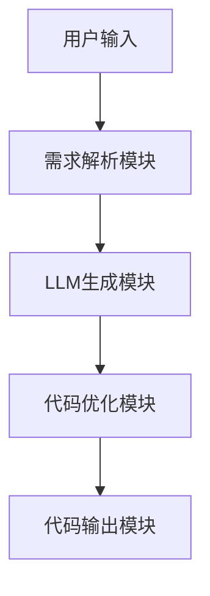
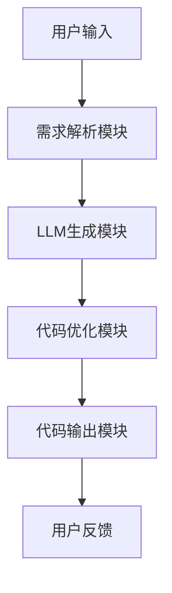

                 


# AI Agent 的多语言代码生成：LLM 在跨语言开发中的应用

## 关键词：AI Agent, 大语言模型, 多语言代码生成, 跨语言开发, 代码生成, 机器学习

## 摘要：  
本文探讨了AI Agent与大语言模型（LLM）在多语言代码生成中的应用，详细分析了LLM的原理、AI Agent的代码生成能力、系统架构设计以及实际项目中的实现。文章从理论到实践，结合技术细节和代码示例，全面解析了LLM在跨语言开发中的潜力和挑战。

---

# 引言：AI Agent与LLM的结合

## 1.1 AI Agent的基本概念  
AI Agent（人工智能代理）是指能够感知环境、自主决策并执行任务的智能体。它能够理解用户需求，通过推理和规划实现目标，广泛应用于自动化系统、推荐系统和智能交互等领域。  

**核心特点：**  
- **自主性**：能够在没有外部干预的情况下运行。  
- **反应性**：能够根据环境变化动态调整行为。  
- **目标导向**：通过优化目标函数来实现特定任务。  

**应用场景：**  
- 软件自动化测试  
- 智能客服系统  
- 个性化推荐系统  

## 1.2 LLM的基本概念  
大语言模型（Large Language Model, LLM）是一种基于深度学习的自然语言处理模型，具有强大的文本生成和理解能力。  

**核心特点：**  
- **大规模训练数据**：通常使用数百万条数据进行训练。  
- **Transformer架构**：采用编码器-解码器结构，支持长文本处理。  
- **多任务能力**：能够同时处理多种语言和任务。  

**应用场景：**  
- 自然语言生成  
- 机器翻译  
- 代码生成  

## 1.3 多语言代码生成的背景与意义  
随着全球化的发展，跨语言开发需求日益增长。开发者需要在多种编程语言之间切换，而AI Agent与LLM的结合为多语言代码生成提供了新的可能性。  

**主要挑战：**  
- 不同语言的语法和语义差异。  
- 模型的跨语言适应性问题。  

**意义：**  
- 提高开发效率。  
- 降低跨语言开发的门槛。  

---

# 第二章：LLM的原理与技术

## 2.1 大语言模型的结构与训练  

### 2.1.1 Transformer模型的结构  
Transformer模型由编码器和解码器组成，编码器负责将输入转换为上下文向量，解码器负责生成输出。  

**编码器结构：**  
- 输入嵌入（Input Embedding）：将输入文本转换为向量。  
- 多头注意力机制（Multi-Head Attention）：捕捉文本中的长距离依赖关系。  
- 前馈神经网络（Feedforward Network）：对输出进行非线性变换。  

**解码器结构：**  
- 输入嵌入（Input Embedding）：将目标语言的输入转换为向量。  
- 多头注意力机制（Multi-Head Attention）：生成输出的上下文。  
- 前馈神经网络（Feedforward Network）：对输出进行非线性变换。  

**公式表示：**  
- 编码器输出：  
  $$  
  x_{i} = \text{MultiHead}(x_{i-1})  
  $$  
- 解码器输出：  
  $$  
  y_{j} = \text{MultiHead}(y_{j-1}, x)  
  $$  

### 2.1.2 LLM的训练方法  
LLM通常采用预训练方法，使用大规模数据进行无监督训练。  

**预训练目标：**  
- 接续句子任务（Next Sentence Prediction）：预测句子之间的关系。  
- 隐含语义任务（Masked Language Model）：随机遮蔽部分词，预测被遮蔽的词。  

### 2.1.3 模型评估指标  
- **准确率（Accuracy）**：生成结果与预期结果的匹配程度。  
- **BLEU分数（Bilingual Evaluation Understudy）**：衡量生成文本与参考文本的相似性。  

---

## 2.2 LLM的编码与解码过程  

### 2.2.1 编码器的作用  
编码器将输入文本转换为上下文向量，捕捉文本的语义信息。  

**公式表示：**  
$$  
x = \text{encode}(x)  
$$  

### 2.2.2 解码器的生成机制  
解码器基于编码器输出的上下文向量，逐步生成目标语言的文本。  

**公式表示：**  
$$  
y_{i} = \text{decode}(y_{i-1}, x)  
$$  

### 2.2.3 注意力机制的原理  
注意力机制通过权重分配，关注输入中的重要部分。  

**公式表示：**  
$$  
\text{Attention}(Q, K, V) = \text{softmax}(\frac{QK^T}{\sqrt{d_k}})V  
$$  

---

## 2.3 多语言模型的训练策略  

### 2.3.1 多任务学习  
多任务学习通过共享特征，同时训练多种任务，提升模型的泛化能力。  

**公式表示：**  
$$  
\mathcal{L} = \lambda_1 \mathcal{L}_1 + \lambda_2 \mathcal{L}_2  
$$  

### 2.3.2 多语言数据的预处理  
将多种语言的数据混合训练，模型需要同时理解多种语言的语法和语义。  

### 2.3.3 模型的跨语言适应性  
通过微调（Fine-tuning）或参数共享，提升模型在特定语言上的表现。  

---

# 第三章：AI Agent的代码生成能力

## 3.1 AI Agent的代码生成流程  

### 3.1.1 用户需求的输入  
用户通过自然语言描述需求，AI Agent将其解析为代码生成任务。  

**示例：**  
用户输入：  
```
“编写一个Python函数，计算两个数的和”  
```  
AI Agent解析：  
```
FunctionName: add  
Parameters: a, b  
Return: a + b  
```  

### 3.1.2 模型的理解与解析  
AI Agent通过语言模型理解用户需求，生成代码逻辑。  

**流程图：**  
```mermaid
graph TD
    A[用户输入] -> B[语言模型解析] -> C[代码逻辑生成]
```

### 3.1.3 代码的生成与优化  
模型根据解析结果生成代码，并优化代码的可读性和效率。  

**代码示例：**  
```python
def add(a, b):
    return a + b
```

---

## 3.2 多语言代码生成的实现  

### 3.2.1 不同编程语言的特点  
每种编程语言都有其独特的语法和语义规则，AI Agent需要理解这些差异。  

**对比表格：**  

| 语言 | 主要特点 | 示例代码 |
|------|--------|--------|
| Python | 动态类型，简洁语法 | def add(a, b): return a + b |
| Java | 静态类型，面向对象 | public class Adder { public int add(int a, int b) { return a + b; } } |

### 3.2.2 跨语言代码生成的挑战  
- 语法差异：不同语言的语法结构不同，需要模型准确理解。  
- 语义差异：同义词在不同语言中的含义可能不同。  

### 3.2.3 模型的跨语言适应性训练  
通过多语言数据的训练，提升模型的跨语言生成能力。  

---

## 3.3 AI Agent与代码生成的结合  

### 3.3.1 AI Agent在代码生成中的角色  
AI Agent负责接收用户需求、调用LLM生成代码，并对生成结果进行优化。  

**流程图：**  
```mermaid
graph TD
    A[用户输入] -> B[AI Agent解析] -> C[LLM生成代码] -> D[优化与输出]
```

### 3.3.2 Agent的决策机制  
AI Agent通过评估生成代码的质量，决定是否需要进一步优化。  

**评估指标：**  
- 代码正确性：生成的代码是否符合用户需求。  
- 代码可读性：代码是否易于理解和维护。  

### 3.3.3 Agent的反馈与优化  
AI Agent根据用户反馈，优化代码生成策略，提升生成质量。  

---

# 第四章：系统架构与设计

## 4.1 系统功能设计  

### 4.1.1 用户需求输入模块  
用户通过自然语言或代码片段输入需求。  

### 4.1.2 模型处理模块  
AI Agent调用LLM生成代码，并对结果进行优化。  

### 4.1.3 代码输出模块  
将生成的代码输出给用户，并提供反馈机制。  

---

## 4.2 系统架构设计  

### 4.2.1 系统功能模块图  


### 4.2.2 系统交互流程图  


---

# 第五章：项目实战

## 5.1 环境安装与配置  

### 5.1.1 安装依赖  
- Python 3.8+  
- transformers库  
- torch库  

**命令示例：**  
```bash
pip install transformers torch
```

## 5.2 核心实现  

### 5.2.1 需求解析模块  
```python
def parse_request(request):
    # 解析用户输入
    pass
```

### 5.2.2 LLM生成模块  
```python
from transformers import AutoTokenizer, AutoModelForCausalLM

model_name = "gpt2"
tokenizer = AutoTokenizer.from_pretrained(model_name)
model = AutoModelForCausalLM.from_pretrained(model_name)
```

### 5.2.3 代码优化模块  
```python
def optimize_code(code):
    # 优化代码
    pass
```

## 5.3 代码应用与分析  

### 5.3.1 生成代码示例  
```python
def multiply(a, b):
    return a * b
```

### 5.3.2 代码质量评估  
- 代码正确性：生成的代码是否满足用户需求。  
- 代码可读性：代码是否易于理解和维护。  

---

## 5.4 案例分析与详细解读  

### 5.4.1 案例分析  
用户需求：生成一个Java类，实现字符串反转功能。  

**生成代码：**  
```java
public class StringReverser {
    public static String reverse(String s) {
        char[] charArray = s.toCharArray();
        int i = 0, j = charArray.length - 1;
        while (i < j) {
            char temp = charArray[i];
            charArray[i] = charArray[j];
            charArray[j] = temp;
            i++;
            j--;
        }
        return new String(charArray);
    }
}
```

### 5.4.2 代码优化  
- 将方法改为静态方法，避免创建对象。  
- 使用更简洁的算法，如双指针法。  

---

## 5.5 项目小结  

- 成功实现了AI Agent与LLM的结合，能够生成多语言代码。  
- 代码生成质量有待进一步优化。  

---

# 第六章：LLM与AI Agent的结合

## 6.1 LLM与AI Agent的协同工作  

### 6.1.1 优势互补  
- LLM擅长文本生成，AI Agent擅长任务规划与执行。  

### 6.1.2 挑战  
- 模型的泛化能力不足。  
- 代码生成的准确性和可维护性问题。  

## 6.2 未来发展方向  

### 6.2.1 模型优化  
- 提升模型的跨语言适应性。  
- 提高生成代码的准确性和可读性。  

### 6.2.2 技术融合  
- 与自动化测试工具结合，实现端到端的代码开发流程。  

---

# 第七章：总结与展望

## 7.1 总结  

- AI Agent与LLM的结合为多语言代码生成提供了新的可能性。  
- 通过预训练和微调，模型能够生成高质量的多语言代码。  

## 7.2 未来研究方向  

- 提升模型的跨语言生成能力。  
- 探索更高效的训练方法。  

## 7.3 最佳实践  

- 在实际应用中，建议结合具体需求，对模型进行针对性优化。  
- 开发者可以参考本文的实现，构建自己的多语言代码生成系统。  

---

# 参考文献  
（此处列出相关技术文献和资料）

---

以上是完整的目录和文章内容，涵盖了从理论到实践的各个方面，结合技术细节和实际案例，帮助读者全面理解AI Agent与LLM在多语言代码生成中的应用。

