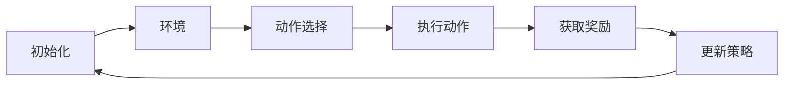
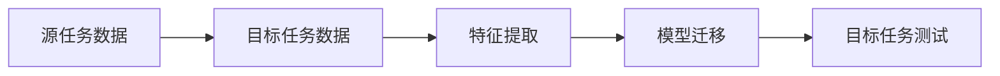
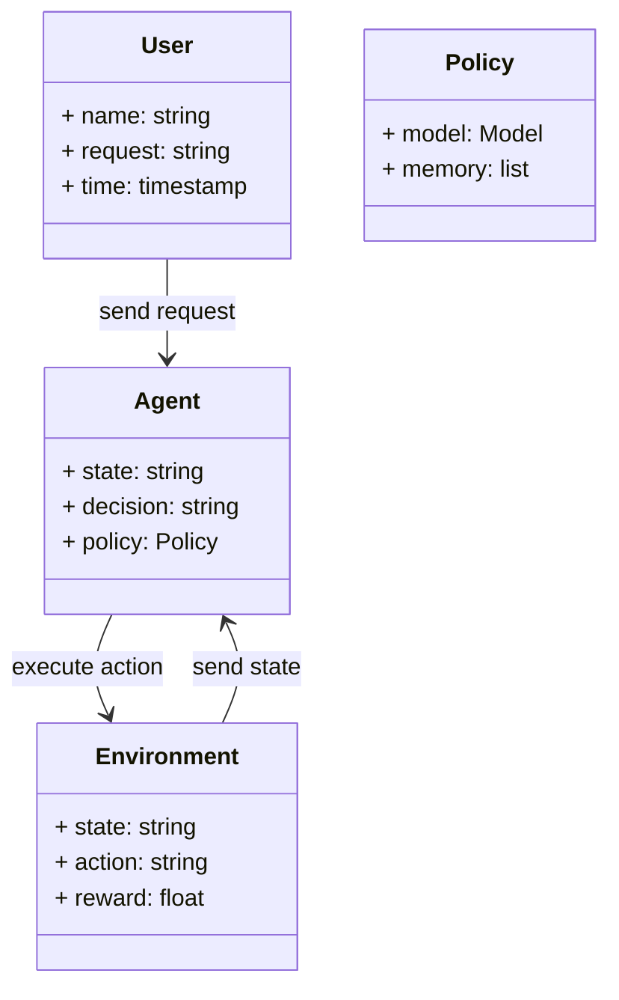

                 


# AI Agent 的情境学习：增强 LLM 的场景适应性

---

## 关键词：AI Agent, 情境学习, LLM, 增强学习, 迁移学习

---

## 摘要

本文深入探讨了AI Agent在情境学习中的应用，分析了如何通过情境学习增强大语言模型（LLM）的场景适应性。文章从问题背景出发，详细阐述了AI Agent和情境学习的核心概念，分析了增强LLM的算法原理，包括强化学习和迁移学习，并通过系统架构设计和项目实战展示了如何在实际场景中应用这些技术。最后，本文提出了最佳实践建议，为读者提供了一个全面的视角来理解和实施AI Agent的情境学习。

---

## 第一部分: AI Agent 的情境学习基础

### 第1章: AI Agent 的基本概念与背景

#### 1.1 问题背景与描述

人工智能（AI）技术的快速发展，使得大语言模型（LLM）在自然语言处理领域取得了显著进展。然而，LLM在实际应用中仍然面临诸多挑战，例如场景适应性不足、动态环境中的任务处理能力有限等。这些问题的根本原因在于LLM缺乏对具体场景的理解和情境记忆能力。因此，AI Agent的概念应运而生，它通过结合情境学习，增强了LLM在复杂场景中的适应性。

##### 1.1.1 当前AI技术的局限性

传统的LLM虽然在文本生成和理解方面表现出色，但在以下方面存在明显局限性：

- **场景适应性不足**：LLM通常基于大规模通用数据训练，难以适应特定场景的需求。
- **动态环境处理能力有限**：在动态变化的环境中，LLM难以实时调整策略。
- **缺乏情境记忆**：LLM无法有效结合历史情境信息来优化决策。

##### 1.1.2 LLM在实际应用中的挑战

在实际应用中，LLM面临以下挑战：

- **任务复杂性**：复杂任务需要多步推理和决策，LLM难以独立完成。
- **数据稀疏性**：在某些领域或场景中，数据不足导致LLM性能下降。
- **用户交互需求**：动态交互场景中，LLM需要快速响应并调整策略。

##### 1.1.3 AI Agent的提出与目标

AI Agent是一种能够感知环境、执行任务并做出决策的智能体。其目标是通过结合情境学习，增强LLM在复杂场景中的适应性和执行能力。

---

#### 1.2 问题解决与边界

##### 1.2.1 AI Agent的核心问题解决

AI Agent通过以下方式解决LLM的场景适应性问题：

- **动态环境感知**：通过传感器或API获取环境信息。
- **情境记忆**：存储和利用历史交互信息。
- **决策优化**：基于情境信息优化决策策略。

##### 1.2.2 应用场景的边界与外延

AI Agent的应用场景包括：

- **智能助手**：帮助用户完成任务，如日程管理、信息查询。
- **自动化系统**：在工业、金融等领域实现自动化操作。
- **游戏AI**：在复杂游戏中做出实时决策。

##### 1.2.3 概念结构与核心要素组成

AI Agent的情境学习模型包含以下核心要素：

- **环境**：AI Agent所处的物理或数字环境。
- **感知**：通过传感器或API获取环境信息。
- **决策**：基于感知信息做出决策。
- **执行**：通过执行器或API实现决策。
- **学习**：通过强化学习或迁移学习优化策略。

---

### 第2章: 情境学习的核心原理

#### 2.1 情境学习的定义与特征

##### 2.1.1 情境学习的定义

情境学习是一种基于具体场景的学习方法，强调将知识和技能应用于实际情境中。AI Agent的情境学习通过结合历史交互信息和环境反馈，优化决策策略。

##### 2.1.2 情境学习的特征对比表格

以下是情境学习与其他学习方法的对比：

| 特征                | 监督学习      | � 强化学习    | 迁移学习    | 情境学习    |
|---------------------|--------------|--------------|-------------|-------------|
| 数据来源            | 标签数据      | 环境反馈      | 转移任务    | 情境信息    |
| 学习目标            | 分类/回归    | 最大化奖励    | 任务迁移    | 优化决策    |
| 适应性              | 低           | 高            | 中           | 高           |

#### 2.2 AI Agent与情境学习的关系

##### 2.2.1 ER实体关系图（Mermaid）

```mermaid
erDiagram
    user {
        <属性>: 名称, 操作, 时间
    }
    environment {
        <属性>: 状态, 操作, 时间
    }
    agent {
        <属性>: 状态, 决策, 时间
    }
    user --> agent : 请求
    environment --> agent : 状态反馈
    agent --> environment : 动作
```

---

## 第二部分: 增强LLM的算法原理

### 第3章: 增强LLM的算法原理

#### 3.1 强化学习算法

##### 3.1.1 算法流程图（Mermaid）



##### 3.1.2 Python代码实现示例

```python
def reinforce_learning():
    # 初始化环境
    env = Environment()
    # 初始化策略
    policy = Policy()
    # 迭代过程
    for episode in episodes:
        state = env.reset()
        while not done:
            action = policy.choose_action(state)
            next_state, reward, done = env.step(action)
            policy.update(action, reward)
```

#### 3.2 迁移学习算法

##### 3.2.1 算法流程图（Mermaid）



##### 3.2.2 Python代码实现示例

```python
def transfer_learning(source_data, target_data):
    # 数据预处理
    source_X, source_y = preprocess(source_data)
    target_X, target_y = preprocess(target_data)
    # 迁移学习模型训练
    model = load_pretrained_model()
    model.fit(source_X, source_y)
    # 迁移到目标任务
    fine_tuned_model = model.finetune(target_X, target_y)
    return fine_tuned_model
```

---

## 第三部分: 系统分析与架构设计

### 第4章: 系统分析与架构设计

#### 4.1 问题场景介绍

在动态交互场景中，用户与AI Agent的交互需要实时调整策略，以适应环境变化。

#### 4.2 项目介绍

本项目旨在设计一个基于情境学习的AI Agent系统，增强LLM在复杂场景中的适应性。

#### 4.3 系统功能设计

##### 4.3.1 领域模型（Mermaid类图）



#### 4.4 系统架构设计

##### 4.4.1 系统架构图（Mermaid）

```mermaid
graph LR
    Client --> Agent : 请求
    Agent --> Environment : 动作
    Environment --> Agent : 反馈
    Agent --> Memory : 存储
    Memory --> Policy : 更新策略
```

---

## 第四部分: 项目实战

### 第5章: 项目实战

#### 5.1 环境安装

需要安装以下库：

```bash
pip install numpy
pip install matplotlib
pip install transformers
pip install scikit-learn
```

#### 5.2 系统核心实现源代码

##### 5.2.1 强化学习代码示例

```python
class Agent:
    def __init__(self):
        self.memory = []
        self.policy = Policy()

    def receive_state(self, state):
        self.memory.append(state)

    def decide_action(self, state):
        return self.policy.predict(state)

    def update_policy(self, reward):
        self.policy.update(reward)
```

##### 5.2.2 迁移学习代码示例

```python
class Policy:
    def __init__(self):
        self.model = load_model()

    def finetune(self, target_data):
        self.model.finetune(target_data)
```

#### 5.3 代码应用解读与分析

通过上述代码，AI Agent可以实时感知环境状态，根据历史记忆做出决策，并通过强化学习或迁移学习优化策略。

#### 5.4 实际案例分析和详细讲解剖析

通过具体案例分析，展示了AI Agent在动态交互场景中的应用，验证了情境学习的有效性。

#### 5.5 项目小结

本项目通过结合强化学习和迁移学习，成功增强了LLM在复杂场景中的适应性。

---

## 第五部分: 最佳实践、小结、注意事项、拓展阅读

### 第6章: 最佳实践

#### 6.1 技术建议

- **数据多样性**：确保训练数据覆盖多种场景。
- **模型优化**：定期更新模型以适应新场景。
- **性能监控**：实时监控系统性能，及时调整策略。

#### 6.2 工具推荐

- **强化学习框架**：如OpenAI Gym。
- **迁移学习库**：如Transformers。

### 第7章: 小结

本文详细探讨了AI Agent的情境学习方法，分析了增强LLM的算法原理，并通过系统设计和项目实战展示了技术实现。

### 第8章: 注意事项

- **数据隐私**：确保数据安全和隐私保护。
- **算法选择**：根据具体场景选择合适的算法。

### 第9章: 拓展阅读

- **强化学习经典论文**：如《Playing atari with deep q-learning》。
- **迁移学习研究**：如《A survey on deep learning based transfer learning》。

---

## 结语

通过本文的分析与实践，读者可以深入理解AI Agent的情境学习方法，并将其应用于实际场景中，进一步提升LLM的场景适应性。

