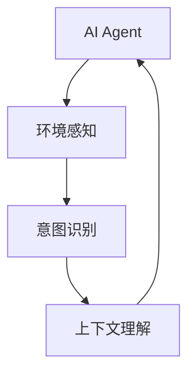
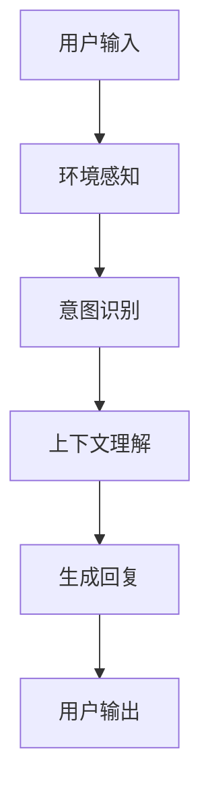

                 


# AI Agent 的情境感知：增强 LLM 的环境适应能力

> **关键词**: AI Agent, 情境感知, LLM, 环境适应, 人工智能, 机器学习

> **摘要**: 本文探讨了AI Agent在情境感知中的应用，分析了如何通过增强大语言模型（LLM）的环境适应能力来提升其在实际场景中的表现。文章从背景介绍、核心概念、算法原理、系统架构到项目实战，全面解析了情境感知在AI Agent中的重要性及其实现方法，最后给出了实践中的注意事项和未来研究方向。

---

## 第一部分: AI Agent 的情境感知基础

### 第1章: AI Agent 的基本概念与情境感知的重要性

#### 1.1 AI Agent 的基本概念
AI Agent（人工智能代理）是指能够感知环境、自主决策并执行任务的智能实体。它具备以下特点：
- **自主性**: 能够独立决策和行动。
- **反应性**: 能够实时感知环境变化并做出反应。
- **目标导向**: 具备明确的目标，驱动其行为。
- **学习能力**: 能够通过经验优化自身行为。

#### 1.2 情境感知的重要性
情境感知是指AI Agent能够理解当前环境的状态、上下文信息以及用户的需求，从而做出更精准的决策。其重要性体现在以下几个方面：
- **提升用户体验**: 根据用户的实时需求和环境变化，提供个性化的服务。
- **增强任务执行能力**: 通过理解环境信息，优化任务执行策略。
- **提高系统适应性**: 面对动态变化的环境，系统能够快速调整以应对挑战。

#### 1.3 问题背景与分析
当前，大语言模型（LLM）虽然在文本生成、对话交互等方面表现出色，但其环境适应能力较弱。具体问题包括：
- **缺乏上下文理解**: LLM难以结合实际场景中的多模态信息进行决策。
- **静态知识库**: 无法动态更新环境信息，导致决策失误。
- **环境依赖性**: 需要依赖外部数据源提供实时信息，但信息获取和处理效率有限。

---

### 第2章: 情境感知的核心概念与联系

#### 2.1 情境感知的定义与属性
情境感知是指AI Agent能够理解当前环境的状态、用户意图和上下文信息的能力。其核心属性包括：
- **环境感知**: 理解环境中的物理实体、空间布局等。
- **用户意图**: 分析用户的动作、语言和行为，推测其目标。
- **上下文理解**: 综合环境信息和用户需求，提供情境化的服务。

#### 2.2 情境感知的核心概念对比
| 概念 | 描述 |
|------|------|
| 环境建模 | 通过传感器或数据源构建环境的数字表示。 |
| 意图识别 | 分析用户行为，推测其潜在需求和目标。 |
| 上下文理解 | 综合环境信息和用户需求，提供情境化的服务。 |

#### 2.3 情境感知与AI Agent的关系


---

### 第3章: 情境感知的算法原理

#### 3.1 环境建模算法
环境建模是情境感知的第一步，其核心是将物理环境数字化表示。常用算法包括：
- **基于传感器的数据融合**: 组合来自多种传感器的数据，构建环境的多维表示。
- **基于深度学习的环境建模**: 使用神经网络学习环境的特征表示。

#### 3.2 意图识别算法
意图识别是通过分析用户的行为和输入，推测其潜在需求。常用算法包括：
- **基于规则的意图识别**: 根据预定义的规则匹配用户行为。
- **基于机器学习的意图识别**: 使用分类模型（如SVM、随机森林）或深度学习模型（如LSTM）进行意图分类。

#### 3.3 上下文理解算法
上下文理解需要综合环境信息和用户需求，提供情境化的服务。常用算法包括：
- **注意力机制**: 在文本处理中，通过注意力机制关注重要信息。
- **强化学习**: 通过与环境的交互，优化决策策略。

---

## 第4章: 系统分析与架构设计

### 4.1 项目场景介绍
假设我们正在开发一个智能客服系统，AI Agent需要根据用户的问题、情绪和历史记录提供个性化的解决方案。

### 4.2 系统功能设计
- **环境感知**: 收集用户的情绪、历史记录和问题类型。
- **意图识别**: 分析用户的需求，推测其潜在意图。
- **上下文理解**: 综合环境信息，生成个性化回复。

### 4.3 系统架构设计


---

## 第5章: 项目实战

### 5.1 环境安装
安装必要的库：
```bash
pip install numpy pandas scikit-learn transformers
```

### 5.2 核心实现
实现意图识别的代码示例：
```python
from sklearn.feature_extraction.text import TfidfVectorizer
from sklearn.svm import SVC

# 数据准备
X = [...]  # 用户输入
y = [...]  # 标签

# 特征提取
vectorizer = TfidfVectorizer()
X_vec = vectorizer.fit_transform(X)

# 训练模型
model = SVC()
model.fit(X_vec, y)

# 预测
new_X = ["用户的新输入"]
new_X_vec = vectorizer.transform(new_X)
print(model.predict(new_X_vec))
```

### 5.3 案例分析
通过具体案例分析，展示如何结合环境信息优化AI Agent的决策过程。

---

## 第6章: 最佳实践

### 6.1 小结
- 情境感知是提升AI Agent环境适应能力的关键技术。
- 通过环境建模、意图识别和上下文理解，可以显著增强系统的智能化水平。

### 6.2 注意事项
- 确保数据质量和多样性，避免模型过拟合。
- 在实际应用中，需要考虑系统的实时性和响应速度。

### 6.3 拓展阅读
- 《Deep Learning》
- 《Pattern Recognition and Machine Learning》

---

**结语**: 通过本文的介绍，读者可以全面了解AI Agent的情境感知技术及其在增强LLM环境适应能力中的应用。未来，随着技术的不断进步，情境感知将为AI Agent带来更广泛的应用场景和更高的智能化水平。

