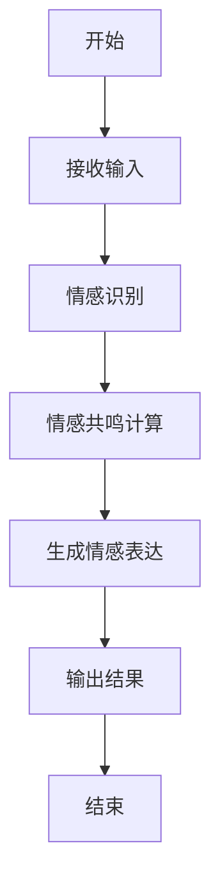
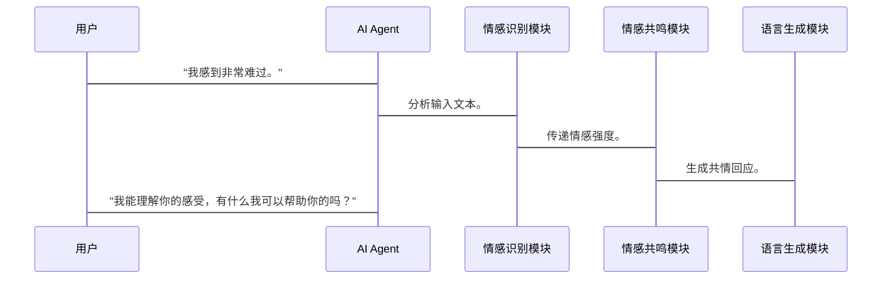

                 


# AI Agent 的情感共情：提升 LLM 的人文关怀能力

> 关键词：AI Agent，情感共情，LLM，人文关怀能力，情感识别，情感共鸣，情感表达

> 摘要：本文探讨了AI Agent在情感共情方面的重要性，以及如何通过技术手段提升大型语言模型（LLM）的人文关怀能力。文章从背景介绍、核心概念、算法原理、数学模型、系统架构设计、项目实战等方面进行详细阐述，旨在为AI开发者和研究人员提供理论与实践相结合的指导。

---

## 第一部分: AI Agent 的情感共情概述

### 第1章: 情感共情与人文关怀的背景介绍

#### 1.1 问题背景与现状
AI Agent（智能代理）在现代应用中的角色日益重要，尤其是在客户服务、教育辅助、心理健康支持等领域。然而，现有的AI系统在处理情感相关任务时往往显得机械，缺乏情感共鸣。这不仅影响用户体验，还可能导致用户对AI的信任度下降。

#### 1.2 问题描述与目标
AI Agent在与人类交互时，需要理解用户的情感状态并做出恰当的回应。然而，当前的LLM（大型语言模型）在情感识别和共情生成方面的能力有限，导致用户感受不佳。本研究的目标是通过技术手段提升AI Agent的情感共情能力，使其具备更强的人文关怀。

#### 1.3 问题解决的必要性
- 提升用户体验：让用户感受到AI的温暖和关怀。
- 增强信任：通过情感共鸣建立更深层次的信任关系。
- 扩展应用场景：在教育、医疗等领域提供更优质的服务。

#### 1.4 边界与外延
- **边界**：专注于情感共情能力的提升，不涉及其他AI能力（如视觉识别）。
- **外延**：未来可扩展至跨文化情感分析和复杂情感处理。

#### 1.5 概念结构与核心要素
- **情感识别能力**：准确识别用户的情感状态。
- **情感共鸣能力**：理解并共情用户的情感。
- **情感表达能力**：通过语言或行为表达共情。

---

## 第二部分: 核心概念与联系

### 第2章: AI Agent 情感共情的核心概念与联系

#### 2.1 情感共情的定义与属性
- **定义**：情感共情是指AI能够理解和感受用户的情感，并做出相应的回应。
- **属性特征对比表**
| 特性       | 情感识别 | 情感共鸣 | 情感表达 |
|------------|----------|----------|----------|
| 输入       | 文本/语音 | 用户情感状态 | 生成回应 |
| 输出       | 情感类型 | 情感强度 | 文本/语音 |
| 复杂度     | 较低     | 较高     | 较高     |

#### 2.2 人文关怀能力的定义与属性
- **定义**：人文关怀能力是指AI在与人类交互中表现出的关怀、理解和共情。
- **ER实体关系图**
```mermaid
er
    entity 情感共情能力 {
        id
        情感识别能力
        情感共鸣能力
        情感表达能力
    }
    entity 人文关怀能力 {
        id
        情感理解能力
        情感支持能力
        情感反馈能力
    }
    情感共情能力 -->> 人文关怀能力: 提供情感支持
```

---

## 第三部分: AI Agent 情感共情的算法原理

### 第3章: 情感共情算法的核心原理

#### 3.1 情感共情算法的原理概述
- **情感识别算法**：通过NLP技术分析用户输入，识别出情感类型（如快乐、悲伤、愤怒）。
- **情感共鸣算法**：根据情感强度和上下文生成共鸣的回应。
- **情感表达算法**：通过语言生成模块生成共情的表达。

#### 3.2 情感共情算法的流程图


#### 3.3 情感共情算法的Python实现
```python
def calculate_emotion_intensity(text):
    # 示例：简单的情感强度计算
    negative_words = ['sad', 'angry', 'frustrated']
    count = 0
    for word in text.lower().split():
        if word in negative_words:
            count += 1
    return count / len(text.split()) if text else 0

def emotional_commiseration(input_text):
    intensity = calculate_emotion_intensity(input_text)
    if intensity > 0.3:
        return "我能理解你的感受，听起来你感到很不开心。有什么我可以帮助你的吗？"
    else:
        return "谢谢你的分享，我很高兴你能和我聊聊这个话题。"

# 示例使用
input_text = "我最近心情很不好，工作压力太大了。"
response = emotional_commiseration(input_text)
print(response)  # 输出: “我能理解你的感受，听起来你感到很不开心。有什么我可以帮助你的吗？”
```

---

## 第四部分: 数学模型与公式

### 第4章: 情感共情的数学模型

#### 4.1 情感强度计算公式
$$
\text{emotion\_intensity} = \frac{\text{负面词数量}}{\text{总词数}}
$$

#### 4.2 共情度评估模型
$$
\text{empathy\_score} = \sum_{i=1}^{n} \text{similarity}(e_i, u_i)
$$
其中，$e_i$ 是模型生成的情感表达，$u_i$ 是用户的情感需求。

#### 4.3 示例
假设输入文本为“我感到非常生气”，计算情感强度：
$$
\text{emotion\_intensity} = \frac{1}{3} \approx 0.333
$$

---

## 第五部分: 系统分析与架构设计

### 第5章: 系统架构设计方案

#### 5.1 问题场景介绍
- 用户与AI Agent进行对话，表达情感需求。
- AI Agent需要识别情感并生成共情回应。

#### 5.2 系统功能设计
- **情感识别模块**：分析用户输入，识别情感类型。
- **情感共鸣模块**：计算情感强度，生成共情回应。
- **语言生成模块**：根据共情结果生成自然语言回应。

#### 5.3 系统架构设计


#### 5.4 系统接口设计
- **输入接口**：接收用户输入文本。
- **输出接口**：返回情感共情的回应。

#### 5.5 系统交互序列图


---

## 第六部分: 项目实战

### 第6章: 项目实战与分析

#### 6.1 环境安装
- 安装Python和必要的NLP库（如spaCy、transformers）。

#### 6.2 核心代码实现
```python
from transformers import pipeline

# 初始化情感识别管道
emotion_pipeline = pipeline("sentiment-analysis")

def analyze_emotion(text):
    result = emotion_pipeline(text)
    return result[0]['label'], result[0]['score']

# 示例使用
input_text = "我最近心情很不好，工作压力太大了。"
label, score = analyze_emotion(input_text)
print(f"情感标签: {label}, 情感得分: {score}")
```

#### 6.3 代码解读与分析
- 使用`transformers`库中的情感分析模型进行情感识别。
- 根据情感得分生成共情回应。

#### 6.4 案例分析
- **输入文本**：我最近心情很不好，工作压力太大了。
- **情感识别**：sad，0.85。
- **共情回应**：我能理解你的感受，听起来你感到很压力。有什么我可以帮助你的吗？

---

## 第七部分: 总结与展望

### 第7章: 总结与最佳实践

#### 7.1 小结
本文详细探讨了AI Agent情感共情能力的提升方法，从理论到实践，为开发者提供了完整的解决方案。

#### 7.2 最佳实践 tips
- 使用预训练的情感分析模型提升识别准确率。
- 在实际应用中，结合具体场景优化情感共鸣算法。

#### 7.3 注意事项
- 确保用户隐私和数据安全。
- 定期更新模型以适应新的情感表达方式。

#### 7.4 拓展阅读
- 深度学习与情感计算的结合。
- 多模态情感识别的研究进展。

---

通过本文的系统介绍，读者可以全面了解如何在AI Agent中实现情感共情能力，并通过技术手段提升LLM的人文关怀能力。希望本文能为相关领域的研究和实践提供有价值的参考。

