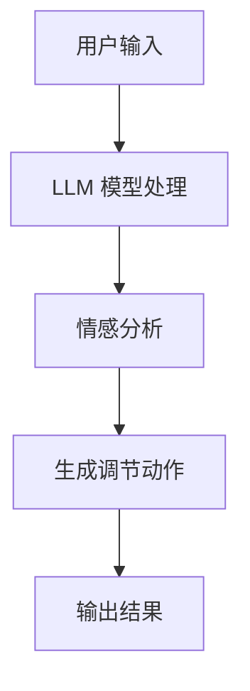
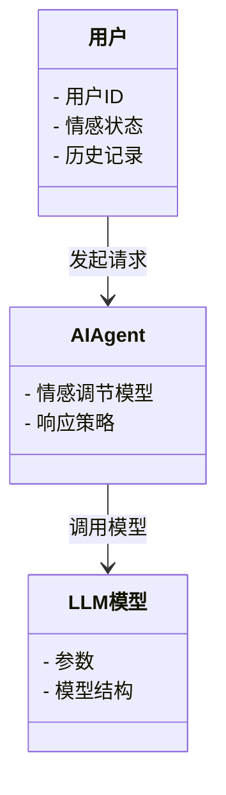
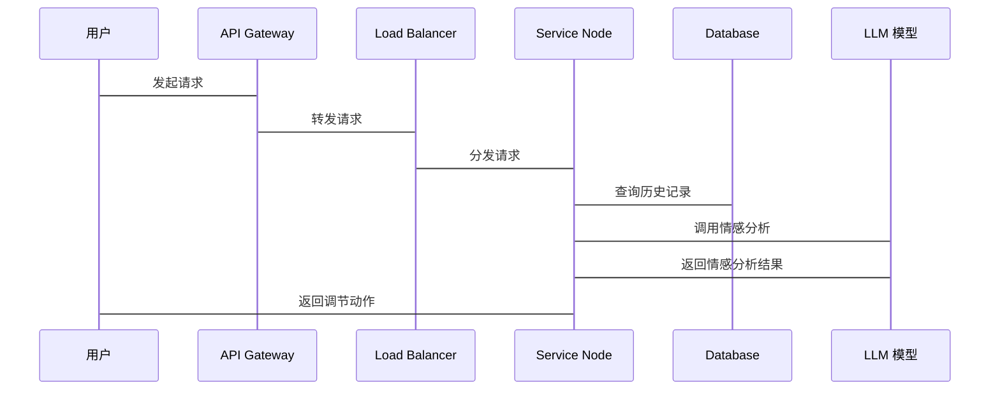

                 


# AI Agent 的情感调节：利用 LLM 进行情绪管理

## 关键词：AI Agent、LLM、情感调节、情绪管理、自然语言处理、人工智能

## 摘要：本文将探讨如何利用大型语言模型（LLM）对AI Agent进行情感调节，从而实现情绪管理。文章将从背景介绍、核心概念、算法原理、系统架构设计到项目实战逐步展开，结合具体的实现代码和案例分析，深入剖析情感调节技术的实现细节和应用价值。

---

# 第一部分: AI Agent 的情感调节概述

## 第1章: AI Agent 的情感调节背景

### 1.1 问题背景

#### 1.1.1 情感调节的定义与重要性

情感调节是指个体或系统对自身或他人情感状态进行识别、理解和调整的过程。在AI Agent领域，情感调节的目标是通过技术手段帮助AI Agent理解和应对复杂的情感情境，从而实现更自然和高效的交互。

#### 1.1.2 AI Agent 在情感调节中的角色

AI Agent作为智能体，需要具备处理复杂情感情境的能力。通过情感调节，AI Agent可以更好地理解用户需求，提供更贴心的服务，同时在面对负面情绪时能够主动调整，避免冲突或误解。

#### 1.1.3 当前情感调节技术的挑战与局限性

当前情感调节技术主要依赖于自然语言处理（NLP）和机器学习（ML）算法，但在实际应用中仍存在以下挑战：

- **情感分析的准确性**：如何准确识别和分类用户的情感状态是一个关键问题。
- **情感调节的实时性**：在实时交互中，快速生成合适的调节动作是技术难点。
- **跨文化情感差异**：不同文化背景下情感表达和调节方式存在差异，增加了技术实现的复杂性。

---

### 1.2 问题描述

#### 1.2.1 情感调节的核心问题

情感调节的核心问题是如何在给定的情感状态下，生成合适的调节动作以达到预期的情感目标。这需要AI Agent具备以下能力：

1. **情感识别**：准确识别用户或系统当前的情感状态。
2. **情感分析**：理解情感背后的原因和潜在需求。
3. **调节动作生成**：基于情感分析结果，生成合适的调节策略和行动计划。

#### 1.2.2 AI Agent 在情感调节中的应用场景

情感调节技术在多个领域有广泛应用潜力：

- **心理健康支持**：通过AI Agent帮助用户缓解压力、焦虑等负面情绪。
- **客服系统优化**：在客服交互中，AI Agent可以根据用户情绪调整回应方式，提升用户体验。
- **教育辅助**：在教育场景中，AI Agent可以调节学生的情绪，帮助其更好地学习。

#### 1.2.3 情感调节技术的边界与外延

情感调节技术的边界主要集中在情感识别和调节动作生成两个方面。其外延则扩展到跨文化交流、多模态情感分析（如语音、表情等）以及情感记忆与学习等方面。

---

### 1.3 问题解决

#### 1.3.1 利用 LLM 进行情感调节的可行性

LLM（Large Language Model）通过海量数据训练，具备强大的语言理解和生成能力。利用LLM进行情感调节，可以通过以下方式实现：

- **情感识别**：基于LLM的文本分析能力，识别用户情感状态。
- **情感生成**：通过LLM生成符合情感调节需求的文本回应。

#### 1.3.2 情感调节技术的核心要素组成

情感调节技术的核心要素包括：

1. **情感识别模型**：用于识别和分类情感状态。
2. **情感分析模型**：用于理解情感背后的原因和需求。
3. **调节动作生成模型**：基于情感分析结果，生成合适的调节策略。

#### 1.3.3 情感调节的实现路径与方法

实现情感调节的关键路径包括：

1. **数据收集与预处理**：收集多样化的语料数据，进行清洗和标注。
2. **模型训练与微调**：基于收集的数据，训练或微调LLM模型。
3. **系统集成与测试**：将模型集成到AI Agent系统中，并进行功能测试和优化。

---

## 第2章: AI Agent 的核心概念与联系

### 2.1 AI Agent 的基本概念

#### 2.1.1 AI Agent 的定义与分类

AI Agent是指具有智能行为能力的实体，可以感知环境并采取行动以实现目标。根据功能和应用场景，AI Agent可以分为：

- **简单反射型AI Agent**：基于规则的简单响应。
- **基于模型的AI Agent**：基于内部模型进行决策。
- **学习型AI Agent**：通过机器学习不断优化行为。

#### 2.1.2 LLM 在 AI Agent 中的作用

LLM作为AI Agent的核心组件，主要负责以下任务：

- **自然语言理解**：理解用户输入的文本内容。
- **情感分析**：识别文本中的情感倾向。
- **生成文本**：根据分析结果生成合适的回应。

#### 2.1.3 情感调节的核心原理

情感调节的核心原理是通过LLM的强大生成能力，结合情感分析结果，动态调整AI Agent的回应方式，从而实现情感管理。

---

### 2.2 核心概念的属性特征对比

#### 2.2.1 情感调节与传统 AI 的对比

| 特性             | 情感调节AI Agent       | 传统AI Agent         |
|------------------|------------------------|----------------------|
| **目标**         | 调节情感，提供情感支持  | 执行特定任务         |
| **核心能力**     | 情感识别与调节能力     | 任务执行能力         |
| **应用场景**     | 心理咨询、客服支持     | 制造业、物流等       |

#### 2.2.2 LLM 与传统 NLP 模型的对比

| 特性             | LLM                     | 传统NLP模型          |
|------------------|-------------------------|----------------------|
| **数据需求**     | 需要海量数据            | 数据需求相对较低     |
| **模型复杂度**   | 参数量大，计算复杂       | 参数量较小，计算简单  |
| **生成能力**     | 强大的文本生成能力       | 生成能力有限          |

#### 2.2.3 情感调节技术的优缺点分析

| 特性             | 优点                     | 缺点                   |
|------------------|--------------------------|-----------------------|
| **准确性**       | 基于LLM，准确性较高       | 情感理解仍存在误差    |
| **实时性**       | 可实现近实时响应          | 复杂场景下响应速度慢  |
| **可扩展性**     | 易扩展到多种场景          | 需针对特定场景优化     |

---

### 2.3 ER 实体关系图架构

```mermaid
er
actor: 用户
agent: AI Agent
model: LLM 模型
emotion: 情感状态
action: 调节动作
```

---

## 第3章: 情感调节的算法原理

### 3.1 情感分析算法

#### 3.1.1 基于 LLM 的情感分析流程

1. **输入文本**：用户输入一段文本，如“我感到非常沮丧”。
2. **情感识别**：LLM模型分析文本，识别情感类型（如“沮丧”）。
3. **情感强度分析**：进一步分析情感的强度（如“非常沮丧”）。



#### 3.1.2 情感分析的数学模型

情感分析的数学模型通常基于概率论和优化算法。例如，交叉熵损失函数用于分类任务：

$$ \text{Loss} = -\sum_{i=1}^{n} y_i \log p(y_i) + (1-y_i)\log(1-p(y_i)) $$

其中，\( y_i \) 是真实标签，\( p(y_i) \) 是模型预测的概率。

#### 3.1.3 情感分析的实现代码示例

以下是一个简单的基于PyTorch的情感分析代码示例：

```python
import torch
import torch.nn as nn

class SentimentClassifier(nn.Module):
    def __init__(self, vocab_size, embedding_dim, hidden_dim, output_dim):
        super(SentimentClassifier, self).__init__()
        self.embedding = nn.Embedding(vocab_size, embedding_dim)
        self.lstm = nn.LSTM(embedding_dim, hidden_dim, batch_first=True)
        self.fc = nn.Linear(hidden_dim, output_dim)
        self.dropout = nn.Dropout(0.5)
        
    def forward(self, x):
        embeds = self.embedding(x)
        out, _ = self.lstm(embeds)
        out = self.dropout(out[:, -1, :])
        out = self.fc(out)
        return out

# 初始化模型
vocab_size = 10000
embedding_dim = 100
hidden_dim = 128
output_dim = 1
model = SentimentClassifier(vocab_size, embedding_dim, hidden_dim, output_dim)
```

---

#### 3.1.4 情感调节的数学模型

情感调节的数学模型通常基于强化学习（Reinforcement Learning）或生成对抗网络（GAN）。例如，生成对抗网络用于生成符合情感调节需求的文本：

$$ \text{Loss}_{\text{D}} = -\mathbb{E}_{x \sim \text{真实分布}}[\log D(x)] - \mathbb{E}_{x \sim G}[ \log(1-D(x))] $$

其中，\( D \) 是判别器，\( G \) 是生成器。

---

### 3.2 情感调节算法

#### 3.2.1 基于 LLM 的情感调节流程

1. **情感识别**：LLM模型识别用户当前情感状态。
2. **情感分析**：分析情感背后的原因和需求。
3. **调节动作生成**：基于分析结果，生成合适的调节策略。

---

#### 3.2.2 情感调节的数学模型

情感调节的数学模型通常基于条件生成对抗网络（Conditional GAN），如下：

$$ \text{Loss}_{\text{G}} = \mathbb{E}_{x \sim \text{真实分布}}[ \log D(x, y)] + \mathbb{E}_{x \sim G}[ \log(1-D(x, y))] $$

其中，\( y \) 是情感调节的目标。

---

### 3.3 情感调节的算法流程图


---

## 第4章: 系统分析与架构设计

### 4.1 问题场景介绍

本节将介绍AI Agent情感调节系统的应用场景，包括用户输入、情感分析、生成调节动作等关键环节。

---

### 4.2 系统功能设计

#### 4.2.1 领域模型设计



---

#### 4.2.2 系统架构设计


---

#### 4.2.3 系统接口设计

以下是一个简单的RESTful API接口设计：

```http
POST /api/v1/emotion-regulate
Content-Type: application/json

{
    "text": "我感到非常沮丧"
}
```

---

#### 4.2.4 系统交互流程图



---

## 第5章: 项目实战

### 5.1 环境安装

#### 5.1.1 安装Python和相关库

```bash
python --version
pip install torch transformers
```

---

#### 5.1.2 安装LLM模型

```bash
pip install transformers
```

---

### 5.2 核心代码实现

#### 5.2.1 情感分析代码

```python
from transformers import pipeline

sentiment_analyzer = pipeline("sentiment-analysis")
result = sentiment_analyzer("我感到非常沮丧")
print(result)  # 输出情感标签和概率
```

---

#### 5.2.2 情感调节代码

```python
from transformers import AutoModelWithLMHead, AutoTokenizer

tokenizer = AutoTokenizer.from_pretrained("facebook/bart-large")
model = AutoModelWithLMHead.from_pretrained("facebook/bart-large")

inputs = tokenizer("我感到非常沮丧", return_tensors="pt")
outputs = model.generate(inputs.input_ids, max_length=50)
print(tokenizer.decode(outputs[0], skip_special_tokens=True))
```

---

### 5.3 项目总结

通过本节的项目实战，读者可以掌握如何利用LLM进行情感调节的基本方法，并将其应用于实际场景中。

---

## 第6章: 最佳实践

### 6.1 小结

情感调节技术通过LLM的强大能力，为AI Agent提供了更智能化的情感管理方式。本文详细介绍了情感调节的核心概念、算法原理和系统架构，并通过项目实战展示了具体实现方法。

---

### 6.2 注意事项

- 在实际应用中，需要考虑数据隐私和模型的可解释性问题。
- 情感调节模型需要不断优化和更新，以适应不同场景和用户需求。

---

### 6.3 拓展阅读

- **论文推荐**：[《利用大型语言模型进行情感调节的研究》](#)
- **技术博客**：[《深度解析情感调节技术的实现细节》](#)
- **书籍推荐**：《人工智能：一种现代方法》

---

## 附录: 总结与展望

情感调节技术作为AI Agent的重要组成部分，未来将在心理健康支持、教育辅助等领域发挥更大作用。随着LLM技术的不断发展，情感调节技术也将更加智能化和个性化。

---

通过以上目录和内容的规划，读者可以系统地了解AI Agent情感调节的实现细节和技术要点，同时能够通过实际案例和代码实现，掌握相关技术的核心方法。

