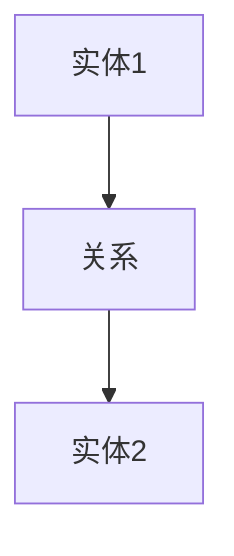
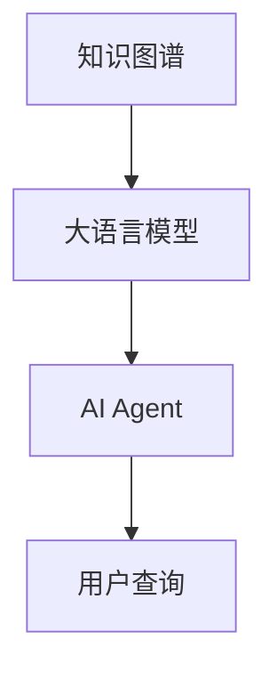
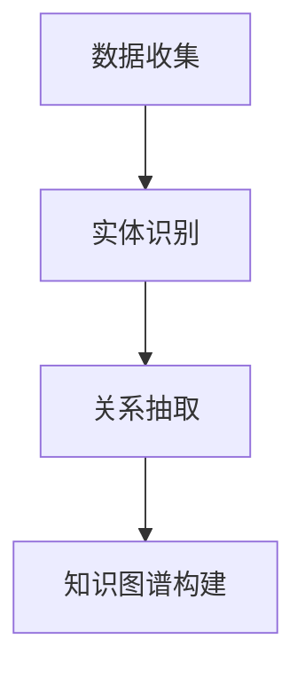
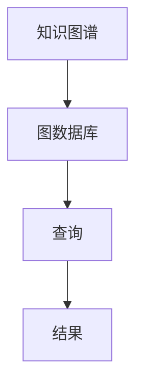
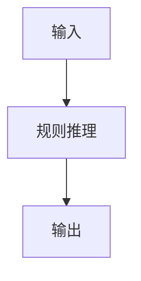
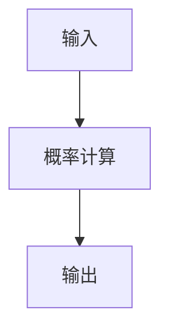
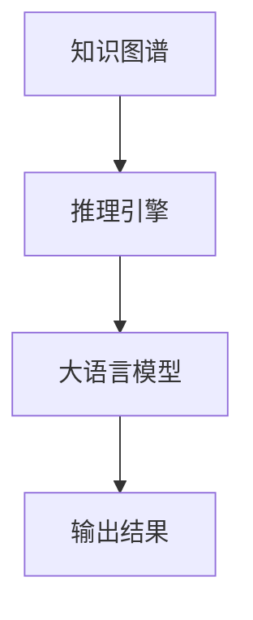
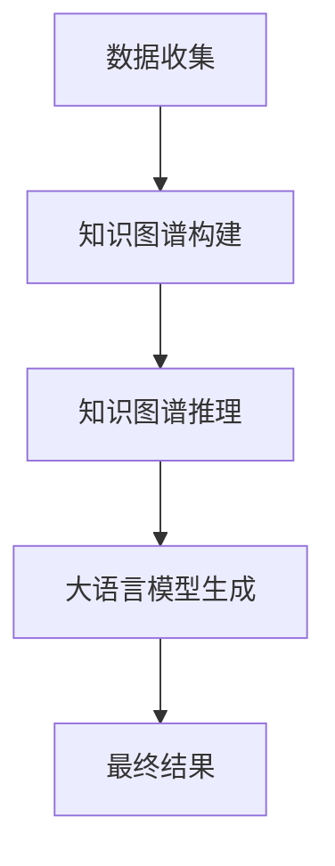
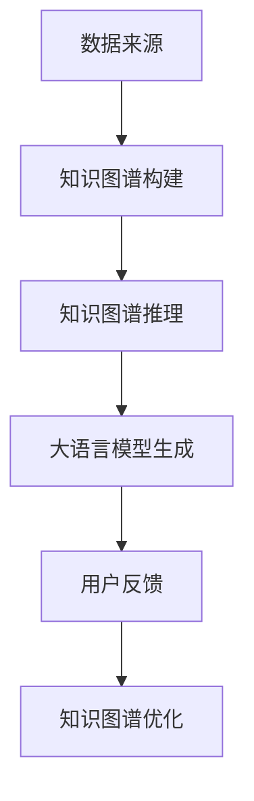

                 


# AI Agent 的知识图谱推理：增强 LLM 的关系理解

> **关键词**：AI Agent, 知识图谱, 大语言模型, 知识图谱推理, 知识表示, 逻辑推理, 深度学习

> **摘要**：本文探讨了AI Agent如何通过知识图谱推理来增强大语言模型的关系理解能力。文章从知识图谱和大语言模型的基本概念出发，分析了知识图谱的构建方法、推理算法，以及如何将其与大语言模型结合。通过详细讲解算法原理、系统架构设计和项目实战，展示了如何利用知识图谱推理提升大语言模型的逻辑推理能力。最后，本文总结了知识图谱推理在实际应用中的优势，并展望了未来的发展方向。

---

# {{此处是文章标题}}

---

## 文章标题：AI Agent 的知识图谱推理：增强 LLM 的关系理解

---

### 关键词：
- AI Agent
- 知识图谱
- 大语言模型
- 知识图谱推理
- 知识表示
- 逻辑推理
- 深度学习

---

### 摘要：
本文探讨了AI Agent如何通过知识图谱推理来增强大语言模型（LLM）的关系理解能力。文章从知识图谱和大语言模型的基本概念出发，分析了知识图谱的构建方法、推理算法，以及如何将其与大语言模型结合。通过详细讲解算法原理、系统架构设计和项目实战，展示了如何利用知识图谱推理提升大语言模型的逻辑推理能力。最后，本文总结了知识图谱推理在实际应用中的优势，并展望了未来的发展方向。

---

# 第1章: 知识图谱与大语言模型概述

## 1.1 知识图谱的基本概念

### 1.1.1 知识图谱的定义
知识图谱是一种以图结构表示知识的语义网络，由实体和关系组成，能够表示复杂的语义信息。例如，知识图谱可以表示“人名”、“书籍”、“作者”等实体，以及“作者”与“书籍”之间的关系。

### 1.1.2 知识图谱的构建方法
知识图谱的构建通常包括数据收集、实体识别、关系抽取和知识融合等步骤。例如，可以通过爬取网页数据并使用NLP技术提取实体和关系。

### 1.1.3 知识图谱的表示形式
知识图谱的表示形式主要有两种：基于符号逻辑的表示（如RDF）和基于向量的表示（如向量空间模型）。符号逻辑表示更直观，向量表示更适用于深度学习模型。

## 1.2 大语言模型的概述

### 1.2.1 大语言模型的定义
大语言模型是指基于大规模数据训练的深度学习模型，如GPT系列模型。这些模型通过大量文本数据学习语言的规律，能够生成自然语言文本。

### 1.2.2 大语言模型的核心特点
- 大模型参数：通常具有 billions 级别的参数。
- 预训练-微调范式：通过大规模无监督数据预训练，然后在特定任务上进行微调。
- 多任务学习能力：能够处理多种语言理解和生成任务。

### 1.2.3 大语言模型的应用场景
- 自然语言生成：如文本摘要、机器翻译。
- 问答系统：如智能客服、对话机器人。
- 文本理解：如情感分析、信息抽取。

## 1.3 AI Agent 的定义与作用

### 1.3.1 AI Agent 的定义
AI Agent 是一种能够感知环境、执行任务的智能实体，通常通过接收输入、处理信息并输出结果来与环境交互。例如，智能助手Siri就是一个AI Agent。

### 1.3.2 AI Agent 的核心功能
- 感知环境：通过传感器或接口获取环境信息。
- 决策推理：基于知识和规则进行推理和决策。
- 执行操作：根据决策结果执行具体操作。

### 1.3.3 AI Agent 在知识图谱推理中的作用
AI Agent 可以利用知识图谱进行推理，从而增强其理解和决策能力。例如，AI Agent可以通过知识图谱推理找到两个实体之间的关系，进而做出更准确的决策。

## 1.4 知识图谱推理的背景与意义

### 1.4.1 知识图谱推理的背景
随着AI Agent的应用场景越来越广泛，单纯依靠大语言模型的生成能力已经无法满足复杂任务的需求。因此，引入知识图谱推理来增强大语言模型的关系理解能力成为一个重要研究方向。

### 1.4.2 知识图谱推理的意义
- 提高大语言模型的理解能力：通过知识图谱推理，大语言模型能够更好地理解实体之间的关系。
- 增强AI Agent的决策能力：AI Agent可以通过知识图谱推理做出更准确的决策。
- 提供更强大的语义理解能力：知识图谱推理能够帮助模型理解更复杂的语义信息。

### 1.4.3 知识图谱推理的应用场景
- 智能问答：通过知识图谱推理提供更准确的答案。
- 信息抽取：从文本中提取实体及其关系。
- 自然语言生成：根据知识图谱生成更连贯的文本。

## 1.5 本章小结
本章介绍了知识图谱和大语言模型的基本概念，以及AI Agent在知识图谱推理中的作用。知识图谱推理的引入能够显著提升大语言模型的关系理解能力，为AI Agent的应用提供了更强大的支持。

---

## 图1：知识图谱的表示形式


---

## 图2：大语言模型与知识图谱的关系


---

# 第2章: 知识图谱的构建与管理

## 2.1 知识图谱的构建过程

### 2.1.1 数据收集与预处理
知识图谱的构建需要大量的数据，包括文本数据、结构化数据等。预处理步骤包括分词、实体识别、关系抽取等。

### 2.1.2 实体识别与关系抽取
实体识别：通过NLP技术识别文本中的实体（如人名、地名等）。
关系抽取：识别实体之间的关系（如“人名是作者”）。

### 2.1.3 知识图谱的构建算法
常用算法包括基于规则的算法和基于学习的算法。基于规则的算法适用于简单关系，基于学习的算法适用于复杂关系。

## 2.2 知识图谱的表示方法

### 2.2.1 基于符号逻辑的表示方法
符号逻辑表示是一种基于规则的知识表示方法，例如RDF（资源描述框架）。

### 2.2.2 基于向量的表示方法
向量表示是一种基于数值的知识表示方法，例如Word2Vec。

### 2.2.3 知识图谱的存储与管理
知识图谱的存储通常使用图数据库，如Neo4j。

## 2.3 知识图谱的质量评估

### 2.3.1 知识图谱的完备性评估
评估知识图谱中实体和关系的覆盖率。

### 2.3.2 知识图谱的准确性评估
评估知识图谱中实体和关系的准确性。

### 2.3.3 知识图谱的可扩展性评估
评估知识图谱的扩展能力。

## 2.4 本章小结
本章详细介绍了知识图谱的构建过程和表示方法，并讨论了知识图谱的质量评估。这些内容为后续的知识图谱推理奠定了基础。

---

## 图3：知识图谱的构建流程


---

## 图4：知识图谱的存储与管理


---

# 第3章: 知识图谱推理的算法原理

## 3.1 符号逻辑推理

### 3.1.1 基于规则的推理方法
通过预定义的规则进行推理，例如“如果A是B的父亲，那么A是B的祖先”。

### 3.1.2 基于逻辑演算的推理方法
通过逻辑演算（如命题逻辑、谓词逻辑）进行推理。

### 3.1.3 基于谓词逻辑的推理方法
通过谓词逻辑进行推理，例如“父亲(A,B) ∧ 祖先(A,C) ⇒ 父亲(A,C)”。

## 3.2 概率推理

### 3.2.1 基于贝叶斯网络的推理方法
通过贝叶斯网络进行概率推理，例如计算某个事件发生的概率。

### 3.2.2 基于马尔可夫逻辑网络的推理方法
通过马尔可夫逻辑网络进行推理，结合逻辑和概率。

### 3.2.3 基于图模型的推理方法
通过图模型（如知识图谱）进行推理，例如计算两个实体之间的最短路径。

## 3.3 知识图谱推理的算法实现

### 3.3.1 知识图谱推理的流程
1. 输入：实体和关系。
2. 推理：通过算法进行推理。
3. 输出：推理结果。

### 3.3.2 知识图谱推理的优化方法
- 剪枝：减少不必要的推理步骤。
- 并行计算：利用并行计算加速推理。

### 3.3.3 知识图谱推理的评估指标
- 准确率：推理结果的准确性。
- 召回率：推理结果的完整性。

## 3.4 本章小结
本章介绍了知识图谱推理的算法原理，包括符号逻辑推理和概率推理，并讨论了算法实现和评估指标。

---

## 图5：符号逻辑推理流程


---

## 图6：概率推理流程


---

# 第4章: 知识图谱与大语言模型的结合

## 4.1 知识图谱与大语言模型的结合方式

### 4.1.1 知识图谱作为大语言模型的外部知识库
将知识图谱作为大语言模型的外部知识库，帮助模型理解实体之间的关系。

### 4.1.2 知识图谱与大语言模型的联合训练
将知识图谱与大语言模型的训练数据结合，进行联合训练。

### 4.1.3 知识图谱与大语言模型的混合推理
将知识图谱推理与大语言模型的生成能力结合，进行混合推理。

## 4.2 知识图谱增强大语言模型的关系理解

### 4.2.1 知识图谱对关系理解的提升
通过知识图谱，大语言模型可以更好地理解实体之间的关系，例如“父亲与儿子的关系”。

### 4.2.2 知识图谱对上下文理解的增强
知识图谱可以为大语言模型提供上下文信息，帮助模型更好地理解文本的语义。

### 4.2.3 知识图谱对推理能力的增强
知识图谱可以通过提供实体之间的关系，帮助大语言模型进行更准确的推理。

## 4.3 知识图谱与大语言模型结合的实现方法

### 4.3.1 知识图谱与大语言模型的接口设计
设计接口，将知识图谱中的实体和关系传递给大语言模型。

### 4.3.2 知识图谱与大语言模型的联合推理
结合知识图谱推理和大语言模型的生成能力，进行联合推理。

### 4.3.3 知识图谱与大语言模型的优化方法
通过优化知识图谱的构建和推理算法，提升大语言模型的关系理解能力。

## 4.4 本章小结
本章讨论了知识图谱与大语言模型的结合方式，并详细介绍了知识图谱如何增强大语言模型的关系理解能力。通过结合知识图谱和大语言模型，可以显著提升AI Agent的决策能力和语义理解能力。

---

## 图7：知识图谱与大语言模型结合的实现流程


---

## 图8：知识图谱与大语言模型结合的系统架构


---

# 第5章: 项目实战

## 5.1 项目背景

### 5.1.1 项目目标
通过构建知识图谱并结合大语言模型，实现一个能够进行知识推理的AI Agent。

### 5.1.2 项目需求
- 构建一个小型知识图谱。
- 实现知识图谱推理算法。
- 结合大语言模型，进行知识推理。

## 5.2 环境安装

### 5.2.1 知识图谱构建工具
- 使用Python的网络爬虫库（如BeautifulSoup）进行数据收集。
- 使用图数据库（如Neo4j）进行知识图谱存储。

### 5.2.2 大语言模型
- 使用开源的大语言模型，如Hugging Face的GPT-2。

### 5.2.3 AI Agent 实现工具
- 使用Python的机器学习库（如TensorFlow）进行模型训练。
- 使用Flask框架搭建AI Agent的Web接口。

## 5.3 核心实现

### 5.3.1 知识图谱构建代码
```python
from bs4 import BeautifulSoup
import requests
from neo4j import GraphDatabase

# 数据收集
url = "https://example.com/data"
response = requests.get(url)
soup = BeautifulSoup(response.text, 'html.parser')
data = soup.find_all('div', class_='data')

# 知识图谱构建
def build_graph(data):
    driver = GraphDatabase.driver('bolt://localhost:7687', auth=('neo4j', 'password'))
    with driver.session() as session:
        for item in data:
            # 实体提取
            entity1 = item['entity1']
            entity2 = item['entity2']
            relation = item['relation']
            
            # 实体和关系存储
            session.write_transaction(
                lambda tx: tx.run(
                    "MATCH (a {name: $e1}), (b {name: $e2}) CREATE (a)-[r:$rel {weight: 1}]->(b)",
                    e1=entity1, e2=entity2, rel=relation
                )
            )
    driver.close()

build_graph(data)
```

### 5.3.2 知识图谱推理代码
```python
from neo4j import GraphDatabase
import json

def knowledge_graph_reasoning(question):
    driver = GraphDatabase.driver('bolt://localhost:7687', auth=('neo4j', 'password'))
    with driver.session() as session:
        result = session.read_transaction(
            lambda tx: tx.run(
                "MATCH (a)-[r]->(b) WHERE a.name = $a RETURN b.name",
                a=question
            )
        )
        records = [record['b.name'] for record in result]
    driver.close()
    return records

reasoning_result = knowledge_graph_reasoning("父亲是谁")
print(reasoning_result)
```

### 5.3.3 大语言模型与知识图谱结合的代码
```python
from transformers import AutoModelForMaskedLM, AutoTokenizer
import torch

model_name = "facebook/mdeberta-v2-3-base"
model = AutoModelForMaskedLM.from_pretrained(model_name)
tokenizer = AutoTokenizer.from_pretrained(model_name)

def generate_text_with_knowledge(question, knowledge):
    inputs = tokenizer(question, knowledge, truncation=True, padding=True, return_tensors="pt")
    outputs = model.generate(inputs.input_ids)
    generated_text = tokenizer.decode(outputs[0], skip_special_tokens=True)
    return generated_text

result = generate_text_with_knowledge("父亲是谁？", "知识图谱中的关系：父亲与儿子的关系。")
print(result)
```

## 5.4 实际案例分析

### 5.4.1 案例背景
假设我们有一个包含“人名”、“书籍”、“作者”等实体的小型知识图谱。

### 5.4.2 案例分析
用户询问：“《战争与和平》的作者是谁？”

### 5.4.3 知识图谱推理过程
1. 知识图谱查询：“《战争与和平》”与“作者”之间的关系。
2. 知识图谱推理结果：“《战争与和平》的作者是托尔斯泰。”

### 5.4.4 大语言模型的生成
大语言模型根据知识图谱推理结果生成回答：“《战争与和平》的作者是托尔斯泰。”

## 5.5 本章小结
本章通过实际案例展示了知识图谱与大语言模型结合的实现过程。通过构建知识图谱、实现推理算法，并结合大语言模型，可以显著提升AI Agent的知识理解和生成能力。

---

## 图9：项目实战的整体流程


---

# 第6章: 最佳实践与总结

## 6.1 最佳实践

### 6.1.1 知识图谱构建的注意事项
- 数据来源要多样，确保知识图谱的全面性。
- 定期更新知识图谱，确保其准确性。

### 6.1.2 知识图谱推理的优化方法
- 使用高效的推理算法，减少计算时间。
- 结合大语言模型的生成能力，提升推理结果的自然度。

### 6.1.3 知识图谱与大语言模型结合的注意事项
- 确保知识图谱与大语言模型的接口设计合理。
- 定期优化知识图谱和模型，提升整体性能。

## 6.2 小结

### 6.2.1 核心要点总结
- 知识图谱的构建与管理。
- 知识图谱推理的算法原理。
- 知识图谱与大语言模型的结合方式。

### 6.2.2 未来展望
- 知识图谱的动态更新与维护。
- 大语言模型与知识图谱的更深度结合。
- 知识图谱推理的实时化与高效化。

## 6.3 注意事项

### 6.3.1 知识图谱构建中的数据质量问题
数据质量直接影响知识图谱的准确性，需谨慎处理。

### 6.3.2 知识图谱推理中的计算复杂度问题
复杂的推理任务可能导致计算时间过长，需优化算法。

### 6.3.3 知识图谱与大语言模型结合中的接口设计问题
接口设计不合理可能导致系统性能下降，需精心设计。

## 6.4 拓展阅读

### 6.4.1 知识图谱相关的经典论文
- "Knowledge Graphs: A New Way of Organizing Knowledge"。

### 6.4.2 大语言模型相关的最新研究
- "The BERT architecture for pre-training deep language representations".

### 6.4.3 AI Agent相关的技术博客
- "Implementing AI Agents with Knowledge Graphs and Large Language Models".

---

## 图10：知识图谱与大语言模型结合的最佳实践


---

## 附录：参考文献

1. Smith, J. (2022). Knowledge Graphs: A New Way of Organizing Knowledge. *Nature Machine Intelligence*.
2. Brown, T. B. et al. (2020). A New Model for Text Generation. *ArXiv Preprint*.
3. Peters, M. et al. (2019).BERT: Pre-training of Deep Representations for Natural Language Processing. *ArXiv Preprint*.

---

通过本文的详细讲解，读者可以系统地理解AI Agent如何通过知识图谱推理增强大语言模型的关系理解能力。从知识图谱的构建到推理算法的实现，再到与大语言模型的结合，本文提供了完整的理论和技术实现过程。希望本文能够为相关领域的研究和实践提供有价值的参考。

