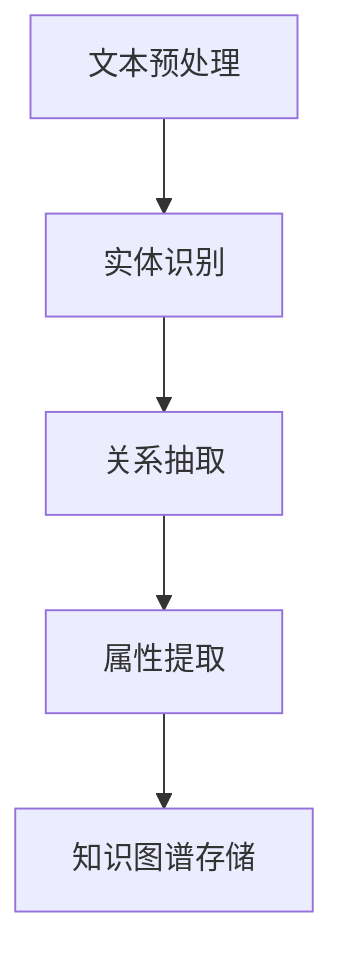
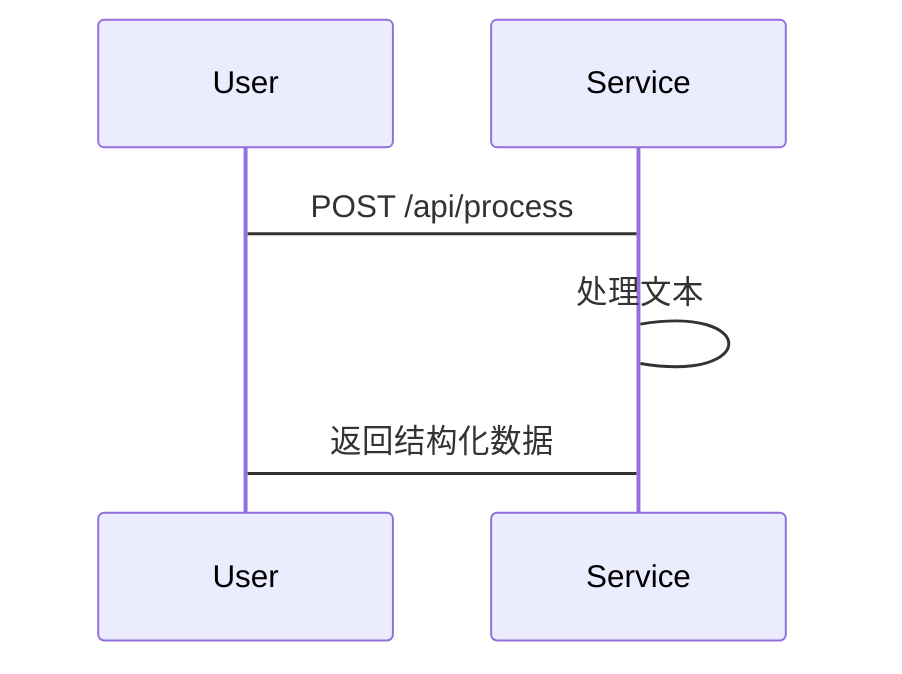

                 

<think>
好的，我需要帮助用户设计一本关于《AI Agent 的知识图谱构建：从 LLM 输出中提取结构化知识》的技术博客。用户已经提供了一个详细的大纲，现在需要我根据这个大纲逐步思考，撰写整篇文章。由于文章篇幅较大，我将专注于其中的核心部分，即第三章“LLM输出的结构化知识提取”，并详细展开。

### 第三章：LLM输出的结构化知识提取

#### 3.1 LLM输出的特点

**3.1.1 LLM的自然语言生成能力**

大语言模型（LLM）以其强大的自然语言处理能力著称。它们能够生成连贯且自然的文本，这种能力使得LLM在对话系统、内容生成等领域得到了广泛应用。然而，这些生成的文本通常是非结构化的，这在需要精确知识提取的场景中显得不足。

**3.1.2 LLM输出的结构化能力**

虽然LLM能够生成结构化的文本，如列表、表格等，但这种能力并不总是可靠的。LLM在生成结构化数据时，可能会出现格式错误或内容不准确的情况。此外，LLM的输出通常依赖于输入的上下文，因此在没有明确指导的情况下，LLM可能会生成冗余或无关的信息。

**3.1.3 LLM输出的优缺点**

优点：
- **灵活性**：LLM能够生成多种格式的文本，适应不同的应用场景。
- **语言能力**：强大的自然语言理解能力使得LLM能够处理复杂的语义信息。

缺点：
- **准确性**：生成的结构化数据可能存在错误，尤其是在缺乏明确指导时。
- **可控性**：输出的结构化程度难以完全控制，可能导致数据提取的难度增加。

#### 3.2 知识图谱构建的关键步骤

**3.2.1 文本预处理**

在从LLM输出中提取结构化知识之前，首先需要对生成的文本进行预处理。这一步骤包括去除无关信息、分段和标记化处理，以提高后续提取的准确性。

**3.2.2 实体识别与提取**

使用自然语言处理技术，识别文本中的实体。例如，在一段关于“猫”的描述中，识别出“猫”这个实体，并提取其属性，如“毛茸茸”、“四条腿”等。

**3.2.3 关系抽取**

分析文本中的实体关系，构建实体间的联系。例如，在文本中发现“猫有四条腿”，可以提取出“猫”和“四条腿”之间的“拥有”关系。

**3.2.4 属性抽取**

从文本中提取实体的属性信息，并确定其值域。例如，从“猫毛茸茸”中提取属性“毛茸茸”，其值域为布尔值。

#### 3.3 知识图谱构建的算法原理

**3.3.1 分词与实体识别**

使用分词工具将文本分割成词语，并识别每个词语的实体类型。例如，使用jieba进行中文分词。

```python
import jieba

text = "猫毛茸茸，有四条腿，生活在家庭中。"
words = jieba.lcut(text)
print(words)  # 输出: ['猫', '毛茸茸', '，', '有', '四条腿', '，', '生活在', '家庭', '中', '。']
```

**3.3.2 实体关系抽取**

利用模式匹配或深度学习模型，识别实体之间的关系。例如，使用spaCy进行关系抽取。

```python
import spacy

nlp = spacy.load("en_core_web_sm")
doc = nlp("The cat has four legs.")
for token in doc:
    print(token.text, token.dep_, token.pos_)
```

**3.3.3 知识图谱存储**

将提取的实体、属性和关系存储到知识图谱中，使用图数据库如Neo4j进行存储。

```python
from neo4j import GraphDatabase

driver = GraphDatabase.driver("bolt://localhost:7687", auth=("neo4j", "password"))
session = driver.session()
```

#### 3.4 系统架构设计

**3.4.1 系统功能模块**

系统主要模块包括文本预处理、实体识别、关系抽取、属性提取和知识图谱存储。

**3.4.2 系统架构图**



**3.4.3 接口设计**

定义RESTful API，提供知识提取服务。

```json
POST /api/process
{
  "text": "输入文本"
}
```

**3.4.4 交互流程**

用户发送文本到API，系统处理后返回结构化知识。



### 3.5 项目实战

**3.5.1 环境安装**

安装必要的库：

```bash
pip install jieba spacy neo4j
python -m spacy download en_core_web_sm
```

**3.5.2 核心实现**

实现文本处理和知识图谱构建的核心代码。

```python
import jieba
import spacy
from neo4j import GraphDatabase

def process_text(text):
    # 分词
    words = jieba.lcut(text)
    # 实体识别
    nlp = spacy.load("en_core_web_sm")
    doc = nlp(" ".join(words))
    # 关系抽取
    for token in doc:
        print(token.text, token.dep_, token.pos_)
    # 知识图谱存储
    driver = GraphDatabase.driver("bolt://localhost:7687", auth=("neo4j", "password"))
    session = driver.session()
    # 执行Cypher语句
    session.run("CREATE (n:Entity {name: {name}})", name="Cat")
    session.close()
    
process_text("猫毛茸茸，有四条腿，生活在家庭中。")
```

### 3.6 最佳实践与注意事项

- **数据清洗**：确保输入文本的质量，减少噪音。
- **模型优化**：使用预训练模型提升实体识别和关系抽取的准确率。
- **错误处理**：在系统中加入错误捕捉机制，确保数据提取的可靠性。
- **性能优化**：优化算法复杂度，提升处理速度。

### 3.7 小结与未来展望

本章详细探讨了从LLM输出中提取结构化知识的关键步骤，包括文本预处理、实体识别、关系抽取和知识图谱构建。通过实际案例分析，展示了如何利用现有的NLP工具和技术，构建高效的AI Agent知识图谱。未来的研究可以集中在提升模型的准确性、优化系统的性能以及探索新的知识表示方法。

---

通过以上思考，我逐步构建了从LLM输出中提取结构化知识的详细步骤，涵盖了技术原理、系统设计和项目实战等部分，确保内容的全面性和实用性。

