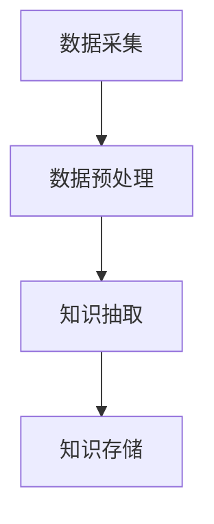

                 

# AI Agent 的知识图谱集成：增强 LLM 的结构化知识

## 关键词：AI Agent，知识图谱，LLM，结构化知识，大语言模型

## 摘要：  
随着人工智能技术的快速发展，AI Agent 和大语言模型（LLM）在各个领域的应用日益广泛。然而，LLM 的知识主要依赖于训练数据，缺乏结构化的知识表示和推理能力。通过将知识图谱集成到 AI Agent 中，可以为 LLM 提供更强大的结构化知识支持，增强其理解和推理能力。本文详细探讨了知识图谱与 AI Agent 的集成方法，分析了其对 LLM 的增强作用，并通过实际案例展示了如何实现这一集成。

---

## 第1章: 知识图谱与AI Agent概述

### 1.1 知识图谱的基本概念
知识图谱是一种以图结构形式表示知识的工具，由节点（实体）和边（关系）组成。例如，节点可以表示“人”、“地点”、“事件”，边可以表示“出生”、“位于”、“发生”。知识图谱通过将实体与关系连接起来，构建了一个可计算的语义网络。

**知识图谱的表示方法：**
- 符号逻辑表示：通过谓词逻辑描述实体之间的关系，例如“Person(Xiaoming, Person) ∧ BornIn(Xiaoming, Shanghai)”。
- 向量表示：将实体和关系映射到向量空间，便于计算和推理。

### 1.2 AI Agent的基本概念
AI Agent 是一种能够感知环境、自主决策并执行任务的智能体。它可以分为简单反射型 Agent 和基于模型的规划 Agent。AI Agent 的核心功能包括感知、推理、规划和执行。

**AI Agent 的分类：**
- 单一智能体：独立执行任务，例如 Siri。
- 分布式智能体：多个 Agent 协作完成任务，例如自动驾驶系统中的传感器、决策器和执行器。

### 1.3 知识图谱与AI Agent的集成意义
通过将知识图谱集成到 AI Agent 中，可以为 LLM 提供以下增强：
- **结构化知识支持**：知识图谱为 LLM 提供了结构化的知识库，使其能够更准确地理解上下文。
- **推理能力提升**：基于知识图谱的推理算法，LLM 可以进行逻辑推理，回答复杂问题。
- **动态知识更新**：知识图谱可以实时更新，确保 AI Agent 的知识库始终保持最新。

---

## 第2章: 知识图谱的构建与管理

### 2.1 知识图谱的构建过程
知识图谱的构建包括数据采集、预处理、知识抽取和存储四个步骤。

**流程图：知识图谱构建过程**

**数据预处理：** 对原始数据进行清洗、去重和格式化，例如将文本数据转换为结构化数据。

**知识抽取：** 通过自然语言处理技术从文本中提取实体、关系和属性，例如从新闻中提取“公司- CEO”关系。

### 2.2 知识图谱的表示方法
知识图谱的表示方法决定了其存储和查询的效率。常用的表示方法包括符号逻辑和向量嵌入。

**符号逻辑表示：**  
通过谓词逻辑描述实体之间的关系，例如：
$$ Person(Xiaoming) \land BornIn(Xiaoming, Shanghai) $$

**向量嵌入表示：**  
将实体和关系映射到高维向量空间，例如使用 Word2Vec 或 GloVe 进行嵌入。

### 2.3 知识图谱的查询与推理
知识图谱的查询可以通过基于图的遍历算法实现，例如深度优先搜索（DFS）和广度优先搜索（BFS）。推理算法包括基于规则的推理和基于概率的推理。

**基于规则的推理：**  
定义规则，例如“如果 A 是 B 的子类，那么 A 具有 B 的属性”，然后通过规则匹配进行推理。

**基于概率的推理：**  
使用概率论计算实体之间的关系概率，例如贝叶斯推理。

---

## 第3章: AI Agent的知识表示与推理

### 3.1 AI Agent的知识表示
AI Agent 的知识表示需要结合知识图谱的结构化知识和大语言模型的语义理解能力。知识表示的形式包括符号表示和向量表示。

**符号表示：**  
通过符号逻辑描述知识，例如“猫是一种动物”。

**向量表示：**  
将知识表示为向量，便于计算相似性，例如使用 Word2Vec 表示词语向量。

### 3.2 AI Agent的推理机制
AI Agent 的推理机制包括基于符号逻辑的推理和基于向量的推理。

**基于符号逻辑的推理：**  
通过谓词逻辑进行推理，例如“所有猫都是动物，因此猫有四条腿”。

**基于向量的推理：**  
通过向量空间模型进行推理，例如计算两个向量的余弦相似度。

### 3.3 知识图谱与AI Agent的交互
知识图谱与 AI Agent 的交互可以通过查询接口实现，例如通过 SPARQL 查询知识图谱中的实体和关系。

---

## 第4章: LLM与知识图谱的结合

### 4.1 LLM的基本原理
大语言模型（LLM）是一种基于深度学习的生成模型，通过大量数据训练，可以生成人类水平的文本。其基本原理包括编码器-解码器结构和注意力机制。

**编码器-解码器结构：**  
编码器将输入文本映射到向量空间，解码器根据向量生成输出文本。

**注意力机制：**  
通过计算输入文本中每个词的重要性，生成注意力权重。

### 4.2 知识图谱对LLM的增强作用
知识图谱可以为 LLM 提供以下增强：
- **结构化知识支持**：通过知识图谱提供结构化的知识库，增强 LLM 的理解能力。
- **推理能力提升**：基于知识图谱的推理算法，增强 LLM 的推理能力。
- **动态知识更新**：通过实时更新知识图谱，保持 LLM 的知识库最新。

### 4.3 LLM与知识图谱的集成方法
知识图谱与 LLM 的集成方法包括知识嵌入和知识调用两种方式。

**知识嵌入：**  
将知识图谱嵌入到 LLM 的训练过程中，增强模型的语义理解能力。

**知识调用：**  
通过接口调用知识图谱中的实体和关系，增强 LLM 的推理能力。

---

## 第5章: AI Agent的知识图谱集成系统设计

### 5.1 系统架构设计
知识图谱集成到 AI Agent 的系统架构包括知识图谱存储、LLM 调用和推理引擎三个模块。

**知识图谱存储：**  
存储和管理知识图谱数据，支持高效查询和推理。

**LLM 调用：**  
通过接口调用 LLM 的生成能力，增强 AI Agent 的交互能力。

**推理引擎：**  
基于知识图谱的推理算法，增强 AI Agent 的推理能力。

### 5.2 系统功能设计
系统功能包括知识图谱构建、LLM 集成和推理引擎设计。

**知识图谱构建：**  
通过数据采集和知识抽取构建知识图谱。

**LLM 集成：**  
通过接口调用 LLM 的生成能力，增强 AI Agent 的交互能力。

**推理引擎设计：**  
基于知识图谱的推理算法，增强 AI Agent 的推理能力。

### 5.3 系统接口设计
系统接口包括知识图谱查询接口和 LLM 调用接口。

**知识图谱查询接口：**  
通过 SPARQL 查询知识图谱中的实体和关系。

**LLM 调用接口：**  
通过 API 调用 LLM 的生成能力。

### 5.4 系统交互设计
系统交互包括知识图谱查询和 LLM 生成的交互流程。

**知识图谱查询：**  
AI Agent 通过知识图谱查询接口获取实体和关系，增强推理能力。

**LLM 生成：**  
AI Agent 通过 LLM 调用接口生成自然语言文本，增强交互能力。

---

## 总结

通过将知识图谱集成到 AI Agent 中，可以为 LLM 提供更强大的结构化知识支持，增强其理解和推理能力。本文详细探讨了知识图谱与 AI Agent 的集成方法，分析了其对 LLM 的增强作用，并通过实际案例展示了如何实现这一集成。未来，随着知识图谱和大语言模型技术的不断发展，AI Agent 的知识图谱集成将在更多领域发挥重要作用。

--- 

如果需要进一步扩展或调整，请随时告知！

