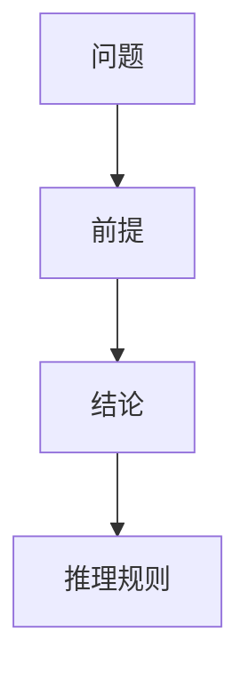
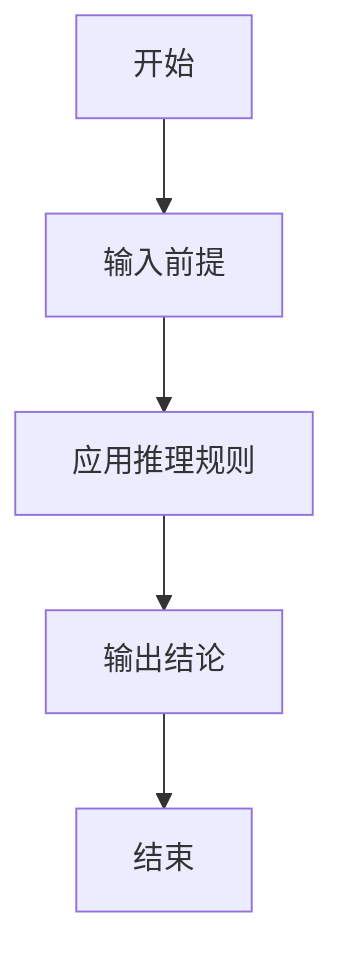
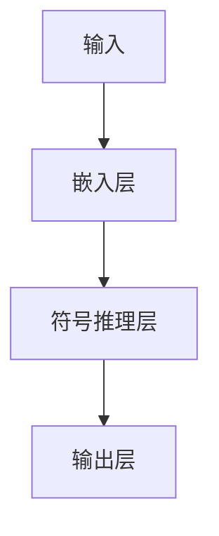
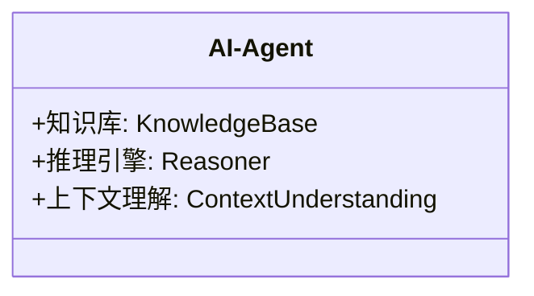
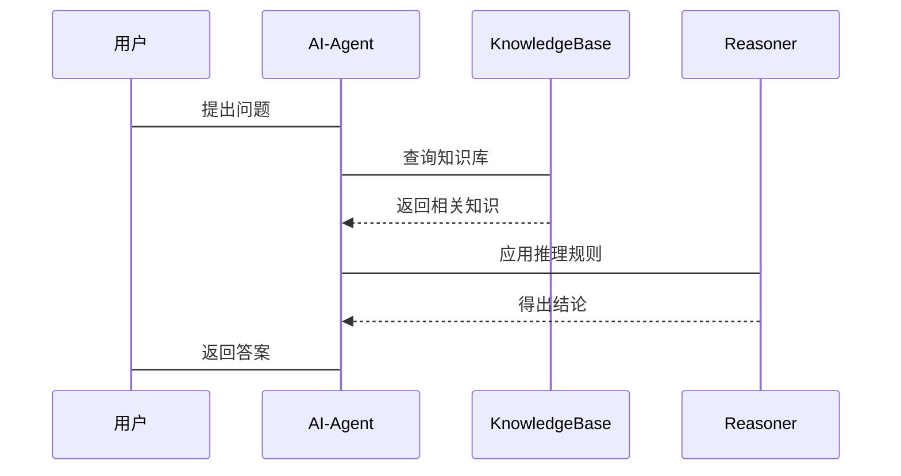
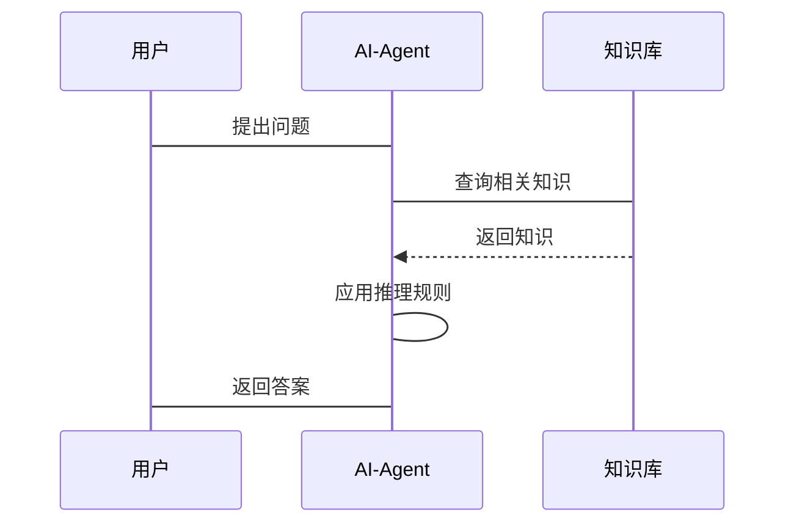

                 


# AI Agent 的知识推理：增强 LLM 的逻辑分析能力

## 关键词：
AI Agent、知识推理、LLM、逻辑分析能力、增强推理

## 摘要：
本文深入探讨AI Agent的知识推理能力，分析其如何增强大型语言模型（LLM）的逻辑分析能力。文章从背景介绍、核心概念、算法原理、系统架构设计、项目实战到最佳实践，全面解析知识推理的原理与应用，结合实际案例和代码示例，帮助读者掌握如何构建和支持知识推理的AI系统。

---

## 第一部分：AI Agent 与知识推理的背景介绍

### 第1章：AI Agent 的基本概念

#### 1.1 问题背景
- **AI Agent 的定义与应用领域**  
  AI Agent（人工智能代理）是能够感知环境、自主决策并执行任务的智能体。它们广泛应用于聊天机器人、智能助手、推荐系统和自动驾驶等领域。  
  例如，Siri 和 Alexa 是典型的 AI Agent，它们通过理解用户需求并执行任务来提供服务。

- **知识推理在 AI Agent 中的重要性**  
  AI Agent 需要具备理解上下文、推理逻辑和处理复杂问题的能力。知识推理是其实现这些功能的核心技术。

- **当前 AI Agent 的主要挑战**  
  当前的 AI Agent，尤其是基于大型语言模型（LLM）的系统，存在逻辑推理能力有限的问题。它们往往依赖预训练的数据，难以处理动态变化的推理任务。

#### 1.2 问题描述
- **知识推理的核心问题**  
  知识推理是指通过已有知识库或上下文信息，推导出新的结论或解决复杂问题的过程。核心问题是如何让 AI Agent 具备逻辑推理能力，以增强 LLM 的分析能力。

- **LLM 在知识推理中的局限性**  
  LLM 依赖于训练数据，无法进行动态推理。当面对未见过的新问题时，LLM 的表现往往受限。

- **增强 LLM 的逻辑分析能力的必要性**  
  增强 LLM 的逻辑分析能力，可以让 AI Agent 更高效地解决复杂问题，提升用户体验。

#### 1.3 问题解决
- **知识推理的方法概述**  
  知识推理可以通过符号逻辑推理、神经符号推理等方法实现。符号逻辑推理依赖规则，神经符号推理结合神经网络和符号推理。

- **增强 LLM 的策略分析**  
  增强策略包括将 LLM 与符号推理引擎结合，或者通过微调模型来提升推理能力。

- **现有解决方案的优缺点**  
  - 符号逻辑推理：优点是规则明确，缺点是难以处理复杂问题。  
  - 神经符号推理：优点是结合了神经网络的灵活性和符号推理的可解释性，缺点是实现复杂。

#### 1.4 边界与外延
- **知识推理的适用范围**  
  知识推理适用于需要逻辑分析的任务，如问答系统、诊断系统和推荐系统。

- **与相关概念的区分**  
  知识推理与数据挖掘和机器学习的区别在于，它更注重基于知识的逻辑推导，而非数据模式的发现。

- **技术的未来发展趋势**  
  神经符号推理和增量式推理是未来发展的主要方向，将提升 AI Agent 的动态推理能力。

#### 1.5 核心要素组成
- **知识表示**  
  知识表示是推理的基础，常用符号逻辑（如谓词逻辑）或知识图谱（如 RDF）表示。

- **推理机制**  
  推理机制包括演绎推理、归纳推理和 abduction 推理。

- **上下文理解**  
  上下文理解是知识推理的关键，AI Agent 需要结合当前上下文进行推理。

---

## 第二部分：知识推理的核心概念与联系

### 第2章：知识推理的原理与方法

#### 2.1 核心概念原理
- **符号逻辑推理**  
  符号逻辑推理基于谓词逻辑，通过规则库推导结论。例如，使用 Prolog 进行逻辑推理。

- **神经符号推理**  
  神经符号推理结合神经网络和符号推理，通过学习推理规则来提升推理能力。

- **增量式推理**  
  增量式推理在动态环境中逐步推理，适用于实时更新的知识库。

#### 2.2 概念属性特征对比
| 概念         | 符号逻辑推理 | 神经符号推理 |
|--------------|--------------|--------------|
| 表示方式     | 符号规则     | 神经网络与符号结合 |
| 可解释性     | 高           | 较高，依赖网络结构 |
| 处理复杂性   | 低           | 较高 |
| 应用场景     | 简单逻辑问题 | 复杂动态问题 |

#### 2.3 ER实体关系图


---

## 第三部分：算法原理讲解

### 第3章：主流知识推理算法

#### 3.1 符号逻辑推理算法

##### 算法流程图


##### Python代码实现
```python
# 示例：符号逻辑推理
def logical_inference(rules, premises):
    # 规则：列表，每个规则为一个元组 (antecedent, consequent)
    # 前提：前提列表
    for rule in rules:
        if all(p in premises for p in rule[0]):
            return rule[1]
    return None

# 示例规则和前提
rules = [((1, 2), 3), ((3, 4), 5)]
premises = (1, 2)
print(logical_inference(rules, premises))  # 输出 3
```

##### 数学模型和公式
逻辑推理的数学模型基于谓词逻辑，推理规则可以表示为：
$$ (A \land B) \rightarrow C $$
其中，$A$ 和 $B$ 是前提，$C$ 是结论。

#### 3.2 神经符号推理算法

##### 算法流程图


##### Python代码实现
```python
# 示例：神经符号推理
import torch
import torch.nn as nn

class NeuralSymbolic(nn.Module):
    def __init__(self, input_dim, hidden_dim):
        super().__init__()
        self.embed = nn.Linear(input_dim, hidden_dim)
        self.reason = nn.Linear(hidden_dim, 1)

    def forward(self, x):
        x = self.embed(x)
        x = torch.sigmoid(x)
        x = self.reason(x)
        return x

# 示例输入和训练
model = NeuralSymbolic(2, 4)
optimizer = torch.optim.Adam(model.parameters())
criterion = nn.MSELoss()

input_tensor = torch.FloatTensor([[1, 0]])
target = torch.FloatTensor([[1.0]])

for _ in range(100):
    output = model(input_tensor)
    loss = criterion(output, target)
    loss.backward()
    optimizer.step()

print(output.item())  # 输出接近1.0
```

##### 数学模型和公式
神经符号推理结合了神经网络的表达能力和符号推理的逻辑性，其数学模型可以表示为：
$$ f(x) = \sigma(Wx + b) $$
其中，$\sigma$ 是 sigmoid 函数，$W$ 和 $b$ 是模型参数。

---

## 第四部分：系统分析与架构设计

### 第4章：系统架构设计

#### 4.1 问题场景分析
- **目标**：设计一个支持知识推理的 AI Agent 系统。
- **主要功能**：包括知识表示、推理引擎和上下文理解模块。

#### 4.2 系统功能设计


#### 4.3 系统架构设计


#### 4.4 接口设计与交互


---

## 第五部分：项目实战

### 第5章：构建知识推理系统

#### 5.1 环境安装
- **工具**：Python、TensorFlow、Keras
- **库**：安装必要的依赖，如 `networkx` 和 `py2neo`

#### 5.2 系统核心实现源代码

##### 知识库构建
```python
from networkx import Graph
from py2neo import Graph as NeoGraph, Node, Relationship

# 创建知识图谱
graph = Graph()
neo_graph = NeoGraph("http://localhost:7474", auth=('neo4j', 'password'))

# 添加节点和关系
node1 = Node('Concept', name='逻辑推理')
node2 = Node('Concept', name='符号规则')
graph.add_node(node1)
graph.add_node(node2)
graph.add_edge(node1, node2, 'uses')
```

##### 推理引擎实现
```python
def infer(neo_graph):
    # 查询知识库
    results = list(neo_graph.run("MATCH (a:Concept {name:'逻辑推理'}) "
                                  "RETURN a"))
    return [result['a'].name for result in results]

print(infer(neo_graph))  # 输出相关概念
```

##### 系统交互流程


#### 5.3 案例分析与详细解读
- **案例**：用户询问“如果下雨，我应该如何安排会议？”
  - 系统首先查询天气数据。
  - 然后应用推理规则（如会议安排规则）。
  - 最终得出结论：如果下雨，建议推迟会议。

#### 5.4 项目小结
- **实现效果**：系统能够根据上下文进行推理，提供合理建议。
- **经验总结**：知识库构建和推理规则的设计是关键。

---

## 第六部分：最佳实践与扩展阅读

### 第6章：最佳实践

#### 6.1 小结
- 知识推理是 AI Agent 的核心能力，能够显著增强 LLM 的逻辑分析能力。
- 综合使用符号逻辑推理和神经符号推理是提升推理能力的有效策略。

#### 6.2 注意事项
- 知识库的质量直接影响推理结果，需持续更新和优化。
- 推理规则的设计需要结合具体应用场景，避免过于复杂。

#### 6.3 扩展阅读
- 推荐阅读《神经符号人工智能》和《知识图谱构建与应用》。

---

## 结语
通过本文的系统介绍，读者可以全面理解 AI Agent 的知识推理能力及其在增强 LLM 逻辑分析能力中的应用。结合实际项目案例和代码示例，帮助读者掌握知识推理的核心技术和实现方法。未来，随着神经符号推理和增量式推理的发展，AI Agent 的推理能力将进一步提升，为更多复杂应用场景提供支持。

