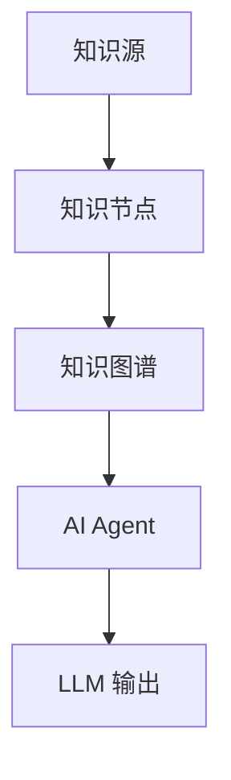

                 


# AI Agent 的知识溯源：提高 LLM 输出的可追溯性

## 关键词：AI Agent, 知识溯源, LLM, 可追溯性, 信息来源, 知识图谱, 区块链

## 摘要：  
随着AI Agent和大语言模型（LLM）的广泛应用，输出结果的可追溯性问题日益重要。本文系统性地探讨了AI Agent的知识溯源方法，从理论基础到算法实现，再到系统设计，全面分析了如何提高LLM输出的可追溯性。通过构建知识图谱、优化算法模型和设计合理的系统架构，本文为解决AI Agent的知识溯源问题提供了实践指导和理论支持。

---

# 第一部分: AI Agent 的知识溯源基础

## 第1章: 知识溯源的背景与问题背景

### 1.1 问题背景

#### 1.1.1 AI Agent 的定义与特点
AI Agent（人工智能代理）是指能够感知环境、自主决策并执行任务的智能实体。其特点包括自主性、反应性、目标导向和社交能力。AI Agent广泛应用于自然语言处理、智能推荐、自动化决策等领域。

#### 1.1.2 LLM 输出的可追溯性问题
大语言模型（LLM）如GPT生成的输出虽然具有高价值，但其知识来源缺乏明确的记录，导致输出的可追溯性不足。这使得用户难以验证输出的准确性和可靠性，尤其是在需要法律合规或学术引用的场景中。

#### 1.1.3 知识溯源的重要性
知识溯源是指追踪信息的来源，确保输出内容的合法性和可靠性。在AI Agent中，知识溯源不仅有助于提高输出的质量，还能增强用户对AI系统的信任。

### 1.2 问题描述

#### 1.2.1 知识溯源的定义
知识溯源是通过记录和追踪信息的来源，验证信息的合法性和准确性。

#### 1.2.2 LLM 输出中的知识来源问题
LLM 输出的信息可能来源于多种数据源，但缺乏明确的记录，导致难以追溯信息的具体来源。

#### 1.2.3 知识溯源的边界与外延
知识溯源的边界包括信息的生成过程和数据源的记录，外延则涉及数据质量管理、信息验证等领域。

### 1.3 问题解决与核心概念

#### 1.3.1 知识溯源的目标
目标包括确保信息的准确性和可靠性，增强用户的信任，以及满足法律和合规要求。

#### 1.3.2 AI Agent 的知识来源分析
AI Agent的知识来源包括训练数据、知识库和实时数据。知识溯源需要对这些来源进行记录和管理。

#### 1.3.3 知识溯源的核心要素
核心要素包括数据源记录、信息验证机制和知识图谱构建。

---

## 第2章: 知识溯源的核心概念与联系

### 2.1 知识溯源的原理

#### 2.1.1 知识溯源的基本原理
知识溯源通过构建知识图谱和使用区块链技术，记录信息的生成和传播过程。

#### 2.1.2 AI Agent 的知识表示方法
知识表示方法包括符号表示、向量表示和图结构表示。

#### 2.1.3 知识图谱的构建与应用
知识图谱是一种结构化的知识表示形式，用于记录实体及其关系。

### 2.2 核心概念对比

#### 2.2.1 知识溯源与数据溯源的对比
知识溯源关注信息来源，数据溯源关注数据的生成和处理过程。

#### 2.2.2 AI Agent 与传统知识管理系统的关系
AI Agent结合了知识管理系统的智能化和自动化特点。

#### 2.2.3 知识图谱与传统数据库的对比
知识图谱是语义网络，传统数据库是结构化数据存储。

### 2.3 实体关系图



---

## 第3章: 知识溯源的算法原理

### 3.1 算法原理概述

#### 3.1.1 知识图谱的构建算法
知识图谱的构建算法包括实体识别、关系抽取和数据融合。

#### 3.1.2 知识表示的学习方法
知识表示学习方法包括Word2Vec、GloVe和图嵌入方法。

#### 3.1.3 知识溯源的推理机制
推理机制包括基于规则的推理和基于学习的推理。

### 3.2 算法实现

#### 3.2.1 知识图谱构建的Python代码实现

```python
from networkx import DiGraph

def build_knowledge_graph():
    kg = DiGraph()
    kg.add_node('Source', label='Source')
    kg.add_node('Agent', label='Agent')
    kg.add_node('LLM_Output', label='LLM Output')
    kg.add_edge('Source', 'Agent', label='Knowledge Source')
    kg.add_edge('Agent', 'LLM_Output', label='Knowledge Usage')
    return kg

kg = build_knowledge_graph()
```

#### 3.2.2 知识表示学习的数学模型
知识表示学习的数学模型通常使用向量空间模型，例如Word2Vec的skip-gram模型：

$$ P(w_i | w_j) = \prod_{k=1}^{n} P(w_{i+k} | w_i) $$

#### 3.2.3 知识溯源的推理算法
知识溯源的推理算法可以基于图遍历方法，例如广度优先搜索（BFS）。

### 3.3 数学模型与公式

#### 3.3.1 知识图谱构建的公式推导
知识图谱的构建可以通过实体识别和关系抽取公式推导。

#### 3.3.2 知识表示学习的数学模型
知识表示学习的数学模型通常涉及向量空间和概率分布。

#### 3.3.3 知识溯源的推理公式
知识溯源的推理公式可以基于贝叶斯定理：

$$ P(A|B) = \frac{P(B|A)P(A)}{P(B)} $$

### 3.4 示例与解释

#### 3.4.1 知识图谱构建的示例
构建一个简单的知识图谱，记录“AI Agent”与“LLM 输出”的关系。

#### 3.4.2 知识表示学习的

---

接下来的章节将详细探讨系统分析与架构设计，确保AI Agent的知识溯源能够在实际应用中得到有效的实现和验证。

