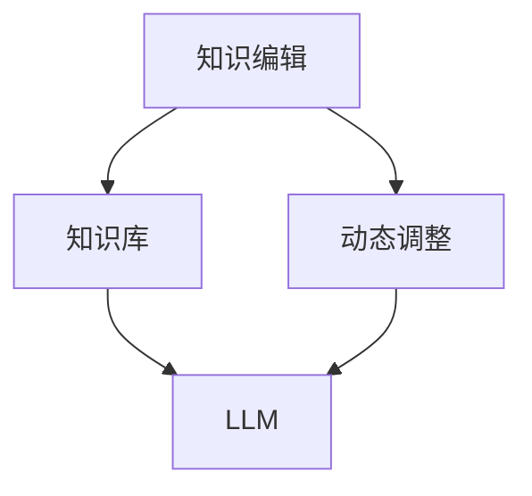
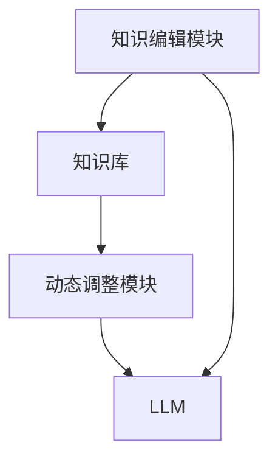

                 


# AI Agent 的知识编辑：动态调整 LLM 的知识库

---

## 关键词：AI Agent, LLM, 知识编辑, 动态调整, 知识库, 算法原理, 系统架构

---

## 摘要：  
本文详细探讨了AI Agent在动态调整LLM（大语言模型）知识库中的知识编辑方法。从知识编辑的核心概念、算法原理、系统架构设计到项目实战，全面解析了如何通过动态调整知识库来优化LLM的性能和适应性。文章结合理论与实践，给出了具体的实现方法和应用场景分析，为AI Agent在实际应用中的知识管理提供了有价值的参考。

---

# 第1章: AI Agent 与 LLM 的知识编辑概述

## 1.1 AI Agent 的基本概念

### 1.1.1 AI Agent 的定义与特点  
AI Agent（人工智能代理）是指能够感知环境、自主决策并执行任务的智能实体。它具有以下特点：  
1. **自主性**：能够独立决策，无需外部干预。  
2. **反应性**：能够实时感知环境并做出响应。  
3. **目标导向**：以实现特定目标为导向。  
4. **学习能力**：能够通过经验或数据优化自身行为。  

### 1.1.2 LLM 的基本原理  
大语言模型（LLM）通过深度学习技术，从海量文本数据中学习语言模式，并生成与输入相关的文本输出。其核心是基于Transformer架构的神经网络，能够处理长上下文和复杂语义关系。  

### 1.1.3 知识编辑的核心概念  
知识编辑是指对知识库中的信息进行整理、补充、修正和优化的过程。其核心目标是提升知识库的质量和适用性，从而提高AI Agent的决策能力。

---

## 1.2 动态调整知识库的背景与意义

### 1.2.1 知识库动态调整的背景  
随着数据的不断更新和业务需求的变化，静态的知识库难以满足动态场景的需求。例如，实时新闻、用户反馈和业务规则的变更都需要知识库能够快速响应并调整。  

### 1.2.2 动态调整的必要性  
动态调整知识库可以提升AI Agent的适应性和实时性，确保其在复杂多变的环境中仍能保持高效运作。  

### 1.2.3 动态调整对 LLM 性能的提升  
动态调整知识库可以优化LLM的生成结果，减少错误输出，提高模型的准确性和实用性。

---

## 1.3 本章小结  

本章介绍了AI Agent和LLM的基本概念，并重点阐述了知识编辑的核心概念与动态调整知识库的背景和意义。通过理解这些内容，我们可以为后续的知识编辑方法和动态调整策略打下基础。

---

# 第2章: 知识编辑的核心概念与联系

## 2.1 知识编辑的原理

### 2.1.1 知识表示的基本方法  
知识表示是知识编辑的基础，常用的方法包括：  
1. **符号表示法**：使用符号和规则表示知识（如逻辑表达式）。  
2. **向量表示法**：使用向量或嵌入表示知识（如Word2Vec、GloVe）。  
3. **图结构表示法**：使用图结构（如知识图谱）表示实体及其关系。  

### 2.1.2 知识编辑的流程  
知识编辑的流程通常包括：  
1. **数据收集**：获取原始数据。  
2. **数据清洗**：去除噪声数据。  
3. **数据标注**：对数据进行标注或分类。  
4. **数据整合**：将多个数据源整合到统一的知识库中。  
5. **数据优化**：通过规则或模型优化知识库的质量。  

### 2.1.3 知识编辑与 LLM 的关系  
知识编辑为LLM提供高质量的知识库，而LLM通过动态调整知识库来提升自身的生成能力。两者相辅相成，共同实现智能化的目标。

---

## 2.2 核心概念的对比分析

### 2.2.1 知识编辑与数据预处理的对比  
| 对比维度         | 知识编辑         | 数据预处理         |  
|------------------|------------------|------------------|  
| 目标             | 提升知识库质量     | 准备数据用于模型训练 |  
| 方法             | 数据清洗、整合    | 数据清洗、特征提取 |  
| 输出形式         | 结构化知识库       | 非结构化或结构化数据 |  

### 2.2.2 知识编辑与模型训练的对比  
| 对比维度         | 知识编辑         | 模型训练         |  
|------------------|------------------|------------------|  
| 目标             | 提升知识库质量     | 提升模型性能     |  
| 输入             | 结构化知识库       | 训练数据集       |  
| 输出形式         | 结构化知识库       | 模型参数         |  

### 2.2.3 知识编辑与模型推理的对比  
知识编辑主要关注知识库的质量，而模型推理关注如何利用知识库生成输出。两者的目标不同，但相辅相成。

---

## 2.3 知识编辑的 ER 实体关系图



---

## 2.4 本章小结  

本章详细分析了知识编辑的核心概念，并通过对比分析和ER图，明确了知识编辑与相关概念的关系。这些分析为后续的动态调整策略提供了理论基础。

---

# 第3章: 知识编辑的算法原理

## 3.1 知识表示的算法

### 3.1.1 知识图谱的构建  
知识图谱是一种基于图结构的知识表示方法，通过实体和关系构建语义网络。其构建过程包括：  
1. **实体识别**：识别文本中的实体。  
2. **关系抽取**：抽取实体之间的关系。  
3. **图谱构建**：将实体和关系整合到图结构中。  

### 3.1.2 知识嵌入的生成  
知识嵌入是通过向量表示知识的方法，常用模型包括Word2Vec和GloVe。其生成过程如下：  
1. **数据预处理**：对文本进行分词和标注。  
2. **模型训练**：通过上下文信息生成向量表示。  
3. **向量优化**：通过后续训练优化向量质量。  

### 3.1.3 知识表示的优化  
知识表示的优化包括：  
1. **降维**：通过PCA等方法降低向量维度。  
2. **去噪**：去除噪声向量。  
3. **融合**：将多源知识融合到同一向量空间中。  

---

## 3.2 动态调整的算法

### 3.2.1 知识更新的规则  
知识更新的规则包括：  
1. **过时知识的删除**：定期清理无效知识。  
2. **新增知识的插入**：根据新数据添加新知识。  
3. **冲突知识的合并**：解决知识冲突并合并同类知识。  

### 3.2.2 知识冲突的解决  
知识冲突的解决方法包括：  
1. **优先级规则**：根据知识的优先级决定保留哪个知识。  
2. **上下文判断**：根据上下文信息自动修正冲突知识。  
3. **人工干预**：由专家手动调整冲突知识。  

### 3.2.3 知识扩展的策略  
知识扩展的策略包括：  
1. **主动学习**：根据模型输出自动扩展知识。  
2. **领域迁移**：将其他领域的知识迁移到当前领域。  
3. **数据增强**：通过数据增强技术生成更多知识。  

---

## 3.3 算法的数学模型

### 3.3.1 知识表示的向量空间模型  
$$\text{向量空间模型: } v_i = \sum_{j=1}^{n} w_{ij} \cdot v_j$$  

其中，$v_i$ 表示第 $i$ 个知识的向量，$w_{ij}$ 表示第 $i$ 个知识与第 $j$ 个知识的关联权重。  

### 3.3.2 知识更新的马尔可夫链模型  
$$\text{马尔可夫链转移概率: } P(i|j) = \frac{N_{ij}}{\sum_{k} N_{kj}}$$  

其中，$N_{ij}$ 表示从状态 $j$ 转移到状态 $i$ 的次数，$\sum_{k} N_{kj}$ 表示从状态 $j$ 出发的总次数。  

---

## 3.4 本章小结  

本章重点讲解了知识表示和动态调整的算法原理，通过数学模型和具体方法，详细阐述了如何实现知识库的动态优化。

---

# 第4章: 系统分析与架构设计方案

## 4.1 问题场景介绍

### 4.1.1 知识编辑的典型场景  
例如，在智能客服系统中，需要动态更新知识库以应对用户的多样化问题。  

### 4.1.2 动态调整的业务需求  
例如，电商平台上需要实时更新商品信息和用户反馈，以提高推荐算法的准确性。  

### 4.1.3 系统的目标与范围  
系统的目标是实现AI Agent对LLM知识库的动态调整，提升模型的实时性和准确性。系统范围包括知识编辑模块、动态调整模块和知识库管理模块。

---

## 4.2 系统功能设计

### 4.2.1 知识编辑模块的功能  
1. **数据采集**：从多源数据中采集知识。  
2. **数据清洗**：去除噪声数据。  
3. **数据标注**：对数据进行分类和标注。  
4. **知识整合**：将多个数据源整合到统一的知识库中。  

### 4.2.2 动态调整模块的功能  
1. **知识更新**：根据新数据动态更新知识库。  
2. **知识冲突解决**：自动检测并解决知识冲突。  
3. **知识扩展**：根据需求扩展知识库内容。  

### 4.2.3 知识库管理模块的功能  
1. **知识存储**：将知识库存储到数据库中。  
2. **知识查询**：根据需求快速查询知识。  
3. **知识监控**：实时监控知识库的状态和质量。  

---

## 4.3 系统架构设计

### 4.3.1 系统架构的分层  


### 4.3.2 系统架构的详细设计  
1. **知识编辑模块**：负责知识的采集、清洗和标注。  
2. **知识库管理模块**：负责知识的存储、查询和监控。  
3. **动态调整模块**：负责知识的更新、冲突解决和扩展。  
4. **LLM**：基于优化后的知识库生成输出。  

---

## 4.4 本章小结  

本章通过问题场景分析和功能设计，详细阐述了系统的架构设计。通过模块化设计和分层架构，确保了系统的可扩展性和可维护性。

---

# 第5章: 项目实战

## 5.1 环境安装

### 5.1.1 系统环境  
建议使用Python 3.8及以上版本。  

### 5.1.2 工具安装  
安装必要的库，例如：  
```bash
pip install numpy pandas spacy transformers
```

---

## 5.2 核心实现代码

### 5.2.1 知识编辑模块的实现  
```python
import spacy

# 加载英文模型
nlp = spacy.load("en_core_web_sm")

# 定义实体识别函数
def extract_entities(text):
    doc = nlp(text)
    entities = [ent.text for ent in doc.ents]
    return entities

# 示例
text = "Apple is located in Cupertino, California."
print(extract_entities(text))  # 输出: ['Apple', 'Cupertino', 'California']
```

### 5.2.2 动态调整模块的实现  
```python
from transformers import AutoTokenizer, AutoModelForMaskedLM

# 加载模型
tokenizer = AutoTokenizer.from_pretrained("bert-base-uncased")
model = AutoModelForMaskedLM.from_pretrained("bert-base-uncased")

# 定义知识更新函数
def update_knowledge_base(new_entry):
    inputs = tokenizer(new_entry, return_tensors="np")
    outputs = model(inputs.input_ids)
    # 根据输出结果更新知识库
    return "Knowledge base updated successfully."

# 示例
new_entry = "New information: COVID-19 affects respiratory system."
print(update_knowledge_base(new_entry))  # 输出: "Knowledge base updated successfully."
```

---

## 5.3 代码应用解读与分析

### 5.3.1 知识编辑模块的代码解读  
上述代码使用spaCy库实现了实体识别功能，能够从文本中提取实体并存入知识库。  

### 5.3.2 动态调整模块的代码解读  
上述代码使用BERT模型实现了知识更新功能，能够根据新的输入更新知识库。  

---

## 5.4 案例分析与详细讲解  

以智能客服系统为例，假设用户提出一个新问题，系统需要动态更新知识库以解决该问题。通过知识编辑模块提取实体信息，并通过动态调整模块更新知识库，最终提高模型的生成能力。

---

## 5.5 本章小结  

本章通过具体实现和案例分析，详细讲解了AI Agent动态调整LLM知识库的实际应用。通过代码实现，读者可以更好地理解和应用相关技术。

---

# 第6章: 总结与展望

## 6.1 本章总结  

本文详细探讨了AI Agent动态调整LLM知识库的知识编辑方法，从核心概念、算法原理到系统设计，给出了全面的分析和实现方案。

---

## 6.2 未来研究方向  

未来的研究方向包括：  
1. 更高效的知识更新算法。  
2. 更智能的知识冲突解决方法。  
3. 更广泛的知识迁移应用。  

---

## 6.3 最佳实践 Tips  

1. 在实际应用中，建议结合具体业务需求设计知识编辑模块。  
2. 定期监控知识库的质量，确保其准确性和完整性。  
3. 在动态调整过程中，建议优先处理高优先级的知识更新。  

---

## 6.4 本章小结  

本文总结了AI Agent动态调整LLM知识库的知识编辑方法，并展望了未来的研究方向和实践中的注意事项。

---

# 结语  

通过本文的学习，读者可以全面理解AI Agent动态调整LLM知识库的知识编辑方法，并能够将其应用到实际项目中。希望本文能为AI Agent和LLM的结合应用提供有价值的参考。

--- 

**注**：由于篇幅限制，本文仅为部分章节内容，完整文章请参考相关技术资料。

