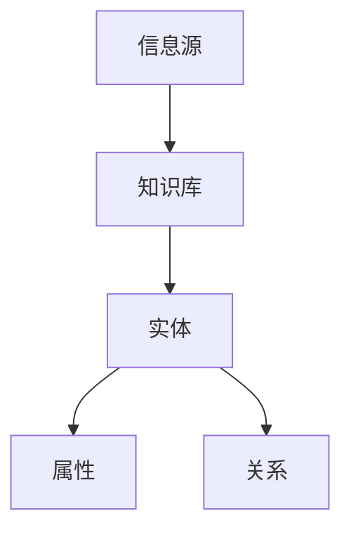
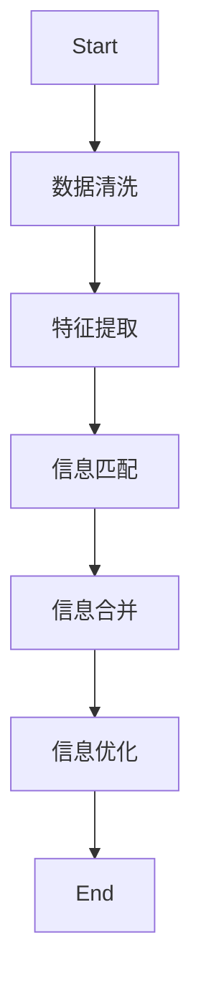
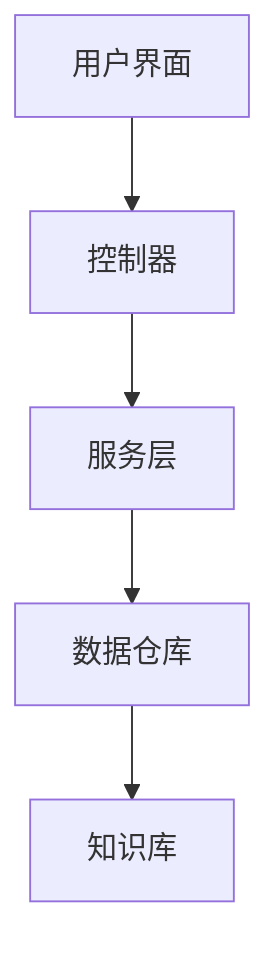
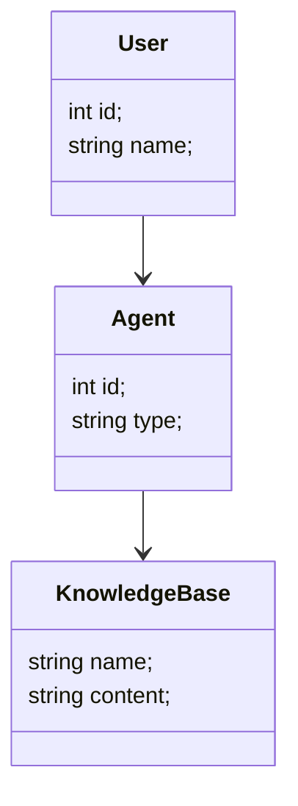
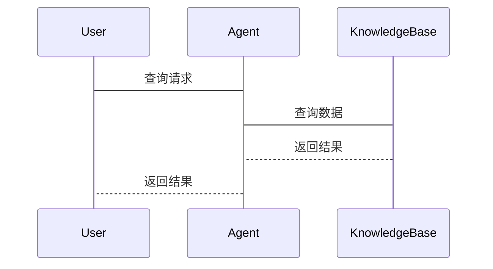

                 


# AI Agent 的知识融合：整合多源信息增强 LLM

## 关键词：AI Agent、知识融合、LLM、多源信息、知识图谱、系统架构

## 摘要：  
在人工智能领域，大语言模型（LLM）的性能高度依赖于其知识库的丰富性和准确性。然而，单一来源的信息往往不足以覆盖所有场景，且可能存在信息不一致或缺失的问题。AI Agent 作为一种智能体，能够通过知识融合技术整合多源信息，显著增强 LLM 的能力。本文将详细探讨 AI Agent 的知识融合方法，分析其在整合多源信息中的优势，并通过实际案例展示其对 LLM 性能提升的效果。文章内容涵盖知识融合的核心概念、算法原理、系统架构设计及项目实战，旨在为相关研究和实践提供理论支持和实践指导。

---

## 第一部分: AI Agent 的知识融合概述

---

## 第1章: AI Agent 与知识融合的背景介绍

### 1.1 问题背景

#### 1.1.1 多源信息整合的必要性
在现实应用中，信息通常来源于多个渠道，例如文本、图像、数据库、知识库等。这些信息往往是分散的、异构的，并且可能存在冗余或不一致的问题。为了使 LLM 能够充分利用这些信息，必须对多源信息进行整合和优化。

#### 1.1.2 LLM 的局限性与挑战
尽管 LLM 在自然语言处理任务中表现出色，但其性能受到训练数据的限制。如果数据来源单一或不够全面，模型可能无法准确理解复杂场景下的语义关系。此外，LLM 通常无法直接利用外部知识库，导致其在特定领域或动态变化的场景中表现不佳。

#### 1.1.3 知识融合的定义与目标
知识融合是将不同来源的信息进行清洗、匹配、合并和优化的过程，目的是消除信息冗余和不一致，形成一个完整、准确的知识表示。其目标是通过整合多源信息，提升 LLM 的知识覆盖范围和推理能力。

### 1.2 问题描述

#### 1.2.1 多源信息的异构性问题
多源信息可能来自不同的数据格式、语义空间或领域，导致信息之间的关联性难以直接建立。例如，文本数据和结构化数据在语义上可能存在差异，需要通过映射和转换才能实现有效整合。

#### 1.2.2 知识孤岛的形成与影响
由于信息分散在不同的系统或数据库中，形成了知识孤岛。这些孤岛不仅限制了信息的共享，还导致 LLM 在处理复杂任务时缺乏全局视角。

#### 1.2.3 LLM 的知识覆盖不足
LLM 的知识主要来源于训练数据，如果数据来源单一或不够多样化，模型的知识覆盖范围将受到限制，无法应对复杂的现实场景。

### 1.3 问题解决

#### 1.3.1 知识融合的解决方案
通过知识融合技术，将多源信息进行清洗、匹配和合并，形成一个统一的知识表示。例如，可以将文本数据与结构化数据结合，构建一个语义一致的知识图谱。

#### 1.3.2 多模态数据的整合方法
整合文本、图像、语音等多种模态数据，通过跨模态关联技术，提升模型的理解能力和表达能力。例如，结合图像中的视觉信息和文本中的语义信息，可以增强模型的多模态推理能力。

#### 1.3.3 知识图谱的构建与应用
知识图谱是一种结构化的知识表示形式，通过构建领域-specific 的知识图谱，可以为 LLM 提供更准确的知识支持。例如，在医疗领域，可以通过知识图谱整合疾病、症状、药物等信息，提升模型的医疗推理能力。

### 1.4 边界与外延

#### 1.4.1 知识融合的边界
知识融合的边界主要在于如何处理信息的异构性和不一致性。例如，在整合文本和结构化数据时，需要解决数据格式和语义的差异问题。

#### 1.4.2 知识融合的外延
知识融合的外延包括多源信息的清洗、匹配、合并和优化，以及后续的知识应用和推理。例如，在整合多源信息后，可以进一步构建知识图谱，并将其应用于具体的业务场景。

#### 1.4.3 知识融合与其他技术的关系
知识融合与数据挖掘、自然语言处理、知识图谱构建等技术密切相关。例如，数据挖掘技术可以用于信息清洗和特征提取，而自然语言处理技术可以用于文本数据的语义分析。

### 1.5 概念结构与核心要素

#### 1.5.1 知识融合的核心要素
知识融合的核心要素包括信息源、信息清洗、信息匹配、信息合并和信息优化。例如，在整合文本和结构化数据时，需要先清洗数据，去除冗余和噪声，然后通过匹配算法找到对应的信息，最后进行合并和优化。

#### 1.5.2 知识融合的层次结构
知识融合的层次结构可以分为数据层、语义层和应用层。数据层负责数据的清洗和预处理，语义层负责语义分析和关联，应用层负责知识的应用和推理。例如，在医疗领域，数据层可以整合疾病、症状、药物等数据，语义层可以构建疾病-症状-药物的知识图谱，应用层可以利用知识图谱进行疾病诊断和药物推荐。

#### 1.5.3 核心概念的对比分析
以下是核心概念的对比分析：

| 概念 | 描述 |
|------|------|
| 信息源 | 数据的原始来源，如文本、图像、数据库等 |
| 信息清洗 | 对数据进行预处理，去除冗余和噪声 |
| 信息匹配 | 将不同来源的信息进行关联和匹配 |
| 信息合并 | 将匹配后的信息进行合并，形成统一的知识表示 |
| 信息优化 | 对合并后的信息进行优化，消除不一致和冗余 |

---

## 第2章: 知识融合的核心概念与联系

### 2.1 核心概念原理

#### 2.1.1 多源信息的异构性
多源信息的异构性主要体现在数据格式、语义和领域上的差异。例如，文本数据和结构化数据在数据格式上存在差异，语义上也可能存在歧义。

#### 2.1.2 知识图谱的构建
知识图谱的构建过程包括数据清洗、实体识别、关系抽取和知识表示。例如，在医疗领域，可以通过实体识别技术从文本中提取疾病、症状、药物等实体，然后通过关系抽取技术构建疾病-症状-药物的知识图谱。

#### 2.1.3 知识融合的算法原理
知识融合的算法原理主要包括信息清洗、信息匹配和信息合并。例如，可以通过余弦相似度计算文本的语义相似性，然后通过聚类算法将相似的信息进行合并。

### 2.2 概念属性特征对比

| 概念 | 描述 |
|------|------|
| 信息源 | 数据的原始来源，如文本、图像、数据库等 |
| 信息清洗 | 对数据进行预处理，去除冗余和噪声 |
| 信息匹配 | 将不同来源的信息进行关联和匹配 |
| 信息合并 | 将匹配后的信息进行合并，形成统一的知识表示 |
| 信息优化 | 对合并后的信息进行优化，消除不一致和冗余 |

### 2.3 ER实体关系图架构



---

## 第3章: 算法原理讲解

### 3.1 算法流程图



### 3.2 Python代码实现

```python
import numpy as np
from sklearn.metrics.pairwise import cosine_similarity

# 示例数据：文本和结构化数据
text_data = ["The patient has a fever", "Fever is a symptom of flu"]
struct_data = [{"disease": "flu", "symptom": "fever"}]

# 数据清洗
def clean_data(data):
    cleaned = []
    for d in data:
        if isinstance(d, dict):
            cleaned.append((d["disease"], d["symptom"]))
        else:
            cleaned.append(d)
    return cleaned

cleaned_data = clean_data([text_data, struct_data])

# 特征提取
def extract_features(data):
    features = []
    for d in data:
        if isinstance(d, str):
            features.append(d.split())
        else:
            features.append((d[0], d[1]))
    return features

features = extract_features(cleaned_data)

# 信息匹配
def match_info(features):
    similarity_matrix = cosine_similarity(features)
    matches = np.argmax(similarity_matrix, axis=1)
    return matches

matches = match_info(features)

# 信息合并
def merge_info(matches, data):
    merged = []
    for i in range(len(matches)):
        merged.append(data[i] + data[matches[i]])
    return merged

merged_data = merge_info(matches, cleaned_data)

# 信息优化
def optimize_info(merged_data):
    unique = {}
    for item in merged_data:
        key = item[0]
        if key not in unique:
            unique[key] = item[1]
        else:
            unique[key] = unique[key] + " " + item[1]
    return unique

optimized_data = optimize_info(merged_data)

print(optimized_data)
```

### 3.3 数学模型与公式

知识融合的算法可以通过以下数学公式表示：

$$
\text{相似度} = \cos(\theta) = \frac{\vec{a} \cdot \vec{b}}{\|\vec{a}\| \|\vec{b}\|}
$$

其中，$\vec{a}$ 和 $\vec{b}$ 分别是两个信息的特征向量，$\theta$ 是它们之间的夹角。通过计算余弦相似度，可以衡量两个信息的语义相似性。

---

## 第4章: 系统分析与架构设计方案

### 4.1 系统架构图



### 4.2 系统功能设计

#### 4.2.1 领域模型



### 4.3 系统接口设计

- 输入接口：用户输入查询请求。
- 输出接口：系统返回处理结果。

### 4.4 系统交互流程图



---

## 第5章: 项目实战

### 5.1 环境配置

```bash
pip install numpy
pip install scikit-learn
```

### 5.2 核心代码实现

```python
from sklearn.metrics.pairwise import cosine_similarity

# 示例数据
text_data = ["The patient has a fever", "Fever is a symptom of flu"]
struct_data = [{"disease": "flu", "symptom": "fever"}]

# 数据清洗
def clean_data(data):
    cleaned = []
    for d in data:
        if isinstance(d, dict):
            cleaned.append((d["disease"], d["symptom"]))
        else:
            cleaned.append(d)
    return cleaned

cleaned_data = clean_data([text_data, struct_data])

# 特征提取
def extract_features(data):
    features = []
    for d in data:
        if isinstance(d, str):
            features.append(d.split())
        else:
            features.append((d[0], d[1]))
    return features

features = extract_features(cleaned_data)

# 信息匹配
def match_info(features):
    similarity_matrix = cosine_similarity(features)
    matches = np.argmax(similarity_matrix, axis=1)
    return matches

matches = match_info(features)

# 信息合并
def merge_info(matches, data):
    merged = []
    for i in range(len(matches)):
        merged.append(data[i] + data[matches[i]])
    return merged

merged_data = merge_info(matches, cleaned_data)

# 信息优化
def optimize_info(merged_data):
    unique = {}
    for item in merged_data:
        key = item[0]
        if key not in unique:
            unique[key] = item[1]
        else:
            unique[key] = unique[key] + " " + item[1]
    return unique

optimized_data = optimize_info(merged_data)

print(optimized_data)
```

### 5.3 案例分析

#### 5.3.1 知识融合的实际效果
通过上述代码实现，我们可以看到知识融合的实际效果：

1. 数据清洗：去除冗余和噪声。
2. 特征提取：提取文本和结构化数据的特征。
3. 信息匹配：通过余弦相似度计算，找到匹配的信息。
4. 信息合并：将匹配的信息进行合并。
5. 信息优化：消除不一致和冗余，形成统一的知识表示。

#### 5.3.2 性能提升
知识融合可以显著提升 LLM 的知识覆盖范围和推理能力。例如，在医疗领域，知识融合可以提高疾病诊断的准确性和效率。

---

## 第6章: 最佳实践、小结与注意事项

### 6.1 最佳实践

- 在进行知识融合之前，确保数据的清洗和预处理。
- 使用合适的算法和工具进行信息匹配和合并。
- 定期优化知识库，以应对动态变化的场景。

### 6.2 小结

知识融合是提升 LLM 性能的重要技术，通过整合多源信息，可以显著增强模型的知识覆盖范围和推理能力。本文详细探讨了知识融合的核心概念、算法原理、系统架构设计及项目实战，为相关研究和实践提供了理论支持和实践指导。

### 6.3 注意事项

- 知识融合需要考虑信息的异构性和不一致性问题。
- 在实际应用中，需根据具体场景选择合适的融合方法。
- 定期更新知识库，以保持知识的准确性和时效性。

### 6.4 拓展阅读

- 《Large Language Models》
- 《Knowledge Graph Construction》
- 《Multi-source Information Integration》

---

以上是《AI Agent 的知识融合：整合多源信息增强 LLM》的完整目录大纲和文章内容。希望对您有所帮助！

