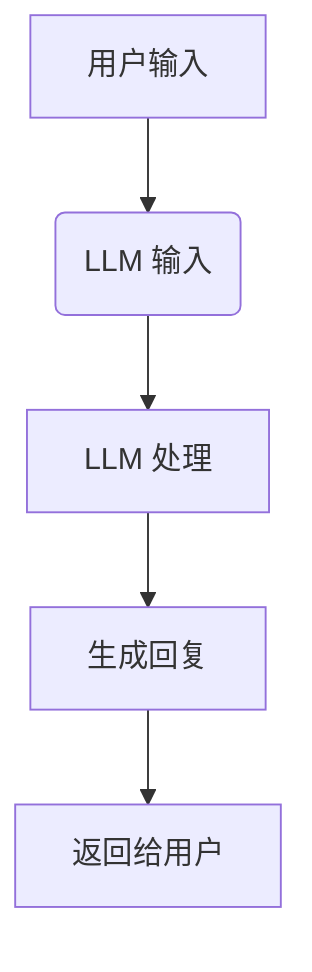
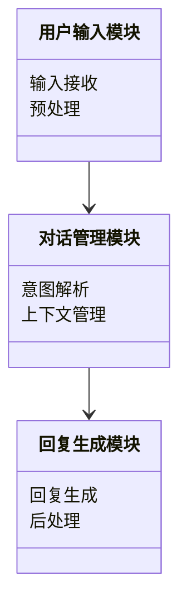
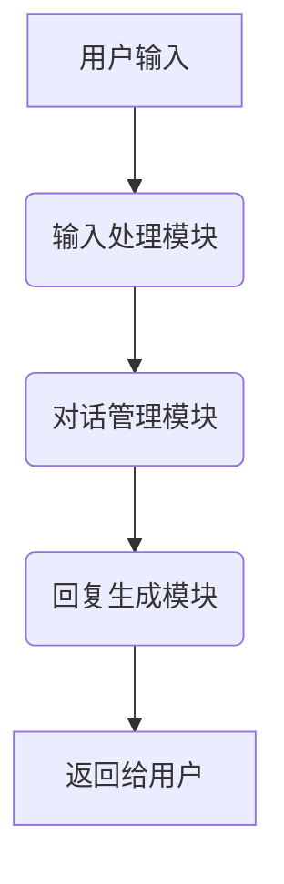

                 


# AI Agent 的自然语言交互：LLM 对话系统设计

## 关键词
AI Agent, 大语言模型, 自然语言交互, 对话系统设计, LLM, 人机交互, 人工智能

## 摘要
本文将深入探讨AI Agent在自然语言交互中的应用，特别是基于大语言模型（LLM）的对话系统设计。从基本概念到算法原理，再到系统架构和项目实战，我们将全面解析如何构建高效、智能的对话系统。通过丰富的技术细节和实际案例，本文旨在为读者提供一个清晰、全面的指南，帮助他们在AI Agent和自然语言处理领域取得更深的理解和应用。

---

# 第一部分: AI Agent 的自然语言交互概述

## 第1章: AI Agent 和 LLM 的基本概念

### 1.1 AI Agent 的定义与特点

#### 1.1.1 AI Agent 的定义
AI Agent（人工智能代理）是一种能够感知环境、自主决策并执行任务的智能实体。它可以是软件程序、机器人或其他智能系统，旨在通过与用户的交互或环境的互动来实现特定目标。

#### 1.1.2 AI Agent 的核心特点
- **自主性**：AI Agent能够在没有外部干预的情况下独立执行任务。
- **反应性**：能够实时感知环境并做出响应。
- **目标导向**：所有行为都以实现特定目标为导向。
- **学习能力**：能够通过数据和经验不断优化自身性能。

#### 1.1.3 AI Agent 的分类与应用场景
AI Agent可以分为**简单反射型代理**、**基于模型的反射型代理**、**目标驱动的代理**和**效用驱动的代理**。它们在智能客服、智能家居、自动驾驶等领域有广泛应用。

### 1.2 大语言模型（LLM）的定义与特点

#### 1.2.1 LLM 的定义
LLM（Large Language Model）是基于深度学习训练的大规模神经网络模型，能够理解和生成人类语言。它通过大量数据的训练，掌握了语言的语义、语法和上下文关系。

#### 1.2.2 LLM 的核心特点
- **大规模数据训练**：通常使用数百万甚至数十亿的文本数据进行训练。
- **多任务学习能力**：能够同时处理多种语言任务，如翻译、问答、文本生成等。
- **生成能力**：能够生成自然流畅的文本，接近人类语言表达。

#### 1.2.3 LLM 与传统 NLP 模型的区别
| 特性                | 传统 NLP 模型                     | LLM                        |
|---------------------|-----------------------------------|-----------------------------|
| 数据需求            | 数据量小，依赖特定标注数据         | 数据量大，依赖海量未标注数据 |
| 任务处理能力        | 专注于单一任务（如分类、实体识别）   | 能够处理多种任务（如生成、理解） |
| 模型复杂度          | 模型结构简单，训练时间短           | 模型结构复杂，训练时间长     |
| 创造性              | 生成能力有限，难以创造新内容       | 具备强大的生成能力，可创造新内容 |

### 1.3 AI Agent 与 LLM 的关系

#### 1.3.1 AI Agent 中的自然语言交互
AI Agent通过自然语言处理技术与用户进行交互，理解用户意图并生成合适的响应。

#### 1.3.2 LLM 在 AI Agent 中的角色
LLM作为AI Agent的核心模块，负责理解和生成自然语言文本，使AI Agent能够与用户进行流畅的对话。

#### 1.3.3 AI Agent 对话系统的应用前景
随着LLM技术的不断进步，AI Agent在智能客服、教育辅助、医疗咨询等领域的应用前景广阔。

---

## 第2章: 自然语言交互的背景与现状

### 2.1 自然语言处理的发展历程

#### 2.1.1 从规则驱动到数据驱动
早期的NLP主要基于规则，通过手动编写语法规则来实现简单的文本处理。随着机器学习的发展，数据驱动的NLP逐渐取代了规则驱动的方法。

#### 2.1.2 深度学习在 NLP 中的应用
深度学习的兴起使得NLP技术取得了质的飞跃，特别是Transformer架构的提出，推动了NLP技术的快速发展。

#### 2.1.3 当前 NLP 的技术瓶颈与未来方向
尽管NLP技术已经取得了显著进步，但在跨语言理解、实时推理和小样本学习等方面仍存在技术瓶颈。未来的研究方向将更加注重模型的可解释性和实用性。

### 2.2 LLM 在自然语言交互中的应用

#### 2.2.1 LLM 在对话系统中的优势
- **强大的生成能力**：能够生成自然流畅的对话内容。
- **多任务能力**：一个模型可以同时支持多种对话任务。
- **快速适应新领域**：通过微调或提示工程技术，可以快速适应新的对话场景。

#### 2.2.2 LLM 在自然语言生成中的应用
LLM在文本生成、机器翻译、摘要生成等领域表现出色，能够帮助AI Agent更自然地与用户交互。

#### 2.2.3 LLM 在问答系统中的应用
LLM能够通过理解上下文和问题意图，生成准确的问答结果，大大提升了问答系统的性能。

### 2.3 AI Agent 对话系统的背景与挑战

#### 2.3.1 对话系统的核心问题
- **理解用户意图**：准确理解用户的输入内容，提取关键信息。
- **生成合适回应**：根据上下文生成符合语境的回复。
- **处理复杂对话流**：应对多轮对话中的复杂关系和状态管理。

#### 2.3.2 AI Agent 对话系统的挑战
- **上下文理解**：在多轮对话中准确理解上下文关系。
- **个性化交互**：根据不同用户的习惯和偏好生成个性化的回复。
- **实时性与效率**：在实时交互中保持快速响应速度。

#### 2.3.3 当前研究与应用的现状
当前，基于LLM的对话系统在智能客服、虚拟助手等领域得到了广泛应用。然而，如何进一步提升对话系统的智能化和个性化仍然是研究的重点。

---

# 第二部分: AI Agent 对话系统的核心概念与联系

## 第3章: 对话系统的概念与架构

### 3.1 对话系统的概念模型

#### 3.1.1 对话系统的组成要素
- **输入处理模块**：接收用户的输入并进行预处理。
- **对话管理模块**：根据上下文和用户意图生成回复。
- **输出生成模块**：将回复生成自然语言文本。

#### 3.1.2 对话系统的交互流程
1. **输入接收**：用户输入文本或语音。
2. **意图理解**：解析用户的意图和需求。
3. **生成回复**：基于意图生成合适的回复内容。
4. **输出回复**：将回复返回给用户。

#### 3.1.3 对话系统的评价指标
| 指标               | 定义                                   | 重要性 |
|--------------------|--------------------------------------|--------|
| 对话准确率         | 回复内容与用户意图的匹配程度         | 高     |
| 响应时间           | 系统生成回复所需的时间               | 中     |
| 用户满意度         | 用户对系统回复的满意程度             | 高     |

### 3.2 AI Agent 对话系统的架构设计

#### 3.2.1 基于 LLM 的对话系统架构


#### 3.2.2 对话系统的模块划分


#### 3.2.3 对话系统与外部知识库的结合
通过与外部知识库的结合，对话系统可以更好地理解上下文并生成准确的回复。

---

## 第4章: LLM 在对话系统中的角色

### 4.1 LLM 的训练与推理过程

#### 4.1.1 LLM 的训练流程
1. **数据准备**：收集和整理训练数据。
2. **模型初始化**：定义模型架构并初始化参数。
3. **前向传播**：输入数据，计算模型输出。
4. **损失计算**：计算预测值与真实值之间的差异。
5. **反向传播**：调整模型参数以最小化损失。

#### 4.1.2 LLM 的推理机制
- **前向传播**：将输入文本输入模型，生成概率分布。
- **采样生成**：根据概率分布生成最终的回复文本。

#### 4.1.3 LLM 的输出生成策略
| 策略             | 描述                                   | 优缺点         |
|------------------|--------------------------------------|---------------|
| 随机采样         | 根据概率分布随机选择生成文本           | 显多样性       |
| 最大概率采样     | 选择概率最高的生成文本                 | 确保回复质量   |
| 钟型采样         | 综合考虑概率和多样性，生成更合理的文本   | 平衡多样性和质量 |

### 4.2 LLM 的数学模型和公式

#### 4.2.1 Transformer 模型的数学公式
```latex
$$
\text{Attention}(Q, K, V) = \text{softmax}\left(\frac{QK^T}{\sqrt{d_k}}\right)V
$$
其中，$Q$ 是查询向量，$K$ 是键向量，$V$ 是值向量，$d_k$ 是向量的维度。

#### 4.2.2 LLM 的损失函数
$$
\text{损失函数} = -\sum_{i=1}^{n} \log P(x_i | x_{<i})
$$
其中，$x_i$ 表示生成的第 $i$ 个词，$x_{<i}$ 表示前 $i-1$ 个词。

### 4.3 LLM 的输出生成策略

#### 4.3.1 随机采样
通过随机采样生成多组候选文本，选择最符合上下文的回复。

#### 4.3.2 最大概率采样
根据概率分布，选择概率最高的词生成回复。

#### 4.3.3 钟型采样
结合概率分布和多样性，生成更合理的回复。

---

## 第5章: 系统分析与架构设计方案

### 5.1 系统功能设计

#### 5.1.1 功能模块划分
- **输入处理模块**：接收用户输入并进行预处理。
- **对话管理模块**：解析用户意图并生成回复内容。
- **回复生成模块**：根据意图生成自然语言文本。

#### 5.1.2 功能流程
1. 用户输入文本或语音。
2. 输入处理模块接收并预处理输入。
3. 对话管理模块解析用户意图。
4. 回复生成模块根据意图生成回复内容。
5. 系统输出回复内容。

### 5.2 系统架构设计

#### 5.2.1 系统架构图


#### 5.2.2 模块交互流程
1. 用户输入文本或语音。
2. 输入处理模块接收并预处理输入。
3. 对话管理模块解析用户意图。
4. 回复生成模块根据意图生成回复内容。
5. 系统输出回复内容。

### 5.3 系统接口设计

#### 5.3.1 接口定义
- **输入接口**：接收用户的输入文本或语音。
- **输出接口**：返回生成的回复内容。

#### 5.3.2 接口实现
- **输入接口实现**：通过API接收用户输入。
- **输出接口实现**：通过API返回生成的回复内容。

### 5.4 系统交互流程

#### 5.4.1 交互流程图
```mermaid
sequenceDiagram
用户 -->+> 输入处理模块: 发送输入
输入处理模块 -->+> 对话管理模块: 请求解析
对话管理模块 -->+> 回复生成模块: 请求生成回复
回复生成模块 -->+> 用户: 返回回复
```

---

## 第6章: 项目实战

### 6.1 环境安装

#### 6.1.1 安装 Python 和必要的库
```bash
pip install python
pip install transformers
pip install torch
```

#### 6.1.2 安装 LLM 模型
```bash
pip install llama
pip install huggingface
```

### 6.2 系统核心实现源代码

#### 6.2.1 输入处理模块
```python
def preprocess_input(text):
    return text.lower().strip()
```

#### 6.2.2 对话管理模块
```python
class DialogManager:
    def __init__(self):
        self.context = []
    
    def process_input(self, input_text):
        self.context.append(input_text)
        # 解析意图
        intent = self.get_intent(input_text)
        return intent
    
    def get_intent(self, text):
        # 简单的意图解析方法
        if "天气" in text:
            return "weather"
        elif "时间" in text:
            return "time"
        else:
            return "unknown"
```

#### 6.2.3 回复生成模块
```python
class ResponseGenerator:
    def __init__(self, model):
        self.model = model
    
    def generate_response(self, intent):
        # 根据意图生成回复
        if intent == "weather":
            return "今天天气不错，您想了解哪个城市的天气？"
        elif intent == "time":
            return "现在的时间是几点？"
        else:
            return "抱歉，我还没有学会回答这个问题。"
```

### 6.3 代码应用解读与分析

#### 6.3.1 输入处理模块
输入处理模块负责接收用户的输入并进行预处理，确保输入格式统一。

#### 6.3.2 对话管理模块
对话管理模块负责解析用户的意图，并维护对话的上下文，确保对话的连贯性。

#### 6.3.3 回复生成模块
回复生成模块根据用户的意图生成相应的回复内容，使对话能够顺利进行。

### 6.4 实际案例分析

#### 6.4.1 案例1: 天气查询
用户输入：“今天天气怎么样？”
系统处理：
1. 输入处理模块接收输入并预处理。
2. 对话管理模块解析意图为“weather”。
3. 回复生成模块生成回复：“今天天气不错，您想了解哪个城市的天气？”

#### 6.4.2 案例2: 时间查询
用户输入：“现在几点了？”
系统处理：
1. 输入处理模块接收输入并预处理。
2. 对话管理模块解析意图为“time”。
3. 回复生成模块生成回复：“现在的时间是几点？”

### 6.5 项目小结

#### 6.5.1 项目总结
通过本项目，我们实现了基于LLM的对话系统，能够准确理解用户的意图并生成合适的回复。

#### 6.5.2 项目优化建议
- **优化意图解析**：引入更先进的意图解析方法。
- **提升生成质量**：优化回复生成策略，提高回复的准确性和流畅性。

---

## 第7章: 总结与展望

### 7.1 全文总结

#### 7.1.1 核心内容回顾
本文详细介绍了AI Agent和LLM的基本概念，分析了对话系统的架构设计，并通过实际案例展示了如何构建基于LLM的对话系统。

#### 7.1.2 本文的核心观点
- LLM在对话系统中的应用前景广阔。
- 对话系统的智能化和个性化是未来研究的重点。

### 7.2 未来展望

#### 7.2.1 技术发展
随着AI技术的不断进步，对话系统的智能化和个性化将得到进一步提升。

#### 7.2.2 应用场景
AI Agent将在更多领域得到广泛应用，如教育、医疗、金融等。

### 7.3 最佳实践 tips

#### 7.3.1 实际应用中的注意事项
- **数据隐私**：确保用户数据的安全性和隐私性。
- **模型优化**：不断优化模型性能，提升对话质量。
- **用户体验**：注重用户体验设计，提供更便捷的交互方式。

#### 7.3.2 未来研究方向
- **多模态对话**：结合视觉、听觉等多模态信息，提升对话系统的智能化。
- **实时推理**：优化模型推理速度，提升对话系统的实时性。
- **个性化交互**：根据用户偏好和习惯，提供个性化的对话体验。

---

# 结语

通过本文的详细介绍，读者可以全面了解AI Agent和LLM对话系统的设计与实现。希望本文能够为读者在AI Agent和自然语言处理领域的研究和应用提供有价值的参考和指导。未来，随着技术的不断进步，AI Agent和LLM对话系统将在更多领域发挥重要作用，为人类带来更智能、更便捷的交互体验。

