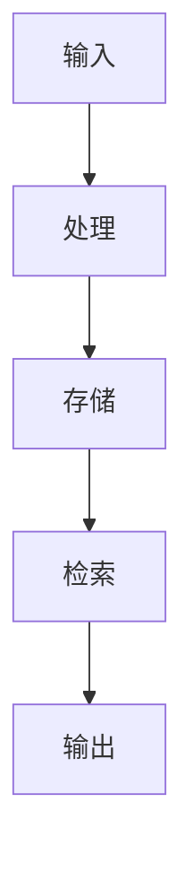

                 


# AI Agent 的记忆机制：让 LLM 具备长期记忆能力

> 关键词：AI Agent、LLM、长期记忆、记忆机制、知识表示、知识图谱、神经网络

> 摘要：本文深入探讨了AI Agent的记忆机制，重点分析了如何让大语言模型（LLM）具备长期记忆能力。通过背景介绍、核心概念、算法原理、数学模型、系统架构设计、项目实战以及最佳实践等多维度的详细讲解，全面剖析了记忆机制的设计与实现，为读者提供了从理论到实践的完整指南。

---

## 第一章：背景介绍

### 1.1 问题背景

#### 1.1.1 当前AI大模型的局限性
目前，大语言模型（LLM）在自然语言处理任务中表现出色，但它们存在显著的局限性，尤其是**短期记忆**的问题。模型无法有效保留上下文信息，导致在多轮对话或需要长期记忆的任务中表现不佳。

#### 1.1.2 长期记忆能力的重要性
AI Agent需要具备长期记忆能力，以便在复杂的任务中保持上下文一致性、理解和推理能力。例如，在智能客服、医疗诊断和自动驾驶等领域，长期记忆能力是实现高效交互和决策的关键。

#### 1.1.3 AI Agent 的概念与目标
AI Agent是一种能够感知环境、执行任务并适应动态变化的智能体。其目标是通过与环境的交互，实现自主决策和高效问题解决。为了实现这一点，AI Agent需要具备强大的记忆能力。

---

### 1.2 问题描述

#### 1.2.1 LLM 的短期记忆问题
LLM依赖于输入的上下文窗口，无法自然地维护长期记忆。模型在处理长序列数据时，信息会逐渐衰减，导致记忆丢失。

#### 1.2.2 AI Agent 的记忆需求
AI Agent需要在任务执行过程中维护动态更新的记忆，以便在复杂场景中快速检索相关信息，提升决策效率。

#### 1.2.3 记忆机制的核心问题
记忆机制需要解决信息存储、检索和更新的核心问题。如何高效存储、检索和管理记忆是实现长期记忆能力的关键。

---

### 1.3 问题解决

#### 1.3.1 记忆机制的设计目标
设计目标包括：高效存储、快速检索、动态更新、信息关联和隐私保护。

#### 1.3.2 解决方案的多样性
目前，解决方案包括基于知识图谱的显式记忆、基于神经网络的隐式记忆，以及混合型记忆机制。

#### 1.3.3 当前技术的挑战与突破
当前技术的挑战包括信息过载、数据稀疏性和计算效率。突破点在于结合符号推理和神经网络，实现高效的混合型记忆机制。

---

### 1.4 边界与外延

#### 1.4.1 记忆机制的适用范围
记忆机制适用于需要长期记忆的场景，如对话系统、智能助手和自动驾驶。

#### 1.4.2 相关概念的区分
区分记忆机制与其他技术，如知识图谱和数据库的区别。

#### 1.4.3 技术边界与未来发展
技术边界包括存储容量和计算效率。未来发展方向是结合强化学习和分布式存储，提升记忆效率。

---

## 第二章：核心概念与联系

### 2.1 记忆机制的原理

#### 2.1.1 内存模型的基本原理
内存模型通过存储、检索和更新操作，实现信息的长期保留和动态管理。

#### 2.1.2 知识表示的核心方法
知识表示方法包括符号表示、向量表示和图结构表示。

#### 2.1.3 记忆检索的机制分析
检索机制包括基于关键词的检索、基于相似度的检索和基于规则的检索。

---

### 2.2 核心概念对比

#### 2.2.1 不同记忆机制的对比表格
| 记忆机制 | 基于知识图谱 | 基于神经网络 | 混合型 |
|----------|--------------|--------------|--------|
| 优点     | 高效检索     | 灵活性强     | 综合性 |
| 缺点     | 更新复杂     | 计算开销大   | 复杂性 |

#### 2.2.2 基于知识图谱的记忆模型
知识图谱通过实体和关系表示知识，支持高效的语义检索。

#### 2.2.3 基于神经网络的记忆模型
神经网络通过向量表示和注意力机制，实现动态记忆。

---

### 2.3 系统架构图

#### 2.3.1 ER实体关系图


---

## 第三章：算法原理讲解

### 3.1 记忆机制的算法流程

#### 3.1.1 内存模型的输入输出流程
1. 输入：用户查询或任务请求。
2. 处理：LLM生成响应并更新记忆。
3. 输出：最终结果。

#### 3.1.2 知识存储的更新规则
1. 新信息的存储。
2. 旧信息的自动删除。

#### 3.1.3 记忆检索的触发条件
1. 关键词匹配。
2. 时间范围限制。

---

### 3.2 算法实现

#### 3.2.1 内存模型的实现代码
```python
class MemoryModel:
    def __init__(self):
        self.memory = {}
    
    def store(self, key, value):
        self.memory[key] = value
    
    def retrieve(self, key):
        return self.memory.get(key, None)
```

---

### 3.3 算法流程图



---

## 第四章：数学模型与公式

### 4.1 内存模型的数学表示

#### 4.1.1 知识存储的向量表示
$$\mathbf{v} = [v_1, v_2, ..., v_n]^T$$

#### 4.1.2 知识检索的相似度计算
$$\text{similarity}(\mathbf{v}_i, \mathbf{v}_j) = \frac{\mathbf{v}_i \cdot \mathbf{v}_j}{\|\mathbf{v}_i\| \|\mathbf{v}_j\|}$$

---

## 第五章：系统分析与架构设计

### 5.1 问题场景介绍

#### 5.1.1 系统功能设计
1. 用户输入处理。
2. 知识存储与检索。

#### 5.1.2 系统架构设计
1. 用户界面。
2. 业务逻辑层。
3. 数据存储层。

---

## 第六章：项目实战

### 6.1 环境安装

#### 6.1.1 安装依赖
```bash
pip install numpy
pip install pymermaid
```

### 6.2 核心实现

#### 6.2.1 代码实现
```python
class MemoryAgent:
    def __init__(self):
        self.memory = {}
    
    def process_query(self, query):
        # 处理查询
        pass
```

---

## 第七章：最佳实践与小结

### 7.1 最佳实践

#### 7.1.1 技术选型建议
1. 选择适合的存储方式。
2. 结合符号推理和神经网络。

### 7.1.2 注意事项
1. 确保数据安全。
2. 定期优化模型。

### 7.1.3 拓展阅读
推荐阅读相关领域的论文和书籍。

---

通过以上内容，我们全面介绍了AI Agent的记忆机制，从理论到实践，帮助读者理解如何让LLM具备长期记忆能力。希望本文能为相关领域的研究和实践提供有价值的参考。

