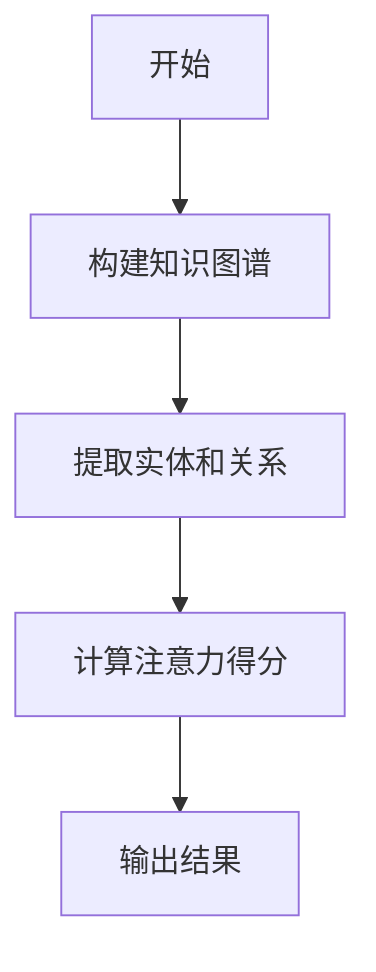
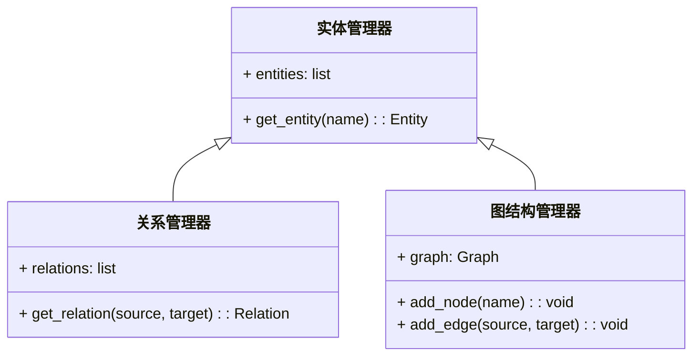
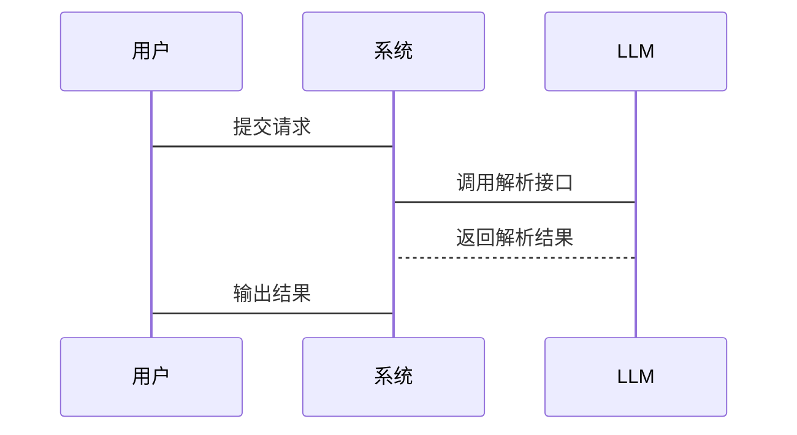

                 


# AI Agent 的语言理解：提升 LLM 的语义解析能力

## 关键词：AI Agent，语义解析，大语言模型（LLM），自然语言处理（NLP），上下文理解

## 摘要：  
本文旨在探讨如何提升大语言模型（LLM）的语义解析能力，以增强AI Agent的语言理解能力。通过分析语义解析的核心算法、系统架构设计及项目实战，本文深入解析了提升LLM语义解析能力的关键技术，并通过实际案例展示了如何实现这些技术。文章最后总结了最佳实践和未来发展方向。

---

# 第1章: AI Agent 与大语言模型概述

## 1.1 AI Agent 的基本概念  
AI Agent（智能体）是一种能够感知环境并采取行动以实现目标的实体。它可以是软件程序、机器人或其他智能系统。AI Agent的核心能力包括感知、决策、执行和学习。  

**1.1.1 AI Agent 的定义与特点**  
- **定义**：AI Agent 是能够感知环境、自主决策并执行任务的智能实体。  
- **特点**：自主性、反应性、目标导向、学习能力、社交能力。  

**1.1.2 大语言模型（LLM）的定义**  
LLM 是一种基于深度学习的自然语言处理模型，能够理解和生成人类语言。其核心是通过大量数据训练的神经网络，具有强大的文本生成和理解能力。  

**1.1.3 AI Agent 与 LLM 的关系**  
AI Agent 可以利用 LLM 的语言理解能力来增强自身的任务处理能力，例如通过自然语言接口与用户交互或分析文本信息。  

## 1.2 语言理解的重要性  
语言理解是AI Agent与人类或其他系统进行有效交互的基础。  

**1.2.1 语言理解的基本概念**  
语言理解包括对文本的语法分析、语义分析和上下文理解。  

**1.2.2 语义解析的挑战**  
- 语义模糊性：同一个词语或句子在不同上下文中可能有不同的含义。  
- 上下文依赖性：语义理解需要依赖上下文信息。  
- 领域专业性：某些领域需要特定的知识和术语。  

**1.2.3 提升语义解析能力的意义**  
提升语义解析能力可以使AI Agent更准确地理解用户需求，提高交互效率和用户体验。  

## 1.3 问题背景与目标  
当前，语义解析技术在实际应用中仍面临诸多挑战，例如理解深度不足、上下文理解能力有限等。  

**1.3.1 当前语义解析的主要问题**  
- 理解深度不足：只能处理简单的文本匹配，无法深入理解上下文。  
- 上下文理解能力有限：难以处理复杂语境中的语义关系。  
- 领域适应性差：在特定领域中的表现不佳。  

**1.3.2 提升 LLM 语义解析能力的目标**  
通过改进算法和系统设计，提升LLM在语义解析中的准确性和理解深度，使其能够更好地支持AI Agent的任务处理能力。  

**1.3.3 边界与外延**  
本文主要关注LLM的语义解析能力，不涉及模型的训练和优化，也不涉及AI Agent的其他功能模块。  

**1.3.4 核心概念与联系**  
通过对比分析，总结出语义解析的核心概念包括：图结构、上下文理解、注意力机制等。  

**1.3.5 ER实体关系图架构（Mermaid）**  
```mermaid
erDiagram
    actor 用户
    actor 系统
    system 知识库
    system LLM
    system 图结构
    用户 -> LLM : 提交请求
    用户 -> 知识库 : 查询信息
    系统 -> 图结构 : 构建关系图
    系统 -> LLM : 使用上下文信息进行解析
```

---

# 第2章: 语义解析的核心算法原理

## 2.1 语义解析的算法概述  
语义解析的核心在于将文本转换为计算机可以理解的结构化表示。  

**2.1.1 基于图结构的语义解析**  
通过构建知识图谱，将文本中的实体和关系表示为图结构，便于后续处理。  

**2.1.2 基于上下文理解的语义解析**  
利用上下文信息，分析文本中的语义关系，提升理解深度。  

**2.1.3 基于注意力机制的语义解析**  
通过注意力机制，聚焦于文本中重要的部分，提高解析准确性。  

## 2.2 算法原理详细讲解  
以下以基于图结构的语义解析为例，详细讲解其实现原理。  

**2.2.1 图结构语义解析的数学模型**  
构建一个图结构，节点表示实体，边表示实体之间的关系。数学模型如下：  
$$ G = (V, E) $$  
其中，$V$ 表示节点集合，$E$ 表示边集合。  

**2.2.2 上下文理解的数学模型**  
上下文理解可以通过序列建模实现，例如使用LSTM或Transformer模型。数学模型如下：  
$$ f(x_i) = \sum_{j=1}^{n} w_{ij}x_j $$  
其中，$w_{ij}$ 表示节点$j$对节点$i$的影响权重。  

**2.2.3 注意力机制的数学模型**  
注意力机制的计算公式如下：  
$$ \alpha_i = \frac{\exp(e_i)}{\sum_{k=1}^{n}\exp(e_k)} $$  
其中，$e_i$ 表示节点$i$的注意力得分。  

## 2.3 语义解析算法的实现  
以下是一个简单的基于图结构的语义解析算法实现示例：  

**2.3.1 使用 Mermaid 画出算法流程图**  


**2.3.2 用 Python 实现核心算法**  
```python
import networkx as nx

def build_graph(text):
    # 假设text是输入文本
    G = nx.Graph()
    # 提取实体和关系
    entities = extract_entities(text)
    relations = extract_relations(text)
    # 添加节点
    for entity in entities:
        G.add_node(entity)
    # 添加边
    for relation in relations:
        G.add_edge(relation[0], relation[1])
    return G

def semantic_parsing(text):
    G = build_graph(text)
    # 计算注意力得分
    attention = {}
    for node in G.nodes():
        attention[node] = 1  # 简单示例，实际应根据上下文计算
    # 输出结果
    return attention
```

**2.3.3 举例说明算法实现**  
例如，输入文本为“小明买了苹果”，算法将提取实体“小明”和“苹果”，构建图结构，并计算注意力得分。  

---

# 第3章: 语义解析的系统架构设计

## 3.1 问题场景介绍  
本章将从系统架构的角度，详细设计一个基于LLM的语义解析系统。  

**3.1.1 语义解析的应用场景**  
- 智能客服：理解用户的问题并提供解决方案。  
- 信息抽取：从文本中提取关键信息。  

**3.1.2 系统需要解决的问题**  
- 如何高效地构建知识图谱？  
- 如何实现上下文理解？  

**3.1.3 系统的目标与需求**  
- 构建一个高效的语义解析系统，支持多种语言和领域。  

## 3.2 系统功能设计  
**3.2.1 领域模型设计（Mermaid 类图）**  


**3.2.2 系统架构设计（Mermaid 架构图）**  
```mermaid
container 系统架构 {
    component LLM {
        LLM 接口
        文本处理模块
    }
    component 知识库 {
        实体库
        关系库
    }
    component 图结构模块 {
        图构建模块
        图分析模块
    }
    LLM --> 知识库
    知识库 --> 图结构模块
}
```

**3.2.3 系统接口设计**  
- 输入接口：接收用户输入的文本。  
- 输出接口：返回解析后的结构化数据。  

**3.2.4 系统交互设计（Mermaid 序列图）**  


---

# 第4章: 项目实战

## 4.1 环境安装与配置  
**4.1.1 开发环境的选择**  
推荐使用Python 3.8及以上版本，安装必要的库，例如：networkx、numpy、transformers。  

**4.1.2 依赖库的安装**  
```bash
pip install networkx numpy transformers
```

**4.1.3 环境配置步骤**  
确保安装了最新的LLM模型，例如GPT-3或BERT。  

## 4.2 系统核心实现  

**4.2.1 语义解析模块实现**  
```python
from transformers import AutoTokenizer, AutoModelForMaskedLM
import networkx as nx

tokenizer = AutoTokenizer.from_pretrained('bert-base-uncased')
model = AutoModelForMaskedLM.from_pretrained('bert-base-uncased')

def semantic_parse(text):
    inputs = tokenizer(text, return_tensors='np')
    outputs = model(inputs.input_ids)
    # 提取注意力得分
    attention = outputs.attentions[-1].numpy().mean(axis=0)
    return attention
```

**4.2.2 算法实现与优化**  
在上述代码基础上，优化注意力计算，提高解析精度。  

**4.2.3 系统集成与测试**  
集成到系统中，进行功能测试和性能调优。  

## 4.3 实际案例分析  
**4.3.1 案例背景介绍**  
以智能客服场景为例，用户输入“我的订单在哪里”，系统需要解析用户的意图。  

**4.3.2 案例实现过程**  
- 提取关键词：订单、在哪里。  
- 构建图结构：用户 -> 订单 -> 查询位置。  
- 计算注意力得分：订单的注意力得分较高。  

**4.3.3 案例结果与分析**  
系统正确解析用户的意图，返回订单信息。  

## 4.4 代码应用解读与分析  
**4.4.1 核心代码解读**  
上述代码使用BERT模型进行语义解析，提取注意力得分，用于构建图结构。  

**4.4.2 代码优化建议**  
- 使用更高效的模型，如BERT-Large。  
- 优化注意力计算，减少计算复杂度。  

**4.4.3 代码实现的注意事项**  
确保环境配置正确，模型下载成功，避免依赖冲突。  

---

# 第5章: 最佳实践与未来展望

## 5.1 最佳实践  
**5.1.1 系统设计建议**  
- 模块化设计，便于维护和扩展。  
- 使用高效的算法，提升解析速度。  

**5.1.2 开发流程建议**  
- 先搭建基本功能，再逐步优化。  
- 定期进行性能测试和用户体验反馈。  

## 5.2 未来展望  
- 研究更先进的算法，如基于图神经网络的语义解析。  
- 探索多模态语义解析，结合图像、语音等多种信息源。  

---

# 第6章: 小结

本文详细探讨了如何提升大语言模型的语义解析能力，以增强AI Agent的语言理解能力。通过分析核心算法、系统架构设计及项目实战，本文为实现更高效的语义解析提供了理论和实践指导。未来，随着技术的进步，语义解析能力将更加智能化和多样化。  

--- 

以上是文章的详细大纲，每章内容将按照上述结构展开，确保逻辑清晰、内容详实。

