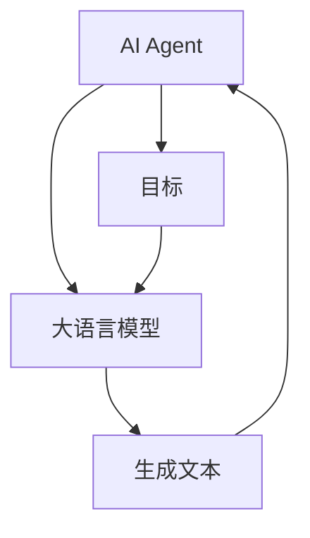
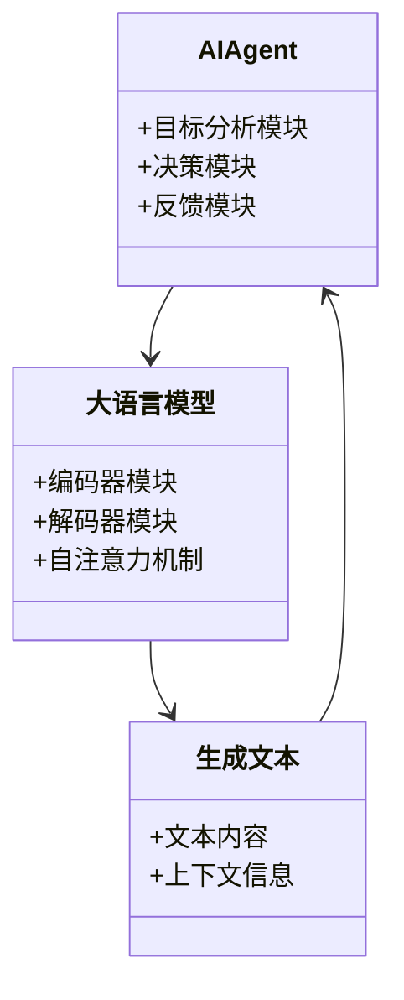
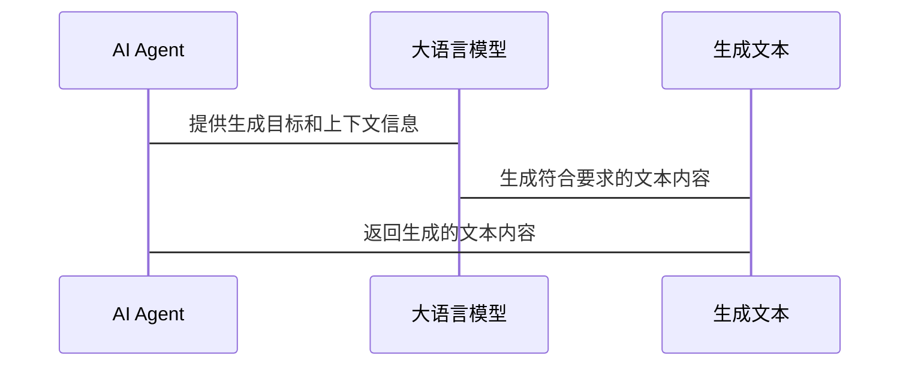

                 


# AI Agent 的语言生成：提升 LLM 的文本创作能力

**关键词**：AI Agent, 大语言模型, 文本生成, 语言模型优化, 自然语言处理, 生成式AI

**摘要**：本文探讨了AI Agent在提升大语言模型（LLM）文本生成能力中的关键作用。通过分析AI Agent与大语言模型的协同工作原理，详细讲解了大语言模型的训练方法、生成算法以及数学模型。文章进一步通过系统架构设计和项目实战，展示了如何构建一个高效的AI Agent驱动的文本生成系统，并提供了实际案例和最佳实践技巧。

---

## 第一部分: AI Agent 的语言生成基础

### 第1章: AI Agent与大语言模型概述

#### 1.1 AI Agent的基本概念

##### 1.1.1 AI Agent的定义与特点
AI Agent（人工智能代理）是指能够感知环境并采取行动以实现目标的智能实体。其特点包括自主性、反应性、目标导向性和社会能力。AI Agent通过感知环境、分析信息并做出决策，能够与人类或其他系统进行交互。

##### 1.1.2 AI Agent在语言生成中的作用
AI Agent在语言生成中充当决策者和协调者。它利用大语言模型的生成能力，结合上下文和目标，优化生成的文本内容，使其更符合特定场景的需求。

##### 1.1.3 大语言模型的基本原理
大语言模型（Large Language Model, LLM）是基于深度学习的自然语言处理模型，通常采用Transformer架构。其基本原理包括编码器和解码器，通过自注意力机制捕捉文本中的长距离依赖关系，从而生成连贯且有意义的文本。

#### 1.2 大语言模型与文本生成

##### 1.2.1 大语言模型的定义与特点
大语言模型是指在大规模数据上训练的深度学习模型，具有参数量大、训练时间长、生成能力强等特点。它能够处理复杂的语言任务，如文本生成、翻译、问答等。

##### 1.2.2 AI Agent与大语言模型的结合
AI Agent与大语言模型的结合使得生成的文本不仅具有语言能力，还具备智能决策能力。AI Agent通过分析上下文和目标，指导大语言模型生成更符合需求的文本内容。

##### 1.2.3 AI Agent与大语言模型的协同优化
协同优化是指AI Agent与大语言模型共同工作，通过不断迭代和调整生成策略，提升生成文本的质量和相关性。这种协同优化能够有效解决生成文本中可能存在的不准确或不符合场景的问题。

---

### 第2章: AI Agent与大语言模型的协同工作

#### 2.1 AI Agent的决策机制

##### 2.1.1 AI Agent的决策模型
AI Agent的决策模型通常包括感知模块、推理模块和行动模块。感知模块负责获取环境信息，推理模块基于信息进行分析和决策，行动模块执行具体的生成任务。

##### 2.1.2 决策机制与语言生成的关系
决策机制直接影响生成文本的内容和质量。AI Agent通过分析上下文和目标，选择最合适的生成策略，确保生成的文本既准确又符合场景需求。

##### 2.1.3 AI Agent的多目标优化
在语言生成中，AI Agent需要在多个目标之间进行平衡，例如生成文本的准确性和流畅性。通过多目标优化，AI Agent能够在满足不同目标的前提下，生成高质量的文本内容。

#### 2.2 大语言模型的生成机制

##### 2.2.1 基于Transformer的生成模型
基于Transformer的生成模型通过自注意力机制捕捉文本中的长距离依赖关系，生成连贯且有意义的文本内容。这种机制使得生成的文本能够更好地理解上下文。

##### 2.2.2 基于RNN的生成模型
基于循环神经网络（RNN）的生成模型通过序列处理生成文本内容。虽然RNN在处理长序列时存在梯度消失问题，但在某些场景下仍然具有一定的应用价值。

##### 2.2.3 混合生成模型
混合生成模型结合了Transformer和RNN的优势，通过融合两种模型的特点，进一步提升生成文本的质量和效率。

#### 2.3 AI Agent与大语言模型的协同优化

##### 2.3.1 协同工作的核心原理
AI Agent与大语言模型的协同优化基于共同的目标，通过信息共享和策略调整，提升生成文本的质量和相关性。AI Agent通过分析上下文和目标，指导大语言模型生成更符合需求的文本内容。

##### 2.3.2 协同优化的实现方法
协同优化的实现方法包括多目标优化、策略调整和动态反馈机制。AI Agent通过不断调整生成策略，确保生成的文本内容既准确又流畅。

##### 2.3.3 协同优化的效果评估
效果评估主要通过生成文本的质量、准确性和流畅性进行衡量。通过不断地优化和调整，AI Agent能够生成更高质量的文本内容。

---

### 第3章: 大语言模型的文本生成原理

#### 3.1 大语言模型的训练方法

##### 3.1.1 监督微调
监督微调是一种基于标注数据的微调方法，通过在特定任务上的微调，提升模型的生成能力。这种方法适用于需要高度定制化生成场景的应用。

##### 3.1.2 强化学习
强化学习通过引入奖励机制，引导模型生成更符合期望的文本内容。通过不断试错和奖励反馈，模型能够逐步优化生成策略。

##### 3.1.3 对抗训练
对抗训练通过引入对抗网络，提升模型的生成能力和鲁棒性。通过与对抗网络的博弈，模型能够在生成过程中不断优化生成策略。

#### 3.2 大语言模型的生成算法

##### 3.2.1 基于Transformer的生成模型
基于Transformer的生成模型通过自注意力机制，捕捉文本中的长距离依赖关系。生成过程通常包括解码器的逐步生成，每一步生成一个词并更新注意力权重。

##### 3.2.2 基于RNN的生成模型
基于RNN的生成模型通过序列处理生成文本内容。RNN通过维护一个隐藏状态，逐步生成每个词。虽然RNN在处理长序列时存在梯度消失问题，但在某些场景下仍然具有一定的应用价值。

##### 3.2.3 混合生成模型
混合生成模型结合了Transformer和RNN的优势，通过融合两种模型的特点，进一步提升生成文本的质量和效率。

#### 3.3 大语言模型的数学模型

##### 3.3.1 Transformer模型的数学表示
Transformer模型的数学表示包括编码器和解码器部分。编码器通过多头自注意力机制生成词向量表示，解码器通过自注意力机制和交叉注意力机制生成最终的文本内容。

##### 3.3.2 RNN模型的数学表示
RNN模型通过循环结构处理序列数据。模型通过维护一个隐藏状态，逐步生成每个词，并更新隐藏状态。

##### 3.3.3 混合模型的数学表示
混合模型的数学表示结合了Transformer和RNN的特点，通过融合两种模型的数学表达，进一步优化生成策略。

---

### 第4章: 系统分析与架构设计

#### 4.1 系统架构设计

##### 4.1.1 系统架构图

系统架构图展示了AI Agent与大语言模型之间的交互关系。AI Agent通过分析目标，指导大语言模型生成符合需求的文本内容。

##### 4.1.2 功能模块设计

功能模块设计展示了系统中的各个模块及其交互关系。AI Agent通过目标分析模块和决策模块，指导大语言模型生成文本内容，并通过反馈模块不断优化生成策略。

#### 4.2 系统接口设计

##### 4.2.1 系统接口设计

系统接口设计展示了系统中各组件之间的交互流程。AI Agent首先向大语言模型提供生成目标和上下文信息，大语言模型生成文本内容后，将结果返回给AI Agent。

---

## 第五章: 项目实战

### 5.1 环境配置

```python
# 安装必要的库
pip install numpy
pip install torch
pip install transformers
pip install matplotlib
```

### 5.2 系统核心实现源代码

```python
import torch
import torch.nn as nn
import torch.optim as optim
from transformers import AutoTokenizer, AutoModelForSeq2Seq

# 定义AI Agent类
class AI-Agent:
    def __init__(self, model_name):
        self.tokenizer = AutoTokenizer.from_pretrained(model_name)
        self.model = AutoModelForSeq2Seq.from_pretrained(model_name)

    def generate_text(self, input_text, max_length=50):
        inputs = self.tokenizer(input_text, return_tensors="pt")
        outputs = self.model.generate(**inputs, max_length=max_length)
        return self.tokenizer.decode(outputs[0], skip_special_tokens=True)

# 定义训练函数
def train_agent(agent, optimizer, criterion, train_loader, epochs=10):
    for epoch in range(epochs):
        for batch in train_loader:
            optimizer.zero_grad()
            outputs = agent.model(**batch)
            loss = criterion(outputs.logits, batch.labels)
            loss.backward()
            optimizer.step()
    return agent

# 定义评估函数
def evaluate_agent(agent, val_loader):
    total_loss = 0
    total_correct = 0
    for batch in val_loader:
        outputs = agent.model(**batch)
        loss = criterion(outputs.logits, batch.labels)
        total_loss += loss.item()
        total_correct += (outputs.logits.argmax(dim=-1) == batch.labels).sum().item()
    avg_loss = total_loss / len(val_loader)
    accuracy = total_correct / (len(val_loader.dataset) * batch_size)
    return avg_loss, accuracy
```

### 5.3 项目小结

通过实际项目的实现，我们可以看到AI Agent与大语言模型协同工作的具体过程。从环境配置到系统实现，再到评估与优化，每一个步骤都至关重要。通过不断优化生成策略，我们可以显著提升生成文本的质量和相关性。

---

## 第六章: 总结与展望

### 6.1 总结

本文详细探讨了AI Agent在提升大语言模型文本生成能力中的关键作用。通过分析AI Agent与大语言模型的协同工作原理，详细讲解了大语言模型的训练方法、生成算法以及数学模型。同时，通过系统架构设计和项目实战，展示了如何构建一个高效的AI Agent驱动的文本生成系统。

### 6.2 展望

未来，随着AI技术的不断发展，AI Agent与大语言模型的协同优化将更加智能化和高效化。通过引入更多的智能决策机制和生成算法，我们可以进一步提升生成文本的质量和相关性。同时，随着计算能力的提升，大语言模型的训练和推理效率也将不断提高，为文本生成技术的发展提供更多的可能性。

---

通过本文的详细讲解，我们希望能够帮助读者更好地理解AI Agent与大语言模型的协同工作原理，并为实际应用提供有益的指导和参考。

