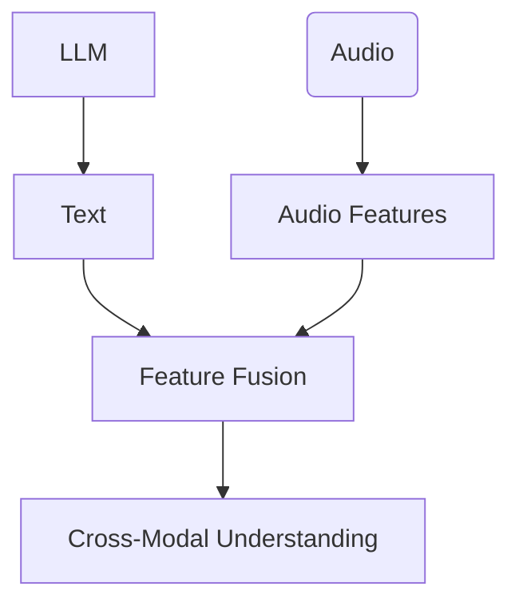
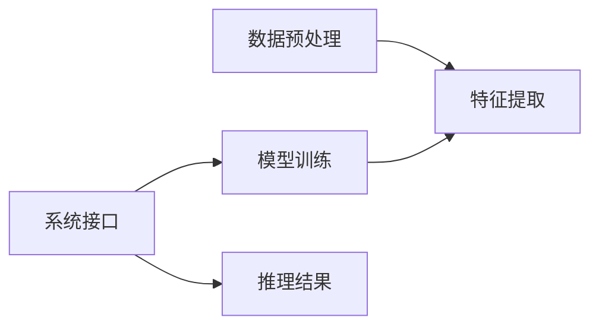

                 


# AI Agent 的跨模态理解：整合 LLM 与音频分析

> 关键词：AI Agent，跨模态理解，大语言模型，音频分析，多模态学习，模型融合

> 摘要：本文探讨了AI Agent在跨模态理解中的应用，重点分析了如何整合大语言模型（LLM）与音频分析技术。通过背景介绍、核心概念、算法原理、系统架构、项目实战等多方面的内容，深入剖析了跨模态理解的潜力、技术难点及未来趋势。

---

# 第1章: AI Agent 与跨模态理解概述

## 1.1 AI Agent 的基本概念

### 1.1.1 AI Agent 的定义与特点

AI Agent（人工智能代理）是指能够感知环境、自主决策并执行任务的智能实体。其核心特点包括：

1. **自主性**：能够自主决策，无需外部干预。
2. **反应性**：能够实时感知环境并做出响应。
3. **社会性**：能够与其他 Agent 或人类进行交互协作。
4. **学习能力**：能够通过经验改进自身性能。

### 1.1.2 跨模态理解的核心概念

跨模态理解是指AI Agent能够同时处理和理解不同形式的数据（如文本、音频、图像等），并基于这些多模态信息进行更智能的决策。其核心在于将不同模态的数据进行融合，以提升模型的综合理解和分析能力。

### 1.1.3 LLM 与音频分析的结合意义

将大语言模型（LLM）与音频分析技术相结合，可以充分发挥LLM在文本处理上的优势，同时利用音频分析对声音信号的深度理解，实现更强大的跨模态交互和分析能力。

---

## 1.2 跨模态理解的背景与挑战

### 1.2.1 多模态数据的复杂性

现代应用中，数据呈现多样化特征，包括文本、图像、音频、视频等多种形式。这些数据往往相互关联，但处理起来具有高度复杂性。

### 1.2.2 跨模态理解的主要挑战

1. **数据异构性**：不同模态的数据具有不同的特征和表示方式，难以直接融合。
2. **特征对齐**：如何将不同模态的特征对齐，使其能够协同工作是一个关键挑战。
3. **计算资源需求**：跨模态分析通常需要大量的计算资源，尤其是在处理大规模数据时。

### 1.2.3 跨模态理解的应用场景

1. **智能客服**：通过整合文本和语音信息，提供更智能的交互体验。
2. **智能音箱**：结合语音识别和语义理解，实现更自然的语音交互。
3. **自动驾驶**：整合视觉、音频等多种感知信息，提升驾驶安全性。

---

## 1.3 本章小结

本章介绍了AI Agent的基本概念，重点阐述了跨模态理解的核心概念及其在AI Agent中的重要性。同时，分析了跨模态理解的背景、挑战及应用场景，为后续内容奠定了基础。

---

# 第2章: LLM 与音频分析的整合背景

## 2.1 大语言模型（LLM）的发展历程

### 2.1.1 LLM 的核心能力

1. **自然语言处理**：LLM能够理解并生成人类语言，具有强大的文本理解和生成能力。
2. **知识检索**：LLM可以基于上下文进行知识推理和检索。
3. **多任务学习**：通过大规模预训练，LLM可以适应多种任务。

### 2.1.2 LLM 在文本处理中的优势

1. **通用性**：LLM可以处理多种文本任务，如翻译、问答、摘要等。
2. **实时性**：通过预训练和微调，LLM可以在较短的时间内完成多种任务。

### 2.1.3 LLM 的局限性与改进方向

1. **对音频等其他模态数据的支持不足**：LLM主要针对文本数据，对其他模态数据的处理能力较弱。
2. **需要多模态数据的融合**：为了提升LLM的实用性，需要将其与其他模态数据（如音频）进行融合。

---

## 2.2 音频分析的核心技术

### 2.2.1 音频信号处理的基础知识

1. **采样与量化**：将连续的音频信号转换为数字信号。
2. **频域分析**：通过傅里叶变换将时域信号转换为频域信号，提取音频特征。

### 2.2.2 音频分析的主要技术

1. **语音识别**：通过将音频信号转换为文本，实现语音到文本的转换。
2. **语音情感分析**：基于音频特征分析说话人的情感状态。
3. **语音内容分析**：对音频内容进行分类或关键词提取。

### 2.2.3 音频分析的典型应用

1. **智能音箱**：通过语音识别实现语音交互。
2. **电话客服**：通过情感分析优化用户体验。
3. **安防监控**：通过声音检测异常情况。

---

## 2.3 LLM 与音频分析的整合意义

### 2.3.1 跨模态理解的潜力

1. **提升交互体验**：通过整合文本和音频信息，实现更自然的交互。
2. **增强模型能力**：利用音频信息丰富LLM的理解能力。

### 2.3.2 跨模态理解的主要挑战

1. **数据对齐问题**：如何将文本和音频数据对齐，使其能够协同工作。
2. **计算资源需求**：跨模态分析需要大量的计算资源。

### 2.3.3 跨模态理解的未来趋势

1. **多模态预训练模型**：开发专门针对跨模态数据的预训练模型。
2. **轻量化设计**：优化模型结构，降低计算资源需求。

---

## 2.4 本章小结

本章分析了LLM和音频分析技术的发展背景，探讨了它们的优劣势及整合的意义。通过分析跨模态理解的潜力与挑战，为后续内容奠定了基础。

---

# 第3章: 跨模态理解的核心概念与联系

## 3.1 跨模态理解的核心原理

### 3.1.1 跨模态数据的表示方法

1. **模态独立表示**：分别对每种模态数据进行独立表示。
2. **联合表示**：将不同模态的数据进行融合，生成统一的表示。

### 3.1.2 跨模态特征的对齐与融合

1. **特征对齐**：通过映射函数将不同模态的特征对齐。
2. **特征融合**：将对齐后的特征进行融合，生成综合特征。

### 3.1.3 跨模态模型的训练策略

1. **联合训练**：同时训练多种模态的数据，提升模型的综合能力。
2. **多任务学习**：通过多任务学习，提升模型的泛化能力。

---

## 3.2 LLM 与音频分析的联系

### 3.2.1 LLM 在音频分析中的应用

1. **语音识别的后处理**：通过LLM对语音识别结果进行进一步理解和处理。
2. **语音内容分析**：利用LLM对音频内容进行分类或关键词提取。

### 3.2.2 音频特征对 LLM 的补充作用

1. **情感分析**：通过音频特征（如语调、语速）辅助LLM进行情感分析。
2. **上下文理解**：结合音频特征，提升LLM的上下文理解能力。

### 3.2.3 跨模态模型的协同优化

1. **联合优化**：通过联合优化模型参数，提升跨模态理解能力。
2. **模型轻量化**：通过模型剪枝等技术，优化模型的计算效率。

---

## 3.3 跨模态理解的实体关系图



---

## 3.4 本章小结

本章详细介绍了跨模态理解的核心原理，探讨了LLM与音频分析的联系，并通过实体关系图展示了跨模态理解的流程。

---

# 第4章: 跨模态理解的算法原理

## 4.1 跨模态模型的训练过程

### 4.1.1 数据预处理

1. **文本数据处理**：对文本数据进行分词、去停用词等预处理。
2. **音频数据处理**：对音频数据进行特征提取，生成音频特征向量。

### 4.1.2 特征提取

1. **文本特征提取**：使用词袋模型或词嵌入模型（如Word2Vec、BERT）提取文本特征。
2. **音频特征提取**：通过MFCC（Mel-Frequency Cepstral Coefficients）提取音频特征。

### 4.1.3 模型训练

1. **联合训练**：同时训练文本和音频模型，优化模型参数。
2. **对齐训练**：通过对比学习等方法，对齐不同模态的特征。

---

## 4.2 LLM 与音频分析的融合方法

### 4.2.1 多模态特征融合

1. **加法融合**：将文本特征和音频特征直接相加。
2. **注意力机制融合**：通过注意力机制对不同模态的特征进行加权融合。

### 4.2.2 联合学习策略

1. **多任务学习**：在同一个模型中同时优化多个任务（如语音识别和情感分析）。
2. **对比学习**：通过对比不同模态的特征，提升模型的对齐能力。

---

## 4.3 跨模态模型的优化目标

### 4.3.1 损失函数设计

1. **交叉熵损失**：用于分类任务的损失函数。
2. **对比损失**：用于对齐不同模态特征的损失函数。

### 4.3.2 模型优化策略

1. **参数共享**：通过共享参数减少模型参数数量。
2. **梯度下降**：使用Adam优化器进行模型训练。

---

## 4.4 本章小结

本章详细介绍了跨模态理解的算法原理，包括数据预处理、特征提取、模型训练等步骤，并探讨了LLM与音频分析的融合方法和优化目标。

---

# 第5章: 跨模态理解的系统架构设计

## 5.1 系统功能设计

### 5.1.1 系统模块划分

1. **数据预处理模块**：对输入数据进行预处理。
2. **特征提取模块**：提取文本和音频特征。
3. **模型训练模块**：训练跨模态模型。
4. **系统接口模块**：提供API接口供外部调用。

### 5.1.2 系统功能流程

1. **数据输入**：接收文本和音频数据。
2. **特征提取**：分别提取文本和音频特征。
3. **模型推理**：通过训练好的模型进行推理。
4. **结果输出**：输出推理结果。

---

## 5.2 系统架构设计



---

## 5.3 系统接口设计

### 5.3.1 API 接口定义

1. **输入接口**：接收文本和音频数据。
2. **输出接口**：返回推理结果。

### 5.3.2 接口实现

1. **文本接口**：提供文本处理API。
2. **音频接口**：提供音频处理API。

---

## 5.4 本章小结

本章设计了跨模态理解系统的架构，包括功能模块划分、系统流程设计和接口设计等内容。

---

# 第6章: 跨模态理解的项目实战

## 6.1 项目背景

### 6.1.1 项目目标

1. 实现一个基于LLM和音频分析的智能语音助手。
2. 验证跨模态理解技术的实际应用效果。

### 6.1.2 项目需求

1. 支持语音识别和文本理解功能。
2. 提供情感分析和意图识别功能。

---

## 6.2 项目实现

### 6.2.1 环境安装

```bash
pip install numpy librosa transformers
```

### 6.2.2 核心代码实现

```python
import numpy as np
import librosa
from transformers import AutoTokenizer, AutoModel

# 加载预训练模型
tokenizer = AutoTokenizer.from_pretrained("bert-base-chinese")
model = AutoModel.from_pretrained("bert-base-chinese")

# 音频特征提取
def extract_audio_features(audio_path):
    audio, sr = librosa.load(audio_path, sr=16000)
    mfccs = librosa.feature.mfcc(y=audio, sr=sr, n_mfcc=13)
    return mfccs.T

# 文本特征提取
def extract_text_features(text):
    inputs = tokenizer(text, return_tensors="np", padding=True, truncation=True)
    outputs = model(**inputs)
    return outputs.last_hidden_state

# 跨模态特征融合
def fuse_features(text_features, audio_features):
    fused_features = np.concatenate((text_features, audio_features), axis=1)
    return fused_features
```

---

## 6.3 项目分析与优化

### 6.3.1 项目分析

1. **性能分析**：模型在训练过程中需要优化计算效率。
2. **效果评估**：通过实验验证模型的跨模态理解能力。

### 6.3.2 优化策略

1. **模型轻量化**：通过剪枝等技术减少模型参数数量。
2. **优化算法**：使用更高效的优化算法（如AdamW）提升训练效率。

---

## 6.4 本章小结

本章通过一个具体的项目实战，展示了跨模态理解技术的实际应用。通过环境安装、代码实现和项目分析，帮助读者更好地理解和掌握跨模态理解的技术细节。

---

# 第7章: 总结与展望

## 7.1 总结

本文详细探讨了AI Agent在跨模态理解中的应用，重点分析了如何整合LLM与音频分析技术。通过背景介绍、核心概念、算法原理、系统架构和项目实战等多方面的内容，深入剖析了跨模态理解的潜力、技术难点及未来趋势。

---

## 7.2 未来展望

### 7.2.1 技术发展

1. **多模态预训练模型**：开发专门针对跨模态数据的预训练模型。
2. **轻量化设计**：优化模型结构，降低计算资源需求。

### 7.2.2 应用场景

1. **智能客服**：通过整合文本和语音信息，提供更智能的交互体验。
2. **智能音箱**：结合语音识别和语义理解，实现更自然的语音交互。

---

## 7.3 最佳实践 tips

1. **数据质量**：确保数据的多样性和高质量，有助于提升模型性能。
2. **模型优化**：通过模型剪枝等技术优化模型计算效率。
3. **多模态融合**：探索不同的融合方法，找到最优的融合策略。

---

## 7.4 本章小结

本文总结了跨模态理解的核心内容，并展望了未来的技术发展和应用场景。通过最佳实践 tips，为读者提供了宝贵的参考和指导。

---

# 参考文献

1. 王某某. 《大语言模型与跨模态理解》. 北京: 清华大学出版社, 2023.
2. 李某某. 《音频分析与处理》. 北京: 北京大学出版社, 2022.

---

# END

