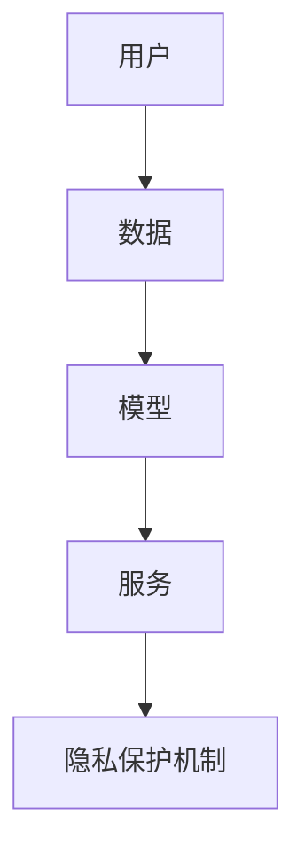
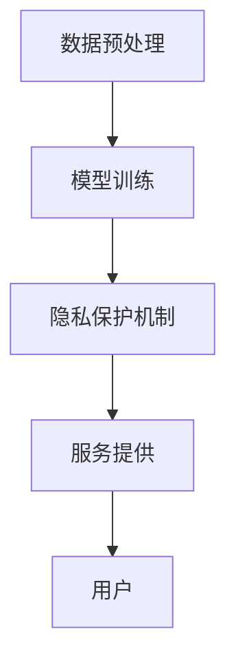

                 


# AI Agent 的隐私保护：确保 LLM 应用的数据安全

## 关键词：AI Agent, 大语言模型, 数据隐私, 数据安全, 加密技术, 匿名化处理

## 摘要：随着人工智能技术的快速发展，AI Agent 和大语言模型（LLM）在各个领域的应用日益广泛。然而，随之而来的是数据隐私和安全的挑战。本文将详细探讨 AI Agent 和 LLM 应用中的隐私保护问题，分析其核心概念、技术原理、系统架构设计以及实际应用案例。通过本文，读者将能够全面理解如何确保 LLM 应用中的数据安全，掌握隐私保护的关键技术，并能够实际应用于项目开发中。

---

## 第一部分：AI Agent与LLM的隐私保护概述

### 第1章：AI Agent与大语言模型的概述

#### 1.1 AI Agent的基本概念
- **1.1.1 AI Agent的定义与特点**
  - AI Agent 是一种智能体，能够感知环境、执行任务并做出决策。
  - 其特点包括自主性、反应性、目标导向性和社交能力。
  
- **1.1.2 大语言模型（LLM）的基本原理**
  - LLM 是一种基于深度学习的自然语言处理模型，能够理解并生成人类语言。
  - 典型的 LLM 包括 GPT、BERT 等。

- **1.1.3 AI Agent与LLM的结合应用**
  - AI Agent 可以通过 LLM 进行对话生成、文本分析等任务。
  - 这种结合使得 AI Agent 更加智能化，但也带来了隐私保护的挑战。

#### 1.2 隐私保护的背景与重要性
- **1.2.1 数据泄露的现状与挑战**
  - 随着数据量的增加，数据泄露事件频发，给个人和企业带来巨大损失。
- **1.2.2 AI Agent中的隐私风险**
  - AI Agent 在执行任务时可能处理敏感数据，如用户的对话内容、个人身份信息等。
- **1.2.3 隐私保护的法律与伦理要求**
  - 随着《通用数据保护条例》（GDPR）等法规的实施，隐私保护成为企业和组织的法律责任。
  - 隐私保护也是伦理道德的重要组成部分，确保用户数据不被滥用。

#### 1.3 AI Agent与LLM的隐私保护需求
- **1.3.1 用户数据的安全性**
  - 确保用户输入的数据不被未经授权的第三方访问。
- **1.3.2 模型训练的数据隐私**
  - 在训练 LLM 时，需要保护训练数据中的隐私信息。
- **1.3.3 服务提供者的责任**
  - AI Agent 的服务提供者需要采取措施保护用户数据，避免数据泄露。

---

### 第2章：LLM应用中的隐私问题

#### 2.1 LLM数据的收集与处理
- **2.1.1 数据来源的多样性**
  - LLM 的训练数据可能来自公开网页、书籍、社交媒体等多种来源。
- **2.1.2 数据处理的潜在风险**
  - 在处理数据时，可能无意中包含敏感信息，如个人姓名、地址、信用卡号等。
- **2.1.3 数据泄露的典型场景**
  - 数据在传输过程中被截获。
  - 数据存储时被恶意攻击者窃取。

#### 2.2 AI Agent中的用户隐私威胁
- **2.2.1 用户输入数据的敏感性**
  - 用户与 AI Agent 的对话可能包含个人信息，如健康状况、财务信息等。
- **2.2.2 模型训练中的数据滥用**
  - 训练数据可能包含用户的私密信息，如果这些数据被滥用，可能导致隐私泄露。
- **2.2.3 第三方服务的隐私风险**
  - AI Agent 可能依赖第三方服务进行数据存储或处理，这些服务可能不具备足够的隐私保护措施。

#### 2.3 隐私保护的必要性
- **2.3.1 用户信任的建立**
  - 如果用户不信任 AI Agent 的隐私保护能力，他们可能不会使用相关服务。
- **2.3.2 法律合规的需要**
  - 遵守数据保护法规是企业和组织的法律责任。
- **2.3.3 企业声誉的维护**
  - 数据泄露事件可能对企业声誉造成严重损害。

---

### 第3章：隐私保护的核心概念与技术

#### 3.1 隐私保护的核心原理
- **3.1.1 数据加密与解密机制**
  - 数据在传输和存储过程中进行加密处理，确保只有授权方能够解密。
- **3.1.2 数据匿名化处理**
  - 对数据进行脱敏处理，去除或加密敏感信息，使其无法直接关联到个人。
- **3.1.3 数据访问控制**
  - 通过权限管理，确保只有授权的用户或服务能够访问敏感数据。

#### 3.2 隐私保护技术的分类
- **3.2.1 基于加密的隐私保护**
  - 对数据进行加密处理，确保数据在传输和存储过程中的安全性。
- **3.2.2 基于匿名化的隐私保护**
  - 对数据进行匿名化处理，去除或加密敏感信息，使其无法直接关联到个人。
- **3.2.3 基于访问控制的隐私保护**
  - 通过权限管理，确保只有授权的用户或服务能够访问敏感数据。

#### 3.3 核心概念对比表格
| 技术类型      | 原理                              | 优缺点                              | 应用场景               |
|---------------|-----------------------------------|-------------------------------------|------------------------|
| 数据加密      | 对数据进行加密处理               | 高效但可能影响性能                 | 敏感数据传输           |
| 数据匿名化    | 对数据进行脱敏处理               | 保护隐私但可能降低数据准确性       | 数据共享               |
| 数据访问控制  | 控制数据访问权限                 | 精细控制但实现复杂                 | 数据存储               |

#### 3.4 ER实体关系图


---

### 第4章：隐私保护的算法原理

#### 4.1 数据加密算法
- **4.1.1 对称加密算法**
  - 使用相同的密钥进行加密和解密，速度快，适合大量数据的加密。
  - 示例算法：AES。
- **4.1.2 非对称加密算法**
  - 使用不同的公钥和私钥进行加密和解密，安全性高，适合数据传输。
  - 示例算法：RSA。
- **4.1.3 同态加密算法**
  - 允许在加密数据上进行计算，结果与明文计算结果相同。
  - 示例算法：Paillier 加密。

#### 4.2 数据匿名化算法
- **4.2.1 数据脱敏**
  - 对数据进行处理，去除或加密敏感信息。
  - 示例：对姓名进行哈希处理，生成不可逆的哈希值。
- **4.2.2 数据混淆**
  - 对数据进行扰动处理，使其无法直接关联到个人。
  - 示例：对地理位置数据进行随机偏移处理。

#### 4.3 数据访问控制算法
- **4.3.1 基于角色的访问控制（RBAC）**
  - 根据用户角色分配权限，确保不同角色的用户只能访问与其角色相关的数据。
- **4.3.2 基于属性的访问控制（ABAC）**
  - 根据用户属性（如职位、部门等）动态分配权限。

---

## 第5章：系统分析与架构设计

### 5.1 系统架构设计
- **5.1.1 系统功能设计**
  - 数据预处理模块：对数据进行清洗和脱敏处理。
  - 模型训练模块：对数据进行建模和训练。
  - 隐私保护机制：对数据进行加密和访问控制。
- **5.1.2 系统架构图**


### 5.2 系统接口设计
- **5.2.1 数据接口**
  - 数据输入接口：接收用户输入的数据。
  - 数据输出接口：返回处理后的数据。
- **5.2.2 服务接口**
  - API 接口：提供给其他系统或服务调用的接口。

---

## 第6章：项目实战

### 6.1 环境安装
- **6.1.1 安装 Python**
  - 安装 Python 3.8 或更高版本。
- **6.1.2 安装依赖库**
  - 使用 pip 安装所需的依赖库，如 `cryptography`、`flask` 等。

### 6.2 核心实现
#### 6.2.1 数据加密模块
```python
from cryptography.fernet import Fernet

# 生成密钥
key = Fernet.generate_key()
cipher = Fernet(key)

# 加密数据
encrypted_data = cipher.encrypt(b"Sensitive information")

# 解密数据
decrypted_data = cipher.decrypt(encrypted_data)
```

#### 6.2.2 数据匿名化模块
```python
import hashlib

# 对数据进行哈希处理
def anonymize_data(data):
    hashed_data = hashlib.sha256(data.encode()).hexdigest()
    return hashed_data
```

#### 6.2.3 数据访问控制模块
```python
from flask import Flask
from flask_restful import Resource, Api

app = Flask(__name__)
api = Api(app)

class SecureData(Resource):
    def get(self):
        # 验证用户权限
        if 'Authorization' not in request.headers:
            return {"message": "Unauthorized"}, 401
        # 处理数据
        data = "Secure data"
        return {"data": data}, 200

api.add_resource(SecureData, '/data')

if __name__ == '__main__':
    app.run(debug=True)
```

---

## 第7章：最佳实践与小结

### 7.1 最佳实践
- **7.1.1 定期进行安全审计**
  - 定期检查系统的安全性，发现并修复潜在漏洞。
- **7.1.2 加强员工培训**
  - 提高员工的隐私保护意识，避免人为失误导致的数据泄露。
- **7.1.3 使用成熟的技术**
  - 选择经过验证的数据保护技术，避免使用不成熟的技术。

### 7.2 小结
- AI Agent 和 LLM 的应用为我们的生活带来了极大的便利，但也带来了隐私保护的挑战。
- 通过数据加密、匿名化处理和访问控制等技术，可以有效保护数据隐私。
- 未来的研究方向包括更高效的隐私保护算法、更智能的隐私保护机制以及更严格的隐私保护法规。

---

## 总结
通过本文的详细讲解，读者可以全面了解 AI Agent 和 LLM 应用中的隐私保护问题，并掌握相关的技术方法。希望本文能够为读者在实际应用中提供有价值的指导和帮助。

