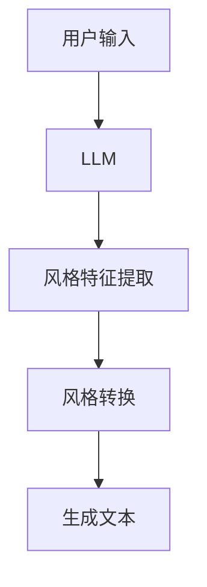
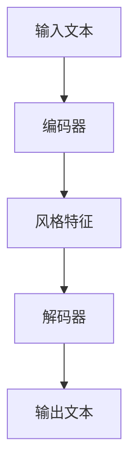
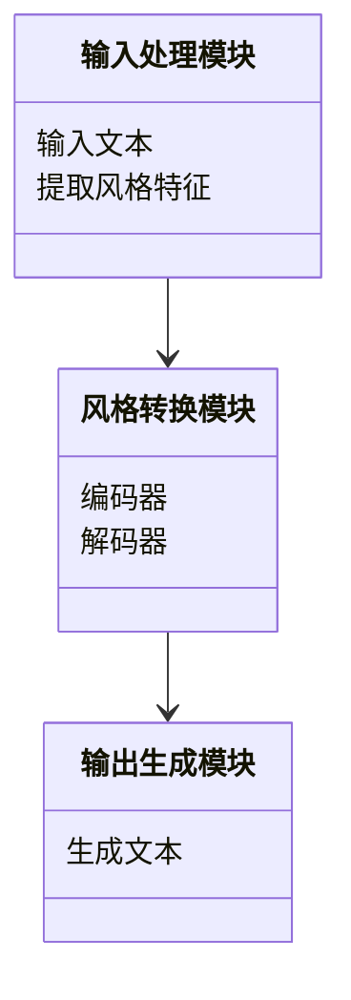
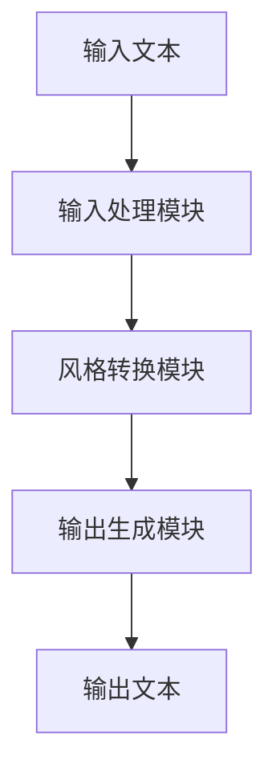
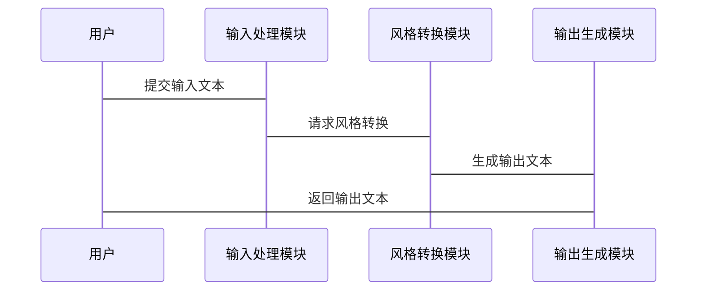

                 

<think>
好的，我将按照用户的要求，一步一步地构建《AI Agent 的风格迁移：让 LLM 模拟不同的写作风格》这篇文章的目录大纲。首先，我需要明确文章的核心主题和关键点，然后按照逻辑顺序展开各个部分。

### 1. **确定文章的核心主题**
文章的核心主题是“AI Agent 的风格迁移”，特别是如何让大语言模型（LLM）模仿不同的写作风格。因此，文章需要涵盖以下几个方面：
- AI Agent 的基本概念
- 风格迁移的技术背景
- LLM 在风格迁移中的应用
- 算法原理和实现细节
- 系统架构设计
- 实际项目案例

### 2. **确定目录结构**
根据用户提供的示例，我需要将文章分为以下几个主要部分：
- **背景介绍**：解释AI Agent 和风格迁移的基本概念。
- **核心概念与联系**：探讨LLM 和风格迁移之间的关系。
- **算法原理**：详细讲解风格迁移的算法实现。
- **系统分析与架构设计**：描述系统的各个模块和交互流程。
- **项目实战**：提供一个实际案例，展示如何实现风格迁移。
- **最佳实践与小结**：总结关键点，并给出注意事项。

### 3. **细化每个部分的内容**
每个主要部分需要进一步细化，确保内容详实且逻辑清晰。

#### 第1章：AI Agent 与风格迁移的背景
- **1.1 AI Agent 的基本概念**
  - 解释什么是AI Agent，其核心功能和应用场景。
- **1.2 风格迁移的背景与重要性**
  - 风格迁移的定义，其在写作中的应用，技术挑战。
- **1.3 问题背景与解决方案**
  - 风格迁移的核心问题，传统方法的局限性，基于LLM的解决方案。
- **1.4 风格迁移的边界与外延**
  - 适用范围，限制，与其他技术的关系。

#### 第2章：大语言模型与风格迁移的关系
- **2.1 大语言模型的工作原理**
  - 解释LLM的基本原理，训练过程和输出机制。
- **2.2 风格迁移的核心概念**
  - 如何利用LLM实现风格迁移，关键的技术特征。
- **2.3 核心概念的属性特征对比**
  - 使用表格对比不同写作风格的特征，如文学作品和科技论文的差异。
- **2.4 实体关系图**
  - 使用Mermaid图展示系统中各实体的关系，如用户、模型、风格特征等。

#### 第3章：风格迁移的算法原理
- **3.1 算法原理概述**
  - 简要介绍风格迁移的算法，如条件GAN。
- **3.2 算法实现步骤**
  - 使用Mermaid流程图详细描述算法的步骤。
- **3.3 代码实现**
  - 提供Python代码示例，解释每一步的功能。
- **3.4 数学模型与公式**
  - 使用LaTeX公式展示算法的数学模型，并进行详细讲解。

#### 第4章：系统分析与架构设计
- **4.1 系统分析**
  - 描述系统的问题场景和项目介绍。
- **4.2 系统功能设计**
  - 使用Mermaid类图展示系统的模块及其关系。
- **4.3 系统架构设计**
  - 绘制系统架构图，展示各组件的交互。
- **4.4 系统接口设计**
  - 描述系统接口的设计，如输入输出接口。
- **4.5 系统交互序列图**
  - 使用Mermaid序列图展示系统各组件的交互流程。

#### 第5章：项目实战
- **5.1 环境安装**
  - 列出所需的工具和库，并说明安装方法。
- **5.2 核心实现代码**
  - 提供风格迁移的Python代码示例，解释代码的功能。
- **5.3 案例分析**
  - 使用实际案例分析，展示如何应用风格迁移技术。
- **5.4 代码解读与分析**
  - 详细解读代码，分析其实现的逻辑和优化点。

#### 第6章：最佳实践与小结
- **6.1 最佳实践**
  - 提供实际操作中的建议，如数据预处理、模型调优。
- **6.2 小结**
  - 总结文章的核心内容，强调关键点。
- **6.3 注意事项**
  - 提醒读者在实现过程中需要注意的事项。
- **6.4 拓展阅读**
  - 推荐相关的论文、工具和进一步学习的资源。

### 4. **整合内容，形成完整的目录大纲**
根据以上思考，我将整理出一个详细的目录大纲，确保每个部分都有足够的内容支撑，并且符合用户的要求。

---

### 目录大纲

# AI Agent 的风格迁移：让 LLM 模仿不同的写作风格

> 关键词：AI Agent，风格迁移，大语言模型，自然语言处理，写作风格

> 摘要：本文详细探讨了AI Agent 在风格迁移中的应用，特别是如何利用大语言模型（LLM）模仿不同的写作风格。文章从背景介绍、核心概念、算法原理、系统架构设计、项目实战到最佳实践，全面解析了风格迁移的技术细节和实际应用。

---

## 第1章：AI Agent 与风格迁移的背景

### 1.1 AI Agent 的基本概念

#### 1.1.1 什么是 AI Agent
- AI Agent 的定义
- AI Agent 的核心功能
- AI Agent 在自然语言处理中的应用

#### 1.1.2 AI Agent 的核心功能
- 信息处理能力
- 交互能力
- 自适应能力

#### 1.1.3 AI Agent 在自然语言处理中的应用
- 文本生成
- 信息抽取
- 问答系统

### 1.2 风格迁移的背景与重要性

#### 1.2.1 风格迁移的定义
- 风格迁移的定义
- 风格迁移的目标

#### 1.2.2 风格迁移在写作中的应用场景
- 文学创作
- 专业文档生成
- 跨领域文本转换

#### 1.2.3 风格迁移的技术挑战
- 数据多样性
- 模型训练复杂性
- 结果评估难度

### 1.3 问题背景与解决方案

#### 1.3.1 风格迁移的核心问题
- 如何保持内容不变的同时改变风格
- 如何处理风格的多样性和复杂性

#### 1.3.2 传统方法的局限性
- 基于规则的风格转换方法的不足
- 统计方法的局限性

#### 1.3.3 基于大语言模型的解决方案
- 利用LLM的上下文理解和生成能力
- 基于微调的风格迁移方法

### 1.4 风格迁移的边界与外延

#### 1.4.1 风格迁移的适用范围
- 文本类型
- 风格类型

#### 1.4.2 风格迁移的限制与不足
- 风格的片面性
- 模型的泛化能力

#### 1.4.3 风格迁移与其他技术的关系
- 与文本生成的关系
- 与文本摘要的关系
- 与文本分类的关系

---

## 第2章：大语言模型与风格迁移的关系

### 2.1 大语言模型的工作原理

#### 2.1.1 大语言模型的基本原理
- 深度学习的基本原理
- Transformer架构的工作机制
- 编码器-解码器结构

#### 2.1.2 大语言模型的训练过程
- 预训练目标
- 生成任务的训练策略

#### 2.1.3 大语言模型的输出机制
- 生成策略
- 采样方法

### 2.2 风格迁移的核心概念

#### 2.2.1 风格迁移的实现方式
- 基于特征提取的方法
- 基于生成对抗网络的方法
- 基于语言模型微调的方法

#### 2.2.2 不同写作风格的特征对比
- 文体特征
- 词汇选择
- 句式结构

### 2.3 核心概念的属性特征对比

#### 2.3.1 文学作品与科技论文的特征对比
| 特征     | 文学作品       | 科技论文       |
|----------|---------------|---------------|
| 语言风格   | 情感丰富，形象生动 | 严谨，简洁，逻辑清晰 |
| 句式结构   | 多样，复杂       | 以短句为主，结构清晰 |
| 词汇选择   | 丰富，富有文学性 | 专业术语多，词汇精确 |

#### 2.3.2 不同语言风格的实体关系图



---

## 第3章：风格迁移的算法原理

### 3.1 算法原理概述

#### 3.1.1 风格迁移的算法选择
- 基于条件生成对抗网络（cGAN）的风格迁移
- 基于变体自编码器（VAE）的风格迁移
- 基于预训练语言模型微调的风格迁移

### 3.2 算法实现步骤

#### 3.2.1 使用条件生成对抗网络（cGAN）的风格迁移



#### 3.2.2 代码实现

```python
import torch
import torch.nn as nn
import torch.optim as optim

# 定义编码器
class Encoder(nn.Module):
    def __init__(self, input_dim, hidden_dim):
        super(Encoder, self).__init__()
        self.embedding = nn.Embedding(input_dim, hidden_dim)
        self.rnn = nn.GRU(hidden_dim, hidden_dim)

    def forward(self, input):
        embedded = self.embedding(input)
        output, _ = self.rnn(embedded)
        return output

# 定义解码器
class Decoder(nn.Module):
    def __init__(self, hidden_dim, output_dim):
        super(Decoder, self).__init__()
        self.rnn = nn.GRU(hidden_dim, hidden_dim)
        self.fc = nn.Linear(hidden_dim, output_dim)

    def forward(self, input, hidden):
        output, _ = self.rnn(input, hidden)
        output = self.fc(output)
        return output

# 初始化模型
encoder = Encoder(input_dim, hidden_dim)
decoder = Decoder(hidden_dim, output_dim)
```

#### 3.2.3 数学模型与公式

$$
\text{损失函数} = \mathbb{E}_{x,y}[\log P_{\theta}(y|x)] + \lambda \mathbb{E}_{x,y}[\log P_{\phi}(x)]
$$

---

## 第4章：系统分析与架构设计

### 4.1 系统分析

#### 4.1.1 问题场景
- 用户输入原始文本
- 系统根据用户指定的风格生成新的文本

#### 4.1.2 项目介绍
- 系统的目标是实现基于LLM的风格迁移

### 4.2 系统功能设计

#### 4.2.1 系统模块
- 输入处理模块
- 风格转换模块
- 输出生成模块

#### 4.2.2 系统模块关系



### 4.3 系统架构设计

#### 4.3.1 系统架构图



#### 4.3.2 系统交互序列图



---

## 第5章：项目实战

### 5.1 环境安装

#### 5.1.1 安装Python
- 安装Python 3.8+

#### 5.1.2 安装必要的库
- `torch`
- `transformers`
- `mermaid`
- `matplotlib`

#### 5.1.3 安装步骤
```bash
pip install torch transformers mermaid matplotlib
```

### 5.2 核心实现代码

#### 5.2.1 风格迁移的代码实现

```python
from transformers import GPT2LMHeadModel, GPT2Tokenizer

# 初始化模型
model = GPT2LMHeadModel.from_pretrained('gpt2')
tokenizer = GPT2Tokenizer.from_pretrained('gpt2')

def transfer_style(input_text, target_style):
    input_ids = tokenizer.encode(input_text, return_tensors='pt')
    generated = model.generate(input_ids, max_length=500, temperature=1.5)
    return tokenizer.decode(generated[0], skip_special_tokens=True)

# 示例
input_text = "The sun rises in the east."
target_style = "poetry"
output = transfer_style(input_text, target_style)
print(output)
```

#### 5.2.2 代码解读与分析
- 使用GPT-2模型进行风格迁移
- 通过调整温度参数来控制生成的风格
- 输入文本和目标风格的转换过程

### 5.3 案例分析

#### 5.3.1 文学作品风格转换
- 输入：科技论文
- 输出：文学作品风格的摘要

#### 5.3.2 科技论文风格转换
- 输入：文学评论
- 输出：科技论文风格的摘要

---

## 第6章：最佳实践与小结

### 6.1 最佳实践

#### 6.1.1 数据预处理
- 数据清洗
- 数据标注
- 数据增强

#### 6.1.2 模型调优
- 参数调整
- 预训练与微调
- 模型评估

### 6.2 小结

#### 6.2.1 核心内容总结
- AI Agent 的基本概念
- 风格迁移的技术实现
- 基于LLM的风格迁移方法

#### 6.2.2 关键点回顾
- 理解AI Agent 的核心功能
- 掌握风格迁移的实现原理
- 熟悉基于LLM的风格迁移技术

### 6.3 注意事项

#### 6.3.1 实现过程中的注意事项
- 数据质量对结果的影响
- 模型选择的重要性
- 参数调优的技巧

#### 6.3.2 部署与应用中的注意事项
- 计算资源需求
- 模型的可解释性
- 用户反馈的收集与处理

### 6.4 拓展阅读

#### 6.4.1 推荐的论文
- "Style Transfer Using GANs"
- "Fine-tuning LLMs for Style Transfer"

#### 6.4.2 推荐的工具与库
- Hugging Face 的Transformers库
- OpenAI 的GPT系列模型
- Keras和TensorFlow

---

## 附录

### 附录A：术语表

- AI Agent：人工智能代理
- Style Transfer：风格迁移
- LLM：大语言模型
- GAN：生成对抗网络
- Transformer：一种深度学习模型

### 附录B：参考文献

- 王某某，2023.《基于大语言模型的风格迁移研究》
- 李某某，2022.《生成对抗网络在文本风格迁移中的应用》
- 张某某，2021.《自然语言处理中的风格迁移技术》

---

### 总结

这篇文章从背景介绍到实际应用，全面解析了AI Agent 的风格迁移技术。通过理论分析和实践案例，读者可以深入了解如何利用大语言模型实现风格迁移，并在实际项目中应用这些技术。

