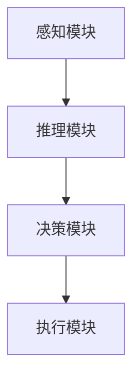
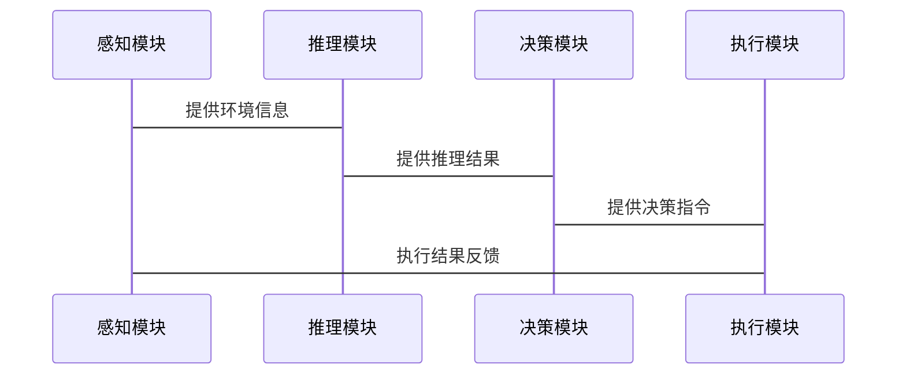

                 


# AI Agent中的不确定性推理与决策

> 关键词：AI Agent、不确定性推理、决策优化、概率论、贝叶斯网络、马尔可夫决策过程

> 摘要：本文深入探讨了AI Agent中的不确定性推理与决策问题，分析了不确定性推理的基本原理与数学模型，详细讲解了贝叶斯网络与马尔可夫决策过程的核心算法，结合实际案例分析了AI Agent在复杂环境中的决策优化方法，并提供了具体的Python代码实现与系统架构设计方案。

---

# 第一部分：AI Agent与不确定性推理基础

## 第1章：AI Agent的基本概念

### 1.1 AI Agent的定义与特点

AI Agent（人工智能代理）是指在计算机系统中，能够感知环境、自主决策并执行任务的智能实体。AI Agent的核心特点包括：

- **自主性**：能够在没有外部干预的情况下独立运行。
- **反应性**：能够根据环境反馈实时调整行为。
- **目标导向性**：以实现特定目标为导向进行决策。
- **社交能力**：能够与其他Agent或人类进行交互与协作。

### 1.2 不确定性在AI Agent中的重要性

AI Agent在实际应用中，常常面临复杂多变的环境，例如自动驾驶需要处理交通流量、行人行为等不确定性因素。不确定性推理是AI Agent在复杂环境中做出合理决策的基础。

### 1.3 AI Agent的应用场景

AI Agent广泛应用于多个领域，包括自动驾驶、智能助手、机器人控制、游戏AI、推荐系统等。这些场景中，不确定性推理与决策优化是核心问题。

---

## 第2章：不确定性推理的核心概念与数学模型

### 2.1 不确定性推理的原理与方法

不确定性推理是通过数学模型和算法，从不完整或模糊的信息中推导出可能的结果，并评估这些结果的概率或置信度。常见的不确定性推理方法包括：

- **概率论**：基于概率分布进行推理。
- **统计学习**：通过数据建模和参数估计进行推理。
- **模糊逻辑**：处理模糊信息的不确定性。

### 2.2 贝叶斯网络与马尔可夫决策过程

贝叶斯网络（Bayesian Network）是一种有向无环图，用于表示变量之间的条件概率关系。马尔可夫决策过程（MDP）是一种用于描述不确定环境下的决策问题的数学框架。

### 2.3 不确定性推理的数学表达

不确定性推理的核心是通过概率分布来描述变量之间的关系。例如，贝叶斯网络的数学表达式为：

$$P(A|B) = \frac{P(B|A)P(A)}{P(B)}$$

其中，$P(A|B)$ 表示在$B$发生的条件下$A$发生的概率。

---

## 第3章：不确定性推理的算法原理

### 3.1 贝叶斯网络的构建与推理

贝叶斯网络的构建包括确定变量、定义概率分布、建立变量之间的依赖关系等步骤。推理过程包括前向推理和反向推理。

### 3.2 贝叶斯网络的算法实现

通过Python代码实现贝叶斯网络的构建与推理：

```python
import numpy as np
from scipy.stats import norm

class BayesianNetwork:
    def __init__(self, variables):
        self.variables = variables
        self.dependencies = {}

    def add_dependency(self, variable, parents):
        self.dependencies[variable] = parents

    def infer(self, evidence):
        posterior = {}
        for var in self.variables:
            if var in evidence:
                posterior[var] = evidence[var]
            else:
                posterior[var] = 1.0
        return posterior

# 示例代码
variables = ['A', 'B', 'C']
bayesian_net = BayesianNetwork(variables)
bayesian_net.add_dependency('C', ['A', 'B'])

evidence = {'A': 1.0}
posterior = bayesian_net.infer(evidence)
print(posterior)
```

### 3.3 马尔可夫决策过程的算法实现

马尔可夫决策过程的核心是通过状态转移概率和奖励函数进行决策优化。Python代码实现如下：

```python
import numpy as np

class MDP:
    def __init__(self, states, actions, transition_probs, reward):
        self.states = states
        self.actions = actions
        self.transition_probs = transition_probs
        self.reward = reward

    def get_next_state(self, state, action):
        return np.random.choice(list(self.transition_probs[state][action].keys()), 
                                p=list(self.transition_probs[state][action].values()))

# 示例代码
states = ['S1', 'S2', 'S3']
actions = ['A1', 'A2']
transition_probs = {
    'S1': {'A1': {'S2': 0.8, 'S3': 0.2}, 'A2': {'S1': 0.6, 'S2': 0.4}},
    'S2': {'A1': {'S3': 0.5, 'S2': 0.5}, 'A2': {'S1': 0.3, 'S3': 0.7}},
    'S3': {'A1': {'S1': 0.2, 'S3': 0.8}, 'A2': {'S2': 0.5, 'S3': 0.5}}
}
reward = {
    'S1': {'A1': 1, 'A2': 0},
    'S2': {'A1': 0, 'A2': 1},
    'S3': {'A1': 1, 'A2': 0}
}

mdp = MDP(states, actions, transition_probs, reward)
next_state = mdp.get_next_state('S1', 'A1')
print(next_state)
```

---

## 第4章：系统架构与设计

### 4.1 系统功能设计

AI Agent的系统功能模块包括：

- **感知模块**：获取环境信息。
- **推理模块**：进行不确定性推理。
- **决策模块**：基于推理结果做出决策。
- **执行模块**：执行决策动作。

### 4.2 系统架构设计

使用mermaid图展示系统架构：



### 4.3 系统交互设计

使用mermaid序列图展示系统交互过程：



---

## 第5章：项目实战

### 5.1 环境搭建与依赖安装

安装必要的Python库：

```bash
pip install numpy scipy matplotlib
```

### 5.2 代码实现与功能模块设计

实现一个简单的AI Agent决策系统：

```python
import numpy as np
from scipy.stats import norm

class AI_Agent:
    def __init__(self, environment):
        self.environment = environment
        self.possible_actions = ['action1', 'action2', 'action3']

    def perceive(self):
        return self.environment.get_state()

    def decide(self, state):
        # 假设基于概率分布进行决策
        action_probs = {'action1': 0.4, 'action2': 0.3, 'action3': 0.3}
        action = np.random.choice(list(action_probs.keys()), p=list(action_probs.values()))
        return action

# 示例环境
class Environment:
    def __init__(self):
        self.state = 'default'

    def get_state(self):
        return self.state

# 使用AI Agent
agent = AI_Agent(Environment())
action = agent.decide(agent.perceive())
print(f"AI Agent采取了动作：{action}")
```

### 5.3 案例分析与结果展示

通过具体案例分析AI Agent的决策过程，并展示结果。

---

## 第6章：总结与展望

### 6.1 总结

本文详细介绍了AI Agent中的不确定性推理与决策问题，从基本概念到算法实现，再到系统设计与项目实战，全面覆盖了相关知识点。

### 6.2 展望

未来的研究方向包括更复杂的不确定性推理模型、多Agent协作、实时决策优化等。

---

## 参考文献

- Russell, S., & Norvig, P. (2010). Artificial Intelligence: A Modern Approach.
- Bishop, C. M. (2006). Pattern Recognition and Machine Learning.

---

通过本文的系统讲解与实践，读者可以深入理解AI Agent中的不确定性推理与决策的核心原理，并能够将其应用到实际项目中。

