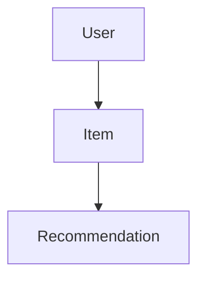
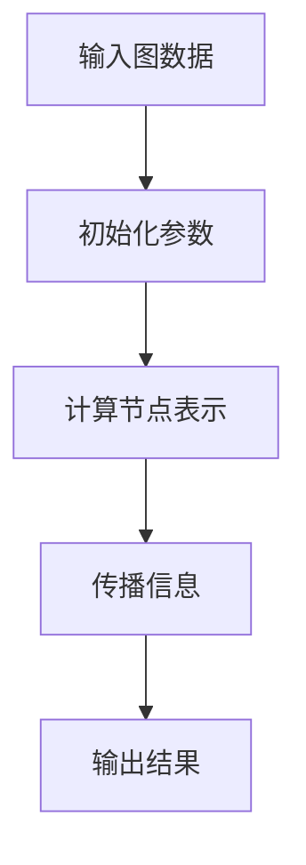
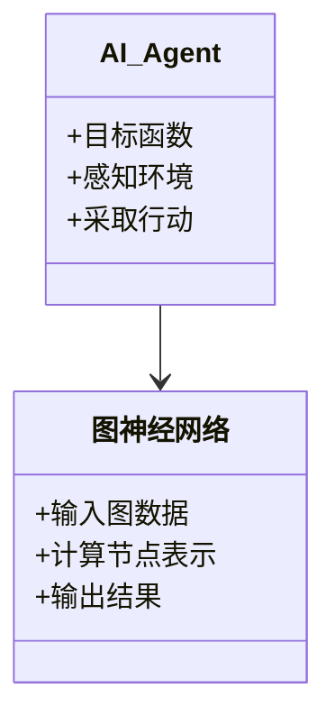
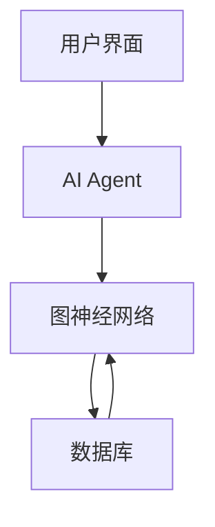
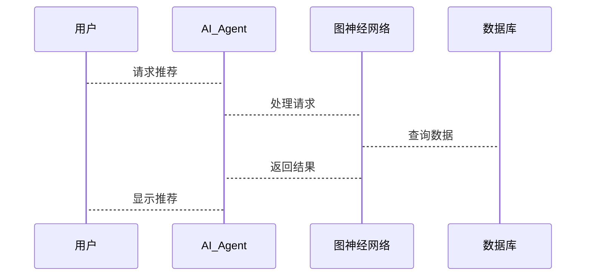

                 


# AI Agent中的图神经网络应用

## 关键词：AI Agent，图神经网络，推荐系统，路径规划，关系图

## 摘要：本文探讨了AI Agent与图神经网络的结合，通过背景介绍、核心概念分析、算法原理、系统设计和项目实战，详细讲解了图神经网络在AI Agent中的应用，特别是推荐系统和路径规划中的案例。

---

## 第一部分: AI Agent与图神经网络的背景介绍

### 第1章: AI Agent与图神经网络的背景介绍

#### 1.1 问题背景与描述

- **AI Agent的发展历程**  
  AI Agent是一种智能体，能够感知环境并采取行动，广泛应用于推荐系统、路径规划等领域。

- **图神经网络的崛起**  
  图神经网络擅长处理图结构数据，能够捕捉数据间的复杂关系，成为处理复杂任务的重要工具。

- **问题解决的核心目标**  
  提升AI Agent在复杂环境中的理解和决策能力，特别是在处理关系型数据时。

#### 1.2 AI Agent与图神经网络的边界与外延

- **AI Agent的定义与特征**  
  AI Agent通过感知和行动优化目标，具有自主性和适应性。

- **图神经网络的定义与特征**  
  图神经网络处理图结构数据，节点间的关系通过边表示，擅长非线性关系处理。

- **结合与应用范围**  
  在推荐系统、路径规划、社交网络分析等领域，图神经网络增强AI Agent的能力。

---

## 第二部分: 核心概念与联系

### 第2章: AI Agent与图神经网络的核心概念与联系

#### 2.1 核心概念原理

- **AI Agent的核心原理**  
  通过感知环境和采取行动，优化设定的目标，具有自主决策能力。

- **图神经网络的核心原理**  
  利用图结构数据，通过聚合邻居信息更新节点表示，捕捉全局信息。

#### 2.2 属性特征对比

| **属性**       | **AI Agent**                     | **图神经网络**                  |
|----------------|----------------------------------|-------------------------------|
| 数据类型       | 多样化，包括结构化和非结构化数据 | 图结构数据，节点和边属性        |
| 处理任务       | 任务驱动，目标导向               | 处理关系型数据，节点间关系     |
| 算法复杂度     | 高，依赖感知和决策逻辑           | 中等，依赖图结构和聚合操作      |

#### 2.3 ER实体关系图



---

## 第三部分: 算法原理讲解

### 第3章: 图神经网络算法的原理与实现

#### 3.1 图神经网络算法概述

- 常见算法：GCN、GAT、GraphSAGE。

#### 3.2 图神经网络算法流程图



#### 3.3 图神经网络的Python实现

- **环境安装与配置**
  ```bash
  pip install numpy networkx
  ```

- **核心代码实现**
  ```python
  import numpy as np
  import networkx as nx

  def graph_convolution(X, A):
      return X * A

  # 示例图构建
  G = nx.Graph()
  G.add_nodes_from(['A', 'B', 'C'])
  G.add_edges_from([('A', 'B'), ('B', 'C')])

  # 节点表示
  X = np.random.randn(3, 1)
  # 邻接矩阵
  A = nx.adjacency_matrix(G)
  # 图卷积操作
  output = graph_convolution(X, A)
  ```

- **数学模型与公式**
  - **节点表示公式**
    $$h_i^{(l+1)} = \sum_{j \in N(i)} \theta^{(l)} h_j^{(l)}$$
  - **信息传播公式**
    $$h_i^{(l+1)} = f(\sum_{j \in N(i)} h_j^{(l)})$$

---

## 第四部分: 系统分析与架构设计方案

### 第4章: 系统分析与架构设计方案

#### 4.1 应用场景

- **推荐系统**：基于用户行为构建图结构，推荐相关商品。
- **路径规划**：利用图结构优化路径，减少时间和距离。

#### 4.2 系统功能设计



#### 4.3 系统架构设计



#### 4.4 系统接口设计

- **输入接口**：接收图数据和用户请求。
- **输出接口**：返回推荐结果或路径规划。

#### 4.5 系统交互流程图



---

## 第五部分: 项目实战

### 第5章: 项目实战

#### 5.1 环境安装与配置

```bash
pip install numpy networkx keras
```

#### 5.2 核心代码实现

```python
from keras.models import Model
from keras.layers import Dense, Input
import networkx as nx

# 示例图构建
G = nx.Graph()
G.add_nodes_from(['A', 'B', 'C'])
G.add_edges_from([('A', 'B'), ('B', 'C')])

# 图卷积层实现
input_layer = Input(shape=(3,))  # 假设3个节点
dense_layer = Dense(2, activation='relu')(input_layer)
output_layer = Dense(1, activation='sigmoid')(dense_layer)

model = Model(inputs=input_layer, outputs=output_layer)
model.compile(optimizer='adam', loss='binary_crossentropy')
model.summary()
```

#### 5.3 案例分析

- **推荐系统案例**：构建用户-商品图，利用图神经网络推荐商品。
- **路径规划案例**：基于地理位置数据，优化路径。

---

## 第六部分: 小结与展望

### 第6章: 最佳实践、小结、注意事项、拓展阅读

#### 6.1 最佳实践

- 选择适合的框架：如Keras、PyTorch。
- 处理数据稀疏性：增加数据或使用嵌入层。
- 优化模型：调整超参数，防止过拟合。

#### 6.2 小结

本文详细讲解了AI Agent与图神经网络的结合，通过案例展示了其应用，强调了图神经网络在复杂关系处理中的优势。

#### 6.3 注意事项

- 数据预处理：确保数据质量和完整性。
- 模型调优：监控训练过程，调整超参数。

#### 6.4 拓展阅读

推荐阅读相关书籍和论文，深入学习图神经网络和AI Agent的前沿技术。

---

# 结语

通过本文的学习，读者能够理解AI Agent与图神经网络的结合，掌握其在推荐系统和路径规划中的应用，并为实际项目提供参考。希望本文能为相关领域的研究和应用提供有价值的见解。

