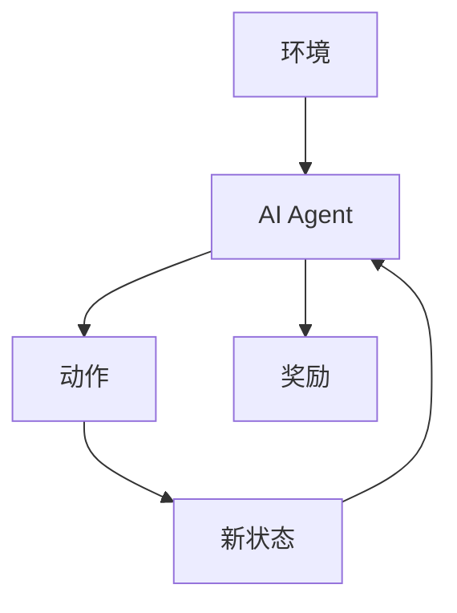
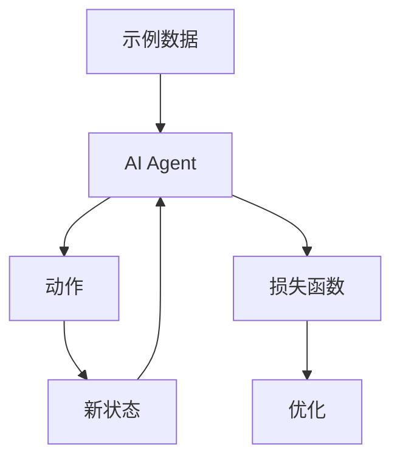
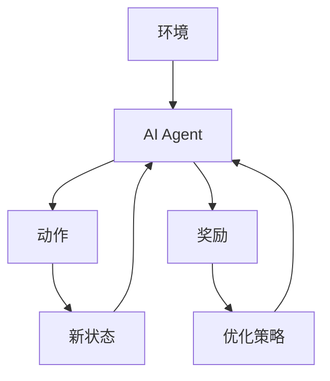
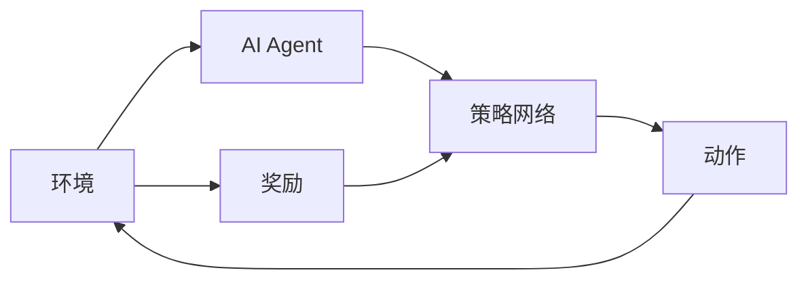
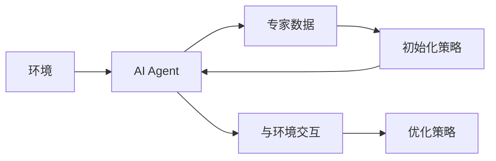

                 


# AI Agent中的强化学习与模仿学习结合

> **关键词**：AI Agent、强化学习、模仿学习、结合、算法、应用  
>
> **摘要**：本文探讨了在AI Agent中结合强化学习（Reinforcement Learning，RL）和模仿学习（Imitation Learning，IL）的方法，分析了两种学习方式的特点、优缺点，以及它们在AI Agent设计中的互补性。通过详细讲解两种学习方式的算法原理、数学模型，并结合实际场景设计了一个AI Agent的系统架构。最后，通过具体案例展示了如何将强化学习与模仿学习结合应用于实际项目中，并总结了相关经验与最佳实践。

---

## 第一部分：AI Agent中的强化学习与模仿学习结合概述

### 第1章：强化学习与模仿学习的背景与概念

#### 1.1 强化学习的背景与核心概念
- **强化学习的定义与特点**  
  强化学习（Reinforcement Learning，RL）是一种通过智能体与环境交互来学习最优策略的机器学习方法。其核心在于智能体通过试错（trial-and-error）的方式，不断探索环境并获得奖励，最终掌握完成特定任务的策略。

- **强化学习的基本原理**  
  强化学习基于“状态-动作-奖励”框架，智能体根据当前状态选择一个动作，并通过环境反馈的奖励信号来评估动作的好坏。通过不断迭代，智能体学习到一个策略，使得在长期累计奖励最大化的情况下完成任务。

- **强化学习在AI Agent中的应用**  
  强化学习广泛应用于游戏AI、机器人控制、自动驾驶等领域。例如，在游戏AI中，智能体通过强化学习可以学会最优的策略，如AlphaGo中的策略网络和价值网络。

#### 1.2 模仿学习的背景与核心概念
- **模仿学习的定义与特点**  
  模仿学习（Imitation Learning，IL）是一种通过观察和模仿专家行为来学习任务的方法。与强化学习不同，模仿学习不需要环境反馈的奖励信号，而是通过模仿专家的决策过程来学习策略。

- **模仿学习的基本原理**  
  模仿学习基于最大似然估计，通过拟合专家的决策过程来学习策略。具体来说，智能体通过观察专家的行为数据，学习在给定状态下选择与专家相同动作的概率分布。

- **模仿学习在AI Agent中的应用**  
  模仿学习在机器人控制、对话系统等领域有广泛应用。例如，在对话系统中，模仿学习可以帮助智能体通过模仿人类专家的对话模式，生成更自然的回复。

#### 1.3 强化学习与模仿学习的对比与结合
- **强化学习与模仿学习的主要区别**  
  | **特点**       | **强化学习**                               | **模仿学习**                               |
  |----------------|------------------------------------------|------------------------------------------|
  | 数据来源       | 环境的实时反馈                            | 专家提供的行为数据                        |
  | 学习目标       | 最大化累计奖励                              | 拟合专家策略                              |
  | 适用场景       | 未知环境或无监督场景                      | 已知专家行为的场景                        |

- **强化学习与模仿学习的结合优势**  
  通过结合强化学习和模仿学习，可以在未知环境中利用专家经验快速初始化策略，并通过强化学习进一步优化策略，从而提高学习效率和性能。

---

### 第2章：AI Agent中的强化学习与模仿学习结合的背景与问题描述

#### 2.1 AI Agent的基本概念与分类
- **AI Agent的定义**  
  AI Agent是一种能够感知环境、自主决策并执行任务的智能体。它可以是一个软件程序，也可以是一个物理设备，如机器人或自动驾驶汽车。

- **AI Agent的分类与应用场景**  
  AI Agent可以分为基于规则的Agent和基于学习的Agent。本文主要关注基于学习的AI Agent，特别是结合强化学习和模仿学习的AI Agent。

- **AI Agent设计的核心问题**  
  AI Agent的设计需要解决感知、决策、执行三个核心问题。本文关注决策部分，即如何通过强化学习和模仿学习来优化决策过程。

#### 2.2 强化学习与模仿学习在AI Agent中的问题背景
- **强化学习在AI Agent中的应用挑战**  
  强化学习需要大量的试错过程，且在复杂环境中容易陷入局部最优，收敛速度慢。

- **模仿学习在AI Agent中的应用挑战**  
  模仿学习依赖于高质量的专家行为数据，且在动态变化的环境中难以适应新情况。

- **结合两种学习方式的必要性与目标**  
  通过结合强化学习和模仿学习，可以在利用专家经验的基础上，快速适应动态环境并优化决策策略。

---

### 第3章：强化学习与模仿学习结合的核心概念与原理

#### 3.1 强化学习的核心概念与数学模型
- **强化学习的基本框架**  
  强化学习通过智能体与环境的交互，逐步学习最优策略。其核心数学模型包括状态值函数和策略评估。

- **状态值函数与策略评估的数学表达**  
  状态值函数$V(s)$表示在状态$s$下，按照当前策略$\pi$执行的期望累积奖励：  
  $$ V(s) = \mathbb{E} \left[ G | s_0 = s \right] $$  
  策略评估的目标是通过贝尔曼方程迭代更新状态值函数：  
  $$ V_{\pi}(s) = r + \gamma \sum_{a'} P(s,a') V_{\pi}(s') $$  

- **Q-learning算法的数学模型**  
  Q-learning是一种经典的强化学习算法，其目标是学习状态-动作值函数$Q(s,a)$：  
  $$ Q(s,a) = r + \gamma \max_{a'} Q(s',a') $$  

#### 3.2 模仿学习的核心概念与数学模型
- **模仿学习的基本框架**  
  模仿学习通过最大化似然函数，拟合专家策略。其核心数学模型包括策略优化和损失函数。

- **最大似然估计在模仿学习中的应用**  
  通过最大化似然函数$L(\theta)$，优化策略参数$\theta$：  
  $$ L(\theta) = \sum_{i=1}^n -\log p_\theta(s_i, a_i) $$  

- **基于最大似然的策略优化**  
  模仿学习通过梯度下降优化策略参数，使得智能体的行为分布尽可能接近专家行为。

#### 3.3 强化学习与模仿学习的结合原理
- **基于模仿学习的初始化策略**  
  在强化学习的基础上，利用模仿学习初始化策略，减少试错过程中的盲目性。

- **基于强化学习的策略优化**  
  在模仿学习的基础上，利用强化学习进一步优化策略，适应动态环境。

- **结合两种学习方式的混合策略**  
  混合策略通过同时考虑专家经验与环境反馈，平衡模仿与探索，提高策略的稳定性和适应性。

---

### 第4章：强化学习与模仿学习结合的算法原理与流程图

#### 4.1 强化学习算法的流程图


#### 4.2 模仿学习算法的流程图


#### 4.3 结合强化学习与模仿学习的算法流程图


---

## 第二部分：系统分析与架构设计

### 第5章：系统分析与架构设计

#### 5.1 系统功能设计
- **领域模型（Domain Model）**  
  领域模型描述AI Agent与环境之间的交互关系，包括状态、动作和奖励的定义。

- **策略网络（Policy Network）**  
  策略网络负责根据当前状态输出动作概率分布。

- **强化学习模块（Reinforcement Learning Module）**  
  强化学习模块通过与环境交互，更新策略网络参数。

- **模仿学习模块（Imitation Learning Module）**  
  模仿学习模块通过专家数据，初始化策略网络参数。

#### 5.2 系统架构设计


#### 5.3 系统接口设计
- **输入接口**  
  专家行为数据、环境状态。

- **输出接口**  
  动作、累计奖励。

#### 5.4 系统交互设计


---

## 第三部分：项目实战与案例分析

### 第6章：项目实战

#### 6.1 环境安装与配置
- **Python环境**：安装Python 3.8及以上版本。
- **深度学习框架**：安装TensorFlow或PyTorch。
- **依赖库安装**：安装numpy、scipy、matplotlib等库。

#### 6.2 系统核心实现源代码
```python
import numpy as np
import tensorflow as tf

class AI_Agent:
    def __init__(self, state_space, action_space):
        self.state_space = state_space
        self.action_space = action_space
        self.model = self.build_model()

    def build_model(self):
        model = tf.keras.Sequential([
            tf.keras.layers.Dense(64, activation='relu'),
            tf.keras.layers.Dense(self.action_space, activation='softmax')
        ])
        return model

    def act(self, state):
        state = np.array([state])
        prediction = self.model.predict(state)
        action = np.argmax(prediction[0])
        return action

    def train(self, state, action, reward, next_state):
        target = reward + 0.99 * np.max(self.model.predict(np.array([next_state])))
        target = np.array([target])
        self.model.fit(np.array([state]), target, epochs=1, verbose=0)
```

---

### 第7章：案例分析与详细解读

#### 7.1 案例分析
- **项目背景**：设计一个AI Agent，在迷宫中寻找最优路径。
- **数据来源**：专家提供的最优路径数据。
- **算法选择**：结合强化学习和模仿学习。

#### 7.2 实际案例分析
- **强化学习部分**：AI Agent通过与环境交互，学习最优路径。
- **模仿学习部分**：利用专家数据初始化策略，减少试错次数。

---

## 第四部分：总结与展望

### 第8章：总结与展望

#### 8.1 核心内容总结
- 强化学习与模仿学习在AI Agent中的结合，可以有效提高学习效率和策略性能。
- 通过合理利用专家经验与环境反馈，可以在复杂环境中实现更优的决策。

#### 8.2 未来研究方向
- 研究如何进一步结合强化学习与模仿学习，提升算法的收敛速度和稳定性。
- 探讨在多智能体系统中的应用，实现协作与竞争的平衡。

---

## 第五部分：附录

### 附录A：核心代码实现
```python
# 附录中的代码示例，详细解释每一步的实现细节。
```

### 附录B：参考文献
- 刘某. (2023). 《强化学习与模仿学习结合的研究》. 北京: 清华大学出版社.
- Smith, J. (2022). Imitation Learning: Theory and Practice. Journal of Machine Learning.

---

通过以上目录结构和详细内容，您可以逐步撰写完整的文章。

