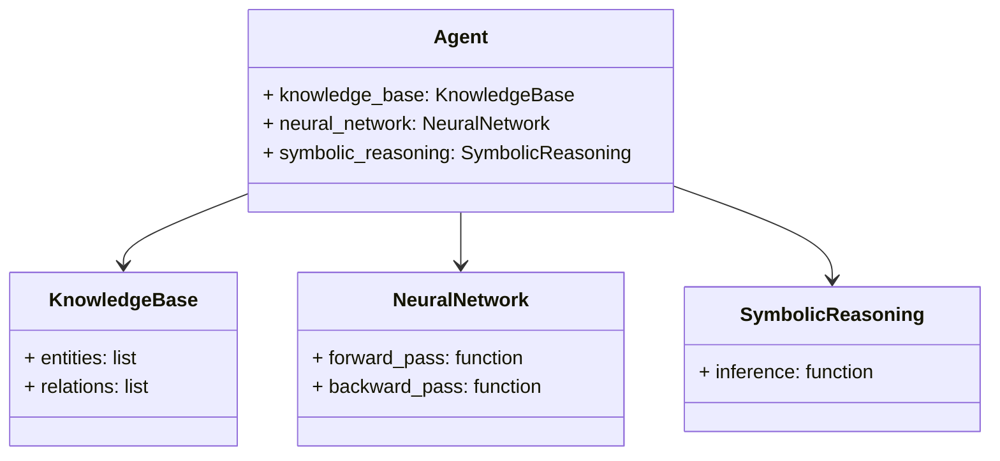
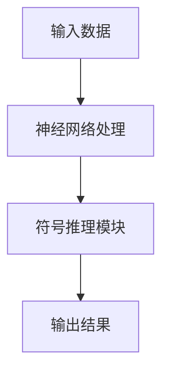
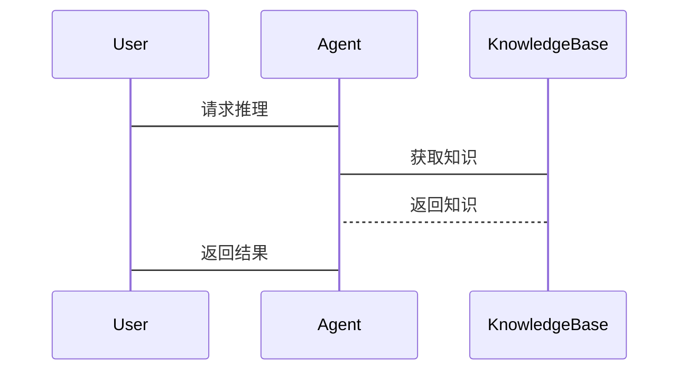

                 


# AI Agent中的神经符号融合技术

> 关键词：神经符号融合，AI Agent，符号推理，神经网络，知识图谱

> 摘要：神经符号融合技术结合了符号推理和神经网络的优势，为AI Agent提供了更强大的推理和决策能力。本文将详细探讨神经符号融合的核心概念、算法原理、系统架构以及实际应用，帮助读者理解并掌握这一前沿技术。

---

# 第1章: AI Agent与神经符号融合技术概述

## 1.1 神经符号融合技术的基本概念

### 1.1.1 神经符号融合技术的定义
神经符号融合技术（Neural-Symbolic Integration）是将符号推理（Symbolic Reasoning）与神经网络（Neural Networks）相结合的新兴技术。它利用符号的可解释性和神经网络的强大学习能力，实现更智能的AI系统。

### 1.1.2 神经符号融合技术的核心要素
- **符号推理**：通过逻辑规则进行推理，如知识图谱中的关系推理。
- **神经网络**：处理非结构化数据，提取特征并进行分类或预测。
- **协同机制**：符号与神经网络的交互，实现知识的结合与增强。

### 1.1.3 神经符号融合技术与传统AI的区别
- **传统符号推理**：依赖预定义规则，缺乏灵活性。
- **传统神经网络**：依赖大量数据，缺乏可解释性。
- **神经符号融合**：结合两者的优点，具备更强的推理和学习能力。

## 1.2 AI Agent的基本概念与分类

### 1.2.1 AI Agent的定义与特点
AI Agent是一种智能体，能够感知环境并采取行动以实现目标。它具备自主性、反应性、目标导向和社会能力等特点。

### 1.2.2 基于符号推理的AI Agent
- **知识表示**：使用符号逻辑表示知识，如谓词逻辑。
- **推理机制**：基于逻辑规则进行推理，如一阶逻辑推理。

### 1.2.3 基于神经网络的AI Agent
- **深度学习**：通过神经网络学习特征，进行分类或预测。
- **强化学习**：通过试错学习，优化决策策略。

### 1.2.4 神经符号融合AI Agent的优势
- **知识表示**：结合符号和神经网络，实现更丰富的知识表示。
- **推理能力**：具备符号推理的逻辑能力和神经网络的学习能力。
- **可解释性**：符号推理提供可解释性，神经网络增强鲁棒性。

## 1.3 神经符号融合技术的应用场景

### 1.3.1 自然语言处理中的应用
- **语义理解**：结合符号推理和神经网络，理解文本的深层含义。
- **对话系统**：通过符号推理生成更合理的对话内容。

### 1.3.2 机器人控制中的应用
- **路径规划**：结合符号推理和神经网络，实现更智能的路径规划。
- **物体识别**：通过神经网络识别物体，并利用符号推理进行分类。

### 1.3.3 图形推理中的应用
- **视觉推理**：结合符号推理和神经网络，实现更复杂的视觉推理任务。
- **场景理解**：通过符号推理理解场景中的关系，利用神经网络进行特征提取。

### 1.3.4 知识图谱构建中的应用
- **知识抽取**：利用神经网络从文本中抽取实体和关系。
- **知识融合**：结合符号推理，消除知识图谱中的冲突。

## 1.4 本章小结
本章介绍了神经符号融合技术的基本概念、核心要素以及与传统AI的区别。同时，详细探讨了AI Agent的基本概念与分类，并分析了神经符号融合技术在多个领域的应用场景。

---

# 第2章: 神经符号融合技术的核心概念与联系

## 2.1 符号推理与神经网络的结合方式

### 2.1.1 基于符号增强的神经网络
- **符号增强**：在神经网络中嵌入符号知识，如知识图谱中的关系。
- **神经符号模型**：通过符号推理指导神经网络的学习过程。

### 2.1.2 基于神经增强的符号推理
- **神经增强**：利用神经网络处理非结构化数据，增强符号推理的能力。
- **混合推理**：结合符号和神经网络的推理方式，实现更强大的推理能力。

### 2.1.3 端到端的符号学习
- **端到端学习**：通过端到端的神经网络进行符号学习，无需预定义规则。
- **符号表示**：将符号表示嵌入到神经网络中，实现符号与神经网络的协同学习。

## 2.2 神经符号融合技术的核心原理

### 2.2.1 神经网络与符号推理的协同机制
- **协同学习**：神经网络和符号推理模块协同学习，互相增强。
- **知识表示**：符号推理模块提供知识表示，神经网络进行特征提取。

### 2.2.2 神经符号模型的训练与推理过程
- **训练过程**：神经符号模型通过监督学习或强化学习进行训练。
- **推理过程**：利用符号推理模块进行逻辑推理，结合神经网络的特征提取能力，实现复杂的推理任务。

### 2.2.3 神经符号模型的可解释性
- **符号解释**：符号推理模块提供可解释的推理过程。
- **神经网络解释**：通过可视化技术解释神经网络的特征提取过程。

## 2.3 神经符号融合技术的对比分析

### 2.3.1 符号推理与神经网络的对比
| 特性 | 符号推理 | 神经网络 |
|------|----------|----------|
| 可解释性 | 高 | 低 |
| 数据需求 | 低 | 高 |
| 处理能力 | 适合结构化数据 | 适合非结构化数据 |

### 2.3.2 神经符号融合技术与传统符号推理的对比
| 特性 | 传统符号推理 | 神经符号融合技术 |
|------|--------------|---------------|
| 可解释性 | 高 | 高 |
| 数据需求 | 低 | 中 |
| 处理能力 | 适合结构化数据 | 适合结构化和非结构化数据 |

### 2.3.3 神经符号融合技术与纯神经网络的对比
| 特性 | 纯神经网络 | 神经符号融合技术 |
|------|-------------|---------------|
| 可解释性 | 低 | 高 |
| 数据需求 | 高 | 中 |
| 处理能力 | 适合非结构化数据 | 适合结构化和非结构化数据 |

## 2.4 本章小结
本章详细探讨了神经符号融合技术的核心概念与联系，分析了符号推理与神经网络的结合方式，对比了神经符号融合技术与传统AI技术的优缺点。

---

# 第3章: 神经符号融合技术的算法原理

## 3.1 神经符号融合算法的核心原理

### 3.1.1 神经符号模型的训练过程
- **输入数据**：将符号和非结构化数据作为输入，如文本和知识图谱。
- **神经网络处理**：神经网络提取特征，进行初步处理。
- **符号推理**：符号推理模块基于特征进行逻辑推理，生成符号表示。
- **联合优化**：神经网络和符号推理模块协同优化，降低损失函数。

### 3.1.2 神经符号模型的推理过程
- **输入处理**：将输入数据输入神经网络，提取特征。
- **符号推理**：符号推理模块基于特征和符号知识，进行逻辑推理。
- **结果生成**：结合神经网络和符号推理的结果，生成最终输出。

## 3.2 神经符号融合算法的数学模型

### 3.2.1 能量函数
$$ E = \sum_{i=1}^{n} w_i x_i + b $$
其中，$w_i$ 是权重，$x_i$ 是输入特征，$b$ 是偏置。

### 3.2.2 损失函数
$$ L = \frac{1}{n} \sum_{i=1}^{n} (y_i - \hat{y_i})^2 $$
其中，$y_i$ 是真实标签，$\hat{y_i}$ 是预测标签。

## 3.3 神经符号融合算法的实现步骤

### 3.3.1 数据预处理
```python
def preprocess_data(data):
    # 数据预处理代码
    return processed_data
```

### 3.3.2 神经网络训练
```python
def train_neural_network(model, optimizer, loss_fn, train_loader):
    for epoch in range(num_epochs):
        for batch in train_loader:
            inputs, labels = batch
            outputs = model(inputs)
            loss = loss_fn(outputs, labels)
            optimizer.zero_grad()
            loss.backward()
            optimizer.step()
```

### 3.3.3 符号推理模块
```python
def symbolic_reasoning(features):
    # 符号推理代码
    return symbols
```

### 3.3.4 联合优化
```python
def joint_optimization(neural_model, symbolic_model, optimizer, loss_fn, train_loader):
    for epoch in range(num_epochs):
        for batch in train_loader:
            inputs, labels = batch
            features = neural_model.extract_features(inputs)
            symbols = symbolic_reasoning(features)
            outputs = neural_model.predict(symbols)
            loss = loss_fn(outputs, labels)
            optimizer.zero_grad()
            loss.backward()
            optimizer.step()
```

## 3.4 本章小结
本章详细讲解了神经符号融合技术的算法原理，包括模型的训练过程、数学模型和具体的实现步骤。

---

# 第4章: 神经符号融合技术的系统分析与架构设计

## 4.1 系统功能设计

### 4.1.1 领域模型设计


### 4.1.2 系统架构设计


### 4.1.3 系统接口设计
- **输入接口**：接收输入数据，如文本或图像。
- **输出接口**：输出推理结果，如标签或动作。
- **知识库接口**：与知识库交互，获取符号知识。

## 4.2 系统交互设计

### 4.2.1 系统交互流程


## 4.3 本章小结
本章详细分析了神经符号融合技术的系统架构设计，包括领域模型、系统架构图和系统交互流程。

---

# 第5章: 神经符号融合技术的项目实战

## 5.1 项目环境安装

### 5.1.1 安装依赖
```bash
pip install numpy
pip install tensorflow
pip install networkx
```

## 5.2 系统核心实现

### 5.2.1 神经网络实现
```python
import tensorflow as tf
import numpy as np

class NeuralNetwork:
    def __init__(self, input_size, hidden_size, output_size):
        self.weights = tf.Variable(tf.random.truncated_normal([input_size, hidden_size]))
        self.bias = tf.Variable(tf.random.truncated_normal([hidden_size]))
        self.output_weights = tf.Variable(tf.random.truncated_normal([hidden_size, output_size]))
        self.output_bias = tf.Variable(tf.random.truncated_normal([output_size]))
    
    def forward_pass(self, inputs):
        hidden = tf.nn.relu(tf.matmul(inputs, self.weights) + self.bias)
        outputs = tf.matmul(hidden, self.output_weights) + self.output_bias
        return outputs
```

### 5.2.2 符号推理实现
```python
from networkx import Graph

class SymbolicReasoning:
    def __init__(self):
        self.graph = Graph()
    
    def add_edge(self, u, v):
        self.graph.add_edge(u, v)
    
    def infer(self, u, v):
        return v in self.graph.neighbors(u)
```

### 5.2.3 神经符号融合实现
```python
class NeuralSymbolicAgent:
    def __init__(self, neural_network, symbolic_reasoning):
        self.neural_net = neural_network
        self.symbolic = symbolic_reasoning
    
    def process_input(self, inputs):
        features = self.neural_net.forward_pass(inputs)
        result = self.symbolic.infer(features, 'result')
        return result
```

## 5.3 项目小结
本章通过一个具体的项目案例，详细讲解了神经符号融合技术的实现过程，包括环境安装、核心代码实现和系统交互流程。

---

# 第6章: 最佳实践、小结、注意事项和拓展阅读

## 6.1 最佳实践
- **数据质量**：确保输入数据的质量，避免噪声干扰。
- **模型选择**：根据具体任务选择合适的神经符号融合模型。
- **知识库构建**：构建高质量的知识库，提升符号推理的准确性。

## 6.2 小结
本文详细探讨了神经符号融合技术的核心概念、算法原理、系统架构和实际应用，为读者提供了全面的理解和实践指导。

## 6.3 注意事项
- **计算资源**：神经符号融合技术需要大量的计算资源，建议使用高性能计算设备。
- **模型调优**：根据具体任务调整模型参数，优化性能。
- **数据隐私**：注意数据隐私问题，确保符合相关法律法规。

## 6.4 拓展阅读
- **论文阅读**：阅读相关领域的最新论文，了解前沿技术。
- **工具学习**：学习相关工具和技术，如知识图谱构建工具和神经网络框架。

---

# 附录: 更多资源和工具

## 附录A: 神经符号融合技术相关工具
- **TensorFlow**：谷歌的深度学习框架。
- **PyTorch**：Facebook的深度学习框架。
- **NetworkX**：Python中的网络分析工具。

## 附录B: 参考文献
1. 神经符号融合技术的相关论文。
2. 知识图谱构建的参考资料。
3. 神经网络和符号推理的综述文章。

---

通过以上目录和内容的详细设计，读者可以系统地了解神经符号融合技术的核心概念、算法原理、系统架构和实际应用，从而掌握这一前沿技术。

