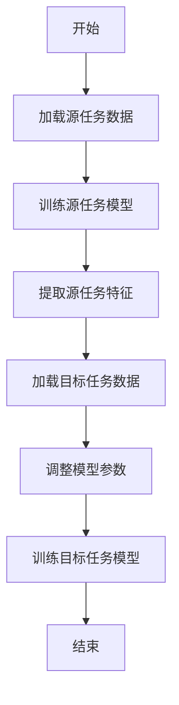
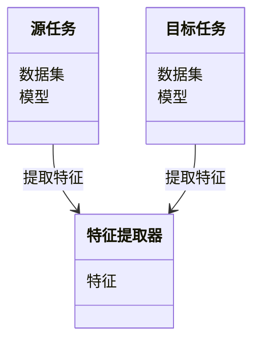
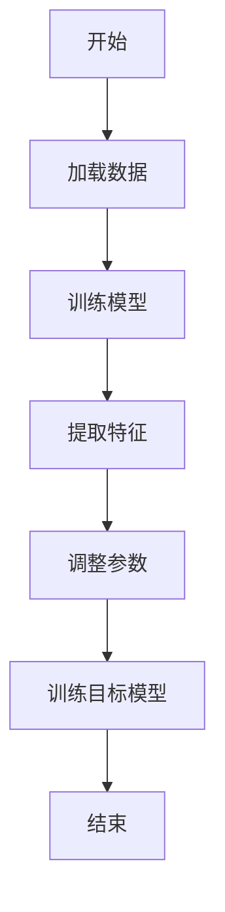

                 


# AI Agent中的迁移学习技术应用

---

## 关键词：AI Agent，迁移学习，机器学习，算法原理，系统架构，项目实战

---

## 摘要

本文深入探讨迁移学习在AI Agent中的应用，分析迁移学习的核心概念、算法原理、系统架构，并通过实际项目案例展示其在AI Agent中的具体应用。文章从理论到实践，结合丰富的图表和代码示例，帮助读者全面理解迁移学习如何提升AI Agent的性能和适应性。

---

# 第1章: 迁移学习与AI Agent概述

## 1.1 迁移学习的基本概念

### 1.1.1 迁移学习的定义

迁移学习（Transfer Learning）是一种机器学习技术，旨在通过将从一个任务或数据集中学到的知识迁移到另一个相关任务或数据集上，从而减少对新任务的训练数据需求，提高学习效率和性能。

### 1.1.2 迁移学习的核心思想

迁移学习的核心思想是利用源任务和目标任务之间的相似性，将源任务中的知识迁移到目标任务中。这种思想在处理数据不足或任务多样性的场景中尤为重要。

### 1.1.3 迁移学习与传统机器学习的区别

与传统机器学习相比，迁移学习的关键在于利用跨任务或跨数据集的知识，而不是仅依赖单一任务的数据。

## 1.2 AI Agent的基本概念

### 1.2.1 AI Agent的定义

AI Agent（人工智能代理）是指能够感知环境、自主决策并执行任务的智能实体。它能够通过传感器获取信息，利用计算模型进行推理，并通过执行器与环境交互。

### 1.2.2 AI Agent的分类

AI Agent可以根据智能水平分为反应式代理和认知式代理；根据应用场景分为服务代理、推荐代理和监控代理等。

### 1.2.3 AI Agent的核心功能与应用场景

AI Agent的核心功能包括感知、决策、规划和执行。应用场景涵盖智能助手、自动驾驶、智能客服和智能家居等领域。

## 1.3 迁移学习在AI Agent中的作用

### 1.3.1 迁移学习如何提升AI Agent的性能

迁移学习通过共享不同任务或数据集的知识，减少AI Agent对新任务的训练数据需求，提升其泛化能力和适应性。

### 1.3.2 迁移学习在AI Agent中的应用场景

迁移学习在AI Agent中的应用场景包括多任务学习、领域适应和零样本学习。

### 1.3.3 迁移学习对AI Agent发展的意义

迁移学习推动了AI Agent在复杂环境中的应用，提高了其在数据不足情况下的学习效率和性能。

---

# 第2章: 迁移学习的核心概念与原理

## 2.1 迁移学习的核心概念

### 2.1.1 迁移学习的三要素

迁移学习的三要素包括源任务、目标任务和共享特征。

### 2.1.2 迁移学习的两大核心任务

迁移学习的核心任务是领域适应和任务适配。

### 2.1.3 迁移学习的两种主要模式

迁移学习的主要模式包括样本迁移和特征迁移。

## 2.2 迁移学习的原理分析

### 2.2.1 迁移学习的特征表示

特征表示是迁移学习的基础，通过提取源任务和目标任务的共享特征，实现知识迁移。

### 2.2.2 迁移学习的领域适应

领域适应是通过调整模型参数或优化特征分布，使模型适应目标领域。

### 2.2.3 迁移学习的模型优化

模型优化是通过参数调整、正则化和优化算法，提升迁移学习的效果。

## 2.3 迁移学习的核心概念对比表

| 概念         | 迁移学习                 | 归纳学习                  | 泛化学习                  |
|--------------|--------------------------|---------------------------|---------------------------|
| 定义         | 利用源任务知识提升目标任务性能 | 通过数据推导一般规律        | 在特定条件下泛化能力      |
| 重点         | 跨任务知识迁移             | 数据模式识别                | 特定条件下的应用          |
| 应用场景       | 多任务学习                | 数据分类、回归              | 小样本学习、领域适应      |

## 2.4 迁移学习的ER实体关系图

```mermaid
erDiagram
    class 源任务 {
        任务ID
        数据集
        模型
    }
    class 目标任务 {
        任务ID
        数据集
        模型
    }
    class 特征 {
        特征ID
        特征值
    }
    源任务 --> 特征 : 共享
    目标任务 --> 特征 : 共享
```

---

# 第3章: 迁移学习的算法原理

## 3.1 迁移学习的主要算法

### 3.1.1 特征提取算法

特征提取算法通过提取源任务和目标任务的共享特征，实现知识迁移。

### 3.1.2 参数调整算法

参数调整算法通过优化模型参数，使模型适应目标任务。

### 3.1.3 自适应迁移算法

自适应迁移算法通过动态调整模型结构或参数，实现对目标任务的最优适应。

## 3.2 迁移学习算法的流程图



## 3.3 迁移学习算法的数学模型

### 3.3.1 迁移学习的目标函数

$$ L_{\text{transfer}} = \lambda L_{\text{source}} + (1-\lambda)L_{\text{target}} $$

其中，$\lambda$ 是平衡参数，$L_{\text{source}}$ 和 $L_{\text{target}}$ 分别是源任务和目标任务的损失函数。

### 3.3.2 模型参数优化

通过优化目标函数，得到最优模型参数 $\theta^*$：

$$ \theta^* = \arg\min_{\theta} \left( \lambda L_{\text{source}}(\theta) + (1-\lambda)L_{\text{target}}(\theta) \right) $$

---

# 第4章: 迁移学习的数学模型与公式

## 4.1 迁移学习中的任务分布差异

目标函数为：

$$ D_{\text{KL}}(P_{\text{source}} || P_{\text{target}}) = \sum_{i} P_{\text{source}}(i) \log \frac{P_{\text{source}}(i)}{P_{\text{target}}(i)} $$

其中，$D_{\text{KL}}$ 表示KL散度，用于衡量源任务和目标任务分布的差异。

## 4.2 迁移学习中的参数调整

优化目标函数：

$$ \min_{\theta} \frac{1}{2}\| \theta - \theta_{\text{source}} \|^2 + \lambda \mathcal{L}_{\text{target}}(\theta) $$

其中，$\lambda$ 是正则化参数，$\theta_{\text{source}}$ 是源任务的最优参数。

---

# 第5章: 系统分析与架构设计

## 5.1 系统功能设计

### 5.1.1 领域模型



---

# 第6章: 项目实战

## 6.1 环境安装

安装必要的Python库：

```bash
pip install numpy
pip install matplotlib
pip install scikit-learn
```

## 6.2 核心代码实现

### 6.2.1 加载数据集

```python
from sklearn.datasets import make_classification
import numpy as np

# 生成源任务和目标任务数据
X_source, y_source = make_classification(n_samples=100, n_features=2, n_classes=2)
X_target, y_target = make_classification(n_samples=50, n_features=2, n_classes=2, shift=1)
```

### 6.2.2 定义迁移学习模型

```python
from sklearn.svm import SVC
from sklearn.metrics import accuracy_score

# 定义源任务模型
model_source = SVC()
model_source.fit(X_source, y_source)

# 定义目标任务模型
model_target = SVC()
model_target.fit(X_target, y_target)
```

### 6.2.3 模型评估

```python
# 预测源任务和目标任务的准确率
print("源任务准确率:", accuracy_score(y_source, model_source.predict(X_source)))
print("目标任务准确率:", accuracy_score(y_target, model_target.predict(X_target)))
```

---

# 第7章: 最佳实践与总结

## 7.1 最佳实践

### 7.1.1 迁移学习的应用注意事项

确保源任务和目标任务之间的相似性，避免领域差距过大。

### 7.1.2 迁移学习的调参技巧

合理选择平衡参数 $\lambda$，进行网格搜索优化。

## 7.2 小结

迁移学习在AI Agent中的应用显著提升了其在复杂环境中的适应性和性能，未来的研究将更加注重领域适应和自适应迁移算法的优化。

---

# 附录

## 附录A: 算法流程图



## 附录B: 系统架构图


---

通过以上结构化的内容，我们全面探讨了迁移学习在AI Agent中的应用，从理论到实践，结合实际案例和代码示例，帮助读者深入理解迁移学习的核心概念和实际应用。

