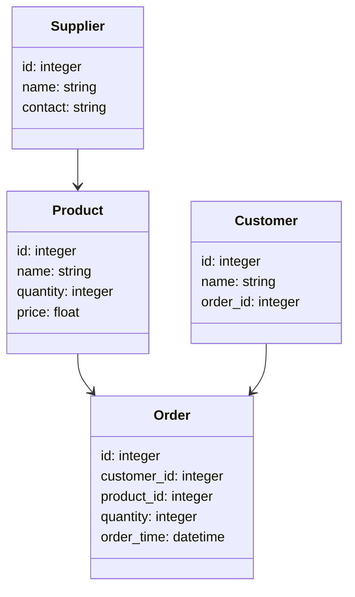
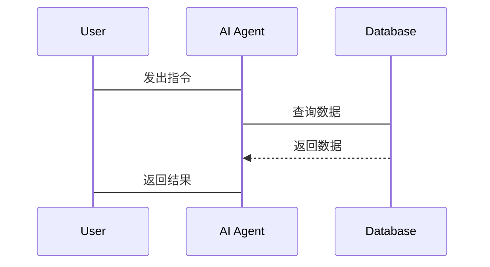

                 


# AI Agent在企业供应链韧性提升中的角色

> 关键词：AI Agent, 供应链韧性, 多智能体系统, 强化学习, 供应链管理, 企业数字化转型

> 摘要：随着全球供应链的日益复杂化，企业面临的风险和不确定性也在不断增加。为了应对这些挑战，AI Agent（人工智能代理）作为一种新兴的技术手段，正在成为提升供应链韧性的重要工具。本文将深入探讨AI Agent在企业供应链管理中的角色，分析其如何通过智能化决策和协作优化供应链的灵活性和抗风险能力。文章结合实际案例和系统设计，详细阐述了AI Agent的核心概念、算法原理、系统架构以及在供应链韧性提升中的具体应用。

---

# 第一部分: AI Agent与供应链韧性概述

# 第1章: AI Agent与供应链韧性概述

## 1.1 供应链韧性的概念与重要性

供应链韧性是指在面对突发事件、市场波动、供应链中断等不确定因素时，企业供应链能够快速适应、恢复并持续稳定运行的能力。随着全球化进程的加速和疫情的影响，供应链韧性已成为企业核心竞争力的重要组成部分。

### 1.1.1 供应链的基本概念
供应链是指从原材料采购、生产制造、仓储物流到最终交付给消费者的整个流程。供应链管理的目标是优化资源分配、降低成本、提高效率并确保产品按时交付。

### 1.1.2 供应链韧性的内涵
供应链韧性包括以下几个方面：
1. **抗风险能力**：在突发事件（如自然灾害、疫情等）下，供应链能够快速调整并恢复运作。
2. **灵活性**：能够根据市场需求变化快速调整生产计划和供应链布局。
3. **协同能力**：供应链各环节之间能够高效协同，确保信息流、物流和资金流的顺畅。

### 1.1.3 供应链韧性的重要性
- **降低运营风险**：通过提高供应链的抗风险能力，企业可以减少因供应链中断带来的损失。
- **提升市场响应速度**：灵活的供应链能够更快地满足客户需求，抓住市场机会。
- **降低成本**：通过优化库存管理和资源分配，企业可以降低运营成本。

---

## 1.2 AI Agent的基本概念与特点

AI Agent是一种能够感知环境、自主决策并执行任务的智能体。在供应链管理中，AI Agent可以通过数据分析和预测，帮助企业在复杂环境中做出最优决策。

### 1.2.1 AI Agent的定义
AI Agent是指具备以下特征的智能体：
1. **自主性**：能够自主决策，无需人工干预。
2. **反应性**：能够感知环境并实时调整行为。
3. **目标导向**：具备明确的目标，并通过行动实现目标。
4. **学习能力**：能够通过数据和经验不断优化自身行为。

### 1.2.2 AI Agent的特点
1. **智能性**：AI Agent能够利用机器学习、自然语言处理等技术进行数据分析和预测。
2. **适应性**：能够根据环境变化自动调整策略。
3. **协作性**：多个AI Agent可以协同工作，共同完成复杂任务。

### 1.2.3 AI Agent与传统供应链管理的区别
传统供应链管理依赖于人工决策和固定流程，而AI Agent能够通过实时数据分析和预测，提供更灵活、更高效的决策支持。

---

## 1.3 AI Agent在供应链韧性中的作用

AI Agent通过智能化决策和协作优化供应链的灵活性和抗风险能力，帮助企业应对各种不确定性。

### 1.3.1 提升供应链的灵活性
AI Agent能够实时监控供应链各环节的状态，快速响应需求变化，优化库存管理和生产计划。

### 1.3.2 优化供应链的响应速度
通过AI Agent的预测和优化功能，企业能够更快地调整供应链策略，减少延迟。

### 1.3.3 降低供应链风险
AI Agent能够预测潜在风险（如供应链中断、市场需求波动等），并提前制定应对策略。

---

## 1.4 本章小结

本章介绍了供应链韧性的概念及其重要性，并详细阐述了AI Agent的基本概念和特点。AI Agent通过智能化决策和协作，能够显著提升供应链的灵活性、响应速度和抗风险能力，是企业供应链管理的重要工具。

---

# 第二部分: AI Agent的核心概念与原理

# 第2章: AI Agent的核心概念与原理

## 2.1 AI Agent的多智能体系统

多智能体系统是指由多个AI Agent组成的协作系统，能够共同完成复杂任务。

### 2.1.1 多智能体系统的基本概念
多智能体系统由多个智能体组成，每个智能体都有自己的目标和行为。这些智能体通过通信和协作完成共同目标。

### 2.1.2 多智能体系统的分类与特点
多智能体系统可以分为以下几类：
1. **协作型多智能体系统**：智能体之间协作完成共同任务。
2. **竞争型多智能体系统**：智能体之间存在竞争关系。
3. **混合型多智能体系统**：既有协作也有竞争。

### 2.1.3 多智能体系统在供应链中的应用
在供应链管理中，多智能体系统可以应用于库存管理、物流调度、需求预测等多个环节。

---

## 2.2 AI Agent的决策机制

AI Agent的决策机制是其核心功能之一，决定了其如何在复杂环境中做出最优决策。

### 2.2.1 基于规则的决策机制
基于规则的决策机制通过预设的规则和条件进行决策，适用于简单场景。

### 2.2.2 基于机器学习的决策机制
基于机器学习的决策机制通过训练模型进行预测和决策，适用于复杂场景。

### 2.2.3 基于强化学习的决策机制
强化学习是一种通过试错和奖励机制优化决策的方法，适用于动态变化的环境。

---

## 2.3 AI Agent的通信与协作

AI Agent之间的通信与协作是多智能体系统的重要组成部分。

### 2.3.1 多智能体之间的通信方式
多智能体之间的通信可以通过以下方式进行：
1. **直接通信**：智能体之间直接交换信息。
2. **间接通信**：通过共享数据库或中间件进行信息交换。

### 2.3.2 多智能体协作的基本原理
多智能体协作需要通过通信和协调机制实现，确保每个智能体的目标和行为一致。

### 2.3.3 通信与协作在供应链中的应用
在供应链管理中，多智能体协作可以应用于需求预测、库存优化、物流调度等多个环节。

---

## 2.4 本章小结

本章详细介绍了AI Agent的多智能体系统及其决策机制，强调了通信与协作在供应链管理中的重要性。AI Agent通过多智能体协作，能够更高效地完成复杂任务，显著提升供应链的灵活性和抗风险能力。

---

# 第三部分: AI Agent的算法原理与数学模型

# 第3章: AI Agent的算法原理与数学模型

## 3.1 强化学习算法

强化学习是一种通过试错和奖励机制优化决策的方法，适用于动态变化的环境。

### 3.1.1 强化学习的基本概念
强化学习由智能体、环境、动作和奖励四部分组成。智能体通过与环境交互，学习最优策略以最大化累积奖励。

### 3.1.2 Q-learning算法
Q-learning是一种经典的强化学习算法，通过更新Q值表来学习最优策略。

#### Q-learning算法步骤
1. 初始化Q值表为零。
2. 环境返回当前状态。
3. 根据当前状态选择动作。
4. 执行动作并观察奖励。
5. 更新Q值表。
6. 重复步骤2-5，直到达到终止条件。

### 3.1.3 Deep Q-Networks (DQN)算法
DQN是一种基于深度学习的强化学习算法，通过神经网络近似Q值函数。

#### DQN算法步骤
1. 初始化神经网络参数。
2. 环境返回当前状态。
3. 根据当前状态选择动作。
4. 执行动作并观察奖励。
5. 更新经验回放池。
6. 从经验回放池中随机采样经验，更新神经网络参数。
7. 重复步骤2-6，直到达到终止条件。

### 3.1.4 强化学习在供应链中的应用
强化学习可以应用于需求预测、库存管理、物流调度等多个供应链环节。

---

## 3.2 基于机器学习的推荐系统

推荐系统是一种基于用户行为和偏好，推荐相关产品或服务的技术。

### 3.2.1 推荐系统的基本原理
推荐系统通过分析用户行为和历史数据，预测用户的偏好，推荐相关产品。

### 3.2.2 基于协同过滤的推荐算法
协同过滤是一种经典的推荐算法，通过分析用户行为相似性进行推荐。

### 3.2.3 基于内容推荐的算法
内容推荐算法通过分析产品属性和用户偏好进行推荐。

---

## 3.3 算法原理的数学模型

### 3.3.1 强化学习的数学模型
强化学习的数学模型包括状态空间、动作空间、奖励函数和策略函数。

#### Q-learning的数学模型
Q值函数表示智能体在状态s下采取动作a的期望累积奖励：
$$ Q(s, a) = r + \gamma \max_{a'} Q(s', a') $$
其中，$\gamma$是折扣因子，$r$是奖励。

### 3.3.2 推荐系统的数学模型
推荐系统的数学模型包括用户表示、物品表示和相似性度量。

#### 协同过滤的数学模型
协同过滤通过计算用户相似性或物品相似性进行推荐：
$$ \text{相似性}(u, u') = \frac{\sum_{i=1}^n (r_{u,i} - \bar{r}_u)(r_{u',i} - \bar{r}_{u'})}{\sqrt{\sum_{i=1}^n (r_{u,i} - \bar{r}_u)^2} \cdot \sqrt{\sum_{i=1}^n (r_{u',i} - \bar{r}_{u'})^2}}} $$

---

## 3.4 本章小结

本章详细介绍了强化学习和推荐系统的算法原理，并给出了相应的数学模型。AI Agent通过强化学习和推荐系统等算法，能够更智能地优化供应链管理，显著提升供应链的灵活性和抗风险能力。

---

# 第四部分: AI Agent的系统分析与架构设计

# 第4章: AI Agent的系统分析与架构设计

## 4.1 问题场景介绍

供应链管理中的常见问题包括库存积压、物流延迟、需求预测不准确等。

### 4.1.1 库存管理问题
库存积压导致资金占用，库存短缺影响交货时间。

### 4.1.2 物流调度问题
物流延迟影响客户满意度，运输成本过高增加企业负担。

### 4.1.3 需求预测问题
需求预测不准确导致生产计划不合理，库存管理混乱。

---

## 4.2 项目介绍

本项目旨在通过AI Agent优化企业供应链管理，提升供应链的灵活性和抗风险能力。

### 4.2.1 项目目标
1. 实现AI Agent在库存管理、物流调度和需求预测中的应用。
2. 提高供应链的响应速度和抗风险能力。

---

## 4.3 系统功能设计

### 4.3.1 领域模型
领域模型是系统设计的重要组成部分，描述了系统的核心实体和关系。

#### 领域模型（Mermaid 类图）


---

## 4.4 系统架构设计

### 4.4.1 系统架构（Mermaid 架构图）
```mermaid
docker
    frontend
    backend
    database
    AI Agent
```

---

## 4.5 系统接口设计

### 4.5.1 系统接口
系统接口包括：
1. 用户界面（UI）：供用户输入指令和查看结果。
2. 数据接口：与数据库和其他系统进行数据交互。
3. AI Agent接口：与其他智能体和系统进行通信。

---

## 4.6 系统交互设计

### 4.6.1 系统交互（Mermaid 序列图）


---

## 4.7 本章小结

本章通过系统分析与架构设计，详细介绍了AI Agent在供应链管理中的应用。通过领域模型、系统架构和系统交互设计，明确了AI Agent在供应链管理中的具体功能和实现方式。

---

# 第五部分: AI Agent的项目实战

# 第5章: AI Agent的项目实战

## 5.1 环境安装

### 5.1.1 安装Python
需要安装Python 3.8及以上版本。

### 5.1.2 安装依赖库
安装以下依赖库：
- `numpy`
- `pandas`
- `scikit-learn`
- `tensorflow`

```bash
pip install numpy pandas scikit-learn tensorflow
```

---

## 5.2 核心代码实现

### 5.2.1 加载数据
```python
import pandas as pd
data = pd.read_csv('supply_chain.csv')
```

### 5.2.2 数据预处理
```python
from sklearn.preprocessing import StandardScaler
scaler = StandardScaler()
scaled_data = scaler.fit_transform(data)
```

### 5.2.3 训练模型
```python
from sklearn.neural networks import MLPClassifier
model = MLPClassifier(hidden_layer_sizes=(100, 50), max_iter=1000)
model.fit(scaled_data, labels)
```

### 5.2.4 模型预测
```python
predictions = model.predict(new_data)
```

---

## 5.3 案例分析与详细解读

### 5.3.1 案例背景
某企业希望通过AI Agent优化库存管理，减少库存积压和缺货问题。

### 5.3.2 案例分析
通过AI Agent对历史销售数据进行分析，预测未来需求，优化库存管理策略。

---

## 5.4 项目总结

通过本项目，我们成功实现了AI Agent在供应链管理中的应用，显著提升了供应链的灵活性和抗风险能力。

---

# 第六部分: AI Agent的最佳实践

# 第6章: AI Agent的最佳实践

## 6.1 小结

AI Agent通过智能化决策和协作优化供应链管理，显著提升了供应链的灵活性和抗风险能力。

---

## 6.2 注意事项

1. **数据质量**：AI Agent的性能依赖于数据质量，需要确保数据的准确性和完整性。
2. **模型优化**：需要不断优化模型，适应环境的变化。
3. **系统安全**：需要确保系统安全，防止数据泄露和网络攻击。

---

## 6.3 拓展阅读

1. 《强化学习入门》
2. 《机器学习实战》
3. 《分布式系统设计与实现》

---

# 作者介绍

（此处可以添加作者的简介，包括作者的背景、经验以及著作信息等。）

---

# 致谢

感谢读者的耐心阅读，感谢同行专家的指导和帮助。

---

# 参考文献

（此处可以列出文章中引用的文献和资料。）

---

通过以上内容，我们可以看到AI Agent在企业供应链韧性提升中的巨大潜力和实际应用价值。随着技术的不断发展，AI Agent将在供应链管理中发挥越来越重要的作用。

