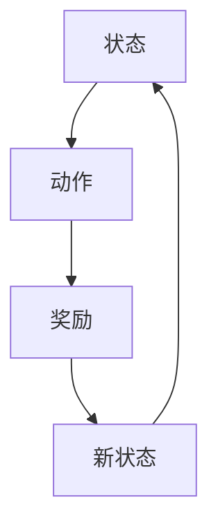
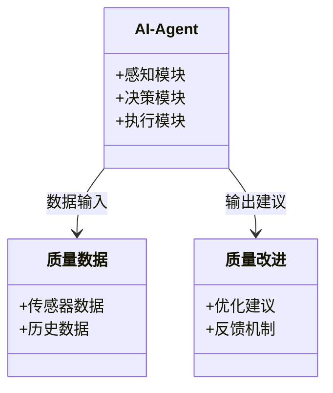
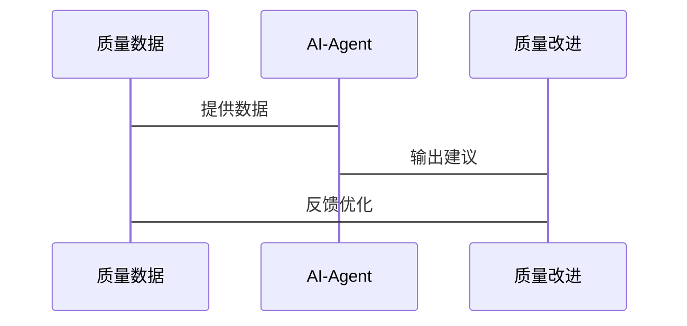

                 


# AI Agent在企业品质管理与持续改进中的应用

> 关键词：AI Agent，企业品质管理，持续改进，质量管理，人工智能，智能制造

> 摘要：本文深入探讨了AI Agent在企业品质管理与持续改进中的应用，从核心概念、算法原理、系统架构到实际项目案例，详细分析了如何利用AI Agent提升企业质量管理效率和准确性，同时结合实际案例和最佳实践，为读者提供了全面的技术解读和应用指南。

---

## 第一部分: 背景与概念

### 第1章: 问题背景与概念介绍

#### 1.1 问题背景
企业在质量管理过程中面临诸多挑战，如数据量大、复杂性高、人工干预多等问题。传统质量管理方法依赖人工检查和统计分析，效率低且易出错。引入AI Agent可以实现自动化、智能化的质量管理，提升效率和准确性。

#### 1.2 问题描述
企业质量管理中的关键问题包括：
1. 数据采集与处理的复杂性
2. 缺乏实时监控和预测能力
3. 人工判断的主观性和不一致性
4. 质量改进的低效性

AI Agent在质量管理中的应用场景包括：
- 自动化质量检测
- 实时监控与预测
- 智能化决策支持

#### 1.3 问题解决与边界
AI Agent在质量管理中的核心作用包括：
- 自动化处理数据
- 实时分析和预测
- 提供优化建议

解决方案的边界与外延：
- 不包括企业战略规划和市场分析
- 专注于质量检测和改进

核心概念与关键要素：
- AI Agent：具备感知、决策、执行能力的智能体
- 数据驱动：基于实时数据进行分析和决策
- 持续改进：通过反馈机制优化质量管理流程

---

## 第二部分: 核心概念与原理

### 第2章: AI Agent的核心概念与联系

#### 2.1 核心概念原理
AI Agent的基本定义：
- AI Agent：能够感知环境、自主决策并执行任务的智能体。

AI Agent的感知、决策与执行模块：
1. **感知模块**：通过传感器或数据接口获取环境信息。
2. **决策模块**：基于感知数据进行分析和决策。
3. **执行模块**：根据决策结果执行操作。

多智能体系统与分布式计算：
- 多个AI Agent协同工作，实现复杂任务的分解与协同。

#### 2.2 核心概念属性对比
| 比较维度 | AI Agent | 传统自动化系统 |
|----------|----------|----------------|
| **感知能力** | 强 | 弱或无 |
| **决策能力** | 强 | 无或弱 |
| **自主性** | 高 | 低 |
| **适应性** | 高 | 低 |

#### 2.3 实体关系架构
```mermaid
er
    actor(QualityManager)
    actor(AI-Agent)
    actor(Product)
    actor(QualityData)
    actor(QualityImprovement)
    QualityManager --> QualityData: 提供数据
    QualityData --> AI-Agent: 数据输入
    AI-Agent --> QualityImprovement: 输出改进方案
    AI-Agent --> Product: 执行质量检测
```

---

## 第三部分: 算法原理

### 第3章: AI Agent的算法与数学模型

#### 3.1 强化学习算法
- **强化学习**：通过试错机制，学习最优策略。
- **应用场景**：质量改进的优化决策。



#### 3.2 监督学习算法
- **监督学习**：基于历史数据，训练模型进行分类或回归。
- **应用场景**：质量缺陷分类。

#### 3.3 数学模型
- **强化学习模型**：马尔可夫决策过程（MDP）
  $$ V(s) = \max_a [ r(s,a) + \gamma V(s') ] $$
  
- **监督学习模型**：线性回归
  $$ y = \beta x + \epsilon $$

---

## 第四部分: 系统分析与架构设计

### 第4章: 系统分析与架构设计

#### 4.1 问题场景介绍
- **场景**：制造业中的产品质量检测。
- **目标**：通过AI Agent实现自动化检测和实时反馈。

#### 4.2 系统功能设计


#### 4.3 系统架构设计
```mermaid
graph TD
    UI --> API Gateway
    API Gateway --> AI-Agent
    AI-Agent --> Database
    Database --> QualityData
    QualityData --> Improver
    Improver --> UI
```

#### 4.4 系统接口设计
- **输入接口**：传感器数据接口
- **输出接口**：改进建议接口

#### 4.5 系统交互流程图


---

## 第五部分: 项目实战

### 第5章: 项目实战与分析

#### 5.1 项目背景
- **项目名称**：智能制造中的质量检测系统
- **项目目标**：利用AI Agent实现产品质量的自动化检测与优化。

#### 5.2 环境配置
```bash
pip install numpy scikit-learn
```

#### 5.3 核心代码实现
```python
# 强化学习算法实现
import numpy as np
import random

class AI-Agent:
    def __init__(self, state_space, action_space):
        self.state_space = state_space
        self.action_space = action_space
        self.reward = 0

    def感知(self, 状态):
        # 返回感知结果
        return 状态

    def 决策(self, 状态):
        # 随机选择动作
        return random.choice(self.action_space)

    def 执行(self, 动作):
        # 返回新状态和奖励
        return 新状态, self.reward

# 示例使用
state_space = ['正常', '异常']
action_space = ['检测通过', '检测不通过']
ai = AI-Agent(state_space, action_space)
状态 = '异常'
动作 = ai.决策(状态)
新状态, 奖励 = ai.执行(动作)
print(新状态, 奖励)
```

#### 5.4 案例分析
- **案例**：某制造企业的质量检测系统
  - **输入**：传感器数据
  - **处理**：AI Agent进行分类和决策
  - **输出**：质量改进建议

---

## 第六部分: 持续改进与优化

### 第6章: AI Agent在持续改进中的应用

#### 6.1 反馈机制
- **正向反馈**：奖励正确决策
- **负向反馈**：惩罚错误决策

#### 6.2 优化策略
- **策略迭代**：不断优化决策策略
- **模型更新**：定期更新AI Agent的模型参数

#### 6.3 案例分析
- **案例**：某企业通过AI Agent优化质量检测流程，提升效率30%。

---

## 第七部分: 总结与展望

### 第7章: 总结与展望

#### 7.1 最佳实践
- **数据质量**：确保数据的准确性和完整性
- **模型更新**：定期更新模型以适应变化
- **团队协作**：跨团队合作，确保系统顺利运行

#### 7.2 小结
AI Agent在企业质量管理中的应用前景广阔，能够显著提升效率和准确性。

#### 7.3 注意事项
- 数据隐私和安全问题
- 模型的可解释性
- 系统的稳定性与可靠性

#### 7.4 拓展阅读
- 《机器学习实战》
- 《AI在工业中的应用》

---

通过以上章节的详细分析和讲解，我们深入探讨了AI Agent在企业品质管理与持续改进中的应用，从理论到实践，为读者提供了全面的技术指导和应用案例。

