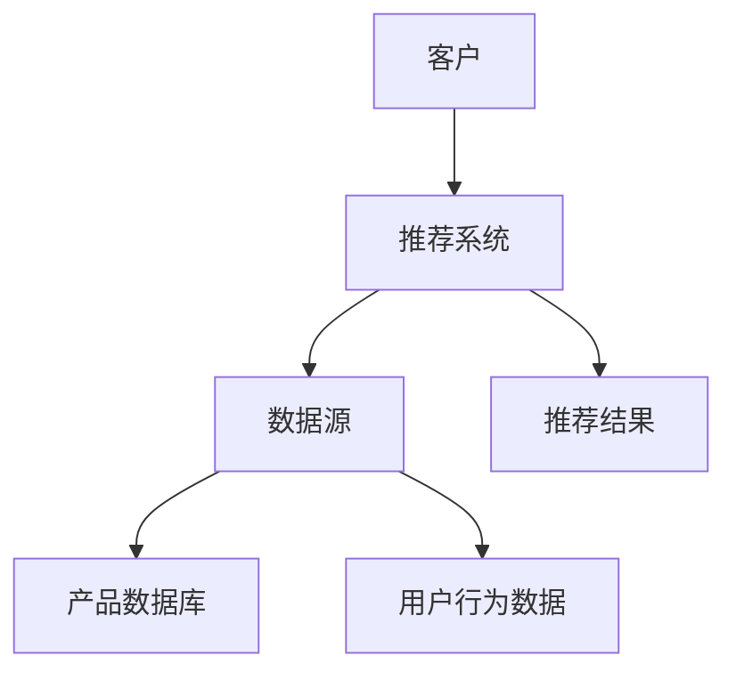
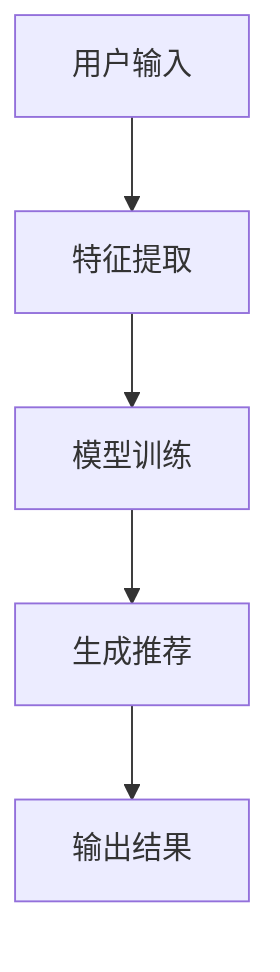
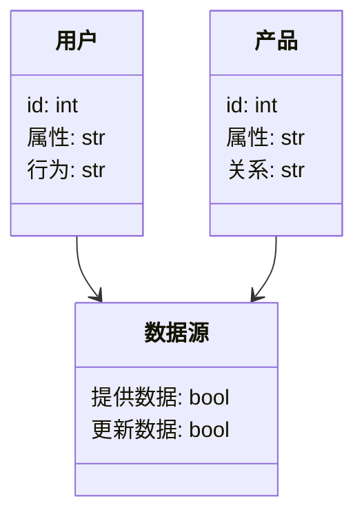
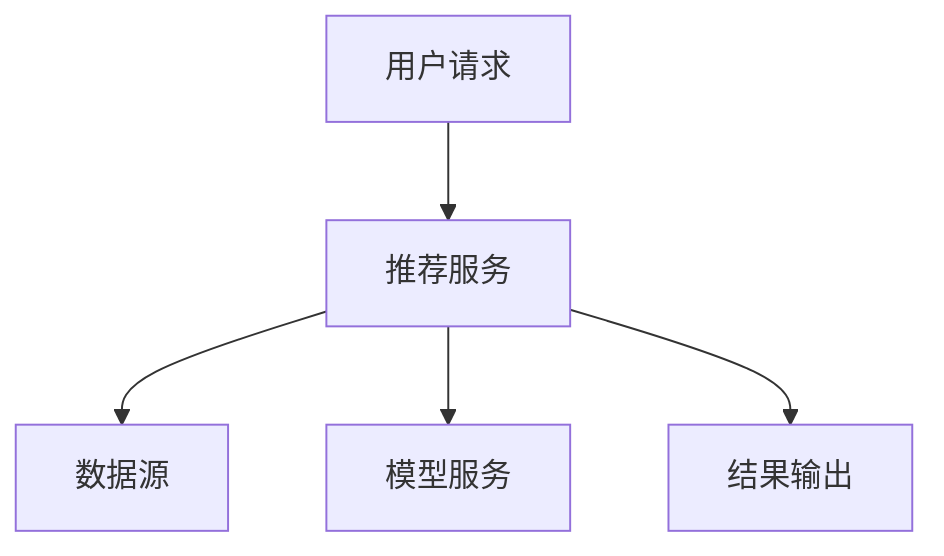

                 


# AI Agent在企业客户体验个性化推荐中的角色

## 关键词：AI Agent, 个性化推荐, 客户体验, 企业应用, 推荐系统

## 摘要：  
本文深入探讨了AI Agent在企业客户体验个性化推荐中的核心作用。通过分析AI Agent的基本概念、算法原理、系统架构以及实际应用，展示了如何利用AI技术提升客户体验。文章结合实际案例和最佳实践，详细阐述了AI Agent在推荐系统中的创新应用和未来发展方向。

---

## 第1章: 企业客户体验与个性化推荐的背景

### 1.1 问题背景  
#### 1.1.1 企业客户体验的重要性  
客户体验是企业与客户建立长期关系的关键因素，直接影响客户忠诚度和企业收益。  

#### 1.1.2 传统客户体验管理的局限性  
传统客户体验管理依赖人工操作，效率低、个性化不足，难以满足现代客户的需求。  

#### 1.1.3 个性化推荐的核心价值  
个性化推荐通过分析客户需求和行为，提供精准的产品或服务建议，提升客户满意度和转化率。  

### 1.2 AI Agent在客户体验中的角色  
#### 1.2.1 AI Agent的定义与特点  
AI Agent是一种智能代理系统，能够自主感知环境、学习客户需求并提供个性化服务。  

#### 1.2.2 AI Agent与传统推荐系统的区别  
AI Agent不仅提供推荐，还能主动与客户交互，实时调整推荐策略。  

#### 1.2.3 AI Agent的核心能力  
- 数据分析能力：从多源数据中提取客户特征。  
- 自然语言处理：理解客户需求和反馈。  
- 自主决策能力：实时优化推荐策略。  

### 1.3 本章小结  
本章介绍了企业客户体验的现状和挑战，重点阐述了AI Agent在个性化推荐中的独特优势。  

---

## 第2章: AI Agent的核心概念与原理

### 2.1 AI Agent的核心概念  
#### 2.1.1 客户行为分析  
通过收集和分析客户的行为数据，识别客户的兴趣和偏好。  

#### 2.1.2 数据驱动的推荐算法  
基于用户行为数据，利用协同过滤、深度学习等算法生成推荐结果。  

#### 2.1.3 个性化推荐模型  
构建客户画像和产品画像，建立推荐模型实现精准推荐。  

### 2.2 AI Agent的推荐机制  
#### 2.2.1 基于协同过滤的推荐  
- 用户-用户协同：相似用户的推荐。  
- 物品-物品协同：相似产品的推荐。  

#### 2.2.2 基于内容的推荐  
通过分析产品属性和用户偏好，生成个性化推荐。  

#### 2.2.3 基于强化学习的推荐  
通过强化学习优化推荐策略，提升推荐效果。  

### 2.3 AI Agent的实体关系图  


### 2.4 本章小结  
本章详细介绍了AI Agent的核心概念和推荐机制，为后续实现奠定了基础。  

---

## 第3章: AI Agent的算法原理与实现

### 3.1 推荐系统的传统算法  
#### 3.1.1 协同过滤算法  
- 基于用户的相似性进行推荐。  
- 使用余弦相似度计算用户相似度。  

#### 3.1.2 基于内容的推荐  
- 分析产品特征向量，计算相似度。  
- 使用TF-IDF提取关键词。  

### 3.2 AI Agent的推荐算法  
#### 3.2.1 基于深度学习的推荐  
- 使用神经网络模型，如DNN、CNN和RNN。  
- 示例代码：  
  ```python
  model = tf.keras.Sequential([
      tf.keras.layers.Dense(64, activation='relu'),
      tf.keras.layers.Dense(1, activation='sigmoid')
  ])
  ```

#### 3.2.2 基于强化学习的推荐  
- 使用Q-learning优化推荐策略。  
- 示例代码：  
  ```python
  def q_learning(state, action):
      return reward + γ * max(Q(next_state, action))
  ```

#### 3.2.3 基于知识图谱的推荐  
- 构建知识图谱，分析实体关系。  
- 示例代码：  
  ```python
  graph = {
      "Product": ["属性", "关系"],
      "User": ["属性", "关系"]
  }
  ```

### 3.3 算法流程图  


### 3.4 本章小结  
本章详细讲解了AI Agent的推荐算法及其实现，展示了不同算法的特点和应用场景。  

---

## 第4章: 系统分析与架构设计

### 4.1 问题场景分析  
#### 4.1.1 客户体验优化的目标  
提升客户满意度、提高转化率、增强客户忠诚度。  

#### 4.1.2 系统功能需求  
- 用户画像构建。  
- 实时推荐生成。  
- 系统监控与优化。  

### 4.2 系统架构设计  
#### 4.2.1 领域模型类图  


#### 4.2.2 系统架构图  


#### 4.2.3 系统接口设计  
- 输入接口：用户行为数据。  
- 输出接口：推荐结果。  

### 4.3 本章小结  
本章通过系统分析和架构设计，展示了AI Agent在企业推荐系统中的实现方案。  

---

## 第5章: 项目实战与案例分析

### 5.1 项目环境搭建  
#### 5.1.1 开发环境  
- Python 3.8+  
- TensorFlow 2.0+  
- 数据库：MySQL或MongoDB  

#### 5.1.2 工具安装  
```bash
pip install tensorflow pandas numpy
```

### 5.2 核心代码实现  
#### 5.2.1 用户画像构建  
```python
import pandas as pd

def build_user_profile(users):
    profile = {}
    for user in users:
        profile[user['id']] = {
            'age': user['age'],
            'interest': user['interest']
        }
    return profile
```

#### 5.2.2 推荐系统实现  
```python
def recommend(user_id, model):
    return model.predict(user_id)
```

### 5.3 案例分析  
#### 5.3.1 案例背景  
某电商企业希望利用AI Agent提升客户推荐效果。  

#### 5.3.2 实施过程  
- 数据收集与清洗。  
- 模型训练与优化。  
- 推荐结果输出与监控。  

### 5.4 项目小结  
本章通过实际案例展示了AI Agent在企业推荐系统中的应用，验证了其有效性和优势。  

---

## 第6章: 最佳实践与未来展望

### 6.1 最佳实践  
#### 6.1.1 数据质量的重要性  
确保数据的准确性和完整性。  

#### 6.1.2 模型调优的技巧  
- 参数优化。  
- 模型融合。  

### 6.2 未来展望  
AI Agent在客户体验中的应用将更加智能化和个性化，结合5G、物联网等技术，推荐系统将更加实时和精准。  

### 6.3 注意事项  
- 数据隐私保护。  
- 系统稳定性保障。  

### 6.4 拓展阅读  
- 《深度学习推荐系统》  
- 《强化学习实战》  

### 6.5 本章小结  
本章总结了AI Agent在企业推荐系统中的最佳实践，并展望了未来的发展方向。  

---

## 结语  
通过本文的系统讲解，读者可以全面了解AI Agent在企业客户体验个性化推荐中的角色和应用。希望本文能为相关从业者提供有价值的参考和启发。

