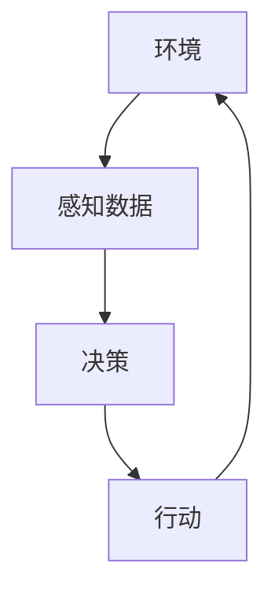
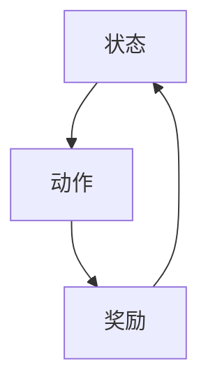
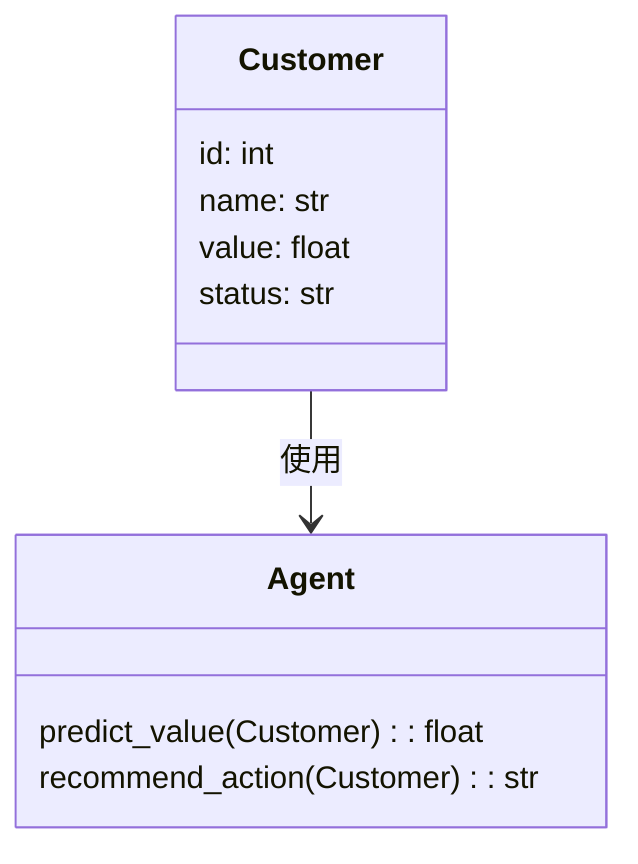
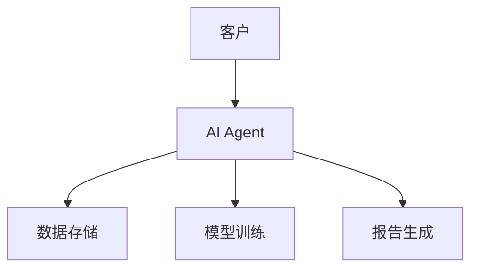

                 


# AI Agent在企业客户生命周期价值最大化中的应用

> **关键词**：AI Agent，客户生命周期，价值最大化，强化学习，客户关系管理，企业智能系统

> **摘要**：本文深入探讨了AI Agent在企业客户生命周期价值最大化中的应用，从AI Agent的核心概念、算法原理、系统架构到实际项目案例，系统性地分析了其在客户获取、维护、流失预测等关键环节中的作用。通过结合强化学习、监督学习和图神经网络等先进算法，本文提出了基于AI Agent的企业客户价值优化解决方案，并通过实际案例验证了其有效性。文章最后总结了AI Agent在企业客户管理中的最佳实践和未来发展趋势。

---

## 第1章: 企业客户生命周期与AI Agent概述

### 1.1 企业客户生命周期的定义与重要性

#### 1.1.1 客户生命周期的定义
客户生命周期（Customer Life Cycle）是指客户从初次接触企业到最终失去联系的全过程。它通常包括以下几个阶段：
1. **获取阶段**：客户首次接触到企业并产生兴趣。
2. **发展阶段**：客户与企业建立关系并逐步增加互动。
3. **成熟阶段**：客户成为企业的核心客户，贡献大部分收入。
4. **衰退阶段**：客户互动减少，最终失去联系。

#### 1.1.2 客户生命周期的阶段划分
客户生命周期的阶段划分可以帮助企业更好地理解客户行为，并制定针对性的策略。以下是常见的客户生命周期阶段划分：
1. **潜在客户**：尚未与企业发生任何互动的客户。
2. **新客户**：刚与企业建立初步联系的客户。
3. **活跃客户**：与企业保持高频互动的客户。
4. **成熟客户**：为企业创造大部分价值的核心客户。
5. **流失客户**：与企业互动减少并最终失去联系的客户。

#### 1.1.3 客户生命周期价值对企业的影响
客户生命周期价值（Customer Lifetime Value，CLV）是企业在客户生命周期中所能获得的总收入减去相关成本。企业可以通过优化客户生命周期中的各个阶段，最大化客户的生命周期价值。

---

### 1.2 AI Agent的核心概念与特点

#### 1.2.1 AI Agent的定义
AI Agent（人工智能代理）是一种能够感知环境、自主决策并采取行动的智能系统。它通过与用户或系统的交互，帮助实现特定目标。

#### 1.2.2 AI Agent的核心特点
AI Agent具有以下核心特点：
1. **自主性**：能够在没有人工干预的情况下独立运行。
2. **反应性**：能够实时感知环境并做出反应。
3. **学习能力**：通过数据和反馈不断优化自身的决策能力。
4. **适应性**：能够根据环境变化调整自身行为。

#### 1.2.3 AI Agent与传统客服系统的区别
与传统客服系统相比，AI Agent具有以下优势：
1. **24/7可用性**：AI Agent可以全天候为客户提供服务。
2. **个性化体验**：通过数据驱动的决策，AI Agent能够为客户提供个性化的服务。
3. **高效性**：AI Agent能够快速处理大量数据并做出决策。

---

### 1.3 AI Agent在客户生命周期管理中的应用前景

#### 1.3.1 AI Agent在客户获取阶段的作用
在客户获取阶段，AI Agent可以通过分析潜在客户的特征，帮助企业精准定位目标客户，并制定个性化的营销策略。

#### 1.3.2 企业采用AI Agent的优势
企业采用AI Agent可以显著提高客户管理效率，降低运营成本，并通过个性化服务提升客户满意度和忠诚度。

#### 1.3.3 AI Agent应用的挑战与机遇
尽管AI Agent在客户管理中具有巨大潜力，但其应用也面临数据隐私、技术复杂性和成本等挑战。然而，这些挑战也为技术创新和业务模式创新提供了机遇。

---

## 1.4 本章小结

本章介绍了企业客户生命周期的定义和阶段划分，并探讨了AI Agent的核心概念和特点。通过分析AI Agent在客户生命周期管理中的应用前景，我们看到了其在提升客户价值和优化企业运营中的巨大潜力。

---

## 第2章: AI Agent的核心概念与联系

### 2.1 AI Agent的原理与核心要素

#### 2.1.1 AI Agent的基本原理
AI Agent通过感知环境、分析数据、制定决策并采取行动来实现目标。其基本原理包括以下几个步骤：
1. **感知环境**：通过传感器或数据输入获取环境信息。
2. **分析数据**：利用机器学习算法对数据进行分析和理解。
3. **制定决策**：基于分析结果，生成决策方案。
4. **采取行动**：根据决策结果执行操作。

#### 2.1.2 AI Agent的核心要素组成
AI Agent的核心要素包括：
1. **感知模块**：负责数据的采集和初步处理。
2. **决策模块**：基于感知数据生成决策。
3. **行动模块**：根据决策结果执行操作。
4. **学习模块**：通过反馈不断优化自身的决策能力。

#### 2.1.3 AI Agent的实体关系图（ER图）

```mermaid
er
  actor: 客户
  agent: AI Agent
  action: 行动
  decision: 决策
  environment: 环境
  relationship: -[1..*] --> actor --| 操作 |--> action
  relationship: -[1..*] --> agent --| 决策 |--> decision
  relationship: -[1..*] --> environment --| 感知 |--> actor
```

---

### 2.2 AI Agent与客户生命周期的关联

#### 2.2.1 AI Agent在客户获取阶段的作用
在客户获取阶段，AI Agent可以通过分析潜在客户的特征，帮助企业精准定位目标客户，并制定个性化的营销策略。

#### 2.2.2 AI Agent在客户维护阶段的作用
在客户维护阶段，AI Agent可以通过分析客户的互动行为，预测客户的需求，并提供个性化的服务。

#### 2.2.3 AI Agent在客户流失预测中的应用
在客户流失预测中，AI Agent可以通过分析客户的互动数据，识别潜在的流失客户，并采取措施挽留客户。

---

### 2.3 AI Agent的核心算法与数学模型

#### 2.3.1 基于强化学习的AI Agent算法
基于强化学习的AI Agent算法通过与环境的互动，逐步优化自身的决策策略。以下是其基本流程：



#### 2.3.2 基于监督学习的客户价值预测模型
基于监督学习的客户价值预测模型通过分析客户的特征数据，预测客户的生命周期价值。

#### 2.3.3 基于图神经网络的客户关系网络分析
基于图神经网络的客户关系网络分析通过构建客户之间的关系网络，识别关键客户并优化客户关系管理。

---

## 2.4 本章小结

本章深入探讨了AI Agent的核心概念与原理，并分析了其与客户生命周期的关联。通过结合强化学习、监督学习和图神经网络等算法，AI Agent可以在客户获取、维护和流失预测等阶段发挥重要作用。

---

## 第3章: AI Agent的算法原理与数学模型

### 3.1 基于强化学习的AI Agent算法

#### 3.1.1 强化学习的基本原理
强化学习是一种通过试错方法来优化决策策略的算法。其基本原理包括以下几个步骤：
1. **环境感知**：通过与环境的互动，获取环境信息。
2. **决策选择**：基于当前状态，选择一个动作。
3. **反馈接收**：根据动作的结果，获得奖励或惩罚。
4. **策略优化**：根据反馈结果，优化决策策略。

#### 3.1.2 AI Agent在客户生命周期中的决策过程
在客户生命周期中，AI Agent可以通过强化学习算法，逐步优化客户的互动策略。

#### 3.1.3 基于Q-learning的客户价值优化算法
以下是基于Q-learning的客户价值优化算法的流程图：



---

### 3.2 基于监督学习的客户价值预测模型

#### 3.2.1 监督学习的基本原理
监督学习是一种通过训练数据学习输入与输出之间的映射关系的算法。

#### 3.2.2 客户价值预测的特征工程
客户价值预测的特征工程包括客户的 demographic features（人口统计特征）、 behavioral features（行为特征）和 transaction features（交易特征）。

#### 3.2.3 基于XGBoost的客户价值预测模型
以下是基于XGBoost的客户价值预测模型的代码示例：

```python
import xgboost as xgb

# 训练数据
train_data = xgb.DMatrix(X_train, label=y_train)

# 模型参数
params = {
    'n_estimators': 100,
    'learning_rate': 0.1,
    'max_depth': 6,
    'min_child_weight': 1,
    'gamma': 0,
    'subsample': 1,
    'colsample_bytree': 1,
    'objective': 'reg:squarederror'
}

# 训练模型
model = xgb.train(params, train_data)
```

---

### 3.3 基于图神经网络的客户关系网络分析

#### 3.3.1 图神经网络的基本原理
图神经网络是一种通过图结构数据进行学习的算法，可以有效地处理客户之间的关系网络。

#### 3.3.2 客户关系网络分析的实现
以下是基于图神经网络的客户关系网络分析的代码示例：

```python
import networkx as nx

# 构建客户关系图
G = nx.Graph()

# 添加节点
G.add_nodes_from(customers)

# 添加边
for i in range(len(edges)):
    G.add_edge(edges[i][0], edges[i][1])

# 可视化图结构
nx.draw(G, node_size=500, edge_color='red')
```

---

## 3.4 本章小结

本章详细介绍了AI Agent的核心算法与数学模型，并通过代码示例展示了其在客户价值预测和客户关系网络分析中的应用。

---

## 第4章: AI Agent的系统分析与架构设计

### 4.1 问题场景介绍

#### 4.1.1 项目背景
本项目旨在通过AI Agent优化企业客户生命周期中的各个阶段，提升客户价值。

#### 4.1.2 项目目标
项目目标包括：
1. 实现客户生命周期价值的预测。
2. 提供个性化的客户互动策略。
3. 预测并挽留潜在流失客户。

---

### 4.2 系统功能设计

#### 4.2.1 领域模型设计
以下是领域模型的类图：



---

### 4.3 系统架构设计

#### 4.3.1 系统架构图
以下是系统架构图：



---

### 4.4 系统接口设计

#### 4.4.1 API接口设计
以下是系统API接口的定义：

```python
class AI

