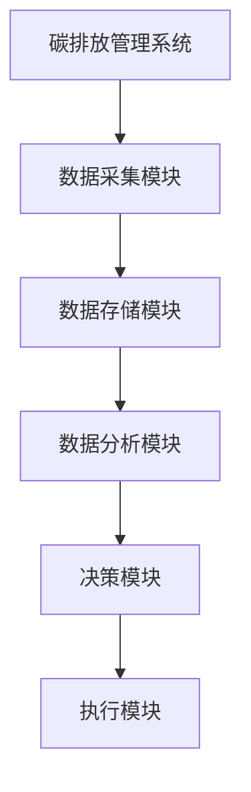
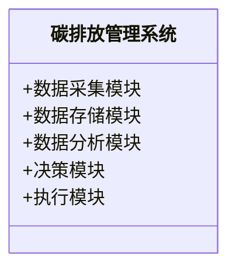
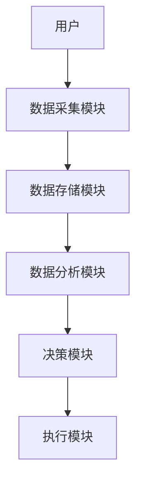

                 


# AI Agent在企业碳排放管理与环保合规中的应用

> **关键词**: AI Agent, 碳排放管理, 环保合规, 机器学习, 智能优化

> **摘要**: 本文深入探讨了AI Agent在企业碳排放管理与环保合规中的应用，从基本概念、算法原理到系统设计和项目实战，全面分析了AI Agent在碳排放预测、优化和合规管理中的潜力与实现方式。通过实际案例和代码实现，展示了AI Agent如何助力企业实现环保目标。

---

## 第1章: AI Agent的基本概念与背景

### 1.1 AI Agent的定义与特点

AI Agent（人工智能代理）是指能够感知环境、自主决策并执行任务的智能系统。与传统算法不同，AI Agent具备以下特点：

- **自主性**: 能够在没有外部干预的情况下自主运行。
- **反应性**: 能够实时感知环境并做出反应。
- **学习能力**: 通过数据和经验不断优化自身行为。

#### AI Agent与传统算法的区别

| **特性**       | **传统算法**          | **AI Agent**            |
|-----------------|----------------------|-------------------------|
| 决策方式       | 预先设定的规则        | 自主学习与优化         |
| 执行环境       | 固定场景             | 多变环境               |
| 适应能力       | 较低                 | 较高                   |

### 1.2 企业碳排放管理的背景与挑战

#### 1.2.1 碳排放管理的定义与重要性

碳排放管理是指通过监测、分析和优化企业运营中的碳排放，以减少对环境的影响。随着全球对环保的重视，企业碳排放管理已成为合规的重要部分。

#### 1.2.2 企业碳排放管理的主要挑战

- 数据复杂性: 碳排放数据来源多样，且实时性要求高。
- 合规压力: 不同地区和行业的环保法规差异大，合规难度高。
- 优化难度: 如何在降低碳排放的同时保持业务效率是核心挑战。

### 1.3 AI Agent在碳排放管理中的应用前景

#### 1.3.1 AI Agent在企业环保管理中的潜在价值

AI Agent能够通过实时数据处理、智能预测和自动化决策，帮助企业优化碳排放管理。

#### 1.3.2 企业采用AI Agent的优势

- 提高效率: 自动化处理数据，减少人工干预。
- 实时优化: 根据实时数据快速调整策略。
- 精准预测: 基于历史数据预测未来排放趋势。

#### 1.3.3 应用中的挑战与应对策略

- 数据隐私: 需要确保数据的安全性。
- 技术门槛: 需要专业团队进行系统设计和维护。

---

## 第2章: AI Agent与碳排放管理的核心概念

### 2.1 AI Agent的核心原理

AI Agent通过感知环境、学习优化和自主决策实现碳排放管理。

#### AI Agent的基本工作原理

1. **感知环境**: 通过传感器或API获取碳排放数据。
2. **分析数据**: 利用机器学习算法进行预测和分类。
3. **决策与执行**: 根据分析结果生成优化方案并执行。

### 2.2 碳排放管理的系统模型

#### 2.2.1 碳排放管理的系统架构



#### 2.2.2 碳排放数据的采集与处理

碳排放数据来源包括能源消耗数据、运输数据、生产过程数据等。

#### 2.2.3 碳排放分析的指标体系

主要指标包括碳排放强度、碳排放总量、单位产品碳排放等。

### 2.3 AI Agent在碳排放管理中的角色与功能

#### 2.3.1 数据采集与处理

AI Agent通过传感器或API实时采集碳排放数据，并进行清洗和预处理。

#### 2.3.2 智能分析与预测

利用机器学习算法对碳排放数据进行预测和分类，识别潜在的超标风险。

#### 2.3.3 自动化决策与执行

基于分析结果，AI Agent自动生成优化方案并执行，如调整设备运行参数。

---

## 第3章: AI Agent的算法原理与数学模型

### 3.1 AI Agent的核心算法

#### 3.1.1 机器学习算法

常用的机器学习算法包括线性回归、随机森林、神经网络等。

#### 3.1.2 自然语言处理算法

用于处理文本数据，如环保法规的自动识别。

#### 3.1.3 强化学习算法

通过奖励机制优化决策过程。

### 3.2 碳排放管理的数学模型

#### 3.2.1 碳排放预测模型

使用时间序列模型（如ARIMA）预测未来碳排放量。

$$ ARIMA(p, d, q) $$

#### 3.2.2 碳排放优化模型

基于线性规划或非线性规划模型优化碳排放。

$$ \text{minimize } \sum_{i=1}^{n} x_i \text{ subject to } \sum_{i=1}^{n} a_i x_i \leq C $$

---

## 第4章: 系统分析与架构设计

### 4.1 系统功能设计

#### 4.1.1 领域模型



#### 4.1.2 系统架构



### 4.2 系统接口设计

- 数据接口: 与传感器或数据库对接。
- 用户接口: 提供可视化界面供用户查看和管理。

---

## 第5章: 项目实战

### 5.1 环境安装

安装Python、机器学习库（如scikit-learn、TensorFlow）和可视化工具（如Matplotlib）。

### 5.2 核心代码实现

```python
import numpy as np
from sklearn.linear_model import LinearRegression

# 示例数据
X = np.array([[1], [2], [3], [4], [5]])
y = np.array([2, 4, 5, 4, 6])

# 模型训练
model = LinearRegression()
model.fit(X, y)

# 预测
print(model.predict([[6]]))  # 输出：[[7.5]]
```

### 5.3 案例分析

以某制造企业为例，通过AI Agent优化能源消耗，降低碳排放。

---

## 第6章: 总结与展望

### 6.1 总结

AI Agent在企业碳排放管理中具有巨大潜力，能够帮助企业实现高效、智能的环保合规。

### 6.2 展望

未来，随着AI技术的进步，AI Agent在环保领域的应用将更加广泛和深入。

---

## 参考文献

1. 《机器学习实战》
2. 《Python机器学习》
3. 《碳排放管理与优化》

---

通过以上内容，我们全面探讨了AI Agent在企业碳排放管理与环保合规中的应用，从理论到实践，为企业实现绿色可持续发展提供了有力的技术支持。

