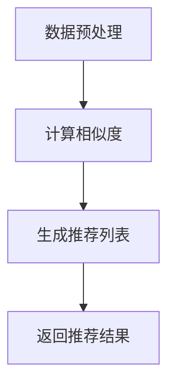
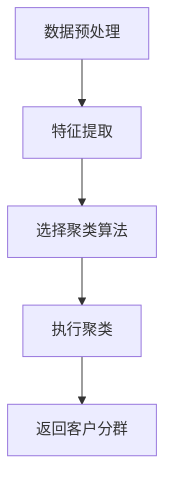
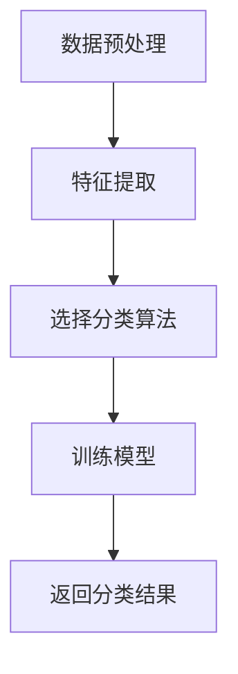
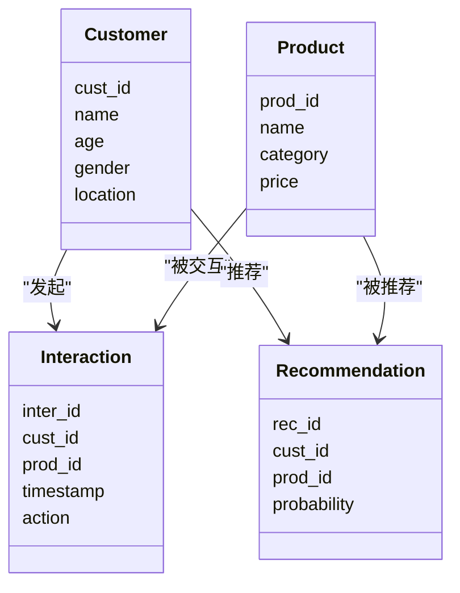
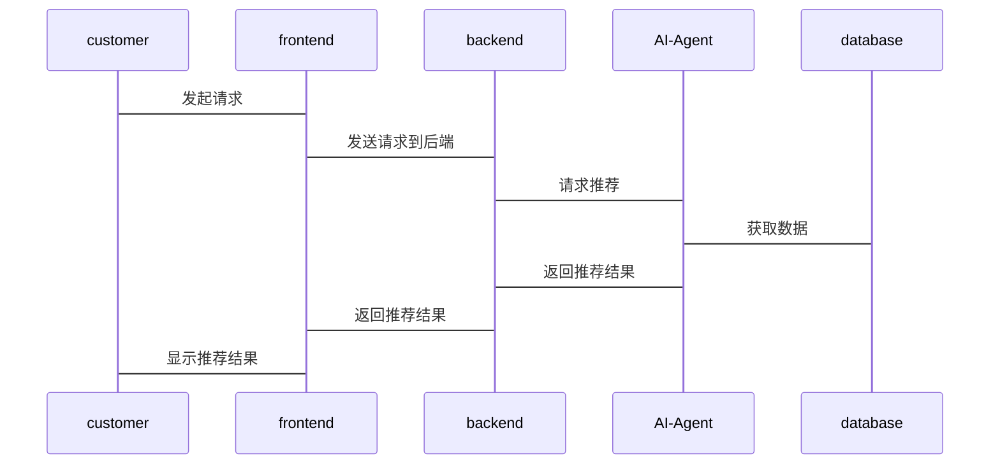

                 


# AI Agent在企业精准营销策略制定中的数据驱动应用

> 关键词：AI Agent，企业精准营销，数据驱动，机器学习算法，营销策略

> 摘要：本文详细探讨了AI Agent在企业精准营销中的应用，通过数据驱动的方法，分析了AI Agent如何优化营销策略，提高营销效率。文章从背景介绍、核心概念、算法原理、系统架构设计到项目实战，全面解析了AI Agent在精准营销中的作用和实现方法。

---

# 正文

## 第一部分：AI Agent与企业精准营销背景介绍

### 第1章：问题背景与问题描述

#### 1.1 问题背景
企业营销的核心目标是通过有效的方式吸引和留住客户，从而实现销售增长和品牌价值提升。然而，传统营销模式面临诸多痛点，例如：
- **目标客户不精准**：传统营销方式往往基于粗放的市场划分，难以精准定位目标客户。
- **数据利用效率低**：企业积累了大量的客户数据，但缺乏有效的工具和方法来利用这些数据优化营销策略。
- **营销成本高**：传统营销方式往往需要大量的人力和物力投入，且效果难以量化。

AI Agent的出现为企业解决这些问题提供了新的可能性。AI Agent（人工智能代理）是一种能够自主感知环境、执行任务并优化决策的智能系统。通过结合机器学习算法和大数据分析，AI Agent能够帮助企业实现精准营销，降低营销成本，提高营销效率。

#### 1.2 问题描述
精准营销的核心目标是通过数据分析和客户行为预测，制定个性化的营销策略，以满足客户需求并提高转化率。然而，实现这一目标需要解决以下问题：
- **数据孤岛**：企业内部的数据分散在不同的系统中，缺乏统一的数据源和分析工具。
- **决策滞后**：传统营销模式依赖于历史数据和人工分析，难以实时响应市场变化。
- **客户画像不完整**：缺乏对客户行为和偏好的深度分析，导致营销策略缺乏针对性。

AI Agent通过整合企业内外部数据，利用机器学习算法实时分析客户行为，优化营销策略，从而解决上述问题。

#### 1.3 问题解决
AI Agent在精准营销中的应用主要体现在以下几个方面：
1. **客户画像构建**：通过整合多源数据，构建客户的360度画像，帮助企业更全面地了解客户需求。
2. **个性化推荐**：基于客户画像和行为分析，AI Agent能够实时推荐个性化的产品和服务，提高客户转化率。
3. **实时反馈与优化**：AI Agent能够实时监控营销活动的效果，根据反馈优化营销策略，提高营销效率。

#### 1.4 边界与外延
AI Agent在营销中的应用边界主要在于其数据来源和算法能力。AI Agent需要依赖高质量的数据和先进的算法才能发挥其潜力。此外，AI Agent的应用还需要与企业的业务流程和组织结构相结合，才能实现真正的价值。

精准营销的外延则包括了从数据采集、分析到策略制定的整个过程。通过AI Agent的赋能，精准营销将更加智能化和个性化。

#### 1.5 概念结构与核心要素
AI Agent在精准营销中的系统架构主要包括以下几个核心要素：
1. **数据源**：包括客户数据、市场数据、产品数据等。
2. **数据处理**：包括数据清洗、特征提取和数据建模。
3. **AI Agent**：包括感知模块、决策模块和执行模块。
4. **营销策略**：包括客户分层、个性化推荐和实时优化。

通过这些核心要素的协同工作，AI Agent能够实现精准营销的目标。

## 第2章：核心概念与联系

### 2.1 AI Agent的核心原理
AI Agent的核心原理在于其能够自主感知环境、学习和优化决策。AI Agent通过数据处理、模型训练和策略执行，实现对营销活动的智能化管理。

#### 2.1.1 AI Agent的分类与特点
AI Agent可以根据其智能水平分为以下几类：
1. **反应式AI Agent**：基于当前输入做出反应，适用于简单的决策任务。
2. **认知式AI Agent**：具备学习和推理能力，能够处理复杂的决策任务。
3. **混合式AI Agent**：结合反应式和认知式的特点，适用于复杂的营销场景。

### 2.2 精准营销的核心要素
精准营销的核心要素包括客户画像、个性化推荐和实时反馈。通过这些要素的协同作用，企业能够制定出更有效的营销策略。

#### 2.2.1 客户画像
客户画像是通过对客户数据的分析，构建出客户的行为和偏好模型。客户画像的构建需要结合客户的 demographic（人口统计信息）、psychographic（心理特征）和 behavioral（行为特征）数据。

#### 2.2.2 个性化推荐
个性化推荐是基于客户画像和历史行为数据，通过机器学习算法推荐个性化的产品或服务。个性化推荐的核心在于准确预测客户的需求和偏好。

#### 2.2.3 实时反馈
实时反馈是指在营销活动进行过程中，实时监控客户反馈和市场反应，根据反馈结果优化营销策略。

### 2.3 AI Agent与精准营销的关系
AI Agent通过数据驱动的方式，优化精准营销的各个环节。AI Agent能够实时分析客户行为，动态调整营销策略，从而提高营销效果。

#### 2.3.1 数据驱动决策
数据驱动决策是AI Agent在精准营销中的核心优势。通过分析海量数据，AI Agent能够发现数据中的潜在规律，帮助企业在复杂的市场环境中做出最优决策。

#### 2.3.2 实时优化
AI Agent能够实时监控营销活动的效果，并根据反馈结果优化营销策略。这使得企业能够快速响应市场变化，提高营销效率。

### 2.4 核心概念的属性对比
以下是AI Agent和精准营销的核心概念对比：

| 比较维度 | AI Agent | 精准营销 |
|----------|-----------|----------|
| 核心目标 | 优化决策过程 | 提高营销效果 |
| 数据来源 | 多源异构数据 | 客户行为数据 |
| 决策方式 | 自主学习与优化 | 个性化推荐与实时反馈 |

### 2.5 ER实体关系图
以下是AI Agent在精准营销中的ER实体关系图：

```mermaid
erDiagram
    customer[CUSTOMER] {
        cust_id : integer
        name : string
        age : integer
        gender : string
        location : string
    }
    product(PRODUCT) {
        prod_id : integer
        name : string
        category : string
        price : integer
    }
    interaction(INTERACTION) {
        inter_id : integer
        cust_id : integer
        prod_id : integer
        timestamp : datetime
        action : string
    }
    recommendation(RECOMMENDATION) {
        rec_id : integer
        cust_id : integer
        prod_id : integer
        probability : float
    }
    customer --> interaction : "发起"
    product --> interaction : "被交互"
    customer --> recommendation : "推荐"
    product --> recommendation : "被推荐"
```

## 第3章：算法原理讲解

### 3.1 AI Agent的核心算法
AI Agent在精准营销中的应用涉及多种算法，以下是几种常见的算法：

#### 3.1.1 协同过滤算法
协同过滤是一种基于用户行为相似性推荐算法。以下是协同过滤的实现步骤：



以下是协同过滤的相似度计算公式：

$$similarity(u, v) = \frac{\sum_{i} (r_{u,i} - \bar{r}_u)(r_{v,i} - \bar{r}_v)}{\sqrt{\sum_{i} (r_{u,i} - \bar{r}_u)^2} \cdot \sqrt{\sum_{i} (r_{v,i} - \bar{r}_v)^2}}}$$

其中，$\bar{r}_u$和$\bar{r}_v$分别是用户u和v的平均评分。

#### 3.1.2 聚类算法
聚类算法是一种基于客户行为相似性进行客户分群的算法。以下是聚类算法的实现步骤：



以下是K-means聚类算法的目标函数：

$$J = \sum_{i=1}^{k} \sum_{j=1}^{n} (x_j - c_i)^2$$

其中，$k$是聚类数，$c_i$是第i个聚类的中心，$x_j$是数据点。

#### 3.1.3 分类算法
分类算法是一种基于客户行为数据预测客户类别或标签的算法。以下是分类算法的实现步骤：



以下是逻辑回归算法的损失函数：

$$L = -\frac{1}{m} \sum_{i=1}^{m} [y_i \cdot \ln(h(x_i)) + (1 - y_i) \cdot \ln(1 - h(x_i))]$$

其中，$h(x_i) = \frac{1}{1 + e^{-w \cdot x_i}}$。

## 第4章：系统架构设计

### 4.1 问题场景介绍
在企业精准营销中，AI Agent需要整合多源数据，构建客户画像，实时推荐个性化产品和服务，并动态优化营销策略。

### 4.2 系统功能设计
以下是系统功能设计的领域模型：



### 4.3 系统架构设计
以下是系统架构设计的架构图：

```mermaid
docker
    frontend
    backend
    database
    AI-Agent
    [数据源]
    frontend --> backend : 请求
    backend --> database : 查询数据
    backend --> AI-Agent : 请求推荐
    AI-Agent --> database : 获取数据
    AI-Agent --> frontend : 返回推荐结果
```

### 4.4 系统接口设计
以下是系统接口设计的交互流程：



## 第5章：项目实战

### 5.1 环境安装
以下是项目实战的环境安装步骤：

1. **安装Python**：确保安装Python 3.8或更高版本。
2. **安装依赖库**：使用pip安装以下依赖库：
   - numpy
   - pandas
   - scikit-learn
   - mermaid
   - matplotlib

### 5.2 系统核心实现

#### 5.2.1 数据预处理
以下是数据预处理的Python代码示例：

```python
import pandas as pd
import numpy as np

# 加载数据
data = pd.read_csv('data.csv')

# 去重
data.drop_duplicates(inplace=True)

# 处理缺失值
data.dropna(inplace=True)

# 转换数据类型
data['age'] = data['age'].astype(int)
```

#### 5.2.2 模型训练
以下是协同过滤算法的实现代码：

```python
from sklearn.metrics.pairwise import cosine_similarity

# 计算用户相似度矩阵
user_similarity = cosine_similarity(data)
```

#### 5.2.3 模型部署
以下是模型部署的代码示例：

```python
import numpy as np

def recommend(user_id, similarity_matrix, threshold=0.5):
    # 获取相似度大于阈值的用户
    similar_users = np.where(similarity_matrix[user_id] > threshold)[0]
    # 返回推荐结果
    return similar_users
```

### 5.3 代码应用解读与分析
通过上述代码，我们可以实现客户画像构建、个性化推荐和实时反馈功能。数据预处理步骤确保了数据质量，模型训练步骤构建了推荐算法，模型部署步骤实现了推荐功能。

### 5.4 实际案例分析
以某电商平台为例，通过AI Agent实现个性化推荐，提高客户转化率。

### 5.5 项目小结
通过本项目实战，我们掌握了AI Agent在精准营销中的核心算法和系统架构设计方法，为后续的优化和扩展奠定了基础。

## 第6章：最佳实践

### 6.1 小结
AI Agent通过数据驱动的方式，优化了企业精准营销的各个环节。通过客户画像构建、个性化推荐和实时反馈，AI Agent帮助企业实现了营销策略的智能化和个性化。

### 6.2 注意事项
在实际应用中，需要注意以下几点：
1. **数据隐私保护**：确保客户数据的安全和隐私。
2. **模型优化**：定期优化模型，确保推荐结果的准确性。
3. **用户体验**：注重用户体验，避免过度推荐。

### 6.3 拓展阅读
以下书籍和资源推荐：
1. 《机器学习实战》
2. 《数据驱动的决策》
3. 《人工智能与营销》

---

通过以上内容，我们详细探讨了AI Agent在企业精准营销中的数据驱动应用。希望本文能够为读者提供有价值的见解和实践指导。

