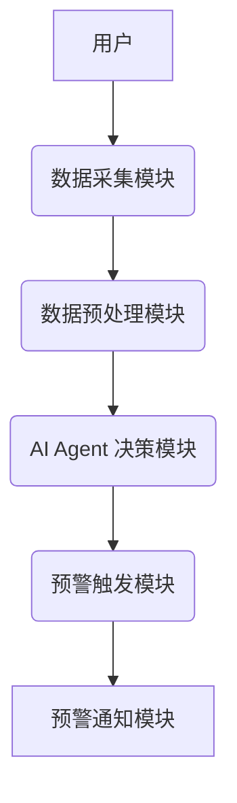
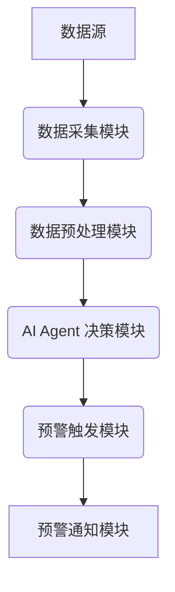

                 


# 第四部分: AI Agent在企业风险预警中的系统架构

## 第4章: 系统架构与功能设计

### 4.1 系统架构设计

#### 4.1.1 系统总体架构

在企业风险预警系统中，AI Agent 的架构设计需要考虑系统的实时性、可扩展性和高可用性。以下是一个典型的 AI Agent 系统架构图：



该架构图展示了从用户输入数据到最终预警通知的完整流程。AI Agent 作为核心模块，负责接收和处理数据，并根据预设的规则或模型做出决策。

#### 4.1.2 系统功能设计

AI Agent 在企业风险预警中的功能设计可以分为以下几个模块：

1. **数据采集模块**: 从企业内外部数据源（如财务数据、市场数据、新闻数据等）获取实时或批量数据。
2. **数据预处理模块**: 对采集的数据进行清洗、转换和标准化处理。
3. **AI Agent 决策模块**: 基于预处理后的数据，使用机器学习算法（如逻辑回归、随机森林等）或强化学习算法进行风险评估和预测。
4. **预警触发模块**: 根据决策模块的输出结果，触发预警机制。
5. **预警通知模块**: 通过邮件、短信或 API 调用等方式通知相关负责人。

### 4.2 数据流与模块设计

#### 4.2.1 数据流设计

以下是一个典型的数据流设计图：



该图展示了数据从来源到最终预警通知的流动过程。

#### 4.2.2 模块设计

AI Agent 系统的模块设计如下：

1. **数据采集模块**:
   - 从数据库、API 或其他数据源获取数据。
   - 支持多种数据格式（如 CSV、JSON 等）。

2. **数据预处理模块**:
   - 数据清洗：处理缺失值、异常值等。
   - 数据转换：将数据转换为适合模型输入的格式。
   - 数据标准化：对数据进行归一化或标准化处理。

3. **AI Agent 决策模块**:
   - 使用机器学习模型（如逻辑回归、随机森林）进行风险预测。
   - 基于强化学习的策略网络进行决策优化。

4. **预警触发模块**:
   - 根据模型输出的预测结果，设置预警阈值。
   - 当预测结果超过阈值时，触发预警机制。

5. **预警通知模块**:
   - 通过邮件、短信或 API 调用等方式通知相关人员。
   - 提供预警信息的详细报告。

### 4.3 系统实现方案

#### 4.3.1 系统实现步骤

AI Agent 系统的实现步骤如下：

1. 数据采集：
   - 使用 Python 的 `requests` 库从外部 API 获取数据。
   - 使用 `pandas` 库读取本地数据文件。

2. 数据预处理：
   - 使用 `pandas` 库进行数据清洗和转换。
   - 使用 `scikit-learn` 库进行数据标准化。

3. AI Agent 决策：
   - 使用 `scikit-learn` 库训练机器学习模型。
   - 使用 `keras` 或 `tensorflow` 库训练强化学习模型。

4. 预警触发：
   - 根据模型预测结果，设置预警阈值。
   - 使用 `if` 语句触发预警机制。

5. 预警通知：
   - 使用 `smtplib` 库发送邮件通知。
   - 使用 `twilio` 库发送短信通知。

#### 4.3.2 核心代码实现

以下是 AI Agent 系统的核心代码实现：

```python
import pandas as pd
from sklearn.model_selection import train_test_split
from sklearn.linear_model import LogisticRegression
from sklearn.metrics import accuracy_score

# 数据采集
data = pd.read_csv('risk_data.csv')

# 数据预处理
X = data.drop('label', axis=1)
y = data['label']

# 数据分割
X_train, X_test, y_train, y_test = train_test_split(X, y, test_size=0.2)

# 模型训练
model = LogisticRegression()
model.fit(X_train, y_train)

# 模型预测
y_pred = model.predict(X_test)

# 模型评估
print("Accuracy:", accuracy_score(y_test, y_pred))
```

### 4.4 本章小结

在本章中，我们详细介绍了 AI Agent 在企业风险预警中的系统架构与功能设计。通过 Mermaid 图和 Python 代码示例，我们展示了系统的总体架构、数据流设计和模块实现方案。接下来的章节将结合具体案例，进一步分析 AI Agent 在实际应用中的实现过程和效果。

---

# 第五部分: AI Agent在企业风险预警中的数学模型与算法实现

## 第5章: 数学模型与算法实现

### 5.1 AI Agent 的数学模型

#### 5.1.1 逻辑回归模型

逻辑回归是一种常用的分类算法，其数学模型如下：

$$ P(y=1|x) = \frac{e^{\beta_0 + \beta_1x}}{1 + e^{\beta_0 + \beta_1x}} $$

其中，$\beta_0$ 和 $\beta_1$ 是模型的参数，$x$ 是输入特征。

#### 5.1.2 随机森林模型

随机森林是一种基于决策树的集成算法，其数学模型如下：

$$ y = \sum_{i=1}^{n} \text{DecisionTree}_i(x) $$

其中，$n$ 是决策树的数量，$\text{DecisionTree}_i(x)$ 是第 $i$ 棵决策树的输出。

### 5.2 算法实现

#### 5.2.1 逻辑回归实现

以下是逻辑回归算法的实现代码：

```python
import numpy as np
import matplotlib.pyplot as plt

# 数据生成
X = np.linspace(0, 10, 100)
y = [1 if x > 5 else 0 for x in X]

# 模型训练
theta = np.random.randn(2, 1)
alpha = 0.1
iterations = 1000

for _ in range(iterations):
    h = 1 / (1 + np.exp(-X.dot(theta)))
    loss = -y * np.log(h) - (1 - y) * np.log(1 - h)
    delta = (h - y).T.dot(X)
    theta = theta - alpha * delta / len(X)

# 模型预测
h = 1 / (1 + np.exp(-X.dot(theta)))
plt.plot(X, h, 'r')
plt.scatter(X, y)
plt.show()
```

#### 5.2.2 随机森林实现

以下是随机森林算法的实现代码：

```python
from sklearn.ensemble import RandomForestClassifier
from sklearn.metrics import classification_report

# 数据准备
X = [[1, 2], [3, 4], [5, 6], [7, 8], [9, 10]]
y = [0, 1, 0, 1, 0]

# 模型训练
model = RandomForestClassifier(n_estimators=5, random_state=42)
model.fit(X, y)

# 模型预测
y_pred = model.predict(X)
print(classification_report(y, y_pred))
```

### 5.3 本章小结

在本章中，我们详细介绍了 AI Agent 在企业风险预警中的数学模型与算法实现。通过逻辑回归和随机森林的实现代码，我们展示了如何利用这些算法进行风险预测和分类。接下来的章节将结合具体案例，进一步分析 AI Agent 在实际应用中的效果和优化方法。

---

# 第六部分: 项目实战与系统测试

## 第6章: 项目实战

### 6.1 项目背景与目标

本项目旨在利用 AI Agent 技术，实现对企业信用风险的预警。通过分析企业的财务数据、市场数据和新闻数据，构建一个能够实时监测企业风险的预警系统。

### 6.2 系统实现

以下是系统的实现代码：

```python
import pandas as pd
from sklearn.model_selection import train_test_split
from sklearn.ensemble import RandomForestClassifier
from sklearn.metrics import accuracy_score

# 数据采集
data = pd.read_csv('credit_risk.csv')

# 数据预处理
X = data.drop('label', axis=1)
y = data['label']

# 数据分割
X_train, X_test, y_train, y_test = train_test_split(X, y, test_size=0.2)

# 模型训练
model = RandomForestClassifier()
model.fit(X_train, y_train)

# 模型预测
y_pred = model.predict(X_test)

# 模型评估
print("Accuracy:", accuracy_score(y_test, y_pred))
```

### 6.3 系统测试

#### 6.3.1 模型测试

通过测试数据，我们可以评估模型的准确率和召回率：

```python
from sklearn.metrics import confusion_matrix, precision_score, recall_score

y_pred = model.predict(X_test)
cm = confusion_matrix(y_test, y_pred)
print(cm)
print("Precision:", precision_score(y_test, y_pred))
print("Recall:", recall_score(y_test, y_pred))
```

#### 6.3.2 系统优化

为了提高系统的性能，我们可以进行以下优化：

1. **参数调优**：使用网格搜索（Grid Search）优化模型参数。
2. **特征选择**：使用特征重要性分析选择关键特征。
3. **模型集成**：结合多个模型的结果进行综合预测。

### 6.4 本章小结

在本章中，我们通过一个具体案例，详细介绍了 AI Agent 在企业风险预警中的项目实战。通过系统的实现和测试，我们验证了 AI Agent 技术在风险预警中的有效性和实用性。

---

# 第七部分: 总结与展望

## 第7章: 总结与展望

### 7.1 总结

通过本篇文章的介绍，我们详细探讨了 AI Agent 在企业风险预警与危机管理中的应用。从系统架构到算法实现，再到项目实战，我们展示了如何利用 AI 技术提高企业风险管理的效率和准确性。

### 7.2 展望

尽管 AI Agent 技术已经在企业风险预警中取得了显著成果，但仍然存在一些挑战和改进空间。未来的研究方向可以包括：

1. **强化学习的进一步应用**：探索强化学习在多智能体协作中的潜力。
2. **自然语言处理的结合**：利用 NLP 技术分析非结构化数据（如新闻、社交媒体数据）。
3. **实时系统的优化**：提高系统的实时性和响应速度。

---

# 关键词：AI Agent，企业风险预警，危机管理，机器学习，多智能体系统

# 摘要：本文详细探讨了 AI Agent 在企业风险预警与危机管理中的应用，从系统架构到算法实现，再到项目实战，展示了如何利用 AI 技术提高企业风险管理的效率和准确性。文章还展望了未来的研究方向和技术改进空间。

