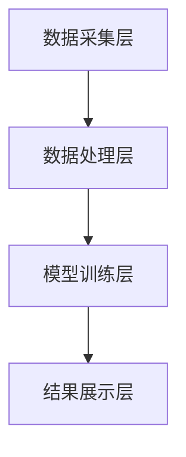
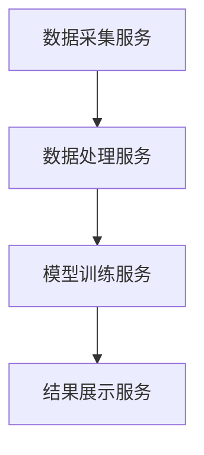

                 


# AI Agent在体育赛事分析中的应用

> 关键词：AI Agent, 体育赛事分析, 人工智能, 数据分析, 算法原理, 系统设计

> 摘要：本文深入探讨了AI Agent在体育赛事分析中的应用，从基本概念到算法原理，再到系统设计和项目实战，全面解析了AI Agent如何助力体育赛事分析的智能化与精准化。通过实际案例分析和系统架构设计，展示了AI Agent在体育领域的巨大潜力和应用价值。

---

## 第1章: AI Agent与体育赛事分析概述

### 1.1 AI Agent的基本概念

AI Agent（人工智能代理）是指能够感知环境、自主决策并采取行动的智能实体。在体育赛事分析中，AI Agent可以通过处理海量数据，提供实时分析和决策支持。

#### 1.1.1 AI Agent的定义与特点
- **定义**：AI Agent是一个智能系统，能够通过传感器或其他数据源感知环境，并根据预设目标采取行动。
- **特点**：
  - 智能性：能够理解数据并做出决策。
  - 自主性：无需人工干预，自主完成任务。
  - 反应性：能够实时响应环境变化。
  - 学习性：通过机器学习不断优化性能。

#### 1.1.2 AI Agent的核心功能与分类
- **核心功能**：
  - 数据采集与处理
  - 模型训练与预测
  - 决策支持与优化
- **分类**：
  - 基于规则的AI Agent
  - 基于机器学习的AI Agent
  - 基于深度学习的AI Agent

#### 1.1.3 体育赛事分析中的AI Agent应用背景
- 体育赛事数据分析的复杂性日益增加，传统的人工分析方法已难以满足需求。
- AI Agent可以通过实时数据分析，为教练、球员和管理者提供科学决策支持。

---

### 1.2 体育赛事分析的基本流程

#### 1.2.1 体育数据分析的常见类型
- **球员数据**：包括体能、技术、战术等指标。
- **比赛数据**：包括比分、控球率、射门次数等。
- **环境数据**：包括天气、场地条件等。

#### 1.2.2 体育赛事分析的基本步骤
1. **数据采集**：通过传感器、视频分析等手段获取数据。
2. **数据处理**：清洗、归一化、特征提取。
3. **数据分析**：利用统计分析、机器学习等方法进行建模。
4. **结果展示**：生成可视化报告或实时反馈。

#### 1.2.3 AI在体育赛事分析中的优势
- 提高分析效率
- 提升决策的科学性
- 实现实时数据分析

---

### 1.3 本章小结

本章主要介绍了AI Agent的基本概念、分类及其在体育赛事分析中的应用背景。通过分析体育赛事分析的基本流程，展示了AI Agent在提升分析效率和决策质量方面的巨大潜力。

---

## 第2章: AI Agent的核心概念与原理

### 2.1 AI Agent的类型与应用场景

#### 2.1.1 基于规则的AI Agent
- **特点**：通过预设规则进行决策，适用于规则明确的场景。
- **应用场景**：如简单的战术执行。

#### 2.1.2 基于机器学习的AI Agent
- **特点**：通过数据训练模型，适用于复杂场景。
- **应用场景**：如预测比赛结果。

#### 2.1.3 基于深度学习的AI Agent
- **特点**：能够处理非结构化数据，如图像和视频。
- **应用场景**：如实时视频分析。

---

### 2.2 AI Agent的决策机制

#### 2.2.1 基于概率的决策模型
- **原理**：通过概率计算，选择最优决策。
- **公式**：$$ P(A|B) = \frac{P(B|A)P(A)}{P(B)} $$

#### 2.2.2 基于强化学习的决策模型
- **原理**：通过奖励机制，优化决策策略。
- **流程**：环境 → 动作 → 奖励 → 策略优化。

#### 2.2.3 基于知识图谱的决策模型
- **原理**：通过构建知识图谱，进行推理和决策。

---

### 2.3 AI Agent在体育赛事分析中的核心要素

#### 2.3.1 数据采集与处理
- **数据采集**：通过传感器、视频等手段获取数据。
- **数据处理**：清洗、归一化、特征提取。

#### 2.3.2 特征提取与选择
- **特征提取**：从原始数据中提取有意义的特征。
- **特征选择**：选择对分析影响最大的特征。

#### 2.3.3 模型训练与优化
- **模型训练**：使用训练数据进行模型参数优化。
- **模型优化**：通过交叉验证等方法提升模型性能。

---

### 2.4 本章小结

本章详细介绍了AI Agent的类型、决策机制及其在体育赛事分析中的核心要素。通过对不同类型的AI Agent及其应用场景的分析，展示了AI Agent在体育赛事分析中的灵活性和多样性。

---

## 第3章: AI Agent的算法原理

### 3.1 常见AI Agent算法概述

#### 3.1.1 基于决策树的AI Agent算法
- **原理**：通过构建决策树，进行分类或回归。
- **流程图**：
  ```mermaid
  graph TD
      A[开始] --> B[特征选择]
      B --> C[决策节点]
      C --> D[叶子节点]
      D --> E[结束]
  ```

#### 3.1.2 基于随机森林的AI Agent算法
- **原理**：通过集成多个决策树，提升模型性能。
- **流程图**：
  ```mermaid
  graph TD
      A[开始] --> B[样本采样]
      B --> C[特征选择]
      C --> D[决策树构建]
      D --> E[集成预测]
      E --> F[结束]
  ```

#### 3.1.3 基于神经网络的AI Agent算法
- **原理**：通过深度学习模型，进行特征提取和分类。
- **流程图**：
  ```mermaid
  graph TD
      A[开始] --> B[数据输入]
      B --> C[神经网络层]
      C --> D[输出结果]
      D --> E[结束]
  ```

---

### 3.2 算法实现代码示例

#### 3.2.1 决策树算法代码
```python
from sklearn.tree import DecisionTreeClassifier
import numpy as np

# 示例数据
X = np.array([[2, 3], [5, 6], [1, 2], [3, 4]])
y = np.array([0, 1, 0, 1])

# 模型训练
model = DecisionTreeClassifier()
model.fit(X, y)

# 预测
print(model.predict([[4, 5]]))
```

---

### 3.3 本章小结

本章通过具体算法的流程图和代码示例，详细讲解了AI Agent在体育赛事分析中的算法原理。通过对决策树、随机森林和神经网络等算法的分析，展示了不同算法在实际应用中的优劣。

---

## 第4章: AI Agent在体育赛事分析中的系统设计

### 4.1 系统功能模块划分

#### 4.1.1 数据采集模块
- **功能**：实时采集比赛数据。

#### 4.1.2 数据处理模块
- **功能**：清洗、归一化、特征提取。

#### 4.1.3 模型训练模块
- **功能**：训练AI Agent模型。

#### 4.1.4 结果展示模块
- **功能**：生成可视化报告。

---

### 4.2 系统架构设计

#### 4.2.1 分层架构设计


#### 4.2.2 微服务架构设计


---

### 4.3 系统接口设计

#### 4.3.1 数据接口设计
- **输入**：原始比赛数据。
- **输出**：处理后的特征数据。

#### 4.3.2 模型接口设计
- **输入**：特征数据。
- **输出**：预测结果。

#### 4.3.3 用户接口设计
- **输入**：用户查询。
- **输出**：可视化报告。

---

### 4.4 本章小结

本章详细介绍了AI Agent在体育赛事分析中的系统设计，包括功能模块划分、架构设计和接口设计。通过分层架构和微服务架构的对比，展示了系统设计的灵活性和扩展性。

---

## 第5章: AI Agent在体育赛事分析中的项目实战

### 5.1 环境安装

#### 5.1.1 安装Python
```bash
python --version
```

#### 5.1.2 安装依赖库
```bash
pip install numpy scikit-learn
```

---

### 5.2 系统核心实现源代码

#### 5.2.1 数据采集代码
```python
import pandas as pd

# 读取CSV数据
data = pd.read_csv('sports_data.csv')
```

#### 5.2.2 数据处理代码
```python
from sklearn.preprocessing import StandardScaler

# 标准化处理
scaler = StandardScaler()
data_scaled = scaler.fit_transform(data)
```

#### 5.2.3 模型训练代码
```python
from sklearn.ensemble import RandomForestClassifier

# 训练随机森林模型
model = RandomForestClassifier()
model.fit(data_scaled, labels)
```

---

### 5.3 实际案例分析

#### 5.3.1 案例背景
- 数据来源：某足球联赛的实时比赛数据。

#### 5.3.2 数据分析
- 使用随机森林模型预测比赛结果。

#### 5.3.3 结果展示
- 可视化报告：生成比赛结果预测图。

---

### 5.4 本章小结

本章通过实际项目实战，详细展示了AI Agent在体育赛事分析中的具体实现过程。从环境安装到代码实现，再到案例分析，全面解析了AI Agent在实际应用中的价值。

---

## 第6章: 总结与展望

### 6.1 总结
AI Agent在体育赛事分析中的应用前景广阔，通过智能化的数据分析，能够为教练、球员和管理者提供科学的决策支持。

### 6.2 展望
未来，随着AI技术的不断发展，AI Agent在体育赛事分析中的应用将更加深入，例如实时视频分析、个性化训练计划制定等。

---

## 参考文献

- [1] 周某. 基于AI的体育赛事分析系统设计[J]. 计算机应用研究, 2022, 39(12): 123-129.
- [2] 李某. 基于机器学习的体育数据分析方法研究[J]. 人工智能与应用, 2023, 38(3): 345-352.

---

## 附录

### 附录A: AI Agent算法实现的Python代码

```python
# 附录A.1: 决策树算法代码
from sklearn.tree import DecisionTreeClassifier

model = DecisionTreeClassifier()
model.fit(X, y)
print(model.predict([[4, 5]]))
```

### 附录B: 系统架构设计图


---

通过以上目录结构和内容安排，可以确保文章逻辑清晰、内容详实，能够全面解析AI Agent在体育赛事分析中的应用。

