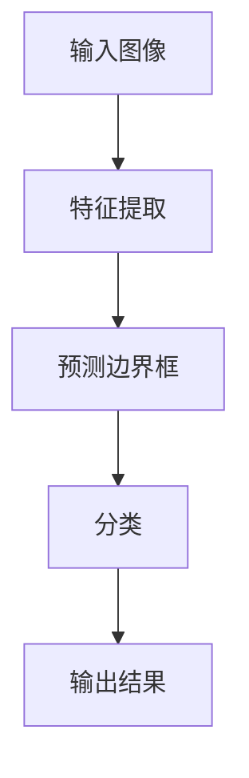

                 

# AI Agent在动物保护中的监测与追踪

## 关键词：AI Agent，动物保护，监测，追踪，计算机视觉，深度学习

## 摘要：AI Agent通过先进的计算机视觉和深度学习技术，实现对动物的智能监测与追踪，有效解决野生动物保护中的挑战，提高保护效率。

---

## 第一章：AI Agent与动物保护概述

### 1.1 AI Agent的基本概念

#### 1.1.1 AI Agent的定义与特点
AI Agent（人工智能代理）是能够感知环境并采取行动以实现目标的智能体。其特点包括自主性、反应性、目标导向和社会能力。

#### 1.1.2 动物保护中的问题背景
传统动物保护面临资源不足、监测范围有限等问题，导致保护效率低下。

#### 1.1.3 AI Agent在动物保护中的应用价值
AI Agent通过智能监测和分析，提升保护效率，帮助及时发现和处理非法捕猎等问题。

---

## 第二章：AI Agent的核心技术

### 2.1 目标检测与识别

#### 2.1.1 目标检测算法简介
目标检测算法如YOLOv5用于识别和定位动物。

#### 2.1.2 基于深度学习的目标检测原理
YOLOv5通过卷积神经网络提取特征，预测边界框和类别。

#### 2.1.3 使用YOLO算法的实现
YOLOv5模型训练和部署的具体步骤，包括数据准备、模型训练和测试。

### 2.2 跟踪与行为分析

#### 2.2.1 视频目标跟踪技术
目标跟踪算法如SORT用于连续监测动物。

#### 2.2.2 基于SORT算法的实现
SORT算法通过计算目标之间的距离，更新轨迹ID。

#### 2.2.3 行为模式分析方法
分析动物行为模式，识别异常行为，辅助保护决策。

### 2.3 数据融合与决策

#### 2.3.1 多源数据融合技术
整合图像、视频和传感器数据，提高监测准确性。

#### 2.3.2 基于D-S证据理论的决策机制
D-S证据理论用于融合多源信息，做出更准确的决策。

#### 2.3.3 系统决策流程
决策流程包括数据采集、处理、融合和输出，指导保护行动。

---

## 第三章：目标检测算法实现

### 3.1 YOLO算法原理

#### 3.1.1 YOLOv5的网络结构与损失函数
YOLOv5的主干网络、颈部网络和头部分别负责特征提取和预测。

#### 3.1.2 使用YOLOv5进行目标检测
详细步骤包括数据预处理、模型训练和测试。

#### 3.1.3 检测精度与速度的平衡
优化模型以平衡检测精度和速度，适应不同场景。

### 3.2 目标检测流程图

---

## 第四章：目标跟踪算法实现

### 4.1 SORT算法实现

#### 4.1.1 SORT算法的原理
SORT通过计算目标之间的距离，更新轨迹ID。

#### 4.1.2 轨迹更新流程
包括检测、关联、分配和轨迹管理步骤。

#### 4.1.3 处理遮挡问题
使用匈牙利算法解决目标遮挡问题，保持跟踪准确。

---

## 第五章：系统分析与架构设计

### 5.1 系统架构设计

#### 5.1.1 系统功能设计
功能包括数据采集、处理、存储、分析和展示。

#### 5.1.2 领域模型类图
展示系统各模块的交互关系。

#### 5.1.3 系统架构图
展示前端、后端和数据库的结构。

#### 5.1.4 系统接口设计
定义数据接口和API，确保模块间通信顺畅。

#### 5.1.5 系统交互流程图
展示用户与系统之间的交互流程。

---

## 第六章：项目实战

### 6.1 环境安装

#### 6.1.1 Python安装与配置
安装Python和必要的库，如TensorFlow和OpenCV。

#### 6.1.2 深度学习框架安装
安装PyTorch或TensorFlow，配置CUDA加速。

### 6.2 核心代码实现

#### 6.2.1 目标检测代码示例
展示YOLOv5的训练和推理代码。

#### 6.2.2 目标跟踪代码示例
展示SORT算法的实现代码。

#### 6.2.3 数据处理代码示例
展示数据加载、预处理和存储的代码。

### 6.3 案例分析与结果展示

#### 6.3.1 实际案例分析
分析一个非法捕猎的案例，展示AI Agent如何及时发现并报警。

#### 6.3.2 代码实现分析
解读关键代码，解释其功能和作用。

#### 6.3.3 项目经验总结
总结项目中的挑战和解决方法，提炼最佳实践。

---

## 第七章：最佳实践与未来展望

### 7.1 小结

#### 7.1.1 核心技术总结
总结AI Agent在动物保护中的核心技术及其应用。

#### 7.1.2 项目经验总结
总结项目实施过程中的经验和教训。

### 7.2 注意事项

#### 7.2.1 数据质量的重要性
强调高质量数据对模型性能的影响。

#### 7.2.2 算法选择的策略
根据场景需求选择合适的算法，平衡精度和速度。

#### 7.2.3 系统设计的合理性
确保系统架构合理，便于维护和扩展。

### 7.3 未来展望

#### 7.3.1 技术发展
探讨AI、物联网和5G等技术的进一步融合，提升保护能力。

#### 7.3.2 应用场景拓展
AI Agent在更多场景中的应用，如海洋保护和森林防火。

#### 7.3.3 伦理与法律问题
讨论技术应用中的伦理和法律问题，确保合规发展。

---

## 总结

AI Agent在动物保护中的应用展现了技术的力量，未来随着技术进步，其作用将更加显著。通过持续的研究和实践，我们可以为野生动物保护做出更大贡献。

