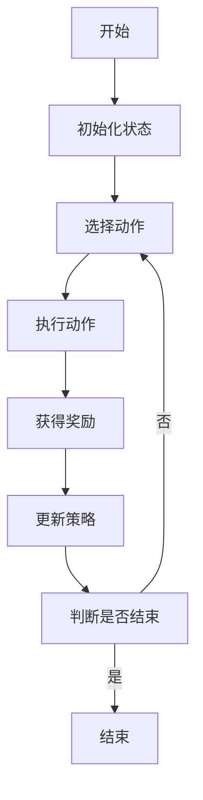
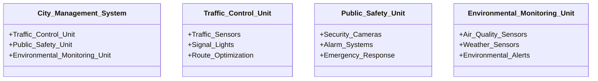
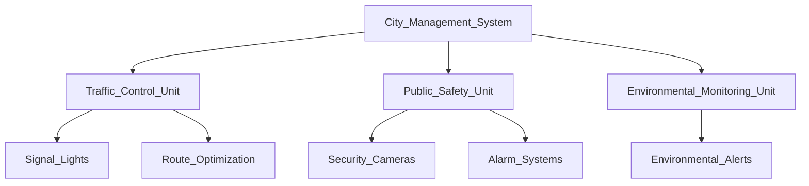
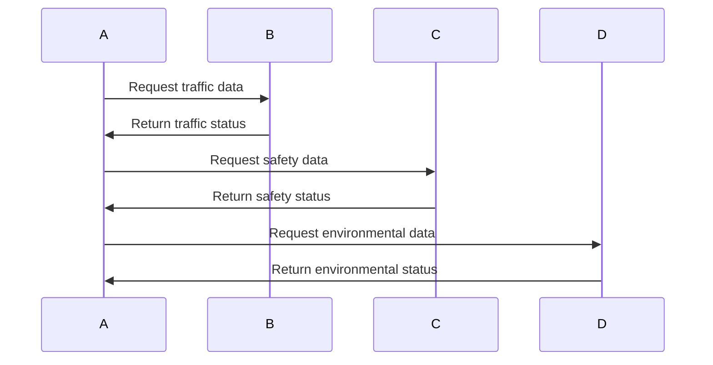

                 


# AI Agent在城市管理中的智能应用

> 关键词：人工智能（AI），智能体（Agent），城市管理，智能交通，智能公共安全，智能环境监测

> 摘要：本文探讨了AI Agent在城市管理中的智能应用，从基本概念、算法原理、系统设计到项目实战，全面分析了AI Agent在智能交通管理、公共安全和环境监测中的应用，结合具体案例，详细讲解了实现过程和注意事项。

---

# 第一部分: AI Agent的基本概念与背景

## 第1章: AI Agent的基本概念与背景

### 1.1 AI Agent的定义与特点

AI Agent，即人工智能智能体，是一种能够感知环境、自主决策并执行任务的智能系统。它具有以下特点：
- **自主性**：能够在没有外部干预的情况下自主运行。
- **反应性**：能够实时感知环境并做出反应。
- **目标导向**：通常具有明确的目标，能够为实现目标而行动。
- **学习能力**：通过机器学习算法不断优化自身性能。

### 1.2 城市管理中的问题与挑战

城市管理面临的主要问题包括交通拥堵、环境污染、公共安全事件频发等。这些问题的复杂性和不确定性使得传统的管理方法难以应对，而AI Agent凭借其智能性和自主性，为这些问题的解决提供了新的可能性。

### 1.3 AI Agent在城市管理中的应用背景

随着技术的发展，AI Agent在城市管理中的应用日益广泛。智能交通管理、智能公共安全和智能环境监测等领域都开始引入AI Agent技术，以提高管理效率和决策的准确性。

---

# 第二部分: AI Agent的核心概念与原理

## 第2章: AI Agent的核心概念与原理

### 2.1 AI Agent的基本原理

AI Agent通过感知环境、分析信息、制定决策和执行操作来完成任务。其基本流程包括：
1. **感知环境**：通过传感器或数据源获取环境信息。
2. **信息处理**：利用算法对信息进行分析和处理。
3. **决策制定**：基于处理后的信息制定行动方案。
4. **执行操作**：根据决策执行具体的操作。

### 2.2 AI Agent的类型与分类

AI Agent可以根据不同的标准进行分类，常见的分类方式包括基于智能体的类型、基于任务的类型等。以下是四种主要类型的对比：

| 类型                | 特性                | 优缺点                |
|---------------------|--------------------|-----------------------|
| 简单反射型AI Agent  | 基于规则的反应式    | 实现简单，但适应性差  |
| 基于模型的反应式AI Agent | 基于模型的推理     | 适应性强，但计算复杂 |
| 目标驱动型AI Agent  | 基于目标的规划     | 灵活性高，但实现复杂 |
| 学习驱动型AI Agent  | 基于机器学习       | 自适应性强，但需要大量数据 |

### 2.3 AI Agent在城市管理中的核心应用

AI Agent在城市管理中的主要应用包括智能交通管理、智能公共安全和智能环境监测。

---

# 第三部分: AI Agent的算法原理与实现

## 第3章: AI Agent的算法原理与实现

### 3.1 AI Agent的算法原理

AI Agent的核心算法包括强化学习和监督学习。以下是一个简单的强化学习算法流程：



### 3.2 AI Agent的实现

以下是基于强化学习的AI Agent实现的Python代码示例：

```python
import numpy as np
import gym

# 初始化环境
env = gym.make('CartPole-v0')

# 初始化策略参数
theta = np.random.randn(4, 1)

# 定义动作选择函数
def choose_action(observation, theta):
    z = np.dot(observation, theta)
    if z > 0:
        return 1
    else:
        return 0

# 定义训练循环
for episode in range(1000):
    observation = env.reset()
    total_reward = 0
    done = False
    while not done:
        action = choose_action(observation, theta)
        observation_, reward, done, info = env.step(action)
        total_reward += reward
        # 更新策略参数
        z = np.dot(observation, theta)
        delta = (reward + 0.99 * np.max(z_)) - z
        theta += alpha * delta * observation
    print(f'Episode {episode}, Reward: {total_reward}')

# 关闭环境
env.close()
```

---

# 第四部分: AI Agent的系统设计与实现

## 第4章: AI Agent的系统设计

### 4.1 问题场景介绍

以智能交通管理为例，AI Agent需要实时监控交通流量，优化信号灯控制，减少交通拥堵。

### 4.2 系统功能设计

以下是智能交通管理系统的领域模型：



### 4.3 系统架构设计

以下是系统的架构图：



### 4.4 系统接口设计

以下是系统的接口设计：



---

# 第五部分: AI Agent的项目实战

## 第5章: 项目实战

### 5.1 环境安装

安装必要的库：

```bash
pip install gym numpy matplotlib
```

### 5.2 系统核心实现

以下是智能交通管理系统的实现代码：

```python
import gym
import numpy as np

# 初始化环境
env = gym.make('CartPole-v0')

# 初始化参数
theta = np.random.randn(4, 1)
alpha = 0.1

# 定义动作选择函数
def choose_action(observation, theta):
    z = np.dot(observation, theta)
    if z > 0:
        return 1
    else:
        return 0

# 定义训练循环
for episode in range(1000):
    observation = env.reset()
    total_reward = 0
    done = False
    while not done:
        action = choose_action(observation, theta)
        observation_, reward, done, info = env.step(action)
        total_reward += reward
        # 更新策略参数
        z = np.dot(observation, theta)
        delta = (reward + 0.99 * np.max(z)) - z
        theta += alpha * delta * observation
    print(f'Episode {episode}, Reward: {total_reward}')

# 关闭环境
env.close()
```

### 5.3 代码解读与分析

该代码实现了基于强化学习的AI Agent，用于优化信号灯控制。通过不断训练，AI Agent能够找到最优的控制策略，减少交通拥堵。

### 5.4 案例分析

通过上述代码，我们可以看到AI Agent在智能交通管理中的应用潜力。通过不断优化策略参数，AI Agent能够显著提高交通管理效率。

---

# 第六部分: 总结与展望

## 第6章: 总结与展望

### 6.1 本章小结

本文详细探讨了AI Agent在城市管理中的智能应用，从基本概念到具体实现，全面分析了其在智能交通管理、公共安全和环境监测中的应用潜力。

### 6.2 最佳实践 tips

- 在实际应用中，需要根据具体场景选择合适的AI Agent类型。
- 确保数据的准确性和实时性，以提高AI Agent的决策能力。
- 定期更新和优化AI Agent的模型和参数，以适应环境的变化。

### 6.3 注意事项

- 在实际应用中，需要考虑数据隐私和安全问题。
- 确保系统的稳定性和可靠性，以应对突发情况。
- 定期进行系统维护和升级，以保持系统的高性能。

### 6.4 拓展阅读

- 《Reinforcement Learning: Theory and Algorithms》
- 《AI in Urban Planning and Management》
- 《Smart City: Technology and Applications》

---

# 结语

AI Agent在城市管理中的应用前景广阔，随着技术的不断发展，AI Agent将更加智能化和自主化，为城市管理带来更大的便利和效率提升。希望本文能够为读者提供有价值的参考和启发。

