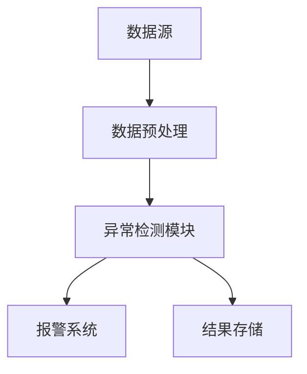
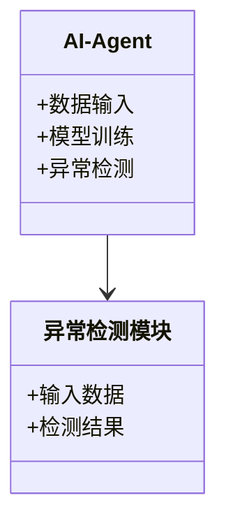

                 


# AI Agent在异常检测中的应用：识别非常规模式

## 关键词：AI Agent，异常检测，非常规模式，机器学习，深度学习，智能体

## 摘要：  
在数据驱动的世界中，异常检测是发现潜在威胁、优化流程和提高效率的关键技术。AI Agent（人工智能代理）通过其自主学习和决策能力，为异常检测提供了新的视角。本文深入探讨AI Agent在异常检测中的应用，分析其识别非常规模式的能力，结合经典算法和系统设计，提供详细的实现方案和实际案例。

---

# 第1章 异常检测的背景与挑战

## 1.1 异常检测的基本概念

### 1.1.1 什么是异常检测  
异常检测（Anomaly Detection）是识别数据中偏离预期模式或行为的过程，广泛应用于安全、金融、医疗等领域。  
**关键点**：异常检测通过分析数据分布，发现异常点，帮助识别潜在问题。

### 1.1.2 异常检测的分类  
- **基于统计的方法**：如高斯分布、马科夫链模型。  
- **基于机器学习的方法**：如支持向量机（SVM）、K-近邻（KNN）。  
- **基于深度学习的方法**：如自编码器（Autoencoder）、对抗网络（GAN）。  

### 1.1.3 异常检测的应用场景  
- 网络入侵检测。  
- 设备故障预测。  
- 金融欺诈识别。  

## 1.2 AI Agent的基本概念

### 1.2.1 什么是AI Agent  
AI Agent是能够感知环境、自主决策并采取行动的智能实体，具备学习、推理和自适应能力。  
**关键点**：AI Agent通过传感器或数据源获取信息，利用算法处理数据，执行任务。

### 1.2.2 AI Agent的核心特征  
- **自主性**：无需外部干预，自动执行任务。  
- **反应性**：实时感知环境变化并调整行为。  
- **学习能力**：通过数据训练，优化决策模型。  

### 1.2.3 AI Agent与传统算法的区别  
AI Agent不仅执行预定义规则，还能动态学习和适应环境，适用于复杂场景。

## 1.3 异常检测与AI Agent的结合

### 1.3.1 异常检测的难点  
- 数据分布复杂，异常点稀少且不明显。  
- 需要实时检测，处理大量数据流。  

### 1.3.2 AI Agent在异常检测中的优势  
- **动态学习**：适应数据分布变化，识别新兴异常模式。  
- **自主决策**：无需人工干预，实时处理异常事件。  

### 1.3.3 识别非常规模式的核心思想  
AI Agent通过深度学习和强化学习，从数据中发现隐藏模式，识别常规行为之外的异常。

---

# 第2章 异常检测的核心原理

## 2.1 异常检测的数学模型

### 2.1.1 基于统计的方法  
- **高斯分布模型**：假设正常数据服从正态分布，异常点远离均值。  
  $$ P(x) = \frac{1}{\sigma \sqrt{2\pi}} e^{-\frac{(x-\mu)^2}{2\sigma^2}} $$  
- **马科夫链模型**：分析时间序列数据，识别状态转移异常。  

### 2.1.2 基于机器学习的方法  
- **支持向量机（SVM）**：通过学习正常数据的边界，识别异常点。  
- **K-近邻（KNN）**：基于邻域密度判断异常点。  

### 2.1.3 基于深度学习的方法  
- **自编码器（Autoencoder）**：通过重建误差检测异常。  
  $$ \text{重建误差} = \|x - \hat{x}\| $$  
- **对抗网络（GAN）**：生成正常数据分布，识别异常样本。  

## 2.2 AI Agent的算法原理

### 2.2.1 基于规则的异常检测  
通过预定义规则匹配异常事件，适用于已知异常模式。  

### 2.2.2 基于聚类的异常检测  
将数据聚类，异常点位于远离主集群的位置。  
$$ \text{聚类中心} = \text{argmin}_c \sum_{x \in c} \|x - c\| $$  

### 2.2.3 基于深度学习的异常检测  
使用循环神经网络（RNN）或变体分析时间序列数据，识别异常行为。  

## 2.3 异常检测与AI Agent的联系

### 2.3.1 AI Agent在异常检测中的角色  
AI Agent作为数据分析师和决策者，实时监控数据流，触发异常报警。  

### 2.3.2 异常检测对AI Agent的挑战  
- 处理高维数据，计算复杂。  
- 异常样本稀少，影响模型泛化能力。  

### 2.3.3 识别非常规模式的实现路径  
1. 数据预处理：清洗、归一化、特征提取。  
2. 模型训练：使用深度学习算法识别正常模式。  
3. 异常识别：通过重建误差或概率评分判断异常点。  

---

# 第3章 异常检测的经典算法

## 3.1 基于统计的异常检测算法

### 3.1.1 高斯分布模型  
假设正常数据符合正态分布，异常点为远离均值的点。  
$$ \mu = \frac{1}{n}\sum x_i, \sigma^2 = \frac{1}{n-1}\sum (x_i - \mu)^2 $$  

### 3.1.2 马科夫链模型  
分析时间序列数据，识别状态转移异常。  
$$ P(s_t | s_{t-1}) = \frac{\text{count}(s_{t-1} \rightarrow s_t)}{\text{total}(s_{t-1})} $$  

## 3.2 基于机器学习的异常检测算法

### 3.2.1 支持向量机（SVM）  
通过训练正常数据的边界，识别异常点。  
$$ \text{优化目标} = \min \frac{1}{2} \|w\|^2 + C \sum \xi_i $$  

### 3.2.2 K-近邻（KNN）  
基于邻域密度判断异常点。  
$$ \text{密度} = \sum_{i=1}^k \frac{1}{\text{distance}(x_i, x)} $$  

## 3.3 基于深度学习的异常检测算法

### 3.3.1 自编码器（Autoencoder）  
通过重建误差检测异常。  
$$ \text{损失函数} = \|x - \hat{x}\|^2 $$  

### 3.3.2 对抗网络（GAN）  
生成正常数据分布，识别异常样本。  
$$ \min_{G} \max_{D} \mathbb{E}_{x \sim p_r(x)} [\log D(x)] + \mathbb{E}_{z \sim p_z(z)} [\log (1 - D(G(z)))] $$  

---

# 第4章 异常检测的系统设计

## 4.1 系统架构设计

### 4.1.1 系统功能模块  
- 数据采集模块：收集原始数据。  
- 数据预处理模块：清洗、归一化数据。  
- 异常检测模块：运行AI Agent算法，识别异常点。  

### 4.1.2 系统架构图  
使用Mermaid绘制系统架构图，展示数据流、AI Agent组件和异常检测模块的关系。

## 4.2 系统实现细节

### 4.2.1 数据流分析  
数据从传感器或日志系统输入，经过预处理后， feeding到AI Agent模型中进行异常检测。

### 4.2.2 模型训练  
使用训练数据训练深度学习模型，保存模型参数以便实时检测。

## 4.3 项目实战

### 4.3.1 环境安装  
安装Python、TensorFlow、Keras等库，配置开发环境。

### 4.3.2 核心代码实现  
实现AI Agent的异常检测算法，如自编码器模型。

### 4.3.3 案例分析  
通过具体案例分析模型的性能，优化参数，提升检测准确率。

---

# 第5章 总结与展望

## 5.1 本章总结  
AI Agent通过动态学习和自主决策，显著提升了异常检测的效率和准确性。

## 5.2 最佳实践  
- 数据预处理是关键，确保数据质量和完整性。  
- 选择合适的算法，结合统计和机器学习方法。  

## 5.3 注意事项  
- 异常检测模型需要持续更新，适应数据分布变化。  
- 注意模型泛化能力，避免过拟合训练数据。  

## 5.4 拓展阅读  
推荐相关书籍和论文，深入学习异常检测和AI Agent的知识。

---

# 附录

## 附录A: Python代码实现

```python
import numpy as np
import tensorflow as tf

# 自编码器模型
class Autoencoder(tf.keras.Model):
    def __init__(self, input_dim):
        super(Autoencoder, self).__init__()
        self.encoder = tf.keras.Sequential([
            tf.keras.layers.Dense(64, activation='relu'),
            tf.keras.layers.Dense(32, activation='relu'),
            tf.keras.layers.Dense(16, activation='relu')
        ])
        self.decoder = tf.keras.Sequential([
            tf.keras.layers.Dense(16, activation='relu'),
            tf.keras.layers.Dense(32, activation='relu'),
            tf.keras.layers.Dense(64, activation='relu'),
            tf.keras.layers.Dense(input_dim, activation='sigmoid')
        ])
    
    def call(self, inputs):
        encoded = self.encoder(inputs)
        decoded = self.decoder(encoded)
        return decoded

# 训练模型
autoencoder = Autoencoder(input_dim=100)
autoencoder.compile(optimizer='adam', loss='binary_crossentropy')
autoencoder.fit(X_train, X_train, epochs=10, batch_size=32)
```

---

## 附录B: Mermaid图表

### 系统架构图  


### 领域模型图  


---

## 附录C: 参考文献

- Bishop, C. M. (2006). Pattern Recognition and Machine Learning.  
- Goodfellow, I., Bengio, Y., & Courville, A. (2016). Deep Learning.  

---

通过以上结构，文章系统地介绍了AI Agent在异常检测中的应用，结合理论、算法和实际案例，帮助读者全面理解并掌握相关知识。

