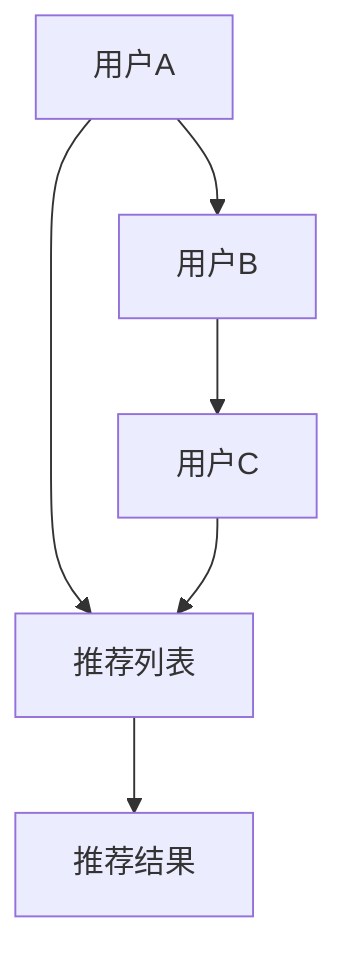
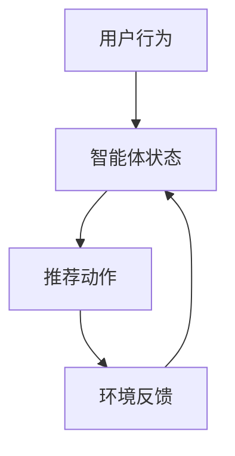
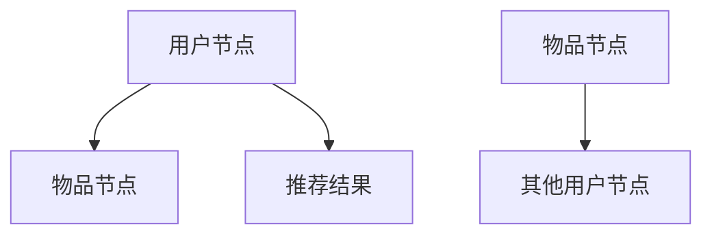

                 


# AI Agent在推荐系统中的应用：个性化与多样性的平衡

> **关键词**: AI Agent, 推荐系统, 个性化推荐, 多样性平衡, 强化学习, 图神经网络

> **摘要**:  
> 本文探讨AI Agent在推荐系统中的应用，重点分析如何在个性化推荐与多样性之间实现平衡。通过介绍推荐系统的背景、核心算法、AI Agent的结合原理、系统架构设计以及实际项目案例，本文详细阐述了如何利用AI技术提升推荐系统的性能与用户体验。文章从理论到实践，结合算法原理、系统架构与代码实现，为读者提供全面的技术解析。

---

## 第一部分: AI Agent与推荐系统概述

### 第1章: AI Agent与推荐系统背景介绍

#### 1.1 推荐系统的概念与应用

##### 1.1.1 推荐系统的定义与核心概念

推荐系统是一种基于用户行为和偏好，通过算法生成个性化推荐内容的技术。其核心目标是为用户提供符合其兴趣的物品（如商品、视频、文章等）。

**推荐系统的核心概念**：
- **用户行为**: 包括点击、浏览、购买等行为数据。
- **物品特征**: 包括商品属性、内容标签等。
- **用户画像**: 通过用户行为数据构建的用户兴趣模型。

##### 1.1.2 推荐系统的应用场景与分类

推荐系统广泛应用于电商、视频平台、社交媒体等多个领域。主要分类如下：
- **基于协同过滤的推荐**: 根据用户相似性推荐。
- **基于内容的推荐**: 根据物品特征推荐。
- **混合推荐**: 结合多种推荐方法。

##### 1.1.3 AI Agent在推荐系统中的角色与意义

AI Agent（智能代理）是一种能够感知环境并主动执行任务的智能体。在推荐系统中，AI Agent可以通过学习用户行为和上下文信息，动态调整推荐策略，从而提升推荐的个性化与多样性。

#### 1.2 AI Agent的基本概念与原理

##### 1.2.1 AI Agent的定义与特征

AI Agent是一种智能系统，能够通过感知环境、学习用户行为并执行推荐任务。其主要特征包括：
- **自主性**: 能够独立执行任务。
- **反应性**: 能够实时感知并响应环境变化。
- **学习能力**: 能够通过数据学习优化推荐策略。

##### 1.2.2 AI Agent的核心功能与分类

AI Agent的核心功能包括：
- **数据采集与分析**: 收集用户行为数据并进行分析。
- **推荐策略优化**: 根据分析结果优化推荐策略。
- **动态调整**: 根据实时反馈调整推荐结果。

AI Agent的分类：
- **基于规则的AI Agent**: 根据预定义规则执行推荐。
- **基于学习的AI Agent**: 通过机器学习模型优化推荐策略。

##### 1.2.3 AI Agent与推荐系统的结合点

AI Agent与推荐系统的结合点主要体现在：
- **动态推荐策略**: 根据用户实时行为调整推荐。
- **个性化推荐优化**: 利用AI Agent的自适应能力提升推荐的精准度。
- **多样性增强**: 通过AI Agent的多策略结合实现推荐结果的多样性。

#### 1.3 个性化推荐与多样性的平衡

##### 1.3.1 个性化推荐的定义与挑战

个性化推荐是指根据用户的兴趣和行为，推荐符合其偏好的内容。其主要挑战包括：
- **数据稀疏性**: 用户行为数据不足导致推荐不准确。
- **冷启动问题**: 新用户或新物品难以获得推荐依据。

##### 1.3.2 多样性推荐的定义与实现

多样性推荐是指推荐系统在满足用户个性化需求的同时，提供多种类型的内容。其实现方法包括：
- **基于内容的多样性推荐**: 根据物品特征推荐不同类别的内容。
- **基于协同过滤的多样性推荐**: 通过用户相似性推荐多样化的物品。

##### 1.3.3 平衡个性化与多样性的必要性

平衡个性化与多样性是提升用户体验的关键。过度个性化可能导致推荐结果单一，而忽视个性化则会导致推荐内容不符合用户需求。因此，推荐系统需要在个性化与多样性之间找到最佳平衡点。

---

## 第二部分: 推荐系统的核心算法与AI Agent的结合

### 第2章: 推荐系统的算法原理

#### 2.1 协同过滤算法

##### 2.1.1 基于用户的协同过滤

基于用户的协同过滤（User-Based Collaborative Filtering, UCF）是一种经典的推荐算法，其核心思想是通过用户相似性推荐相似用户的偏好内容。

**协同过滤的实现步骤**：
1. **构建用户-物品矩阵**: 记录用户对物品的评分或行为。
2. **计算用户相似性**: 使用余弦相似度或皮尔逊相关系数计算用户相似性。
3. **生成推荐结果**: 根据相似用户的评分加权生成推荐结果。

**基于用户的协同过滤算法流程图**：



##### 2.1.2 基于物品的协同过滤

基于物品的协同过滤（Item-Based Collaborative Filtering, ICF）是一种通过物品相似性推荐相关内容的算法。其核心思想是通过物品之间的相似性，推荐与用户已感兴趣物品相关的内容。

**基于物品的协同过滤实现步骤**：
1. **构建物品-物品相似度矩阵**: 计算每对物品之间的相似度。
2. **为用户推荐相似物品**: 根据用户已评分的物品，推荐与其相似的其他物品。

##### 2.1.3 混合协同过滤算法

混合协同过滤算法结合了基于用户和基于物品的协同过滤方法，通过集成两种方法的优势，提升推荐的准确性和多样性。

**混合协同过滤的优势**：
- **准确性提升**: 结合用户与物品的相似性信息。
- **多样性增强**: 推荐结果涵盖更多类型的内容。

#### 2.2 基于内容的推荐算法

##### 2.2.1 基于文本内容的推荐

基于文本内容的推荐算法通过分析物品的内容特征（如文本描述、标签等）生成推荐结果。其核心步骤包括：
1. **提取物品特征**: 使用自然语言处理技术提取文本特征。
2. **计算相似度**: 基于物品特征的相似度生成推荐结果。

##### 2.2.2 基于知识图谱的推荐

基于知识图谱的推荐算法利用知识图谱中的语义关系，推荐与用户兴趣相关的物品。其核心步骤包括：
1. **构建知识图谱**: 将物品及其关系表示为图结构。
2. **推荐路径推理**: 根据图结构推理推荐路径。

#### 2.3 基于深度学习的推荐算法

##### 2.3.1 基于神经网络的推荐模型

基于神经网络的推荐模型通过深度学习技术提取用户和物品的高层次特征，生成推荐结果。其核心步骤包括：
1. **数据预处理**: 对用户行为数据进行特征提取。
2. **构建神经网络模型**: 使用深度学习模型（如卷积神经网络、循环神经网络）进行推荐预测。

##### 2.3.2 基于Transformer的推荐算法

基于Transformer的推荐算法通过自注意力机制捕捉用户行为的全局关系，生成推荐结果。其核心步骤包括：
1. **序列建模**: 将用户行为建模为序列。
2. **自注意力机制**: 捕捉序列中的全局关系。
3. **生成推荐结果**: 根据注意力权重生成推荐列表。

#### 2.4 推荐系统的评价指标

##### 2.4.1 精准率与召回率

精准率（Precision）与召回率（Recall）是衡量推荐系统性能的重要指标。公式如下：
- 精准率: $Precision = \frac{TP}{TP + FP}$
- 召回率: $Recall = \frac{TP}{TP + FN}$

##### 2.4.2 F1分数与AUC值

F1分数是精准率与召回率的调和平均数，公式为：
$F1 = \frac{2 \cdot Precision \cdot Recall}{Precision + Recall}$

AUC值是受试者工作特征曲线下的面积，用于衡量分类器的性能。

##### 2.4.3 多样性与新颖性的评估

多样性是指推荐结果的多样性程度，新颖性是指推荐结果的新颖程度。常用指标包括：
- **多样性指标**: 如NDCG（归一化折扣累积增益）。
- **新颖性指标**: 如 surprisal（意外值）。

#### 2.5 本章小结

---

## 第三部分: AI Agent在推荐系统中的应用原理

### 第3章: AI Agent的核心算法与实现

#### 3.1 基于强化学习的推荐策略

##### 3.1.1 强化学习的基本原理

强化学习是一种通过智能体与环境交互，逐步优化策略的机器学习方法。其核心要素包括：
- **状态（State）**: 智能体所处的环境状态。
- **动作（Action）**: 智能体在状态下的行为。
- **奖励（Reward）**: 环境对智能体行为的反馈。

##### 3.1.2 在推荐系统中的应用

强化学习在推荐系统中的应用包括：
1. **动态推荐策略优化**: 根据用户实时行为调整推荐策略。
2. **长-term用户满意度提升**: 通过强化学习优化长期推荐效果。

**基于强化学习的推荐算法流程图**：



#### 3.2 基于图神经网络的推荐模型

##### 3.2.1 图神经网络的基本概念

图神经网络是一种处理图结构数据的深度学习模型。其核心思想是通过节点间的关系进行信息传播。

##### 3.2.2 在推荐系统中的应用

图神经网络在推荐系统中的应用包括：
1. **用户-物品关系建模**: 将用户与物品的关系表示为图结构。
2. **推荐结果生成**: 通过图结构传播用户偏好生成推荐结果。

**基于图神经网络的推荐模型结构图**：



#### 3.3 基于知识蒸馏的推荐优化

##### 3.3.1 知识蒸馏的定义与原理

知识蒸馏是一种通过小模型学习大模型知识的深度学习技术。其核心思想是通过教师模型指导学生模型学习。

##### 3.3.2 在推荐系统中的应用

知识蒸馏在推荐系统中的应用包括：
1. **模型压缩**: 通过知识蒸馏优化推荐模型的计算效率。
2. **多任务学习**: 在推荐系统中结合多种推荐任务进行优化。

#### 3.4 本章小结

---

## 第四部分: 系统架构与设计

### 第4章: 推荐系统的整体架构设计

#### 4.1 系统功能模块划分

##### 4.1.1 用户行为分析模块

用户行为分析模块负责收集和分析用户行为数据，生成用户画像。

##### 4.1.2 推荐算法模块

推荐算法模块负责根据用户画像生成推荐结果。

##### 4.1.3 推荐结果展示模块

推荐结果展示模块负责将推荐结果呈现给用户。

#### 4.2 系统数据流设计

##### 4.2.1 用户行为数据采集

用户行为数据采集模块负责收集用户的点击、浏览等行为数据。

##### 4.2.2 数据预处理与特征提取

数据预处理与特征提取模块负责对用户行为数据进行清洗和特征提取。

##### 4.2.3 推荐结果生成与反馈

推荐结果生成与反馈模块负责根据用户行为数据生成推荐结果，并收集用户反馈。

#### 4.3 系统架构的可扩展性设计

##### 4.3.1 微服务架构的应用

微服务架构通过将推荐系统分解为多个独立的服务，提升系统的可扩展性和灵活性。

##### 4.3.2 异构计算资源的利用

异构计算资源（如GPU、TPU）的利用可以提升推荐系统的计算效率。

#### 4.4 本章小结

---

## 第五部分: 项目实战与案例分析

### 第5章: 个性化推荐系统的实战开发

#### 5.1 环境搭建与工具安装

##### 5.1.1 Python开发环境的搭建

安装Python和必要的开发工具（如Jupyter、PyCharm）。

##### 5.1.2 推荐算法库的安装

安装推荐算法库（如Scikit-learn、Surprise、LightFM）。

#### 5.2 核心代码实现

##### 5.2.1 数据预处理代码

```python
import pandas as pd

# 读取数据
data = pd.read_csv('user_item.csv')

# 数据清洗
data.dropna(inplace=True)
```

##### 5.2.2 基于协同过滤的推荐算法实现

```python
from surprise import SVD, Dataset, evaluate

# 数据集构建
train = Dataset.load_from_df(data, reader={'cols': ['user', 'item', 'rating']})

# 模型训练
model = SVD()
model.fit(train)
```

##### 5.2.3 基于深度学习的推荐算法实现

```python
import tensorflow as tf
from tensorflow.keras import layers

# 构建模型
model = tf.keras.Sequential([
    layers.Dense(64, activation='relu'),
    layers.Dense(1, activation='sigmoid')
])

# 编译模型
model.compile(optimizer='adam', loss='binary_crossentropy')
```

#### 5.3 代码应用解读与分析

##### 5.3.1 协同过滤算法实现

协同过滤算法的实现步骤包括数据预处理、模型训练和推荐结果生成。

##### 5.3.2 基于深度学习的推荐算法实现

基于深度学习的推荐算法通过构建神经网络模型，提取用户和物品的特征，生成推荐结果。

#### 5.4 实际案例分析

##### 5.4.1 案例背景

以电商推荐系统为例，分析如何利用AI Agent实现个性化与多样性的平衡。

##### 5.4.2 案例分析

通过具体案例分析，展示AI Agent在推荐系统中的实际应用效果。

#### 5.5 本章小结

---

## 第六部分: 总结与展望

### 第6章: 总结与展望

#### 6.1 核心观点回顾

本文主要探讨了AI Agent在推荐系统中的应用，重点分析了如何在个性化推荐与多样性之间实现平衡。

#### 6.2 最佳实践 tips

- 在实际应用中，建议结合多种推荐方法，提升推荐系统的性能与用户体验。
- 注意数据隐私和用户隐私保护，确保推荐系统的合规性。

#### 6.3 未来研究方向

- **多模态推荐**: 结合文本、图像等多种模态信息，提升推荐的精准度。
- **实时推荐**: 提升推荐系统的实时性，满足用户的即时需求。

#### 6.4 本章小结

---

## 关键词索引

- AI Agent
- 推荐系统
- 个性化推荐
- 多样性平衡
- 强化学习
- 图神经网络

---

## 参考文献

（此处可以列出相关的参考文献，如书籍、论文等。）

