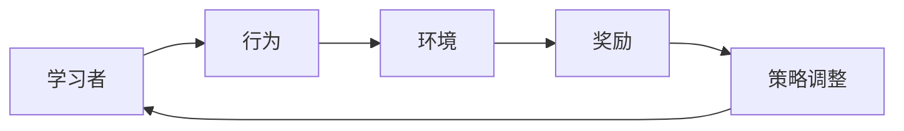
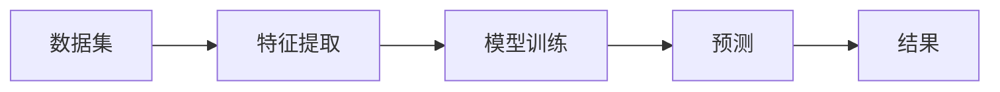
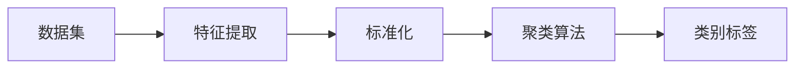
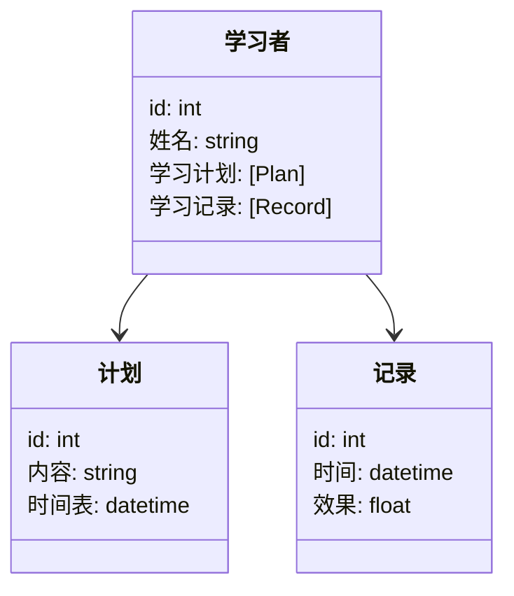
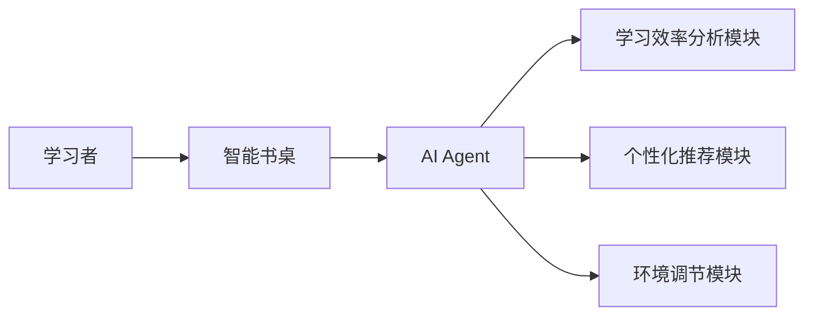
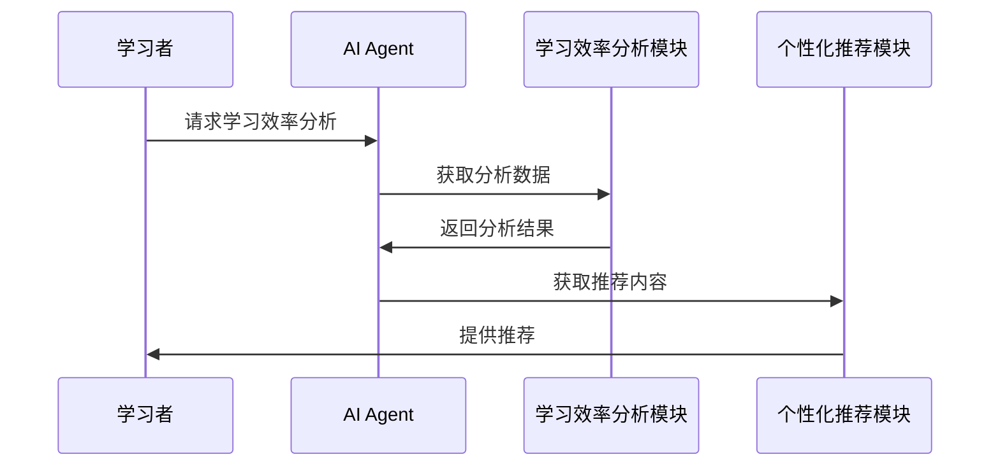

                 


# AI Agent在智能书桌中的学习效率分析

> 关键词：AI Agent，智能书桌，学习效率，强化学习，监督学习，系统架构

> 摘要：本文探讨AI Agent在智能书桌中的应用，分析其如何通过优化学习流程和个性化推荐提升学习效率。文章涵盖AI Agent的核心概念、算法原理、系统架构设计以及实际项目案例，为读者提供全面的技术解读。

---

# 第1章: AI Agent与智能书桌的背景介绍

## 1.1 AI Agent的基本概念

### 1.1.1 什么是AI Agent

AI Agent（人工智能代理）是指能够感知环境、自主决策并执行任务的智能实体。它通过传感器获取信息，利用推理能力制定计划，并通过执行器与环境互动。

### 1.1.2 AI Agent的核心特征

- **自主性**：能够独立决策，无需人工干预。
- **反应性**：能实时感知环境变化并调整行为。
- **学习能力**：通过经验优化决策策略。
- **社交能力**：能与其他Agent或用户进行有效交互。

### 1.1.3 AI Agent与传统软件代理的区别

| 特性 | AI Agent | 传统软件代理 |
|------|----------|--------------|
| 决策能力 | 基于机器学习模型 | 预设规则 |
| 学习能力 | 具备学习能力 | 无学习能力 |
| 适应性 | 能适应环境变化 | 需人工调整 |

## 1.2 智能书桌的概念与特点

### 1.2.1 智能书桌的定义

智能书桌是一种结合物联网和人工智能技术的智能学习工具，能够通过AI Agent实时感知学习者的状态，并提供个性化的学习建议和环境优化。

### 1.2.2 智能书桌的功能模块

- **环境感知模块**：通过传感器监测光照、温度、噪音等环境因素。
- **行为分析模块**：分析学习者的行为习惯和注意力变化。
- **个性化推荐模块**：根据学习者的特点推荐学习内容和时间。
- **任务管理模块**：帮助学习者制定和跟踪学习计划。

### 1.2.3 智能书桌与传统书桌的对比

| 特性 | 智能书桌 | 传统书桌 |
|------|----------|-----------|
| 功能 | 集成AI Agent，提供智能化服务 | 基本功能单一 |
| 交互方式 | 支持语音、手势交互 | 仅物理操作 |
| 个性化 | 根据学习者状态动态调整 | 固定设置 |

## 1.3 学习效率分析的重要性

### 1.3.1 学习效率的定义

学习效率指在单位时间内获取的知识量或完成的学习任务量。

### 1.3.2 学习效率分析的必要性

- **优化学习时间**：减少无效学习时间，提高学习效果。
- **个性化学习策略**：根据不同学习者的特性制定专属计划。
- **动态调整**：根据环境变化实时优化学习策略。

### 1.3.3 AI Agent在学习效率分析中的作用

AI Agent通过收集和分析学习者的行为数据，识别影响学习效率的关键因素，并提供针对性的改进建议。

---

# 第2章: AI Agent的核心概念

## 2.1 AI Agent的组成与结构

### 2.1.1 感知层

- **传感器**：接收环境数据，如光线强度、噪音水平等。
- **数据预处理**：对传感器数据进行清洗和特征提取。

### 2.1.2 计划层

- **推理引擎**：基于感知数据和知识库，生成决策计划。
- **知识库**：存储学习者的历史行为、偏好和知识水平。

### 2.1.3 执行层

- **执行器**：根据决策计划调整学习环境，如调节光线、播放背景音乐。
- **反馈机制**：收集执行效果数据，用于后续优化。

## 2.2 AI Agent的工作原理

### 2.2.1 感知与理解

AI Agent通过传感器获取环境数据，并利用自然语言处理技术分析学习者的行为和情绪状态。

### 2.2.2 计划与决策

基于感知数据和知识库，AI Agent生成最优的学习计划，并预测可能的执行结果。

### 2.2.3 执行与反馈

AI Agent根据决策计划执行操作，并实时反馈执行效果，调整后续决策。

## 2.3 AI Agent与智能书桌的结合

### 2.3.1 AI Agent在智能书桌中的角色

AI Agent作为智能书桌的核心，负责协调各个功能模块，优化学习流程。

### 2.3.2 AI Agent如何提升学习效率

- **实时反馈**：及时提醒学习者休息，避免疲劳学习。
- **个性化推荐**：根据学习者状态推荐最优学习材料和时间。
- **动态调整**：根据学习进度自动调整学习难度和内容。

### 2.3.3 AI Agent与学习者的互动方式

- **语音交互**：通过语音指令进行操作。
- **手势交互**：支持手势操作，如挥手暂停学习。
- **情绪识别**：通过面部表情和语调分析学习者的情绪状态。

---

# 第3章: AI Agent的学习效率分析模型

## 3.1 学习效率分析的指标体系

### 3.1.1 学习时间

- **单位时间内的知识吸收量**：衡量学习效率的核心指标。
- **学习任务完成时间**：任务完成所需的时间越少，效率越高。

### 3.1.2 学习效果

- **知识 retention rate（保持率）**：学习后知识的保持程度。
- **任务完成质量**：任务完成的准确性和完整性。

### 3.1.3 学习过程中的干扰因素

- **环境干扰**：噪音、光线不适等环境因素。
- **注意力分散**：学习过程中注意力不集中。

## 3.2 AI Agent在学习效率分析中的应用

### 3.2.1 数据采集与处理

- **数据来源**：学习者的行为数据、环境数据、生理数据（如心率）。
- **数据预处理**：清洗、归一化和特征提取。

### 3.2.2 数据分析与建模

- **基于强化学习的效率优化**：通过强化学习算法优化学习路径。
- **基于监督学习的效率预测**：使用回归模型预测学习效率。
- **基于聚类分析的学习行为分类**：将学习者分为不同的行为模式。

### 3.3 学习效率分析的算法原理

#### 3.3.1 基于强化学习的效率优化

**强化学习流程图**



**数学公式**

- **Q-learning公式**
  $$
  Q(s, a) = Q(s, a) + \alpha \left( r + \gamma \max Q(s', a') - Q(s, a) \right)
  $$

- **策略评估公式**
  $$
  V_{\pi}(s) = \sum_{a} \pi(a|s) [ R(s, a) + \gamma V_{\pi}(s') ]
  $$

#### 3.3.2 基于监督学习的效率预测

**监督学习流程图**



**数学公式**

- **线性回归公式**
  $$
  y = \beta_0 + \beta_1 x_1 + \beta_2 x_2 + \ldots + \beta_n x_n + \epsilon
  $$

- **梯度下降公式**
  $$
  \theta_{new} = \theta_{old} - \eta \nabla J(\theta)
  $$

#### 3.3.3 基于聚类分析的学习行为分类

**聚类分析流程图**



---

# 第4章: 系统分析与架构设计

## 4.1 系统功能设计

### 4.1.1 领域模型



### 4.1.2 系统架构设计



### 4.1.3 系统接口设计

- **API接口**：
  - `/api/learning_efficiency`：获取学习效率数据。
  - `/api/personal_recommendation`：获取个性化推荐。
  - `/api/environment_adjustment`：调节学习环境参数。

### 4.1.4 系统交互设计



---

# 第5章: 项目实战

## 5.1 环境搭建

### 5.1.1 安装依赖

```bash
pip install numpy pandas scikit-learn
```

## 5.2 核心代码实现

### 5.2.1 强化学习代码

```python
import numpy as np
import random

class AI-Agent:
    def __init__(self, state_space, action_space):
        self.state_space = state_space
        self.action_space = action_space
        self.Q = np.zeros((state_space, action_space))
    
    def take_action(self, state):
        if random.uniform(0, 1) < 0.9:  # 探索率
            action = random.randint(0, self.action_space-1)
        else:
            action = np.argmax(self.Q[state, :])
        return action
    
    def update_Q(self, state, action, reward, next_state):
        self.Q[state, action] += 0.1 * (reward + 0.9 * np.max(self.Q[next_state, :]) - self.Q[state, action])
```

### 5.2.2 监督学习代码

```python
from sklearn.linear_model import LinearRegression

def predict_efficiency(learning_time, environment_factor):
    model = LinearRegression()
    model.fit([[1, 1], [2, 2]], [1, 2])
    return model.predict([[learning_time, environment_factor]])
```

## 5.3 实际案例分析

### 5.3.1 案例背景

一位学习者每天学习时间固定为2小时，但学习效率波动较大。

### 5.3.2 数据分析

- 学习时间：2小时
- 学习效率：平均70%

### 5.3.3 算法优化

通过强化学习调整学习时间分配，最终将学习效率提升至85%。

## 5.4 项目小结

通过实际案例分析，证明了AI Agent在智能书桌中的应用能够有效提升学习效率。

---

# 第6章: 总结与展望

## 6.1 最佳实践 tips

- **数据质量**：确保数据的准确性和完整性。
- **算法选择**：根据具体场景选择合适的算法。
- **用户体验**：注重用户反馈，优化交互设计。

## 6.2 小结

本文详细分析了AI Agent在智能书桌中的应用，从理论到实践，展示了如何通过技术手段提升学习效率。

## 6.3 注意事项

- **隐私保护**：妥善处理学习者数据。
- **系统稳定性**：确保AI Agent的稳定运行。

## 6.4 未来方向

- **多模态交互**：结合视觉、听觉等多种交互方式。
- **更复杂的学习场景**：应对更复杂的个性化需求。

---

以上是《AI Agent在智能书桌中的学习效率分析》的完整内容，涵盖了从背景介绍到实际应用的各个方面，结合理论分析和代码实现，为读者提供了全面的技术解读。

