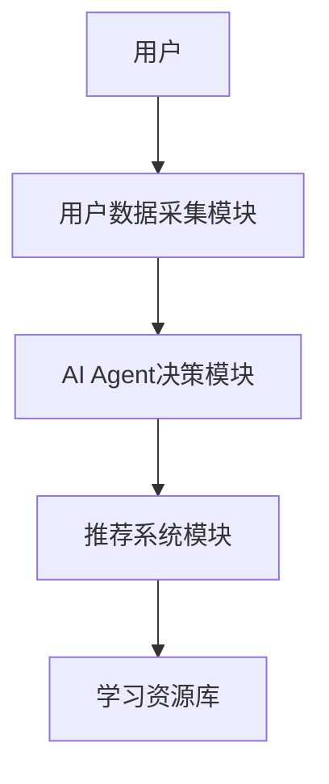

                 


# AI Agent在智能书桌中的学习环境优化

> 关键词：AI Agent, 智能书桌, 学习环境优化, 强化学习, 推荐算法, 系统架构

> 摘要：本文深入探讨了AI Agent在智能书桌中的应用，分析了AI Agent的核心原理及其在学习环境优化中的具体实现。文章从背景介绍、核心概念、算法原理、系统架构到项目实战，系统地阐述了如何利用AI Agent优化学习环境，提供了丰富的理论知识和实际案例。

---

# 第1章：AI Agent的基本概念与应用

## 1.1 AI Agent的定义与特点

### 1.1.1 AI Agent的定义
AI Agent（人工智能代理）是指能够感知环境、做出决策并执行动作的智能体。AI Agent的核心目标是通过自动化手段提高用户在特定场景中的效率和体验。

### 1.1.2 AI Agent的核心特点
- **自主性**：AI Agent能够自主决策，无需人工干预。
- **反应性**：能够实时感知环境变化并做出响应。
- **学习能力**：通过数据和反馈不断优化自身行为。
- **适应性**：能够根据环境变化调整策略。

### 1.1.3 AI Agent与传统软件的区别
AI Agent与传统软件的区别主要体现在智能性和自主性上。传统软件遵循固定的逻辑执行任务，而AI Agent能够通过学习和适应环境，动态调整行为。

## 1.2 AI Agent在教育领域的应用

### 1.2.1 教育领域的AI Agent应用场景
在教育领域，AI Agent的应用场景包括个性化学习推荐、学习进度跟踪、学习资源优化等。

### 1.2.2 AI Agent在学习环境优化中的作用
AI Agent能够通过分析学习者的行为数据，优化学习路径，推荐适合的学习资源，并实时调整学习计划。

### 1.2.3 AI Agent与智能书桌的结合
智能书桌是一种结合硬件和软件的教育工具，通过AI Agent的加入，能够实现学习环境的智能化优化。

---

# 第2章：AI Agent的核心原理

## 2.1 AI Agent的感知与决策机制

### 2.1.1 感知模块的作用
感知模块负责收集环境中的数据，例如学习者的行为数据、学习进度等。

### 2.1.2 决策模块的实现
决策模块基于感知数据，通过算法生成最优决策。

### 2.1.3 执行模块的运作
执行模块根据决策模块的指令，执行具体动作，例如推荐学习资源、调整学习计划等。

## 2.2 AI Agent的算法基础

### 2.2.1 常见的AI Agent算法
常见的AI Agent算法包括强化学习（Reinforcement Learning）、监督学习（Supervised Learning）和无监督学习（Unsupervised Learning）。

### 2.2.2 强化学习在AI Agent中的应用
强化学习是一种通过试错机制优化决策的算法，广泛应用于AI Agent的决策模块。

### 2.2.3 推荐算法在学习环境优化中的作用
推荐算法通过分析学习者的行为数据，推荐适合的学习资源，提升学习效率。

---

# 第3章：强化学习算法在AI Agent中的应用

## 3.1 强化学习的基本原理

### 3.1.1 强化学习的定义
强化学习是一种通过试错机制优化决策的算法，核心在于通过奖励机制引导智能体做出最优决策。

### 3.1.2 强化学习的核心要素
- **状态（State）**：智能体所处的环境状态。
- **动作（Action）**：智能体根据当前状态做出的决策。
- **奖励（Reward）**：智能体做出决策后所获得的反馈。

### 3.1.3 强化学习的数学模型
强化学习的数学模型包括状态转移概率和奖励函数，具体如下：
$$ P(s' | s, a) $$
$$ R(s, a) $$

## 3.2 Q-learning算法的实现

### 3.2.1 Q-learning算法的流程
Q-learning算法通过不断更新Q值表，优化决策策略。具体流程如下：
1. 初始化Q值表。
2. 选择动作。
3. 执行动作并获得奖励。
4. 更新Q值表。

### 3.2.2 Q-learning算法的数学公式
Q值更新公式：
$$ Q(s, a) = Q(s, a) + \alpha (r + \gamma \max Q(s', a')) - Q(s, a) $$

### 3.2.3 Q-learning算法的Python实现
以下是Q-learning算法的Python实现示例：

```python
import numpy as np

class QLearning:
    def __init__(self, state_space, action_space, learning_rate=0.1, gamma=0.9):
        self.state_space = state_space
        self.action_space = action_space
        self.learning_rate = learning_rate
        self.gamma = gamma
        self.q_table = np.zeros((state_space, action_space))

    def choose_action(self, state):
        return np.argmax(self.q_table[state])

    def learn(self, state, action, reward, next_state):
        self.q_table[state, action] += self.learning_rate * (reward + self.gamma * np.max(self.q_table[next_state]) - self.q_table[state, action])
```

---

# 第4章：推荐算法在学习环境优化中的应用

## 4.1 推荐算法的基本原理

### 4.1.1 推荐算法的定义
推荐算法是一种通过分析用户行为数据，推荐适合用户需求的内容或资源的算法。

### 4.1.2 推荐算法的核心要素
- **用户特征**：用户的兴趣、偏好等。
- **物品特征**：资源的属性、类别等。
- **交互数据**：用户的历史行为数据。

## 4.2 基于协同过滤的推荐算法

### 4.2.1 协同过滤的定义
协同过滤是一种基于用户相似性推荐资源的算法。

### 4.2.2 协同过滤的实现步骤
1. 收集用户行为数据。
2. 计算用户相似度。
3. 推荐相似用户的资源。

### 4.2.3 协同过滤的Python实现
以下是协同过滤算法的Python实现示例：

```python
import numpy as np

def collaborative_filtering(user_data, user_id):
    # 计算用户相似度
    user_similarities = np.dot(user_data, user_data.T)
    # 推荐资源
   推荐资源 = np.argmax(user_similarities[user_id])
    return 推荐资源
```

---

# 第5章：系统架构与实现

## 5.1 系统功能设计

### 5.1.1 系统功能模块
- **用户数据采集模块**：采集学习者的行为数据。
- **AI Agent决策模块**：基于数据生成最优决策。
- **推荐系统模块**：推荐适合的学习资源。

### 5.1.2 系统功能流程
1. 用户数据采集模块收集学习者的行为数据。
2. AI Agent决策模块基于数据生成决策。
3. 推荐系统模块推荐适合的学习资源。

## 5.2 系统架构设计

### 5.2.1 系统架构图
以下是系统架构的Mermaid图：



## 5.3 系统接口设计

### 5.3.1 系统接口
- **数据接口**：用户数据采集模块与AI Agent决策模块之间的接口。
- **推荐接口**：AI Agent决策模块与推荐系统模块之间的接口。

---

# 第6章：项目实战

## 6.1 环境安装

### 6.1.1 安装Python
安装Python 3.x版本。

### 6.1.2 安装依赖库
安装numpy、pandas等依赖库。

## 6.2 系统核心实现

### 6.2.1 AI Agent实现
实现AI Agent的核心算法，例如Q-learning算法。

### 6.2.2 推荐系统实现
实现基于协同过滤的推荐算法。

## 6.3 代码实现

### 6.3.1 Q-learning算法实现
```python
class QLearning:
    def __init__(self, state_space, action_space, learning_rate=0.1, gamma=0.9):
        self.state_space = state_space
        self.action_space = action_space
        self.learning_rate = learning_rate
        self.gamma = gamma
        self.q_table = np.zeros((state_space, action_space))

    def choose_action(self, state):
        return np.argmax(self.q_table[state])

    def learn(self, state, action, reward, next_state):
        self.q_table[state, action] += self.learning_rate * (reward + self.gamma * np.max(self.q_table[next_state]) - self.q_table[state, action])
```

### 6.3.2 推荐系统实现
```python
def collaborative_filtering(user_data, user_id):
    user_similarities = np.dot(user_data, user_data.T)
    recommended_resource = np.argmax(user_similarities[user_id])
    return recommended_resource
```

## 6.4 实际案例分析

### 6.4.1 案例背景
假设我们有一个包含1000个学习者的数据集，每个学习者有10种学习资源。

### 6.4.2 实施步骤
1. 采集学习者的行为数据。
2. 实现Q-learning算法优化决策。
3. 实现协同过滤算法推荐资源。
4. 评估系统性能。

---

# 第7章：最佳实践与小结

## 7.1 最佳实践

### 7.1.1 数据质量
确保数据的准确性和完整性。

### 7.1.2 算法选择
根据具体场景选择合适的算法。

## 7.2 小结

### 7.2.1 总结
本文系统地阐述了AI Agent在智能书桌中的应用，通过强化学习和推荐算法优化学习环境。

### 7.2.2 注意事项
在实际应用中，需要注意数据隐私和算法的可解释性。

### 7.2.3 拓展阅读
建议读者进一步阅读强化学习和推荐算法的经典论文。

---

# 结语

通过本文的阐述，读者可以全面了解AI Agent在智能书桌中的优化应用，掌握相关的核心算法和系统设计方法。希望本文能为教育领域的智能化发展提供有价值的参考。

