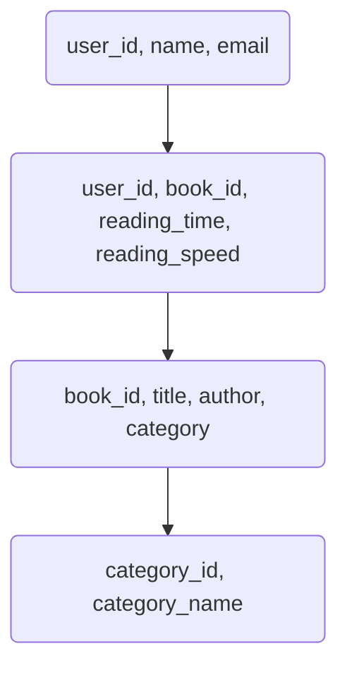
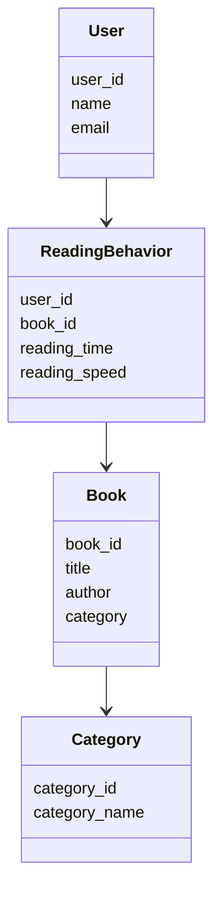
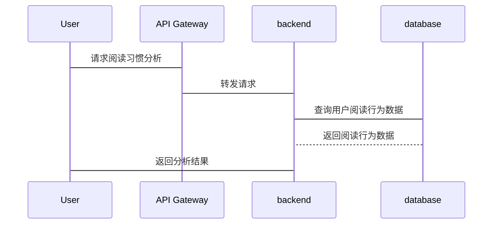

                 


# AI Agent在智能书立中的阅读习惯分析

> 关键词：AI Agent, 阅读习惯分析, 智能书架, 用户行为分析, 机器学习算法, 深度学习模型, 系统架构设计

> 摘要：本文旨在探讨AI Agent在智能书架中的阅读习惯分析的应用与实现。通过分析用户阅读行为，结合AI Agent的核心原理，提出基于协同过滤、聚类分析和深度学习模型的阅读习惯分析方法。同时，本文将详细阐述系统架构设计、算法实现及项目实战，为智能书架的优化提供理论和实践参考。

---

# 第1章: AI Agent与阅读习惯分析的背景介绍

## 1.1 AI Agent的基本概念
### 1.1.1 AI Agent的定义与特点
AI Agent（人工智能代理）是指能够感知环境、自主决策并执行任务的智能实体。其特点包括：**自主性**、**反应性**、**目标导向**和**社会性**。AI Agent通过传感器感知环境，通过执行器与环境交互，从而实现预定目标。

### 1.1.2 AI Agent的核心要素与功能模块
AI Agent的核心要素包括：
1. **感知模块**：负责从环境中获取信息，如用户行为数据、阅读记录等。
2. **决策模块**：基于感知到的信息，通过算法进行分析和决策，如推荐算法。
3. **执行模块**：根据决策结果执行操作，如推荐书籍或调整阅读计划。

### 1.1.3 阅读习惯分析的定义与目标
阅读习惯分析是指通过分析用户的阅读行为数据，识别用户的阅读偏好、阅读频率、阅读深度等特征，并基于此优化智能书架的服务。

## 1.2 AI Agent在智能书架中的应用背景
### 1.2.1 智能书架的概念与发展现状
智能书架是一种基于AI技术的图书管理与推荐系统，通过分析用户的阅读行为，为用户提供个性化阅读建议。

### 1.2.2 阅读习惯分析的重要性与价值
阅读习惯分析能够帮助智能书架更好地理解用户需求，提升推荐算法的准确性和用户体验。

### 1.2.3 AI Agent在阅读习惯分析中的作用
AI Agent通过实时感知用户的阅读行为，动态调整推荐策略，优化用户的阅读体验。

## 1.3 阅读习惯分析的核心问题与解决思路
### 1.3.1 阅读习惯分析的核心问题
- 如何有效采集和处理用户的阅读行为数据？
- 如何基于阅读行为数据构建用户画像？
- 如何通过算法实现精准的阅读习惯预测？

### 1.3.2 AI Agent如何解决阅读习惯分析问题
AI Agent通过实时感知用户行为数据，结合机器学习算法，实现阅读习惯的动态预测和优化。

### 1.3.3 阅读习惯分析的边界与外延
阅读习惯分析的边界包括用户的基本信息、阅读记录、阅读偏好等，外延则涉及个性化推荐、阅读行为预测等领域。

## 1.4 本章小结
本章介绍了AI Agent的基本概念、核心要素以及阅读习惯分析的重要性和解决思路，为后续章节的分析奠定了基础。

---

# 第2章: 阅读习惯分析的核心概念与联系

## 2.1 AI Agent的核心原理
### 2.1.1 AI Agent的感知模块
感知模块通过传感器或数据接口获取用户的阅读行为数据，如阅读时间、阅读速度、阅读频率等。

### 2.1.2 AI Agent的决策模块
决策模块基于感知到的数据，通过算法进行分析和决策，如协同过滤算法、聚类分析算法等。

### 2.1.3 AI Agent的执行模块
执行模块根据决策结果，通过API或其他接口实现推荐书籍或调整阅读计划。

## 2.2 阅读习惯分析的属性特征对比
通过对比不同用户的阅读习惯特征，我们可以发现用户的阅读偏好和行为模式。

| 阅读习惯特征 | 高频阅读者 | 低频阅读者 | 偶尔阅读者 |
|--------------|------------|------------|------------|
| 阅读频率     | 高         | 低         | 中         |
| 阅读深度     | 深         | 浅         | 一般       |
| 阅读偏好     | 小说       | 科普读物    | 综合       |

## 2.3 ER实体关系图架构
以下是阅读习惯分析的ER实体关系图：



## 2.4 本章小结
本章通过对比不同用户的阅读习惯特征，并结合ER实体关系图，详细阐述了AI Agent的核心原理和阅读习惯分析的属性特征。

---

# 第3章: 阅读习惯分析的算法原理

## 3.1 协同过滤算法
### 3.1.1 协同过滤的基本原理
协同过滤是一种基于用户相似性或物品相似性的推荐算法。用户相似性协同过滤通过计算用户之间的相似性，将相似用户的购买或阅读行为推荐给目标用户。

### 3.1.2 基于用户的协同过滤
基于用户的协同过滤算法通过计算用户之间的相似性，找到与目标用户相似的用户群体，推荐他们喜欢的书籍。

### 3.1.3 基于物品的协同过滤
基于物品的协同过滤算法通过计算物品之间的相似性，推荐与目标用户已购买或阅读的书籍相似的书籍。

## 3.2 聚类分析算法
### 3.2.1 聚类分析的基本原理
聚类分析是一种无监督学习算法，通过将用户分成不同的群体，分析每个群体的阅读习惯特征。

### 3.2.2 K-means算法在阅读习惯分析中的应用
K-means算法是一种常用的聚类算法，适用于将用户分成不同的阅读习惯群体。

### 3.2.3 层次聚类算法的应用
层次聚类算法通过构建层次化的树状结构，将用户分成不同层次的群体。

## 3.3 基于深度学习的阅读习惯预测模型
### 3.3.1 Transformer模型的基本原理
Transformer模型是一种基于自注意力机制的深度学习模型，广泛应用于自然语言处理领域。

### 3.3.2 基于Transformer的阅读习惯预测模型
通过将用户的阅读行为数据输入到Transformer模型中，可以实现对用户阅读习惯的预测。

## 3.4 本章小结
本章详细介绍了协同过滤算法、聚类分析算法和深度学习模型在阅读习惯分析中的应用，为后续的系统设计和项目实现奠定了算法基础。

---

# 第4章: 系统分析与架构设计方案

## 4.1 问题场景介绍
智能书架的阅读习惯分析系统需要解决以下问题：
- 如何采集和处理用户的阅读行为数据？
- 如何基于阅读行为数据构建用户画像？
- 如何通过算法实现精准的阅读习惯预测？

## 4.2 系统功能设计
### 4.2.1 领域模型设计
以下是阅读习惯分析系统的领域模型：



### 4.2.2 系统架构设计
以下是阅读习惯分析系统的架构设计：


## 4.3 系统接口设计
系统接口设计包括：
- 用户信息接口：`GET /user/{user_id}`
- 阅读行为接口：`GET /reading_behavior/{user_id}`
- 书籍信息接口：`GET /book/{book_id}`

## 4.4 系统交互设计
以下是系统交互的序列图：



## 4.5 本章小结
本章通过系统分析与架构设计，详细阐述了阅读习惯分析系统的实现方案，包括领域模型、系统架构、接口设计和交互设计。

---

# 第5章: 项目实战

## 5.1 环境安装
- 安装Python环境：`python --version`
- 安装必要的库：`pip install numpy pandas scikit-learn`

## 5.2 系统核心实现源代码
### 5.2.1 数据清洗代码
```python
import pandas as pd

# 读取数据
data = pd.read_csv('reading_behavior.csv')

# 删除重复数据
data.drop_duplicates(inplace=True)

# 填充缺失值
data.fillna(method='ffill', inplace=True)

# 保存数据
data.to_csv('cleaned_behavior.csv', index=False)
```

### 5.2.2 模型训练代码
```python
from sklearn.cluster import KMeans

# 初始化模型
model = KMeans(n_clusters=3, random_state=42)

# 训练模型
model.fit(data)
```

### 5.2.3 结果分析代码
```python
# 预测聚类结果
clusters = model.predict(data)

# 输出聚类中心
print(model.cluster_centers_)
```

## 5.3 代码应用解读与分析
通过上述代码，我们可以实现用户阅读行为数据的清洗、模型训练和结果分析。

## 5.4 实际案例分析
以某用户的阅读行为数据为例，通过协同过滤算法和聚类分析算法，分析其阅读习惯特征。

## 5.5 本章小结
本章通过项目实战，详细展示了如何实现阅读习惯分析系统的数据清洗、模型训练和结果分析。

---

# 第6章: 总结与展望

## 6.1 项目总结
本文详细介绍了AI Agent在智能书架中的阅读习惯分析的应用与实现，包括算法原理、系统架构设计和项目实战。

## 6.2 优化建议
- 提升算法的准确性和效率
- 加强数据隐私保护
- 提供更多样化的阅读习惯分析功能

## 6.3 未来展望
随着AI技术的不断发展，阅读习惯分析将在智能书架中发挥越来越重要的作用，未来将更加注重用户体验和数据隐私保护。

## 6.4 本章小结
本章总结了本文的主要内容，并对未来的发展方向提出了展望。

---

# 参考文献
1. 《机器学习实战》
2. 《深度学习入门：基于Python的理论与实现》
3. 《AI Agent与智能推荐系统》

---

# 结束语
感谢您的阅读！如需进一步了解AI Agent在智能书架中的阅读习惯分析，欢迎关注后续文章或联系我们进行深入探讨。

