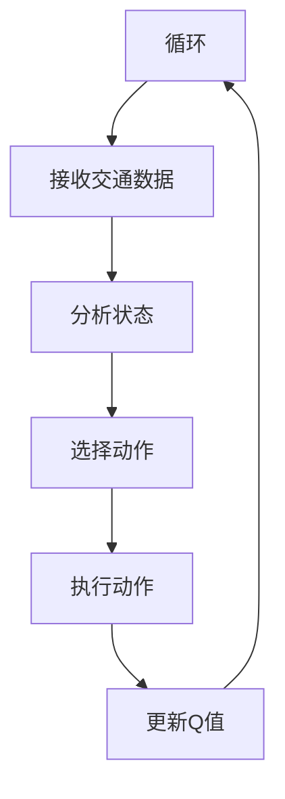
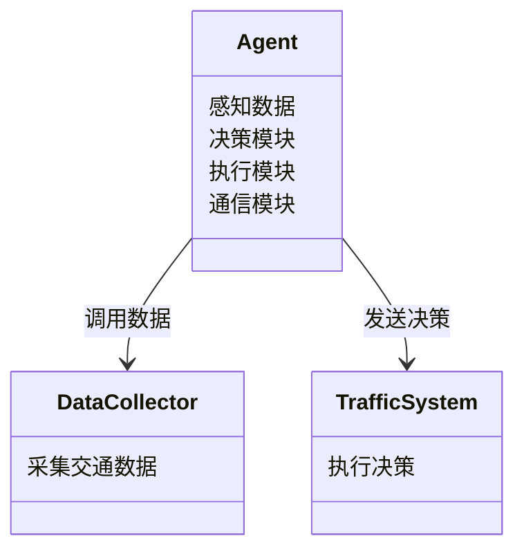
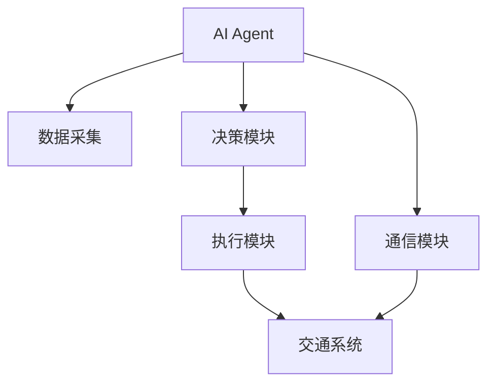
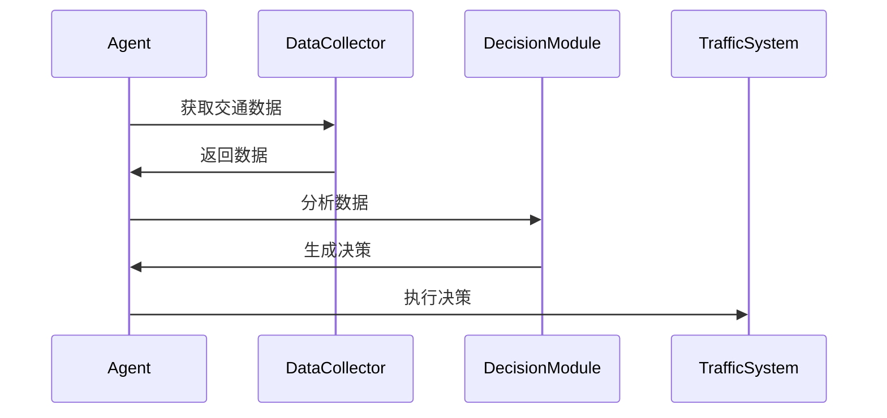

                 


# AI Agent在智能交通流量优化中的角色

## 关键词：
- AI Agent
- 智能交通系统
- 流量优化
- 强化学习
- 多智能体系统

## 摘要：
本文探讨了AI Agent在智能交通流量优化中的应用，分析了其核心概念、算法原理、系统架构及实际案例。通过对比传统方法，展示了AI Agent的优势，详细讲解了基于强化学习的优化算法，并提供了系统设计与项目实现的指导。最后，总结了最佳实践，为读者提供全面的见解。

---

# 第一部分: AI Agent在智能交通流量优化中的角色概述

## 第1章: AI Agent与智能交通流量优化概述

### 1.1 问题背景与描述
#### 1.1.1 城市交通拥堵问题的现状
城市交通拥堵是一个全球性的难题，导致时间浪费、能源消耗和环境污染。传统方法依赖于交通信号优化和道路扩建，但难以应对动态变化的交通需求。

#### 1.1.2 AI Agent在交通优化中的应用潜力
AI Agent能够实时分析交通数据，自主决策，优化信号控制和路径规划，提升交通效率。

#### 1.1.3 问题解决的必要性与目标
通过AI Agent优化交通流量，减少拥堵，提高道路使用效率，降低污染，目标是实现智能、高效的交通管理系统。

### 1.2 AI Agent的核心概念与特点
#### 1.2.1 AI Agent的定义与分类
AI Agent是能够感知环境、自主决策的智能体，分为简单反射型、基于模型的反射型、目标驱动型和效用驱动型。

#### 1.2.2 AI Agent在交通优化中的核心功能
实时数据处理、自主决策、多智能体协作、动态调整策略。

#### 1.2.3 与传统交通优化方法的对比
AI Agent的优势在于智能化、实时性和灵活性，能够应对复杂的交通场景。

### 1.3 AI Agent的边界与外延
#### 1.3.1 AI Agent在交通优化中的应用范围
包括交通信号控制、路径规划、流量预测和应急响应。

#### 1.3.2 相关概念的区分与联系
区分AI Agent与传统算法，联系多智能体系统和强化学习。

#### 1.3.3 AI Agent与其他技术的协同作用
与大数据分析、云计算协同，提升系统的处理能力和数据利用率。

### 1.4 核心要素与概念结构
#### 1.4.1 AI Agent的组成要素
感知模块、决策模块、执行模块和通信模块。

#### 1.4.2 概念结构图解析
AI Agent通过感知数据，经决策模块处理后，执行指令并反馈，形成闭环。

#### 1.4.3 核心要素的相互作用
感知与决策相互依赖，决策与执行紧密相连，通信模块确保协作。

---

## 第2章: AI Agent的核心概念与原理

### 2.1 AI Agent的原理分析
#### 2.1.1 多智能体系统的基本原理
多智能体系统通过协作实现复杂任务，应用于交通优化中。

#### 2.1.2 AI Agent的决策机制
基于环境信息，通过学习和推理做出最优决策。

#### 2.1.3 强化学习在AI Agent中的应用
强化学习通过试错优化策略，适用于动态变化的交通环境。

### 2.2 核心概念属性对比
| 比较维度 | 传统方法 | AI Agent |
|----------|-----------|-----------|
| 响应时间 | 较慢      | 实时      |
| 灵活性   | 低        | 高        |
| 处理能力 | 单一      | 多维      |

### 2.3 ER实体关系图
```mermaid
er
  actor(Agent, role: "优化决策者")
  actor(Car, role: "交通参与者")
  actor(Road, role: "交通设施")
  actor(Signal, role: "信号灯")
  relation(Agent, Car, "监控")
  relation(Agent, Road, "规划")
  relation(Agent, Signal, "控制")
  relation(Car, Road, "行驶于")
  relation(Car, Signal, "响应于")
```

---

## 第3章: AI Agent的算法原理

### 3.1 算法原理概述
#### 3.1.1 改进的强化学习算法
结合Q-learning和Deep Q-Network，提升学习效率和稳定性。

#### 3.1.2 算法的数学模型
状态空间、动作空间、奖励函数，公式如下：
$$ Q(s, a) = Q(s, a) + \alpha (r + \gamma \max Q(s', a') - Q(s, a)) $$

#### 3.1.3 算法的优化策略
经验回放和目标网络，避免灾难性遗忘，加速收敛。

### 3.2 算法流程图


### 3.3 算法实现代码
```python
import numpy as np

class AI-Agent:
    def __init__(self, state_space, action_space):
        self.state_space = state_space
        self.action_space = action_space
        self.q_table = np.zeros((state_space, action_space))
        self.alpha = 0.1
        self.gamma = 0.9

    def choose_action(self, state):
        if np.random.random() < 0.9:
            return np.argmax(self.q_table[state])
        else:
            return np.random.randint(self.action_space)
    
    def update_q(self, state, action, reward, next_state):
        self.q_table[state][action] += self.alpha * (reward + self.gamma * np.max(self.q_table[next_state]) - self.q_table[state][action])
```

---

## 第4章: AI Agent的系统分析与架构设计

### 4.1 问题场景介绍
城市交通管理系统，需要优化信号控制和路径规划。

### 4.2 项目介绍
开发AI Agent系统，实现交通流量优化。

### 4.3 系统功能设计
#### 4.3.1 领域模型


### 4.4 系统架构设计


### 4.5 系统接口设计
#### 接口1：数据接口
从传感器获取实时数据，格式为JSON。

#### 接口2：决策接口
返回信号控制指令，格式为XML。

### 4.6 系统交互序列图


---

## 第5章: 项目实战

### 5.1 环境安装
安装Python、NumPy、Scikit-learn、Mermaid工具。

### 5.2 核心代码实现
实现AI Agent类，数据预处理，模型训练，结果展示。

### 5.3 代码解读
- 数据预处理：处理传感器数据，提取特征。
- 模型训练：使用强化学习算法优化Q值表。
- 结果展示：可视化交通流量变化。

### 5.4 实际案例分析
以某城市为例，展示AI Agent如何优化信号灯控制，减少拥堵。

### 5.5 项目小结
总结成果，分析优势与不足，提出改进建议。

---

## 第6章: 最佳实践 tips

### 6.1 小结
AI Agent在交通优化中展现了巨大潜力，但仍需解决数据隐私和模型泛化问题。

### 6.2 注意事项
确保数据质量和实时性，处理模型泛化能力，避免过拟合。

### 6.3 拓展阅读
推荐书籍和论文，深入学习多智能体系统和强化学习。

---

# 结语
AI Agent在智能交通中的应用前景广阔，通过不断优化算法和系统设计，未来将实现更高效、智能的交通管理。

