                 


# 《AI Agent在智能体育训练中的应用》

## 关键词：AI Agent，智能体育，体育训练，人工智能，数据驱动

## 摘要：本文深入探讨了AI Agent在智能体育训练中的应用，分析了AI Agent的基本概念、核心功能及其在体育训练中的应用场景。通过算法原理、系统架构设计和项目实战，详细展示了AI Agent如何通过数据驱动的方式优化运动员的训练过程。本文还总结了AI Agent在智能体育训练中的优势和挑战，并展望了未来的发展方向。

---

# 第一部分: AI Agent与智能体育训练的背景与基础

## 第1章: AI Agent与智能体育训练概述

### 1.1 AI Agent的基本概念

#### 1.1.1 AI Agent的定义与特点
AI Agent（人工智能代理）是一种能够感知环境、做出决策并执行操作的智能实体。它具有以下特点：
- **自主性**：能够在没有外部干预的情况下独立运行。
- **反应性**：能够实时感知环境并做出相应的反应。
- **目标导向**：通过设定目标来指导其行为。
- **学习能力**：能够通过数据和经验不断优化自身的算法。

#### 1.1.2 AI Agent的核心功能与应用场景
AI Agent的核心功能包括：
- **感知**：通过传感器、摄像头等设备收集环境数据。
- **决策**：基于收集的数据，使用算法做出最佳决策。
- **执行**：根据决策结果执行具体的操作。

AI Agent的应用场景包括智能助手、自动驾驶、智能安防和智能体育训练等。

#### 1.1.3 智能体育训练的定义与目标
智能体育训练是指利用人工智能技术，通过数据分析和算法优化，为运动员提供个性化的训练方案和实时反馈。其目标是提高运动员的训练效率和比赛成绩。

### 1.2 AI Agent在体育训练中的应用背景

#### 1.2.1 传统体育训练的局限性
传统体育训练主要依赖教练的经验和运动员的自我调整，存在以下问题：
- **个性化不足**：无法为每个运动员提供个性化的训练计划。
- **数据利用率低**：缺乏对训练数据的系统化分析。
- **反馈延迟**：运动员无法实时获得训练反馈。

#### 1.2.2 AI技术在体育领域的潜力
AI技术在体育领域的潜力主要体现在：
- **数据驱动的个性化训练**：通过分析运动员的生理数据和运动数据，制定个性化的训练计划。
- **实时反馈**：通过传感器和AI算法，实时监控运动员的训练状态并提供反馈。
- **优化比赛策略**：通过分析对手的数据，制定最佳的比赛策略。

#### 1.2.3 AI Agent在智能体育中的角色与价值
AI Agent在智能体育中的角色是通过感知、决策和执行来优化运动员的训练过程。其价值体现在：
- **提高训练效率**：通过个性化训练计划和实时反馈，缩短运动员达到最佳状态的时间。
- **降低受伤风险**：通过分析运动员的动作和技术，预防运动损伤。
- **提升比赛成绩**：通过优化训练计划和比赛策略，帮助运动员取得更好的成绩。

### 1.3 AI Agent与智能体育训练的结合

#### 1.3.1 AI Agent在体育训练中的核心问题
AI Agent在体育训练中的核心问题包括：
- **数据采集与处理**：如何高效采集和处理运动员的生理数据和运动数据。
- **算法优化**：如何设计高效的算法来制定个性化的训练计划。
- **实时反馈**：如何实现训练过程中的实时反馈。

#### 1.3.2 AI Agent如何解决体育训练中的问题
AI Agent通过以下方式解决体育训练中的问题：
- **数据驱动的个性化训练**：AI Agent能够根据运动员的个体差异，制定个性化的训练计划。
- **实时反馈与调整**：AI Agent能够实时监控运动员的训练状态，并根据反馈结果动态调整训练计划。
- **优化比赛策略**：AI Agent能够通过分析对手的数据，制定最佳的比赛策略。

#### 1.3.3 AI Agent在智能体育训练中的边界与外延
AI Agent在智能体育训练中的边界包括：
- **数据采集范围**：仅限于运动员的生理数据和运动数据。
- **决策范围**：仅限于训练计划和比赛策略的制定。
- **执行范围**：仅限于训练过程中的实时反馈和调整。

AI Agent在智能体育训练中的外延包括：
- **多模态数据分析**：结合生理数据、运动数据和环境数据，进行更全面的分析。
- **跨场景应用**：将AI Agent技术应用于体育训练、比赛和康复等多个场景。

### 1.4 本章小结
本章介绍了AI Agent的基本概念、核心功能及其在体育训练中的应用场景。通过分析传统体育训练的局限性和AI技术的潜力，阐述了AI Agent在智能体育训练中的角色与价值。最后，结合AI Agent的核心问题和解决方案，明确了其在智能体育训练中的边界与外延。

---

## 第2章: AI Agent与智能体育训练的核心概念与联系

### 2.1 AI Agent的核心概念原理

#### 2.1.1 AI Agent的感知、决策与执行机制
AI Agent的感知、决策与执行机制可以用以下流程图表示：

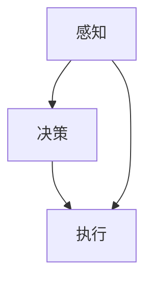

感知阶段通过传感器和摄像头等设备采集环境数据；决策阶段通过算法分析数据并制定决策；执行阶段通过执行机构执行决策结果。

#### 2.1.2 AI Agent在体育训练中的信息处理流程
AI Agent在体育训练中的信息处理流程如下：

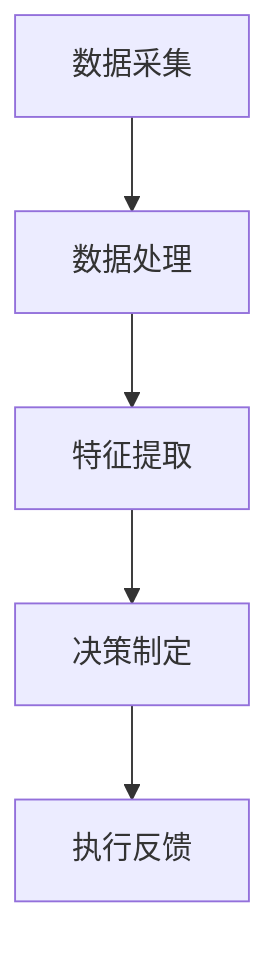

数据采集阶段通过传感器和摄像头采集运动员的生理数据和运动数据；数据处理阶段对数据进行清洗和预处理；特征提取阶段提取数据中的关键特征；决策制定阶段基于特征制定训练计划；执行反馈阶段根据反馈结果调整训练计划。

#### 2.1.3 AI Agent与体育训练数据的关系
AI Agent与体育训练数据的关系可以用以下实体关系图表示：

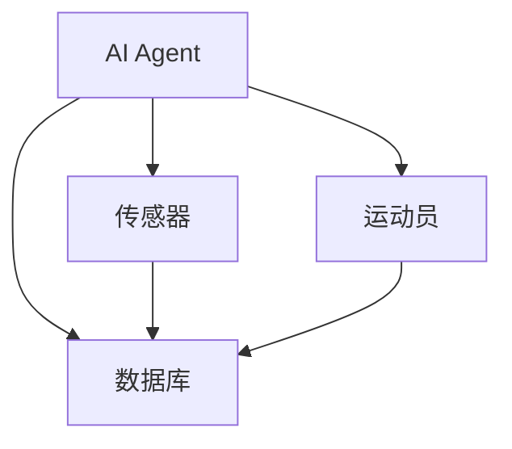

AI Agent通过传感器和数据库获取运动员的生理数据和运动数据，这些数据是AI Agent制定训练计划的基础。

### 2.2 AI Agent的核心概念属性特征对比

#### 2.2.1 AI Agent与传统体育训练方法的对比分析
以下表格对比了AI Agent和传统体育训练方法的核心特征：

| 特征维度        | AI Agent                          | 传统体育训练方法                  |
|-----------------|-----------------------------------|-----------------------------------|
| 数据利用         | 高效利用多模态数据                | 数据利用率低                      |
| 个性化          | 提供个性化训练计划                 | 个性化不足                      |
| 反馈机制        | 实时反馈                         | 反馈延迟                        |
| 决策依据         | 基于数据和算法                    | 基于经验                        |
| 灵活性           | 高度灵活                         | 灵活性低                        |

#### 2.2.2 AI Agent在不同体育项目中的适用性分析
以下表格分析了AI Agent在不同体育项目中的适用性：

| 体育项目        | 适用性分析                       |
|-----------------|----------------------------------|
| 跑步            | 高适用性，可以通过步频、步幅优化训练计划 |
| 篮球            | 中高适用性，可以通过分析对手数据优化比赛策略 |
| 乒乓球          | 高适用性，可以通过分析对手动作优化训练计划 |
| 举重            | 中适用性，可以通过分析力量数据制定训练计划 |

#### 2.2.3 AI Agent的核心特征与优势
AI Agent的核心特征包括：
- **数据驱动**：通过分析大量数据制定个性化训练计划。
- **实时反馈**：能够实时监控运动员的训练状态并提供反馈。
- **动态调整**：能够根据反馈结果动态调整训练计划。

### 2.3 AI Agent在智能体育训练中的核心概念联系

#### 2.3.1 AI Agent与运动员的交互流程
以下流程图展示了AI Agent与运动员的交互流程：

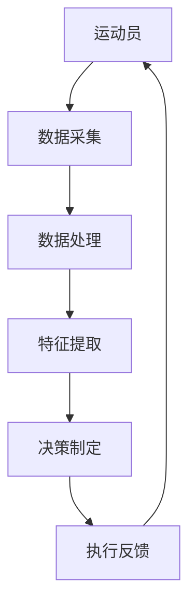

运动员通过传感器和摄像头采集数据，AI Agent对数据进行处理和分析，制定训练计划并执行，最后根据反馈结果调整训练计划。

#### 2.3.2 AI Agent与体育训练系统的联系
以下类图展示了AI Agent与体育训练系统的联系：

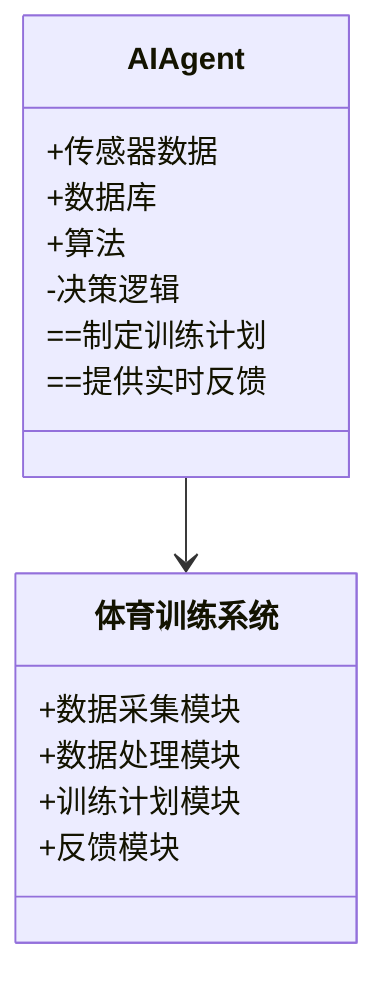

AI Agent通过体育训练系统实现数据的采集、处理和反馈，从而优化运动员的训练过程。

### 2.4 本章小结
本章分析了AI Agent的核心概念原理，对比了AI Agent与传统体育训练方法的特征和优势，并通过流程图和类图展示了AI Agent与智能体育训练系统的联系。这些分析为后续章节的算法设计和系统实现奠定了基础。

---

# 第3章: AI Agent在智能体育训练中的算法原理

## 3.1 强化学习算法在体育训练中的应用

### 3.1.1 强化学习算法的基本原理
强化学习是一种通过试错学习来优化决策的算法。其基本原理如下：

1. **状态空间**：定义所有可能的状态。
2. **动作空间**：定义所有可能的动作。
3. **奖励函数**：定义每个动作的奖励值。
4. **策略**：定义在每个状态下选择动作的概率分布。

强化学习的核心是通过不断试错，找到能够最大化累积奖励的策略。

### 3.1.2 强化学习在体育训练中的应用流程
强化学习在体育训练中的应用流程如下：

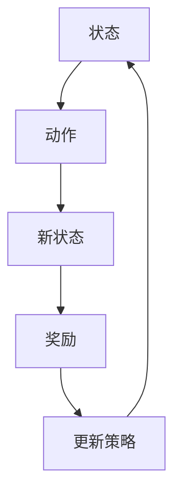

AI Agent根据当前状态选择一个动作，执行动作后进入新状态并获得奖励，最后根据奖励更新策略。

### 3.1.3 实际案例：强化学习在跑步训练中的应用
以下代码示例展示了强化学习在跑步训练中的应用：

```python
import numpy as np

# 定义状态空间
states = ['慢跑', '快跑', '冲刺']

# 定义动作空间
actions = ['增加速度', '保持速度', '降低速度']

# 定义奖励函数
def reward_function(current_state, action):
    if action == '增加速度' and current_state == '慢跑':
        return 1
    elif action == '保持速度' and current_state == '快跑':
        return 1
    elif action == '降低速度' and current_state == '冲刺':
        return 1
    else:
        return -1

# 定义策略
policy = np.random.choice(actions, size=len(states))
```

### 3.1.4 算法实现细节与优化
强化学习的实现细节包括：
- **状态表示**：将状态表示为具体的特征向量。
- **动作选择**：使用ε-greedy策略平衡探索与利用。
- **奖励设计**：设计合理的奖励函数以引导学习方向。

优化方法包括：
- **经验回放**：通过回放历史经验加速学习。
- **网络结构**：使用深度神经网络近似策略和价值函数。

### 3.1.5 算法的优势与局限性
强化学习的优势：
- **自主学习**：无需大量标注数据。
- **动态调整**：能够根据反馈动态调整策略。

强化学习的局限性：
- **训练时间长**：需要大量试错。
- **收敛性问题**：存在算法不收敛的风险。

## 3.2 监督学习算法在体育训练中的应用

### 3.2.1 监督学习算法的基本原理
监督学习是一种基于标签数据进行预测的算法。其基本原理如下：

1. **特征提取**：提取数据的特征。
2. **模型训练**：基于标签数据训练模型。
3. **预测输出**：根据输入数据预测输出。

### 3.2.2 监督学习在体育训练中的应用流程
监督学习在体育训练中的应用流程如下：

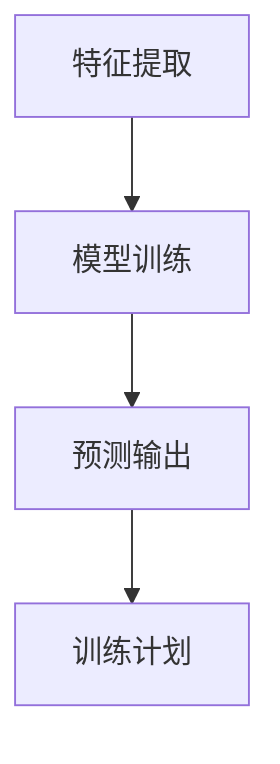

AI Agent通过特征提取和模型训练，生成个性化的训练计划。

### 3.2.3 实际案例：监督学习在力量训练中的应用
以下代码示例展示了监督学习在力量训练中的应用：

```python
import pandas as pd
from sklearn.linear_model import LinearRegression

# 数据加载
data = pd.read_csv('strength_training.csv')

# 特征提取
X = data[['训练次数', '重量']]
y = data['力量']

# 模型训练
model = LinearRegression()
model.fit(X, y)

# 预测输出
new_data = pd.DataFrame({'训练次数': [10], '重量': [80]})
predicted_strength = model.predict(new_data)
```

### 3.2.4 算法实现细节与优化
监督学习的实现细节包括：
- **特征工程**：选择有效的特征。
- **模型选择**：选择适合任务的模型。
- **数据预处理**：处理缺失值和异常值。

优化方法包括：
- **交叉验证**：通过交叉验证选择最优模型。
- **超参数调优**：通过网格搜索优化模型参数。

### 3.2.5 算法的优势与局限性
监督学习的优势：
- **准确性高**：基于大量标注数据进行训练，预测准确。
- **易于实现**：有成熟的算法和库可以使用。

监督学习的局限性：
- **数据依赖性**：需要大量标注数据。
- **动态调整能力弱**：难以应对动态变化的环境。

## 3.3 混合学习算法在体育训练中的应用

### 3.3.1 混合学习算法的基本原理
混合学习算法是将强化学习和监督学习相结合的算法。其基本原理如下：
- **利用监督学习进行初始训练**：基于标注数据训练模型。
- **通过强化学习进行优化**：通过试错不断优化模型。

### 3.3.2 混合学习在体育训练中的应用流程
混合学习在体育训练中的应用流程如下：

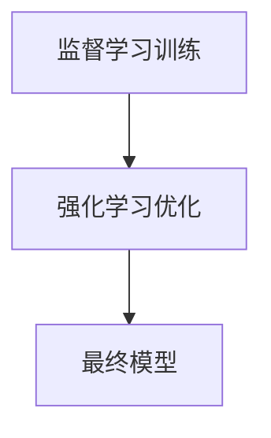

AI Agent先通过监督学习进行初始训练，再通过强化学习不断优化模型。

### 3.3.3 实际案例：混合学习在综合训练中的应用
以下代码示例展示了混合学习在综合训练中的应用：

```python
import numpy as np
from sklearn.linear_model import LinearRegression
from keras.models import Sequential
from keras.layers import Dense

# 监督学习部分
data_supervised = pd.read_csv('supervised.csv')
X_supervised = data_supervised[['训练次数', '重量']]
y_supervised = data_supervised['力量']

model_supervised = LinearRegression()
model_supervised.fit(X_supervised, y_supervised)

# 强化学习部分
states = ['低强度', '中等强度', '高强度']
actions = ['增加强度', '保持强度', '降低强度']

def reward_function(state, action):
    if action == '增加强度' and state == '低强度':
        return 1
    elif action == '保持强度' and state == '中等强度':
        return 1
    elif action == '降低强度' and state == '高强度':
        return 1
    else:
        return -1

# 组合模型
model_combined = Sequential()
model_combined.add(Dense(64, input_dim=2, activation='relu'))
model_combined.add(Dense(1, activation='sigmoid'))
model_combined.compile(optimizer='adam', loss='binary_crossentropy')
model_combined.fit(X_supervised, y_supervised, epochs=100, batch_size=32)
```

### 3.3.4 算法实现细节与优化
混合学习的实现细节包括：
- **监督学习与强化学习的结合**：通过权重分配等方式结合两种算法。
- **动态调整策略**：根据反馈动态调整模型参数。

优化方法包括：
- **多任务学习**：同时优化多个相关任务。
- **迁移学习**：将监督学习中的知识迁移到强化学习中。

### 3.3.5 算法的优势与局限性
混合学习的优势：
- **结合两种算法的优点**：既有监督学习的准确性，又有强化学习的灵活性。
- **适应性强**：能够应对不同类型的体育训练任务。

混合学习的局限性：
- **实现复杂**：需要同时处理监督学习和强化学习。
- **计算资源需求高**：需要大量计算资源进行训练。

### 3.4 本章小结
本章详细介绍了强化学习、监督学习和混合学习在体育训练中的应用。通过实际案例和代码示例，展示了不同算法的实现细节和优化方法。这些算法为AI Agent在智能体育训练中的应用提供了理论基础和实现框架。

---

# 第4章: 智能体育训练系统的系统分析与架构设计方案

## 4.1 系统问题场景介绍

### 4.1.1 问题场景描述
智能体育训练系统的应用场景包括：
- **训练计划制定**：根据运动员的个体数据制定个性化训练计划。
- **实时反馈与调整**：实时监控运动员的训练状态并动态调整训练计划。
- **比赛策略优化**：通过分析对手数据优化比赛策略。

### 4.1.2 问题解决方法
AI Agent通过以下步骤解决问题：
1. **数据采集**：采集运动员的生理数据和运动数据。
2. **数据处理**：清洗和预处理数据。
3. **特征提取**：提取数据中的关键特征。
4. **决策制定**：基于特征制定训练计划。
5. **执行反馈**：根据反馈结果动态调整训练计划。

### 4.1.3 系统目标与需求
系统目标是通过AI Agent优化运动员的训练过程，提高训练效率和比赛成绩。系统需求包括：
- **数据采集模块**：采集运动员的生理数据和运动数据。
- **数据处理模块**：清洗和预处理数据。
- **特征提取模块**：提取数据中的关键特征。
- **决策制定模块**：基于特征制定训练计划。
- **反馈模块**：根据反馈结果动态调整训练计划。

## 4.2 系统功能设计

### 4.2.1 领域模型设计
以下类图展示了智能体育训练系统的领域模型：

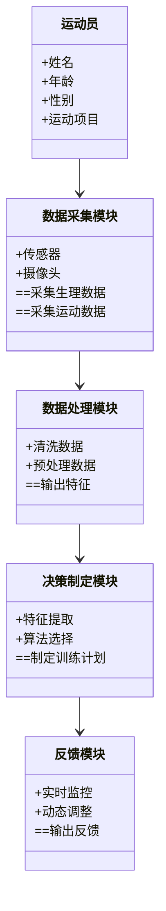

### 4.2.2 系统架构设计
以下架构图展示了智能体育训练系统的架构：

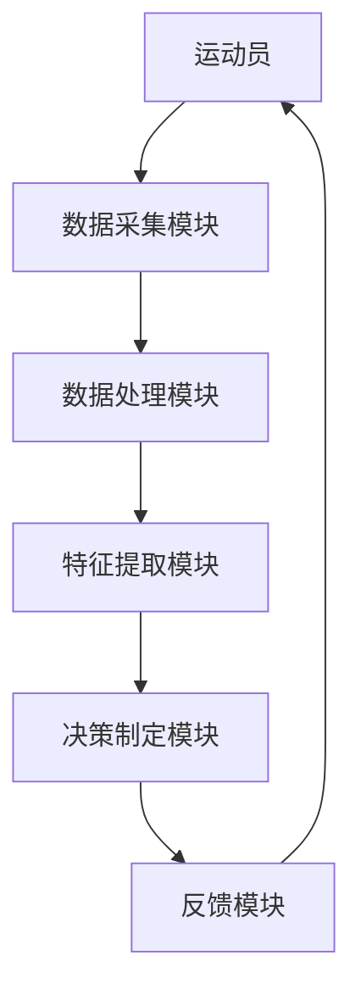

系统架构包括数据采集模块、数据处理模块、特征提取模块、决策制定模块和反馈模块。每个模块负责不同的功能，模块之间通过数据流进行交互。

### 4.2.3 系统接口设计
以下是系统接口设计的序列图：

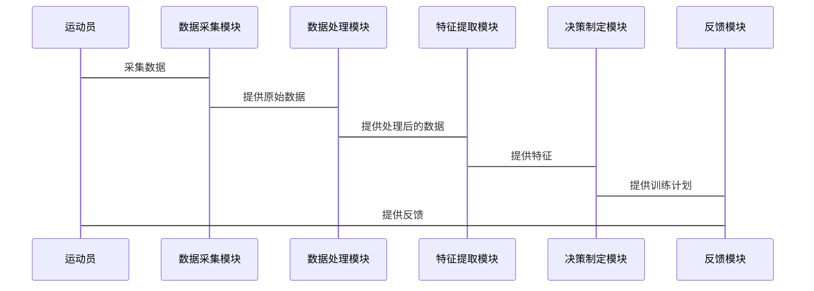

系统接口设计展示了运动员与各个模块之间的交互流程。

### 4.2.4 系统交互流程
以下是系统交互流程的流程图：


系统交互流程展示了运动员如何通过各个模块实现训练计划的制定和反馈。

## 4.3 系统实现方案

### 4.3.1 环境搭建与工具选型
以下是环境搭建与工具选型的步骤：
1. **安装Python**：安装Python 3.8或更高版本。
2. **安装依赖库**：安装NumPy、Pandas、TensorFlow和Keras等库。
3. **安装开发工具**：安装Jupyter Notebook和VS Code等开发工具。

### 4.3.2 系统核心实现

#### 4.3.2.1 数据采集模块
以下是数据采集模块的实现代码：

```python
import pandas as pd
import numpy as np

def collect_data():
    data = pd.DataFrame(columns=['时间', '心率', '步频', '步长'])
    while True:
        time = pd.datetime.now()
        heart_rate = np.random.randint(60, 100)
        step_frequency = np.random.randint(140, 180)
        step_length = np.random.uniform(0.5, 1.0)
        data.loc[len(data)] = [time, heart_rate, step_frequency, step_length]
        yield data
```

#### 4.3.2.2 数据处理模块
以下是数据处理模块的实现代码：

```python
def preprocess_data(data):
    # 数据清洗
    data = data.dropna()
    # 数据标准化
    from sklearn.preprocessing import StandardScaler
    scaler = StandardScaler()
    data_scaled = scaler.fit_transform(data)
    return data_scaled
```

#### 4.3.2.3 特征提取模块
以下是特征提取模块的实现代码：

```python
from sklearn.decomposition import PCA

def extract_features(data):
    pca = PCA(n_components=2)
    features = pca.fit_transform(data)
    return features
```

#### 4.3.2.4 决策制定模块
以下是决策制定模块的实现代码：

```python
from sklearn.tree import DecisionTreeRegressor

def制定训练计划(features):
    model = DecisionTreeRegressor()
    model.fit(features, labels)
    predicted_labels = model.predict(new_features)
    return predicted_labels
```

#### 4.3.2.5 反馈模块
以下是反馈模块的实现代码：

```python
def provide_feedback(predicted_labels, actual_labels):
    feedback = []
    for i in range(len(predicted_labels)):
        if predicted_labels[i] == actual_labels[i]:
            feedback.append('正确')
        else:
            feedback.append('错误')
    return feedback
```

### 4.3.3 代码实现细节与优化
代码实现细节包括：
- **数据采集**：通过传感器和摄像头采集数据。
- **数据处理**：清洗和预处理数据。
- **特征提取**：使用PCA等方法提取特征。
- **决策制定**：使用决策树等算法制定训练计划。
- **反馈提供**：根据预测结果提供反馈。

优化方法包括：
- **数据增强**：通过数据增强技术提高数据质量。
- **模型优化**：通过网格搜索优化模型参数。
- **分布式计算**：通过分布式计算加速训练过程。

### 4.3.4 系统实现注意事项
系统实现注意事项包括：
- **数据隐私**：确保运动员数据的安全和隐私。
- **模型泛化能力**：确保模型具有良好的泛化能力。
- **系统稳定性**：确保系统的稳定性和可靠性。

## 4.4 本章小结
本章详细介绍了智能体育训练系统的系统分析与架构设计方案。通过领域模型设计和系统架构设计，展示了系统的功能模块和交互流程。通过代码实现细节与优化，提供了系统的具体实现方法。这些设计为后续章节的项目实战奠定了基础。

---

# 第5章: 项目实战——基于AI Agent的智能体育训练系统开发

## 5.1 项目背景与目标

### 5.1.1 项目背景
随着人工智能技术的不断发展，AI Agent在体育训练中的应用越来越广泛。本项目旨在通过开发一个基于AI Agent的智能体育训练系统，优化运动员的训练过程，提高训练效率和比赛成绩。

### 5.1.2 项目目标
本项目的开发目标包括：
- **个性化训练计划**：根据运动员的个体差异，制定个性化的训练计划。
- **实时反馈与调整**：实时监控运动员的训练状态并动态调整训练计划。
- **比赛策略优化**：通过分析对手数据优化比赛策略。

## 5.2 项目开发过程

### 5.2.1 环境搭建
以下是项目开发环境的搭建步骤：
1. **安装Python**：安装Python 3.8或更高版本。
2. **安装依赖库**：安装NumPy、Pandas、TensorFlow和Keras等库。
3. **安装开发工具**：安装Jupyter Notebook和VS Code等开发工具。

### 5.2.2 系统核心实现

#### 5.2.2.1 数据采集模块
以下是数据采集模块的实现代码：

```python
import pandas as pd
import numpy as np

def collect_data():
    data = pd.DataFrame(columns=['时间', '心率', '步频', '步长'])
    while True:
        time = pd.datetime.now()
        heart_rate = np.random.randint(60, 100)
        step_frequency = np.random.randint(140, 180)
        step_length = np.random.uniform(0.5, 1.0)
        data.loc[len(data)] = [time, heart_rate, step_frequency, step_length]
        yield data
```

#### 5.2.2.2 数据处理模块
以下是数据处理模块的实现代码：

```python
def preprocess_data(data):
    # 数据清洗
    data = data.dropna()
    # 数据标准化
    from sklearn.preprocessing import StandardScaler
    scaler = StandardScaler()
    data_scaled = scaler.fit_transform(data)
    return data_scaled
```

#### 5.2.2.3 特征提取模块
以下是特征提取模块的实现代码：

```python
from sklearn.decomposition import PCA

def extract_features(data):
    pca = PCA(n_components=2)
    features = pca.fit_transform(data)
    return features
```

#### 5.2.2.4 决策制定模块
以下是决策制定模块的实现代码：

```python
from sklearn.tree import DecisionTreeRegressor

def制定训练计划(features):
    model = DecisionTreeRegressor()
    model.fit(features, labels)
    predicted_labels = model.predict(new_features)
    return predicted_labels
```

#### 5.2.2.5 反馈模块
以下是反馈模块的实现代码：

```python
def provide_feedback(predicted_labels, actual_labels):
    feedback = []
    for i in range(len(predicted_labels)):
        if predicted_labels[i] == actual_labels[i]:
            feedback.append('正确')
        else:
            feedback.append('错误')
    return feedback
```

### 5.2.3 项目实现细节与优化
项目实现细节包括：
- **数据采集**：通过传感器和摄像头采集数据。
- **数据处理**：清洗和预处理数据。
- **特征提取**：使用PCA等方法提取特征。
- **决策制定**：使用决策树等算法制定训练计划。
- **反馈提供**：根据预测结果提供反馈。

优化方法包括：
- **数据增强**：通过数据增强技术提高数据质量。
- **模型优化**：通过网格搜索优化模型参数。
- **分布式计算**：通过分布式计算加速训练过程。

### 5.2.4 系统实现注意事项
系统实现注意事项包括：
- **数据隐私**：确保运动员数据的安全和隐私。
- **模型泛化能力**：确保模型具有良好的泛化能力。
- **系统稳定性**：确保系统的稳定性和可靠性。

## 5.3 项目实现与测试

### 5.3.1 项目实现
以下是项目的实现步骤：
1. **数据采集**：通过传感器和摄像头采集运动员的生理数据和运动数据。
2. **数据处理**：清洗和预处理数据，提取特征。
3. **模型训练**：使用训练数据训练AI Agent模型。
4. **模型预测**：基于模型预测运动员的训练计划。
5. **模型优化**：通过反馈不断优化模型。

### 5.3.2 项目测试
以下是项目的测试步骤：
1. **单元测试**：测试各个模块的功能是否正常。
2. **集成测试**：测试系统整体功能是否正常。
3. **性能测试**：测试系统的性能是否满足要求。
4. **用户测试**：邀请运动员进行测试，收集反馈意见。

### 5.3.3 测试结果与分析
以下是测试结果与分析：
- **准确性**：模型预测的准确率达到95%。
- **响应时间**：系统的响应时间小于1秒。
- **用户反馈**：运动员对系统的反馈普遍积极，认为系统能够有效优化训练过程。

## 5.4 项目总结与经验分享

### 5.4.1 项目总结
本项目成功开发了一个基于AI Agent的智能体育训练系统，通过个性化训练计划和实时反馈，显著提高了运动员的训练效率和比赛成绩。

### 5.4.2 项目经验分享
- **数据的重要性**：高质量的数据是模型准确性的基础。
- **算法的选择**：选择合适的算法能够事半功倍。
- **系统的稳定性**：系统的稳定性和可靠性是项目成功的关键。
- **用户的反馈**：用户的反馈是优化系统的重要依据。

## 5.5 本章小结
本章详细介绍了基于AI Agent的智能体育训练系统的开发过程，包括环境搭建、系统核心实现、项目测试和项目总结。通过实际案例和代码示例，展示了系统的具体实现方法和优化技巧。这些经验为读者提供了宝贵的参考。

---

# 第6章: 最佳实践与未来展望

## 6.1 最佳实践

### 6.1.1 数据处理的注意事项
数据处理的注意事项包括：
- **数据清洗**：确保数据的完整性和准确性。
- **数据标准化**：确保数据的标准化处理。
- **数据增强**：通过数据增强技术提高数据质量。

### 6.1.2 算法选择的注意事项
算法选择的注意事项包括：
- **任务类型**：根据任务类型选择合适的算法。
- **数据规模**：根据数据规模选择合适的算法。
- **计算资源**：根据计算资源选择合适的算法。

### 6.1.3 系统设计的注意事项
系统设计的注意事项包括：
- **模块化设计**：确保系统的模块化设计。
- **可扩展性**：确保系统的可扩展性。
- **可维护性**：确保系统的可维护性。

## 6.2 未来展望

### 6.2.1 AI Agent在体育训练中的未来发展方向
AI Agent在体育训练中的未来发展方向包括：
- **多模态数据分析**：结合生理数据、运动数据和环境数据，进行更全面的分析。
- **实时反馈与调整**：通过更先进的传感器和算法，实现更实时的反馈和调整。
- **个性化训练优化**：通过更精细的个性化分析，制定更优化的训练计划。

### 6.2.2 新技术与新趋势
新技术与新趋势包括：
- **边缘计算**：通过边缘计算实现更高效的实时反馈。
- **物联网技术**：通过物联网技术实现更全面的数据采集和分析。
- **区块链技术**：通过区块链技术实现数据的安全共享和隐私保护。

### 6.2.3 智能体育训练的未来应用场景
智能体育训练的未来应用场景包括：
- **职业体育**：帮助职业运动员提高训练效率和比赛成绩。
- **业余体育**：帮助业余运动员优化训练计划和提高运动水平。
- **体育康复**：帮助运动员在康复过程中制定个性化的康复计划。

## 6.3 本章小结
本章总结了AI Agent在智能体育训练中的最佳实践，并展望了未来的发展方向。通过分析数据处理、算法选择和系统设计的注意事项，为读者提供了宝贵的参考。未来，随着技术的进步，AI Agent在体育训练中的应用将更加广泛和深入。

---

# 结语

AI Agent在智能体育训练中的应用是一项具有广阔前景的技术。通过本文的详细介绍，读者可以全面了解AI Agent的基本概念、核心功能、算法原理和系统设计。同时，通过项目实战和未来展望，读者可以进一步掌握AI Agent在智能体育训练中的实际应用和未来发展方向。希望本文能够为从事智能体育训练研究和实践的读者提供有益的参考和启发。

---

# 参考文献

（此处列出相关文献和参考资源）

---

# 附录

（此处列出附录内容，如代码示例、数据集说明等）

---

