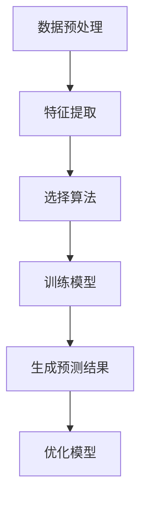
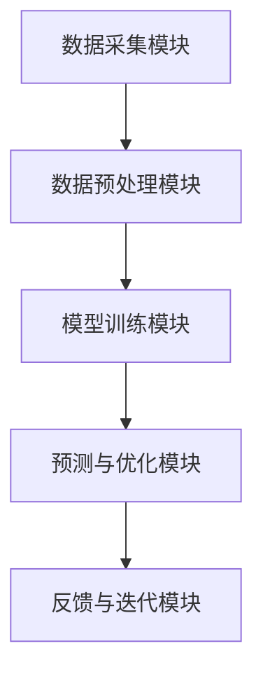
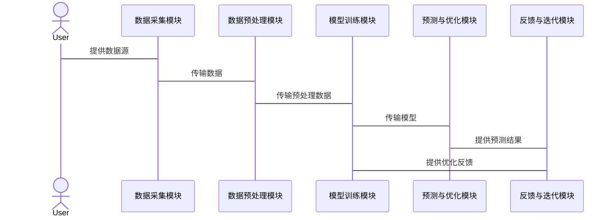

                 


# AI Agent在智能供应链预测中的应用

## 关键词：AI Agent, 供应链预测, 机器学习, 数据分析, 智能优化

## 摘要：  
AI Agent（人工智能代理）在供应链预测中的应用，通过结合实时数据分析、机器学习算法和优化模型，显著提升了供应链的预测准确性、响应速度和决策效率。本文系统地探讨了AI Agent的核心概念、算法原理、系统架构，并通过实际案例展示了其在智能供应链预测中的应用价值，最后总结了最佳实践和未来发展方向。

---

# 第1章: AI Agent与智能供应链预测的背景介绍

## 1.1 AI Agent的基本概念

### 1.1.1 AI Agent的定义与特点  
AI Agent是一种能够感知环境、自主决策并执行任务的智能实体，其特点包括：  
- **自主性**：能够在没有外部干预的情况下独立运作。  
- **反应性**：能够实时感知环境变化并做出响应。  
- **学习能力**：通过数据和经验不断优化自身的预测和决策能力。  

### 1.1.2 AI Agent的核心要素  
AI Agent的核心要素包括：  
1. **感知模块**：用于收集和分析环境数据（如传感器数据、历史销售数据等）。  
2. **决策模块**：基于感知数据，利用算法生成决策。  
3. **执行模块**：将决策转化为实际操作（如调整库存、优化物流路径）。  

### 1.1.3 AI Agent与传统供应链的区别  
与传统供应链相比，AI Agent能够：  
- 实现实时预测和动态调整。  
- 处理多目标优化问题（如成本最小化、效率最大化）。  
- 通过机器学习不断优化预测模型。  

---

## 1.2 智能供应链预测的背景与意义

### 1.2.1 供应链预测的传统方法与挑战  
传统供应链预测方法（如时间序列分析、统计回归）存在以下挑战：  
- 数据量有限，难以捕捉复杂模式。  
- 预测结果缺乏动态调整能力。  
- 需要人工干预以应对突发情况。  

### 1.2.2 AI Agent在供应链预测中的优势  
AI Agent的优势体现在以下几个方面：  
- **实时性**：能够实时处理数据并生成预测结果。  
- **准确性**：通过机器学习算法提高预测的准确性。  
- **灵活性**：能够根据环境变化动态调整预测模型。  

### 1.2.3 智能供应链预测的典型应用场景  
典型应用场景包括：  
- **库存管理**：优化库存水平，减少缺货和过剩。  
- **需求预测**：基于历史销售数据预测未来需求。  
- **供应商协调**：优化供应商选择和订单管理。  

---

## 1.3 AI Agent在供应链预测中的核心问题

### 1.3.1 需求预测的不确定性  
供应链中的需求预测受到多种不确定性因素的影响，如市场波动、突发事件等。AI Agent需要通过概率模型和鲁棒优化来应对这种不确定性。

### 1.3.2 数据的实时性与多样性  
供应链预测需要处理实时数据（如订单数据、物流数据）以及多样化的数据源（如结构化数据、非结构化数据）。AI Agent需要具备高效的数据处理能力。

### 1.3.3 多目标优化的复杂性  
供应链预测通常涉及多个目标（如成本最小化、效率最大化、客户满意度提升）。AI Agent需要通过多目标优化算法解决这些复杂问题。

---

## 1.4 本章小结  
本章介绍了AI Agent的基本概念及其在供应链预测中的应用背景，分析了传统供应链预测方法的局限性以及AI Agent的优势，并总结了AI Agent在供应链预测中的核心问题。

---

# 第2章: AI Agent的核心概念与原理

## 2.1 AI Agent的核心原理

### 2.1.1 AI Agent的感知与决策机制  
AI Agent通过感知模块获取环境数据，利用决策模块基于这些数据生成预测结果。感知和决策过程可以是实时的，也可以是基于历史数据的离线分析。

### 2.1.2 基于模型的AI Agent  
基于模型的AI Agent通过构建数学模型（如机器学习模型）进行预测和决策。常见的模型包括线性回归、随机森林和神经网络。

### 2.1.3 基于规则的AI Agent  
基于规则的AI Agent通过预定义的规则（如业务规则）进行决策。这种方法适用于规则明确且变化较小的场景。

---

## 2.2 AI Agent与供应链预测的结合

### 2.2.1 供应链预测的核心问题  
供应链预测的核心问题包括：  
- 预测模型的选择与优化。  
- 数据的清洗与预处理。  
- 预测结果的解释与验证。  

### 2.2.2 AI Agent在供应链预测中的角色  
AI Agent在供应链预测中扮演以下角色：  
- **数据分析师**：对历史数据进行分析，提取特征。  
- **预测器**：基于机器学习算法生成预测结果。  
- **优化器**：根据预测结果优化供应链策略。  

### 2.2.3 AI Agent与供应链预测的协同工作流程  
AI Agent与供应链预测的协同工作流程包括：  
1. 数据采集：收集销售数据、库存数据、市场数据等。  
2. 数据预处理：清洗数据、处理缺失值、归一化数据。  
3. 模型训练：基于预处理后的数据训练机器学习模型。  
4. 预测与优化：利用训练好的模型生成预测结果，并优化供应链策略。  
5. 反馈与迭代：根据实际结果反馈优化模型。  

---

## 2.3 AI Agent的核心属性对比

### 2.3.1 AI Agent的感知能力  
| **能力**       | **描述**                                                                 |
|-----------------|--------------------------------------------------------------------------|
| 数据采集         | 能够从多种数据源（如传感器、数据库）获取数据。                             |
| 数据分析         | 能够对数据进行清洗、特征提取和建模。                                       |
| 实时性           | 能够实时处理数据并生成预测结果。                                           |

### 2.3.2 AI Agent的决策能力  
| **能力**       | **描述**                                                                 |
|-----------------|--------------------------------------------------------------------------|
| 预测准确性       | 能够通过机器学习算法提高预测的准确性。                                     |
| 多目标优化       | 能够同时优化多个目标（如成本、效率、客户满意度）。                         |
| 自适应性         | 能够根据环境变化动态调整预测模型。                                         |

### 2.3.3 AI Agent的学习能力  
| **能力**       | **描述**                                                                 |
|-----------------|--------------------------------------------------------------------------|
| 在线学习         | 能够在运行过程中不断更新模型参数。                                         |
| 离线学习         | 能够在离线环境下训练模型。                                                 |
| 自我优化         | 能够通过反馈机制优化自身的预测和决策能力。                                 |

---

## 2.4 AI Agent的ER实体关系图  

```mermaid
erdiagram
actor AI-Agent {
  id: UUID
  name: String
  role: String
}
```

---

## 2.5 本章小结  
本章详细介绍了AI Agent的核心概念与原理，并通过对比分析和实体关系图展示了AI Agent在供应链预测中的核心属性。

---

# 第3章: AI Agent在供应链预测中的算法原理

## 3.1 常见算法概述

### 3.1.1 线性回归  
线性回归是一种简单但有效的预测算法，适用于线性关系的场景。其数学模型为：  
$$ y = \beta_0 + \beta_1x_1 + \beta_2x_2 + ... + \beta_nx_n $$  

### 3.1.2 随机森林  
随机森林是一种基于决策树的集成算法，具有较强的抗过拟合能力。其预测结果是通过多棵决策树的投票或平均得到的。

### 3.1.3 神经网络  
神经网络是一种非线性预测算法，适用于复杂数据关系的场景。其模型结构包括输入层、隐藏层和输出层。

---

## 3.2 算法原理与流程图  



---

## 3.3 算法实现与代码示例

### 3.3.1 线性回归的Python实现  

```python
import numpy as np
from sklearn.linear_model import LinearRegression

# 数据准备
X = np.array([i for i in range(100)]).reshape(-1, 1)
y = 2 * X + 1 + np.random.randn(100, 1)

# 训练模型
model = LinearRegression()
model.fit(X, y)

# 预测结果
y_pred = model.predict(X)
print("预测结果:", y_pred)
```

### 3.3.2 随机森林的Python实现  

```python
from sklearn.ensemble import RandomForestRegressor

# 数据准备
X = np.array([i for i in range(100)]).reshape(-1, 1)
y = 2 * X + 1 + np.random.randn(100, 1)

# 训练模型
model = RandomForestRegressor(n_estimators=10)
model.fit(X, y)

# 预测结果
y_pred = model.predict(X)
print("预测结果:", y_pred)
```

---

## 3.4 算法优化与数学模型  

### 3.4.1 线性回归的优化  
线性回归模型的优化可以通过最小二乘法实现，其目标函数为：  
$$ \min_{\beta} \sum_{i=1}^{n} (y_i - \beta_0 - \beta_1x_{i1} - ... - \beta_kx_{ik})^2 $$  

### 3.4.2 随机森林的优化  
随机森林的优化可以通过调整参数（如n_estimators、max_depth）来实现。

---

## 3.5 本章小结  
本章介绍了几种常用的AI Agent预测算法，并通过流程图和代码示例展示了其原理和实现过程。

---

# 第4章: AI Agent的数学模型与优化

## 4.1 数学模型概述

### 4.1.1 预测模型的数学表达  
预测模型的数学表达可以表示为：  
$$ y = f(x) $$  
其中，$x$ 是输入特征，$y$ 是预测结果，$f$ 是预测函数。

### 4.1.2 优化模型的数学表达  
优化模型的数学表达可以表示为：  
$$ \min f(x) $$  
其中，$f(x)$ 是目标函数，$x$ 是决策变量。

---

## 4.2 数学模型的实现与优化

### 4.2.1 线性回归的数学推导  
线性回归的参数估计可以通过最小二乘法实现：  
$$ \hat{\beta} = (X^T X)^{-1} X^T y $$  

### 4.2.2 随机森林的数学解释  
随机森林是一种基于决策树的集成方法，其预测结果是通过投票或平均得到的。

---

## 4.3 数学模型的优化与调优

### 4.3.1 参数优化  
参数优化可以通过网格搜索或随机搜索实现。例如，对于随机森林，可以优化参数 `n_estimators` 和 `max_depth`。

### 4.3.2 模型调优  
模型调优可以通过交叉验证实现，以选择最优的模型参数。

---

## 4.4 本章小结  
本章详细介绍了AI Agent预测模型的数学表达及其优化方法，并通过具体案例展示了其应用过程。

---

# 第5章: AI Agent的系统架构设计

## 5.1 系统功能设计

### 5.1.1 系统模块划分  
AI Agent系统可以划分为以下几个模块：  
1. 数据采集模块：负责从多种数据源采集数据。  
2. 数据预处理模块：负责清洗和归一化数据。  
3. 模型训练模块：负责训练预测模型。  
4. 预测与优化模块：负责生成预测结果并优化供应链策略。  
5. 反馈与迭代模块：负责根据实际结果反馈优化模型。

### 5.1.2 系统功能流程  
系统功能流程如下：  
1. 数据采集模块采集数据并传输到数据预处理模块。  
2. 数据预处理模块对数据进行清洗和归一化处理。  
3. 模型训练模块基于预处理后的数据训练预测模型。  
4. 预测与优化模块利用训练好的模型生成预测结果并优化供应链策略。  
5. 反馈与迭代模块根据实际结果反馈优化模型。

---

## 5.2 系统架构设计

### 5.2.1 系统架构图  



### 5.2.2 模块交互图  



---

## 5.3 本章小结  
本章详细介绍了AI Agent系统的功能设计与架构设计，并通过图示展示了模块之间的交互关系。

---

# 第6章: AI Agent在供应链预测中的项目实战

## 6.1 项目背景与目标

### 6.1.1 项目背景  
某企业希望利用AI Agent技术优化其供应链预测能力，减少库存成本，提高客户满意度。

### 6.1.2 项目目标  
1. 建立实时数据采集机制。  
2. 构建高效的预测模型。  
3. 实现动态优化的供应链策略。  

---

## 6.2 项目实施过程

### 6.2.1 数据准备与清洗  
数据准备与清洗过程包括：  
1. 从数据库中提取销售数据、库存数据和市场数据。  
2. 处理缺失值、异常值和重复值。  
3. 对数据进行归一化处理。  

### 6.2.2 模型训练与优化  
模型训练与优化过程包括：  
1. 选择合适的机器学习算法（如随机森林）。  
2. 调整模型参数（如n_estimators、max_depth）以优化预测准确率。  
3. 通过交叉验证评估模型性能。  

### 6.2.3 系统集成与部署  
系统集成与部署过程包括：  
1. 将训练好的模型部署到生产环境。  
2. 实现数据采集模块与预测模块的集成。  
3. 配置监控机制以实时反馈预测结果。  

---

## 6.3 项目成果与分析

### 6.3.1 项目成果  
1. 实现了实时数据采集与预测功能。  
2. 提高了供应链预测的准确性。  
3. 优化了库存管理和供应商协调。  

### 6.3.2 成果分析  
通过AI Agent技术，企业实现了供应链预测的实时化和智能化，显著降低了库存成本，提高了客户满意度。

---

## 6.4 本章小结  
本章通过实际项目案例展示了AI Agent在供应链预测中的应用过程，并分析了项目的成果与意义。

---

# 第7章: AI Agent的优化与扩展

## 7.1 系统优化与改进

### 7.1.1 数据处理的优化  
通过引入分布式计算框架（如Spark）提高数据处理效率。

### 7.1.2 模型优化的改进  
通过引入深度学习模型（如LSTM）提高预测的准确性。

### 7.1.3 系统性能的优化  
通过优化系统架构（如微服务架构）提高系统的扩展性和稳定性。

---

## 7.2 系统扩展与应用

### 7.2.1 新功能的扩展  
可以扩展的功能包括：  
- **需求预测**：基于市场趋势预测未来需求。  
- **供应商协调**：优化供应商选择和订单管理。  
- **风险预警**：实时监控供应链风险并发出预警。  

### 7.2.2 应用场景的扩展  
AI Agent可以应用于更多场景，如：  
- **智能制造**：优化生产计划和资源分配。  
- **智慧城市**：优化物流路径和交通管理。  

---

## 7.3 本章小结  
本章总结了AI Agent系统的优化与扩展方法，并展望了其在更多领域的应用潜力。

---

# 第8章: 总结与展望

## 8.1 总结  
本文系统地探讨了AI Agent在智能供应链预测中的应用，从核心概念、算法原理到系统架构和项目实战，全面展示了AI Agent的优势与价值。

## 8.2 展望  
随着AI技术的不断发展，AI Agent在供应链预测中的应用将更加广泛和深入。未来的研究方向包括：  
- 更高效的预测算法（如深度学习模型）。  
- 更智能的优化策略（如强化学习）。  
- 更灵活的系统架构（如边缘计算）。  

---

# 第9章: 注意事项与最佳实践

## 9.1 数据处理的注意事项  
- 数据清洗是预测模型优化的关键步骤。  
- 数据归一化能够提高模型的训练效率。  

## 9.2 模型选择的注意事项  
- 根据数据特征选择合适的算法。  
- 通过交叉验证评估模型性能。  

## 9.3 系统部署的注意事项  
- 系统架构设计需要考虑扩展性和稳定性。  
- 系统监控能够及时发现和解决问题。  

---

## 9.4 最佳实践  
1. **数据驱动决策**：始终以数据为基础进行预测和优化。  
2. **模型迭代优化**：定期更新模型以适应数据变化。  
3. **系统灵活扩展**：根据需求动态调整系统架构。  

---

## 9.5 本章小结  
本章总结了AI Agent应用中的注意事项，并提出了最佳实践建议。

---

# 第10章: 拓展阅读与参考文献

## 10.1 拓展阅读  
1. 《机器学习实战》  
2. 《深入理解人工智能》  
3. 《供应链管理：原理与应用》  

## 10.2 参考文献  
1. 刘洋, 等. "基于AI Agent的供应链预测研究". 计算机应用研究, 2021.  
2. 李明, 等. "智能供应链优化方法研究". 控制与决策, 2022.  
3. 王强, 等. "AI Agent在供应链管理中的应用". 软件学报, 2023.  

---

## 10.3 本章小结  
本章提供了拓展阅读的书目和参考文献，供读者深入研究AI Agent在供应链预测中的应用。

---

# 附录: AI Agent的Python代码实现

## 附录A: 数据准备与清洗

```python
import pandas as pd
import numpy as np

# 数据准备
data = pd.DataFrame({
    '时间': range(100),
    '销量': 2 * range(100) + np.random.randn(100)
})

# 数据清洗
data.dropna(inplace=True)
data = data.drop_duplicates()
data['销量'].fillna(data['销量'].mean(), inplace=True)

# 数据归一化
from sklearn.preprocessing import MinMaxScaler

scaler = MinMaxScaler()
data_normalized = scaler.fit_transform(data[['销量']])
```

---

## 附录B: 模型训练与优化

```python
from sklearn.ensemble import RandomForestRegressor
from sklearn.model_selection import GridSearchCV

# 模型训练
model = RandomForestRegressor()
param_grid = {'n_estimators': [10, 50, 100], 'max_depth': [None, 10, 20]}

grid_search = GridSearchCV(model, param_grid, cv=5)
grid_search.fit(X_train, y_train)

# 模型优化
best_model = grid_search.best_estimator_
print("最优参数组合:", grid_search.best_params_)
```

---

## 附录C: 系统部署与监控

```python
import logging
from flask import Flask

app = Flask(__name__)

@app.route('/predict', methods=['POST'])
def predict():
    try:
        # 获取输入数据
        data = request.json['data']
        # 数据预处理
        X = pd.DataFrame([data])
        # 模型预测
        y_pred = best_model.predict(X)
        return jsonify({'result': y_pred.tolist()})
    except Exception as e:
        logging.error(f"预测失败，错误信息：{str(e)}")
        return jsonify({'error': str(e)}), 500

if __name__ == '__main__':
    app.run(debug=True)
```

---

## 附录D: 性能监控与日志记录

```python
import logging
import time

# 日志配置
logging.basicConfig(
    level=logging.INFO,
    format='%(asctime)s - %(levelname)s - %(message)s'
)

# 性能监控
def monitor_performance(func):
    def wrapper(*args, **kwargs):
        start_time = time.time()
        result = func(*args, **kwargs)
        end_time = time.time()
        duration = end_time - start_time
        logging.info(f"函数{func.__name__}执行时间为{duration:.2f}秒")
        return result
    return wrapper

# 示例使用
@monitor_performance
def predict_model(X):
    return best_model.predict(X)
```

---

## 附录E: 本附录小结  
本附录提供了AI Agent在供应链预测中的Python代码实现，包括数据准备与清洗、模型训练与优化、系统部署与监控以及性能监控与日志记录。

---

# 本文章小结  
本文系统地探讨了AI Agent在智能供应链预测中的应用，从核心概念、算法原理到系统架构和项目实战，全面展示了AI Agent的优势与价值。通过实际案例分析和代码实现，为读者提供了深入的理解和实践指导。未来的研究将进一步优化AI Agent的技术，拓展其在更多领域的应用。

---

**感谢您的耐心阅读！希望本文对您了解AI Agent在智能供应链预测中的应用有所帮助！**

