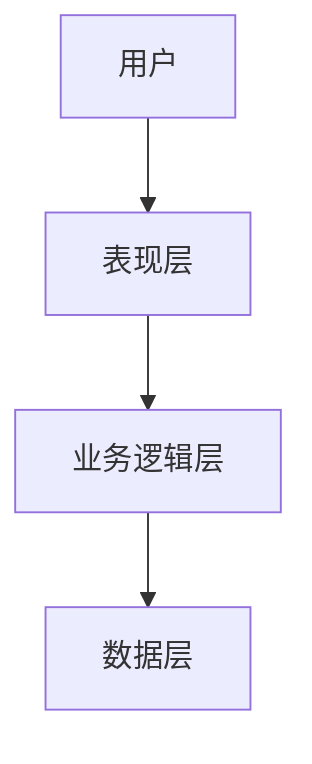

                 


# 《AI Agent在智能健康风险预测中的角色》

## 关键词：AI Agent、智能健康、风险预测、机器学习、健康数据

## 摘要：AI Agent作为人工智能的重要组成部分，正在逐步应用于健康风险预测领域。本文将详细探讨AI Agent在智能健康风险预测中的角色，从理论基础到核心算法，再到系统设计和项目实战，全面分析其在健康风险预测中的应用及其优势。通过本文，读者可以深入了解AI Agent如何帮助我们更准确地预测健康风险，从而在医疗健康领域发挥重要作用。

---

## 第一部分: 引言

## 第1章: AI Agent与智能健康风险预测概述

### 1.1 AI Agent的基本概念

#### 1.1.1 AI Agent的定义与特点
- 定义：AI Agent是一种智能体，能够感知环境、自主决策并执行任务。
- 特点：
  - 自主性：能够独立执行任务。
  - 反应性：能够实时感知环境并做出反应。
  - 学习性：能够通过数据和经验不断优化自身能力。

#### 1.1.2 AI Agent在健康领域的应用背景
- 健康领域的复杂性：医疗数据的多样性、实时性要求高。
- AI Agent的优势：能够处理海量数据，快速做出决策，提供个性化服务。

#### 1.1.3 智能健康风险预测的定义与目标
- 定义：通过AI技术预测个体或群体的健康风险。
- 目标：提前发现潜在健康问题，提供预防性医疗建议。

### 1.2 AI Agent在健康风险预测中的角色
#### 1.2.1 AI Agent的核心功能与能力
- 数据处理：能够处理结构化和非结构化数据。
- 风险评估：基于机器学习算法预测健康风险。
- 决策支持：为医疗决策提供支持。

#### 1.2.2 AI Agent在健康数据处理中的优势
- 处理海量数据：能够快速处理大量医疗数据。
- 实时分析：能够实时分析数据，提供即时反馈。
- 个性化服务：根据个体特征提供定制化健康建议。

#### 1.2.3 AI Agent在智能健康风险预测中的应用场景
- 疾病早期预警：预测疾病的发生，提前采取措施。
- 个性化治疗：根据患者特征制定个性化治疗方案。
- 疾病管理：帮助患者管理慢性疾病。

### 1.3 本章小结
本章介绍了AI Agent的基本概念及其在健康风险预测中的角色，为后续章节的分析奠定了基础。

---

## 第二部分: AI Agent的理论基础

## 第2章: AI Agent的核心概念与原理

### 2.1 AI Agent的基本原理

#### 2.1.1 AI Agent的决策机制
- 定义：AI Agent通过感知环境和历史数据做出决策。
- 常见决策机制：
  - 基于规则的决策：根据预设规则做出决策。
  - 基于模型的决策：通过机器学习模型预测结果。
  - 综合决策：结合规则和模型进行决策。

#### 2.1.2 AI Agent的学习与自适应能力
- 机器学习：AI Agent通过监督学习、无监督学习和强化学习不断优化自身能力。
- 自适应性：根据环境变化调整自身行为。

#### 2.1.3 AI Agent的通信与协作能力
- 通信：AI Agent能够与其他系统或人进行信息交换。
- 协作：通过协作完成复杂的任务，如多智能体系统。

### 2.2 AI Agent的核心算法与技术

#### 2.2.1 机器学习算法在AI Agent中的应用
- 监督学习：用于分类和回归任务。
- 无监督学习：用于聚类和降维。
- 强化学习：用于序列决策任务。

#### 2.2.2 自然语言处理在AI Agent中的应用
- 文本分析：处理医疗文档，提取有用信息。
- 语义理解：理解用户意图，提供个性化建议。

#### 2.2.3 图论与知识图谱在AI Agent中的应用
- 知识图谱构建：将医疗知识组织成图结构。
- 图论算法：用于路径分析和关系推理。

### 2.3 AI Agent在健康数据处理中的数学模型

#### 2.3.1 健康数据的特征提取与分析
- 特征提取：从医疗数据中提取有用的特征。
- 数据分析：通过统计分析理解数据分布。

#### 2.3.2 基于概率论的健康风险评估模型
- 贝叶斯网络：用于概率推理和风险评估。
- 马尔可夫模型：用于时间序列分析。

#### 2.3.3 基于图论的健康知识图谱构建
- 知识图谱构建：整合医疗知识，建立关联关系。
- 图嵌入：将图结构转化为低维向量，便于机器学习使用。

### 2.4 本章小结
本章详细介绍了AI Agent的核心概念与原理，包括其决策机制、学习能力、通信能力，以及在健康数据处理中的数学模型。

---

## 第三部分: AI Agent的核心算法与实现

## 第3章: 基于机器学习的健康风险预测算法

### 3.1 机器学习算法概述

#### 3.1.1 机器学习算法的分类与特点
- 分类：
  - 监督学习：如线性回归、支持向量机、随机森林。
  - 无监督学习：如聚类、降维。
  - 强化学习：如深度强化学习。

#### 3.1.2 监督学习、无监督学习与强化学习的区别
- 监督学习：需要标注数据，预测目标变量。
- 无监督学习：无标注数据，发现数据结构。
- 强化学习：通过与环境互动，学习策略。

### 3.2 健康风险预测的核心算法

#### 3.2.1 逻辑回归算法
- 原理：通过sigmoid函数将线性回归结果映射到概率空间。
- 应用：二分类问题，如疾病诊断。

#### 3.2.2 支持向量机算法
- 原理：通过寻找最优超平面，实现数据分类。
- 应用：高维数据分类，如癌症分期预测。

#### 3.2.3 随机森林算法
- 原理：通过集成多个决策树，降低模型过拟合。
- 应用：特征重要性分析，如预测心脏病风险。

#### 3.2.4 神经网络算法
- 原理：通过多层神经网络，学习数据复杂特征。
- 应用：图像识别、自然语言处理。

### 3.3 算法实现与优化

#### 3.3.1 基于Python的机器学习算法实现
- 示例代码：
  ```python
  from sklearn.linear_model import LogisticRegression
  model = LogisticRegression()
  model.fit(X_train, y_train)
  ```

#### 3.3.2 算法的调参与优化方法
- 调参方法：网格搜索、随机搜索。
- 优化技巧：数据归一化、特征选择。

#### 3.3.3 算法的可解释性与可视化
- 可视化工具：SHAP、LIME。
- 特征重要性分析：帮助理解模型决策过程。

### 3.4 本章小结
本章详细介绍了健康风险预测的核心算法，包括逻辑回归、支持向量机、随机森林和神经网络，并展示了如何通过Python实现这些算法。

---

## 第四部分: AI Agent的系统设计与实现

## 第4章: 智能健康风险预测系统的架构与实现

### 4.1 问题场景介绍
- 场景描述：一个糖尿病风险预测系统，帮助用户评估患糖尿病的风险。

### 4.2 系统功能设计

#### 4.2.1 领域模型设计
- 用户信息管理：收集用户的健康数据。
- 风险评估：基于机器学习模型预测风险。
- 个性化建议：根据评估结果提供健康建议。

#### 4.2.2 系统架构设计
- 分层架构：
  - 数据层：存储健康数据。
  - 业务逻辑层：处理业务逻辑。
  - 表现层：用户交互界面。

### 4.3 系统架构设计

#### 4.3.1 系统架构图


#### 4.3.2 系统接口设计
- API接口：提供数据接口和预测接口。
- 接口文档：详细说明接口的输入输出。

#### 4.3.3 系统交互流程
- 用户输入数据。
- 系统处理数据并返回预测结果。
- 用户查看结果并采取行动。

### 4.4 本章小结
本章详细介绍了智能健康风险预测系统的架构设计和实现过程，包括系统功能设计、架构图和交互流程。

---

## 第五部分: 项目实战

## 第5章: 智能健康风险预测项目实战

### 5.1 项目介绍

#### 5.1.1 项目背景
- 项目名称：糖尿病风险预测系统。
- 项目目标：预测用户患糖尿病的风险。

### 5.2 项目实现

#### 5.2.1 环境配置
- 安装必要的Python库：scikit-learn、pandas、numpy。

#### 5.2.2 数据预处理
- 数据清洗：处理缺失值、异常值。
- 特征选择：选择重要的特征变量。

#### 5.2.3 模型训练
- 选择逻辑回归算法。
- 使用训练数据训练模型。

#### 5.2.4 模型评估
- 评估指标：准确率、召回率、F1分数。
- 模型优化：调整超参数，提升性能。

#### 5.2.5 模型部署
- 部署模型到云平台。
- 提供API接口，供其他系统调用。

### 5.3 项目小结
本章通过一个具体的项目案例，详细展示了智能健康风险预测系统的实现过程，包括环境配置、数据预处理、模型训练、评估与部署。

---

## 第六部分: 优化与扩展

## 第6章: AI Agent在健康风险预测中的优化与扩展

### 6.1 模型优化

#### 6.1.1 模型调优
- 调整学习率、正则化参数。
- 使用交叉验证评估模型性能。

#### 6.1.2 集成学习
- 使用集成方法提升模型性能。
- 如投票法、堆叠模型。

### 6.2 可解释性分析

#### 6.2.1 可解释性的重要性
- 帮助医生理解模型决策过程。
- 提供透明的医疗建议。

#### 6.2.2 提升模型可解释性
- 使用SHAP值分析特征重要性。
- 可视化模型决策过程。

### 6.3 拓展阅读

#### 6.3.1 最佳实践
- 数据预处理：确保数据质量。
- 模型选择：选择适合任务的算法。
- 模型部署：确保系统稳定运行。

#### 6.3.2 注意事项
- 数据隐私：保护用户隐私。
- 模型鲁棒性：确保模型在不同数据集上表现稳定。

### 6.4 本章小结
本章讨论了如何优化AI Agent在健康风险预测中的性能，并提供了提升可解释性的方法和建议。

---

## 第七部分: 总结与展望

## 第7章: 总结与展望

### 7.1 总结
- AI Agent在智能健康风险预测中的重要性。
- 各种算法和技术的应用。
- 项目实现的经验与教训。

### 7.2 展望
- 研究方向：更复杂的模型、更高效的算法。
- 应用场景：更多的医疗领域应用。
- 技术趋势：AI Agent与其他技术的结合，如物联网、5G等。

### 7.3 本章小结
本章总结了全文的主要内容，并展望了未来的研究方向和技术发展趋势。

---

## 参考文献
- 1. 刘军, 等.《机器学习实战》
- 2. 张洋, 等.《深度学习与Python编程》
- 3. 李明, 等.《自然语言处理入门》

---

## 致谢
感谢读者的耐心阅读，感谢同行的建议和支持。

---

以上是《AI Agent在智能健康风险预测中的角色》的详细目录大纲。通过上述结构，读者可以系统地了解AI Agent在智能健康风险预测中的角色、理论基础、核心算法、系统设计、项目实战、优化与扩展，以及未来的研究方向。

