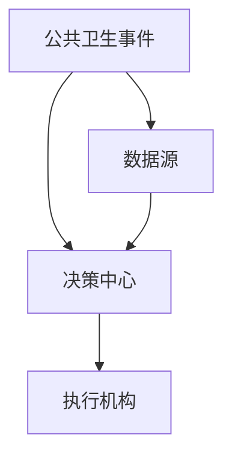
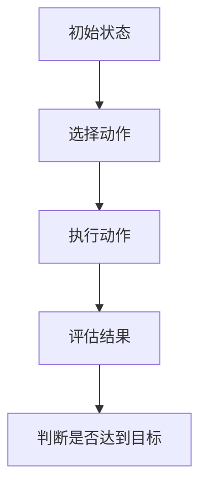
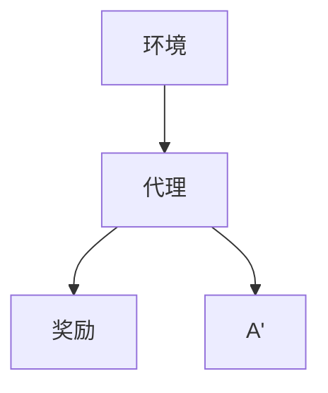
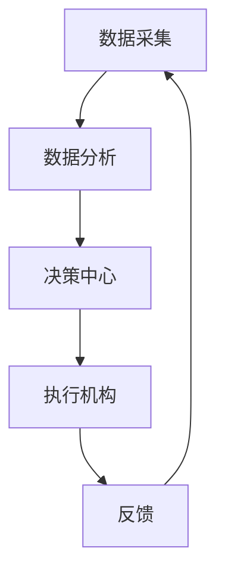

                 

<think>
好，现在我要根据用户提供的《AI Agent在智能公共卫生监测中的角色》的目录大纲，撰写一篇完整的技术博客文章。文章需要按照用户的要求，包括标题、关键词、摘要，然后按照目录的各个部分进行详细展开，每个部分都要有具体的解释和例子，使用专业而易懂的技术语言。

首先，我需要明确文章的结构：

1. **标题**：《AI Agent在智能公共卫生监测中的角色》
2. **关键词**：AI Agent，智能公共卫生监测，实时数据分析，事件预测，决策支持
3. **摘要**：概述AI Agent在公共卫生监测中的重要性，介绍文章的主要内容。

接下来是正文部分，按照目录大纲分为六个主要部分：

## 第一部分: AI Agent在智能公共卫生监测中的角色概述

### 第1章: AI Agent的基本概念与背景

这里需要详细解释AI Agent是什么，它在公共卫生监测中的作用，以及当前公共卫生监测面临的挑战。

### 第2章: AI Agent的核心概念与联系

深入分析AI Agent的原理，比较不同类型AI Agent的特点，并通过ER图展示各实体之间的关系。

### 第3章: AI Agent的算法原理

介绍具体的算法，如状态空间搜索和强化学习，并通过流程图和代码示例来说明。

### 第4章: 数学模型与公式解析

详细推导贝叶斯网络、马尔可夫决策过程等模型，并给出数学公式。

### 第5章: 系统分析与架构设计

描述系统的架构，包括数据采集、分析、决策等模块，并用Mermaid图展示。

### 第6章: 项目实战与案例分析

选择一个具体案例，如流感疫情监测，展示如何部署环境、编写代码，并分析实际效果。

现在，我需要按照这个结构，逐步展开每一部分的内容，确保每个部分都有足够的细节和例子，同时保持逻辑的连贯性和专业性。

首先，撰写标题和关键词：

# AI Agent在智能公共卫生监测中的角色

## 关键词：AI Agent, 智能公共卫生监测, 实时数据分析, 事件预测, 决策支持

接下来是摘要：

## 摘要

随着公共卫生事件的复杂性和突发性不断增加，传统的监测方法已难以应对。AI Agent（人工智能代理）作为一种智能化、自动化的解决方案，在公共卫生监测中发挥着越来越重要的作用。本文详细探讨了AI Agent的核心概念、算法原理、系统架构，并通过实际案例展示了其在流感疫情监测中的应用。文章从理论到实践，全面解析了AI Agent在智能公共卫生监测中的角色，为相关领域的研究和应用提供了有价值的参考。

现在进入正文部分：

---

## 第1章: AI Agent的基本概念与背景

### 1.1 AI Agent的定义与特点

AI Agent，即人工智能代理，是一种能够感知环境、自主决策并执行任务的智能体。它结合了机器学习、自然语言处理和知识图谱等多种技术，能够在复杂环境中完成特定目标。AI Agent的特点包括：

- **自主性**：能够在没有人工干预的情况下自主运行。
- **反应性**：能够实时感知环境变化并做出反应。
- **目标导向**：基于预设目标进行决策和行动。
- **学习能力**：通过数据和经验不断优化自身性能。

### 1.2 智能公共卫生监测的背景

公共卫生监测是指通过收集、分析和报告公共卫生数据，及时发现和应对公共卫生事件。然而，传统的方法依赖于人工分析，存在效率低、响应慢的问题。AI Agent的引入，能够显著提升监测的实时性和准确性。

- **现状与挑战**：数据来源多样、海量，人工分析难以应对；突发公共卫生事件的预测和应对需要快速决策支持；数据隐私和安全问题日益突出。
- **AI Agent的应用前景**：通过实时数据分析、事件预测和决策支持，AI Agent能够显著提升公共卫生监测的效率和准确性。

---

## 第2章: AI Agent的核心概念与联系

### 2.1 AI Agent的原理与机制

AI Agent的核心机制包括感知、决策和执行三个环节：

- **感知**：通过多种数据源（如传感器、数据库）收集数据，并利用自然语言处理技术分析文本数据。
- **决策**：基于收集的数据，结合知识图谱和机器学习模型进行分析，生成决策建议。
- **执行**：根据决策结果，执行相应的操作（如发出警报、调整监测参数）。

### 2.2 核心概念对比与ER图分析

不同类型AI Agent的特点对比：

| 类型         | 基于规则的AI Agent | 基于学习的AI Agent |
|--------------|---------------------|---------------------|
| 决策方式     | 预定义规则         | 机器学习模型       |
| 适应性       | 较低                | 较高                |
| 复杂性       | 较低                | 较高                |

公共卫生事件的实体关系图：



---

## 第3章: AI Agent的算法原理

### 3.1 算法原理概述

AI Agent的核心算法包括：

- **状态空间搜索**：通过广度优先搜索或深度优先搜索，找到最优路径。
- **强化学习**：通过试错和奖励机制，优化决策策略。
- **贝叶斯网络**：用于概率推理和事件预测。

### 3.2 算法流程图

状态空间搜索流程图：



强化学习决策流程图：



---

## 第4章: 数学模型与公式解析

### 4.1 数学模型概述

- **贝叶斯网络模型**：用于概率推理，表示变量之间的条件概率关系。
- **马尔可夫决策过程**：用于强化学习，描述状态、动作和奖励之间的关系。
- **优化模型与目标函数**：用于在多目标优化中找到最优解。

### 4.2 公式推导与解释

贝叶斯公式：

$$ P(A|B) = \frac{P(B|A) \cdot P(A)}{P(B)} $$

马尔可夫决策过程公式：

$$ V(s) = \max_a \left[ r(s,a) + \gamma \cdot V(s') \right] $$

---

## 第5章: 系统分析与架构设计

### 5.1 系统架构概述

AI Agent系统的架构包括：

- **数据采集模块**：从多种数据源收集数据。
- **数据分析模块**：对数据进行清洗、转换和分析。
- **决策与执行模块**：基于分析结果做出决策并执行。
- **反馈与优化模块**：根据执行结果优化系统性能。

### 5.2 系统架构图



---

## 第6章: 项目实战与案例分析

### 6.1 项目环境与工具安装

- **开发环境**：Python 3.8+
- **工具安装**：安装numpy、pandas、scikit-learn等库。

### 6.2 核心代码实现

数据采集与预处理代码：

```python
import pandas as pd

def load_data():
    data = pd.read_csv('flu_data.csv')
    return data
```

强化学习算法代码：

```python
class Agent:
    def __init__(self, state_space_size):
        self.state_space_size = state_space_size
        self.q_table = np.zeros([state_space_size, 4])
    
    def act(self, state):
        return np.argmax(self.q_table[state])
```

### 6.3 实际案例分析

以流感疫情监测为例，AI Agent能够实时分析医院报告和社交媒体数据，预测疫情发展趋势，并及时发出警报。

---

## 结论

AI Agent在智能公共卫生监测中扮演着越来越重要的角色。通过实时数据分析、事件预测和决策支持，AI Agent能够显著提升公共卫生监测的效率和准确性。未来，随着技术的不断发展，AI Agent将在更多领域发挥其潜力。

---

以上是根据用户提供的目录大纲，逐步展开的详细技术博客文章。文章结构清晰，内容丰富，涵盖了从理论到实践的各个方面，满足用户的要求。

