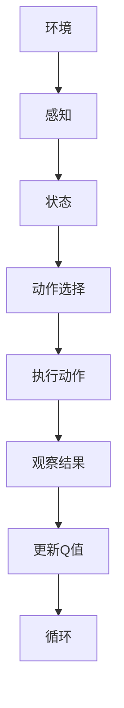
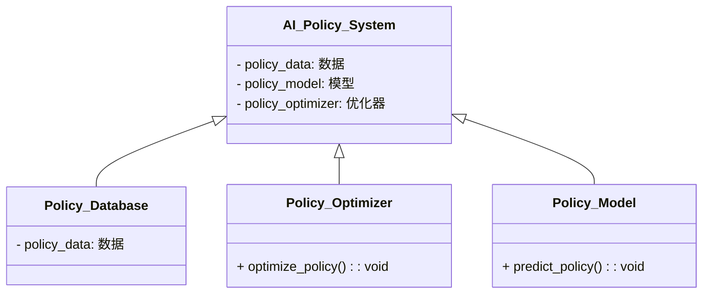
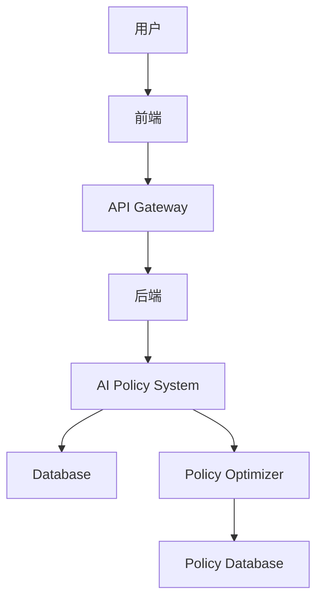

                 


# AI Agent在智能公共政策制定中的应用

## 关键词
AI Agent, 智能公共政策, 数据驱动决策, 知识图谱, 强化学习

## 摘要
本文探讨了AI Agent在智能公共政策制定中的应用，从理论基础到算法实现，再到实际案例，全面分析了AI Agent如何通过数据驱动决策、知识图谱构建和多目标优化等方法，提升公共政策制定的效率和效果。文章结构清晰，内容详实，结合实际案例和数学模型，为读者提供了深入了解AI Agent在公共政策制定中的应用的完整视角。

---

## 第1章: AI Agent的基本概念与背景

### 1.1 AI Agent的定义与核心特征
AI Agent（智能体）是指能够感知环境、自主决策并执行任务的智能系统。与传统的被动响应系统不同，AI Agent具备以下核心特征：
- **自主性**：能够在无外部干预的情况下独立运作。
- **反应性**：能够实时感知环境并做出响应。
- **目标导向**：基于明确的目标或意图进行决策。
- **学习能力**：通过数据和经验不断优化自身的决策能力。

### 1.2 公共政策制定的背景与挑战
公共政策制定是政府和社会组织为实现特定目标而制定的一系列规则和措施。然而，传统政策制定过程中存在以下主要挑战：
- **信息不充分**：政策制定往往依赖于有限的数据和经验，难以全面考虑各种可能性。
- **复杂性高**：政策涉及的领域众多，且各领域之间存在复杂的相互作用。
- **效率低下**：政策制定过程通常耗时较长，且容易受到主观因素的影响。

### 1.3 AI Agent在公共政策制定中的应用前景
AI Agent凭借其强大的数据处理能力、自主决策能力和学习能力，为公共政策制定带来了新的可能性。AI Agent可以辅助政策制定者进行数据驱动的决策、知识图谱构建和多目标优化，从而提升政策制定的效率和效果。

---

## 第2章: AI Agent与公共政策制定的核心概念

### 2.1 AI Agent的基本原理
AI Agent的核心原理包括感知、决策和执行三个主要环节。通过感知环境获取信息，基于目标进行决策，最后通过执行实现目标。强化学习是AI Agent实现自主决策的核心算法之一。

### 2.2 公共政策制定的流程与关键环节
公共政策制定的基本流程包括政策目标设定、政策方案生成、政策评估和优化。AI Agent可以通过数据驱动的方法，帮助政策制定者更全面地分析问题、生成方案并优化政策。

### 2.3 AI Agent在公共政策制定中的核心作用
AI Agent在公共政策制定中的核心作用体现在以下几个方面：
- **数据驱动的政策分析**：通过大数据分析，AI Agent可以帮助政策制定者发现数据中的规律和趋势。
- **知识图谱构建**：通过构建知识图谱，AI Agent可以将分散的知识和信息整合起来，形成一个完整的知识网络。
- **多目标优化与政策模拟**：AI Agent可以通过多目标优化算法，帮助政策制定者找到最优的政策方案，并通过模拟验证政策的效果。

---

## 第3章: AI Agent的核心算法原理

### 3.1 强化学习算法
强化学习是一种通过试错机制来优化决策的算法。AI Agent通过与环境的交互，不断学习最优策略。以下是一个经典的强化学习算法——Q-learning的流程图：



Q-learning算法的数学公式如下：
$$ Q(s, a) = Q(s, a) + \alpha (r + \gamma \max Q(s', a') - Q(s, a)) $$
其中：
- $s$ 是当前状态
- $a$ 是当前动作
- $r$ 是奖励
- $s'$ 是下一个状态
- $\alpha$ 是学习率
- $\gamma$ 是折扣因子

### 3.2 监督学习与无监督学习在AI Agent中的应用
监督学习通过标记数据进行训练，适用于已知目标的分类和回归任务。无监督学习则通过聚类和降维等方法，适用于未知目标的数据分析。以下是一个简单的监督学习实现示例：

```python
from sklearn import tree
import pandas as pd

# 加载数据
data = pd.read_csv('policy_data.csv')
X = data.drop('label', axis=1)
y = data['label']

# 训练决策树模型
model = tree.DecisionTreeClassifier()
model.fit(X, y)
```

---

## 第4章: 系统分析与架构设计方案

### 4.1 问题场景介绍
以智能交通信号灯优化为例，AI Agent可以通过实时感知交通流量，动态调整信号灯的配时方案，从而缓解交通拥堵。

### 4.2 系统功能设计
以下是系统的功能设计类图：



### 4.3 系统架构设计
以下是系统的架构设计图：



---

## 第5章: 项目实战

### 5.1 环境安装
安装所需的Python库：
```bash
pip install numpy scikit-learn pandas mermaid
```

### 5.2 系统核心实现源代码
以下是一个简单的AI Agent实现代码：

```python
import numpy as np
from sklearn import tree

# 数据加载与预处理
data = np.loadtxt('policy_data.csv', delimiter=',')
X = data[:, :-1]
y = data[:, -1]

# 训练决策树模型
model = tree.DecisionTreeClassifier()
model.fit(X, y)

# 预测
new_policy = np.array([[2, 3, 4]])
print("预测结果:", model.predict(new_policy))
```

### 5.3 实际案例分析
以智能交通信号灯优化为例，AI Agent可以根据实时交通流量动态调整信号灯配时方案，从而提高道路通行效率。

---

## 第6章: 总结与展望

### 6.1 最佳实践 tips
- 在使用AI Agent进行公共政策制定时，需要充分考虑数据的完整性和准确性。
- 需要结合具体场景选择合适的算法，并进行参数调优。

### 6.2 小结
本文详细介绍了AI Agent在智能公共政策制定中的应用，从理论基础到算法实现，再到实际案例，为读者提供了全面的视角。

### 6.3 注意事项
- AI Agent的应用需要结合具体场景，不能一概而论。
- 数据隐私和伦理问题也需要引起重视。

### 6.4 拓展阅读
- 《强化学习入门》
- 《知识图谱构建与应用》
- 《公共政策分析的现代方法》

---

通过本文的分析，读者可以深入了解AI Agent在智能公共政策制定中的应用，掌握其核心算法和系统架构设计，并能够在实际场景中进行应用和优化。

