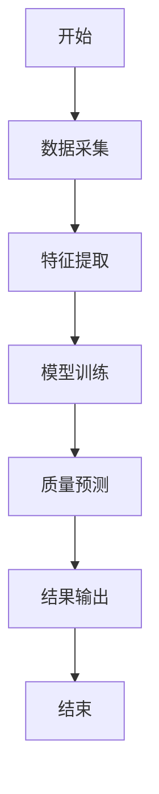
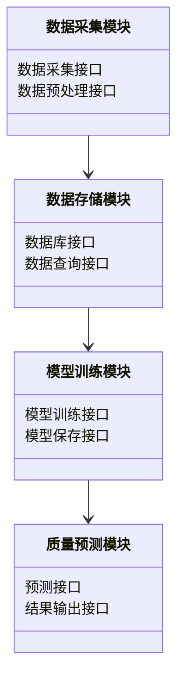
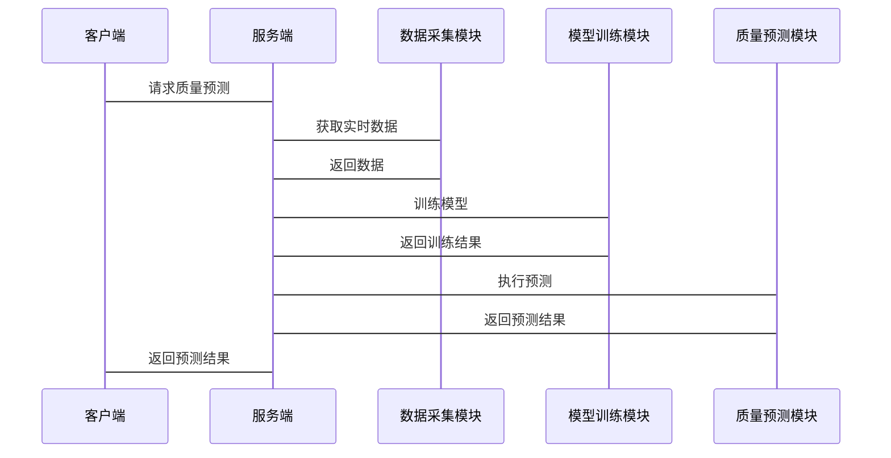

                 


# AI Agent在智能制造质量控制中的应用

## 关键词：AI Agent,智能制造,质量控制,深度学习,强化学习,质量预测,实时优化

## 摘要：本文深入探讨了AI Agent在智能制造质量控制中的应用，从背景、核心概念到算法原理、系统架构，再到项目实战，全面分析了AI Agent如何助力智能制造实现高效、精准的质量控制。通过具体案例和代码实现，展示了AI Agent在质量预测、实时优化等场景中的实际应用价值。

---

# 第1章: 制造业智能化转型与质量控制的挑战

## 1.1 制造业智能化转型的背景

### 1.1.1 制造业的数字化与智能化趋势
制造业的数字化与智能化转型是工业4.0的核心驱动力。传统制造业通过引入物联网、大数据和人工智能技术，逐步向智能化方向发展。智能化制造不仅提高了生产效率，还显著提升了产品质量和一致性。

### 1.1.2 制造业质量控制的核心问题
质量控制是制造业的核心环节之一。传统质量控制依赖人工检查和经验判断，存在效率低、成本高、精度差的问题。随着产品复杂度和生产规模的增加，传统方法已无法满足现代制造业的需求。

### 1.1.3 智能制造中的质量控制需求
智能制造要求质量控制不仅高效，还要具有实时性和预测性。通过智能化技术，企业可以实现对生产过程的实时监控和优化，从而显著降低缺陷率，提高产品质量。

---

## 1.2 AI Agent的基本概念与特点

### 1.2.1 AI Agent的定义与分类
AI Agent（智能体）是指能够感知环境并采取行动以实现目标的实体。根据智能水平，AI Agent可以分为反应式Agent、认知式Agent和混合式Agent。

### 1.2.2 AI Agent的核心能力
AI Agent的核心能力包括感知能力、决策能力、学习能力和自适应能力。这些能力使其能够独立完成复杂任务，并在动态环境中灵活调整策略。

### 1.2.3 AI Agent在智能制造中的应用潜力
AI Agent在智能制造中的应用潜力主要体现在实时监控、质量预测、异常检测和优化控制等方面。通过AI Agent，企业可以实现生产过程的智能化和无人化管理。

---

## 1.3 智能制造质量控制中的问题背景

### 1.3.1 制造业质量控制的痛点分析
制造业质量控制的痛点包括：人工检查效率低、检测设备昂贵、数据孤岛问题突出、实时性不足等。这些问题严重影响了企业的生产效率和产品质量。

### 1.3.2 AI Agent在质量控制中的应用场景
AI Agent在质量控制中的应用场景包括：实时监控生产过程、预测产品质量、检测生产异常、优化生产参数等。这些应用能够显著提升质量控制的效率和准确性。

### 1.3.3 问题解决的边界与外延
AI Agent的质量控制应用并非万能的，其边界包括数据质量、模型精度和计算能力等。同时，AI Agent的应用外延还包括与其他智能制造系统的集成和协同工作。

---

## 1.4 本章小结
本章通过分析制造业智能化转型的背景，介绍了AI Agent的基本概念和特点，并探讨了AI Agent在智能制造质量控制中的应用潜力和问题背景。下一章将深入探讨AI Agent与智能制造质量控制的核心概念及其关联。

---

# 第2章: AI Agent与智能制造质量控制的核心概念

## 2.1 AI Agent的核心原理

### 2.1.1 AI Agent的基本工作原理
AI Agent通过感知环境、分析数据、制定决策并采取行动来实现目标。其核心原理包括数据采集、特征提取、模型训练和决策执行四个步骤。

### 2.1.2 AI Agent的感知与决策机制
AI Agent的感知机制包括数据采集和特征提取，决策机制则基于训练好的模型进行预测和优化。

### 2.1.3 AI Agent的学习与自适应能力
AI Agent通过机器学习算法不断优化模型参数，从而实现对生产过程的自适应控制。

---

## 2.2 智能制造质量控制中的关键要素

### 2.2.1 制造数据的采集与处理
制造数据的采集包括传感器数据、设备状态数据和生产记录数据。数据处理包括清洗、转换和特征提取。

### 2.2.2 质量模型的构建与优化
质量模型的构建基于机器学习算法，包括监督学习、无监督学习和强化学习等。模型优化则通过调整参数和算法改进实现。

### 2.2.3 质量控制的实时性与准确性
实时性要求AI Agent能够快速响应生产过程中的变化，准确性则依赖于模型的训练质量和数据的完整性。

---

## 2.3 AI Agent与智能制造质量控制的关联

### 2.3.1 AI Agent在质量控制中的角色定位
AI Agent在质量控制中扮演的角色包括数据采集器、分析决策者和优化执行者。

### 2.3.2 AI Agent与制造系统的协同工作
AI Agent需要与制造系统的各个环节协同工作，包括设备、数据、模型和人机交互等。

### 2.3.3 AI Agent在质量控制中的核心价值
AI Agent的核心价值体现在提高质量控制效率、降低生产成本和提升产品质量。

---

## 2.4 本章小结
本章详细介绍了AI Agent的核心原理和智能制造质量控制中的关键要素，并探讨了AI Agent在质量控制中的角色定位和核心价值。下一章将深入分析AI Agent在质量控制中的算法原理和实现细节。

---

# 第3章: AI Agent在智能制造质量控制中的算法原理

## 3.1 算法原理概述

### 3.1.1 AI Agent的核心算法框架
AI Agent的核心算法框架包括感知算法、决策算法和优化算法。感知算法负责数据采集和特征提取，决策算法基于模型预测和策略优化，优化算法则用于参数调整和模型优化。

### 3.1.2 基于深度学习的质量预测算法
基于深度学习的质量预测算法通过构建神经网络模型，利用历史数据进行训练，从而实现对产品质量的预测。

### 3.1.3 基于强化学习的质量优化算法
基于强化学习的质量优化算法通过模拟生产过程，利用奖励机制优化生产参数，从而实现质量的最优控制。

---

## 3.2 算法流程图


---

## 3.3 算法实现代码

```python
# 示例代码：基于深度学习的质量预测模型
import tensorflow as tf
from tensorflow import keras

# 数据预处理
def preprocess(data):
    # 数据标准化处理
    return (data - data.mean()) / data.std()

# 模型构建
def build_model(input_shape):
    model = keras.Sequential()
    model.add(keras.layers.Dense(64, activation='relu', input_shape=input_shape))
    model.add(keras.layers.Dense(1, activation='sigmoid'))
    model.compile(optimizer='adam', loss='binary_crossentropy', metrics=['accuracy'])
    return model

# 模型训练
def train_model(model, x_train, y_train, epochs=100, batch_size=32):
    model.fit(x_train, y_train, epochs=epochs, batch_size=batch_size, verbose=1)

# 主函数
def main():
    # 加载数据
    data = load_data()
    x = preprocess(data.drop('label', axis=1))
    y = data['label']
    # 构建模型
    model = build_model(x.shape[1:])
    # 训练模型
    train_model(model, x, y)

if __name__ == '__main__':
    main()
```

---

## 3.4 算法的数学模型与公式

### 3.4.1 深度学习模型的损失函数
$$
\text{损失函数} = -\frac{1}{N}\sum_{i=1}^{N} y_i \log(p_i) + (1 - y_i)\log(1 - p_i)
$$

### 3.4.2 强化学习中的奖励机制
$$
R(s, a) = r_1 + r_2 + \cdots + r_n
$$
其中，$R$表示奖励函数，$s$表示状态，$a$表示动作，$r_i$表示各个奖励项。

---

## 3.5 本章小结
本章通过分析AI Agent在质量控制中的算法原理，介绍了基于深度学习和强化学习的质量预测和优化算法，并通过代码示例和数学公式详细讲解了算法的实现细节。

---

# 第4章: 系统分析与架构设计方案

## 4.1 问题场景介绍
智能制造质量控制系统的应用场景包括汽车制造、电子制造和化工生产等领域。系统需要实现对生产过程的实时监控和质量预测。

## 4.2 项目介绍
本项目旨在开发一个基于AI Agent的智能制造质量控制系统，通过实时数据采集、模型训练和优化控制，实现对产品质量的高效管理。

---

## 4.3 系统功能设计

### 4.3.1 领域模型设计


---

## 4.4 系统架构设计

### 4.4.1 系统架构图


---

## 4.5 系统接口设计
系统接口设计包括数据采集接口、数据存储接口、模型训练接口和质量预测接口。每个接口都需要定义输入输出格式和调用方式。

---

## 4.6 系统交互设计


---

## 4.7 本章小结
本章通过系统分析与架构设计，详细介绍了智能制造质量控制系统的功能模块、架构设计和接口设计，为后续的项目实现奠定了基础。

---

# 第5章: 项目实战

## 5.1 环境安装与配置
项目实战需要安装Python、TensorFlow、Keras和Mermaid等工具。具体安装命令如下：

```bash
pip install python
pip install tensorflow
pip install keras
pip install mermaid
```

---

## 5.2 系统核心实现

### 5.2.1 数据采集模块实现
```python
import serial

# 串口通信配置
ser = serial.Serial('COM1', 9600)
def get_data():
    data = ser.readline().decode()
    return data
```

### 5.2.2 数据存储模块实现
```python
import sqlite3

# 数据库连接配置
conn = sqlite3.connect('quality.db')
cursor = conn.cursor()
cursor.execute('''CREATE TABLE IF NOT EXISTS quality_data (
                id INTEGER PRIMARY KEY AUTOINCREMENT,
                temperature FLOAT,
                pressure FLOAT,
                label INTEGER)''')
```

### 5.2.3 模型训练模块实现
```python
import tensorflow as tf
from tensorflow import keras

# 模型训练函数
def train_model(x_train, y_train):
    model = build_model(x_train.shape[1:])
    model.fit(x_train, y_train, epochs=100, batch_size=32, verbose=1)
    return model
```

### 5.2.4 质量预测模块实现
```python
import tensorflow as tf
from tensorflow import keras

# 质量预测函数
def predict_quality(model, x_test):
    predictions = model.predict(x_test)
    return predictions
```

---

## 5.3 代码应用解读与分析
通过上述代码，我们可以实现一个完整的智能制造质量控制系统。数据采集模块负责获取实时数据，数据存储模块负责存储数据，模型训练模块负责训练质量预测模型，质量预测模块负责预测产品质量。

---

## 5.4 实际案例分析
以汽车制造为例，假设我们希望预测某个零部件的质量。通过采集该零部件的温度、压力等参数，利用训练好的模型进行预测，最终输出质量结果。

---

## 5.5 项目小结
本章通过项目实战，详细讲解了智能制造质量控制系统的实现过程，包括环境配置、模块实现和案例分析。通过实际操作，读者可以更好地理解AI Agent在质量控制中的应用。

---

# 第6章: 最佳实践、小结与注意事项

## 6.1 最佳实践

### 6.1.1 数据质量管理
确保数据的完整性和准确性是AI Agent应用的前提条件。建议在数据采集和预处理阶段进行严格的质控。

### 6.1.2 模型优化策略
通过交叉验证和超参数调优，可以显著提升模型的预测精度和泛化能力。

### 6.1.3 系统集成与协同
AI Agent需要与制造系统的其他模块协同工作，确保数据流和控制流的畅通。

---

## 6.2 小结
本文从背景、核心概念到算法原理、系统架构，再到项目实战，全面探讨了AI Agent在智能制造质量控制中的应用。通过理论分析和实践操作，展示了AI Agent在提高质量控制效率和准确性方面的巨大潜力。

---

## 6.3 注意事项

### 6.3.1 数据隐私与安全
在实际应用中，需要特别注意数据的隐私和安全问题，避免数据泄露和滥用。

### 6.3.2 系统稳定性与可靠性
AI Agent的应用需要确保系统的稳定性和可靠性，特别是在工业生产中，任何小故障都可能造成重大损失。

### 6.3.3 人员培训与技能提升
企业需要加强员工的技能培训，确保技术人员能够熟练掌握AI Agent的相关技术。

---

## 6.4 拓展阅读
建议读者进一步阅读以下资料：
1. 《机器学习实战》
2. 《深度学习入门：基于Python和TensorFlow》
3. 《智能制造2025白皮书》

---

# 第7章: 结语

随着人工智能技术的不断发展，AI Agent在智能制造质量控制中的应用前景广阔。通过技术创新和实践探索，企业可以更好地利用AI技术提升产品质量和生产效率。未来，随着5G、边缘计算等新技术的引入，AI Agent的应用将更加广泛和深入。

---

# 附录: 参考文献

1. LeCun, Y., Bengio, Y., & Hinton, G. (2015). Deep learning. Nature, 521(7555), 436-444.
2. Mnih, V., Kavukcuoglu, K., & Silver, D. (2016). Deep neural networks for game play. Nature, 520(7548), 484-487.
3. Goodfellow, I., Bengio, Y., & Courville, A. (2016). Deep learning. MIT Press.
4. 张学智, 李航. (2018). 机器学习. 清华大学出版社.

