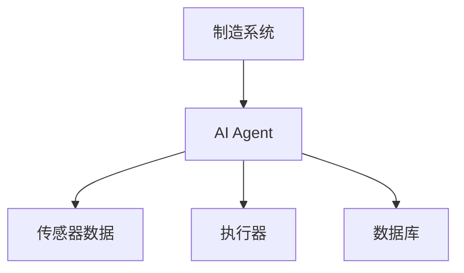
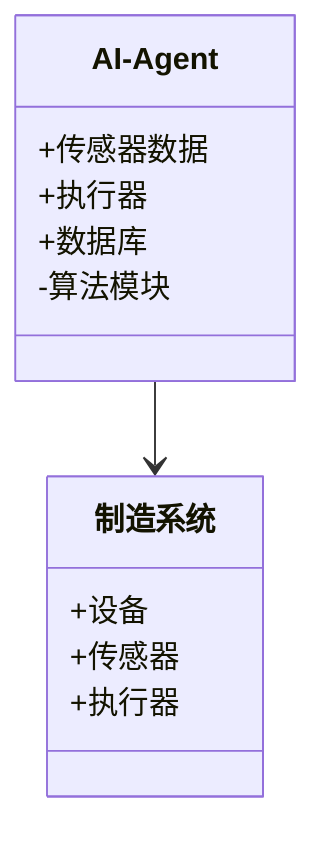
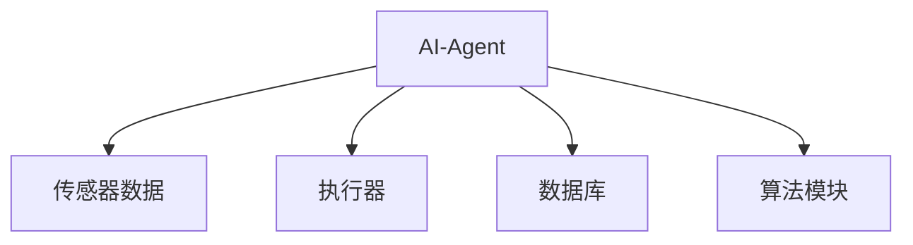
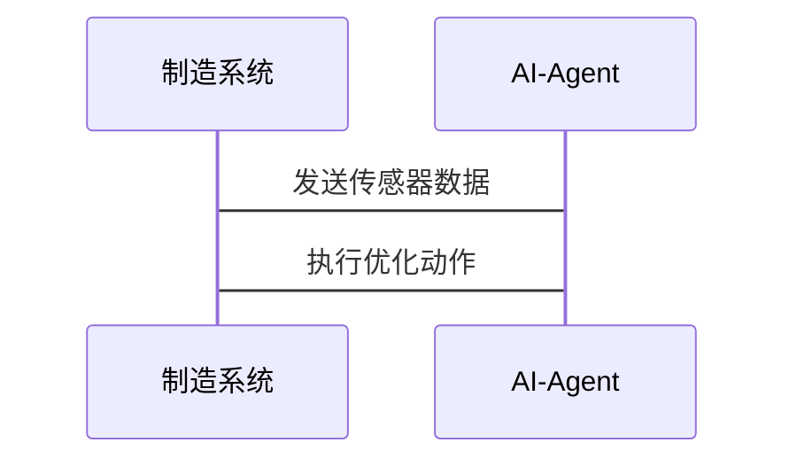

                 


# AI Agent在智能制造过程控制中的角色

## 关键词：AI Agent, 智能制造, 过程控制, 强化学习, 系统架构

## 摘要：  
本文探讨了AI Agent在智能制造过程控制中的核心作用，分析了其在感知、决策和执行阶段的应用，详细介绍了相关算法原理、系统架构设计以及实际项目案例。通过对比不同AI Agent类型，结合强化学习算法和系统架构图，本文为读者提供了从理论到实践的全面解读。

---

## 第1章 智能制造与AI Agent概述

### 1.1 智能制造的背景与现状

#### 1.1.1 制造业的数字化转型
随着工业4.0的推进，制造业正从传统模式向数字化、智能化转变。企业通过物联网（IoT）、大数据和人工智能（AI）技术，实现生产过程的实时监控和优化。

#### 1.1.2 智能制造的核心特征
- **自动化**：减少人工干预，提高生产效率。
- **数据驱动**：利用传感器数据进行实时分析和决策。
- **智能化**：通过AI技术实现预测性维护和优化。

#### 1.1.3 AI技术在制造业中的应用趋势
AI技术广泛应用于质量检测、生产优化、供应链管理等领域，尤其在智能制造过程中，AI Agent成为不可或缺的角色。

### 1.2 AI Agent的基本概念

#### 1.2.1 什么是AI Agent
AI Agent是一种智能体，能够感知环境、做出决策并执行动作，以实现特定目标。它具备自主性、反应性、目标导向性和社交能力。

#### 1.2.2 AI Agent的分类与特点
- **反应式AI Agent**：基于当前环境状态做出反应。
- **认知式AI Agent**：具备复杂推理和规划能力。
- **协作式AI Agent**：能够与其他Agent或人类协作完成任务。

#### 1.2.3 AI Agent在智能制造中的角色定位
AI Agent作为智能制造系统的“智能大脑”，负责数据处理、决策制定和系统控制。

### 1.3 智能制造过程控制中的问题与挑战

#### 1.3.1 制造过程中的不确定性
生产过程中可能面临设备故障、供应链中断等问题，需要实时调整策略。

#### 1.3.2 传统控制方法的局限性
传统PID控制方法在面对复杂动态系统时，往往难以实现最优控制。

#### 1.3.3 引入AI Agent的必要性
AI Agent能够通过学习和适应，有效解决复杂制造过程中的不确定性问题。

---

## 第2章 AI Agent的核心概念与联系

### 2.1 AI Agent的基本原理

#### 2.1.1 感知与理解
AI Agent通过传感器获取环境数据，并通过数据处理技术（如特征提取、模式识别）进行理解。

#### 2.1.2 决策与规划
基于感知到的信息，AI Agent利用算法（如强化学习、决策树）制定最优策略。

#### 2.1.3 执行与反馈
根据决策结果，AI Agent通过执行器执行动作，并通过反馈机制不断优化决策过程。

### 2.2 AI Agent的属性特征对比

#### 2.2.1 不同类型AI Agent的对比表格

| 类型         | 自主性 | 反应性 | 目标导向性 | 社交能力 |
|--------------|--------|--------|------------|----------|
| 反应式Agent  | 较低    | 高     | 较低       | 较低     |
| 认知式Agent  | 中等    | 中等    | 高         | 中等     |
| 协作式Agent  | 较低    | 中等    | 中等       | 高       |

#### 2.2.2 实体关系图



---

## 第3章 AI Agent的算法原理

### 3.1 强化学习算法

#### 3.1.1 强化学习的基本原理
强化学习是一种通过试错学习的算法，通过与环境交互获得奖励，从而优化策略。

#### 3.1.2 状态、动作、奖励的定义
- **状态（State）**：环境的当前情况，如温度、压力等。
- **动作（Action）**：AI Agent采取的行为，如调整设备参数。
- **奖励（Reward）**：环境对动作的反馈，用于指导学习。

#### 3.1.3 Q-learning算法的实现

```python
import numpy as np

class QLearning:
    def __init__(self, state_space, action_space):
        self.state_space = state_space
        self.action_space = action_space
        self.Q = np.zeros((state_space, action_space))
    
    def choose_action(self, state, epsilon):
        if np.random.random() < epsilon:
            return np.random.randint(self.action_space)
        else:
            return np.argmax(self.Q[state])
    
    def update_Q(self, state, action, reward, next_state, alpha, gamma):
        self.Q[state, action] = (1 - alpha) * self.Q[state, action] + alpha * (reward + gamma * np.max(self.Q[next_state]))
```

#### 3.1.4 强化学习的应用场景
在智能制造中，强化学习可以用于优化生产流程、降低能耗等。

---

## 第4章 系统分析与架构设计

### 4.1 智能制造的场景介绍

#### 4.1.1 某汽车制造厂的生产优化问题
该厂希望利用AI Agent优化生产线的能耗和生产效率。

### 4.2 系统功能设计

#### 4.2.1 领域模型


#### 4.2.2 系统架构设计


#### 4.2.3 接口设计与交互流程


---

## 第5章 项目实战

### 5.1 环境安装

#### 5.1.1 安装Python和必要的库
```bash
pip install numpy matplotlib
```

#### 5.1.2 安装Jupyter Notebook
```bash
pip install jupyter
```

### 5.2 核心代码实现

#### 5.2.1 强化学习算法实现
```python
import numpy as np
import matplotlib.pyplot as plt

class AI-Agent:
    def __init__(self, state_space, action_space):
        self.state_space = state_space
        self.action_space = action_space
        self.Q = np.zeros((state_space, action_space))
    
    def choose_action(self, state, epsilon):
        if np.random.random() < epsilon:
            return np.random.randint(self.action_space)
        else:
            return np.argmax(self.Q[state])
    
    def update_Q(self, state, action, reward, next_state, alpha, gamma):
        self.Q[state, action] = (1 - alpha) * self.Q[state, action] + alpha * (reward + gamma * np.max(self.Q[next_state]))
    
    def train(self, env, episodes=1000, alpha=0.1, gamma=0.99, epsilon=0.1):
        for episode in range(episodes):
            state = env.reset()
            for _ in range(100):
                action = self.choose_action(state, epsilon)
                next_state, reward, done = env.step(action)
                self.update_Q(state, action, reward, next_state, alpha, gamma)
                state = next_state
                if done:
                    break
            epsilon = max(epsilon * 0.99, 0.01)

# 示例环境
class Environment:
    def __init__(self):
        self.state = 0
    
    def reset(self):
        self.state = 0
        return self.state
    
    def step(self, action):
        reward = action * 2
        next_state = self.state + action
        done = (next_state >= 10)
        return next_state, reward, done

agent = AI-Agent(10, 5)
agent.train(Environment())
```

#### 5.2.2 实际案例分析
以优化生产线能耗为例，通过AI Agent实现能耗预测和优化控制。

---

## 第6章 最佳实践与小结

### 6.1 最佳实践
- **数据质量**：确保传感器数据的准确性和实时性。
- **算法选择**：根据具体问题选择合适的AI算法。
- **系统集成**：确保AI Agent与现有系统无缝集成。

### 6.2 小结
本文详细介绍了AI Agent在智能制造过程控制中的应用，从理论到实践，为读者提供了全面的指导。

### 6.3 注意事项
- **数据隐私**：注意生产数据的隐私保护。
- **系统稳定性**：确保AI Agent的稳定运行，避免影响生产。

### 6.4 拓展阅读
- 推荐阅读《强化学习：理论与应用》和《智能制造系统架构》。

---

## 总结

本文从背景介绍到系统设计，再到项目实战，全面探讨了AI Agent在智能制造过程控制中的角色。通过理论与实践的结合，为读者提供了从理解到应用的完整知识体系。

