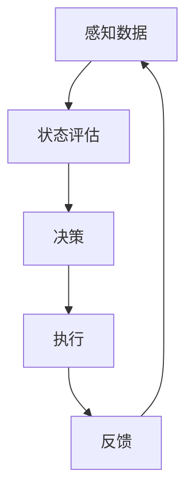
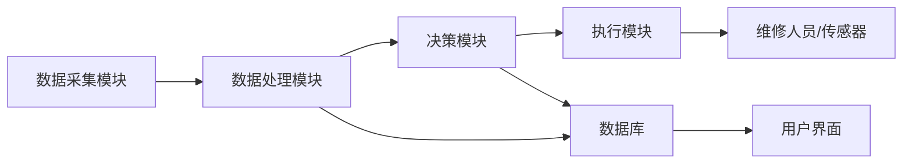
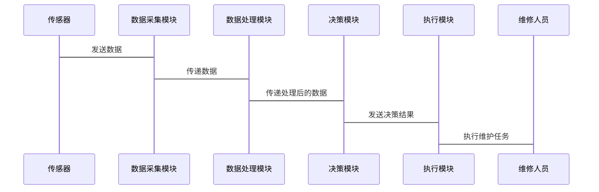

                 


# AI Agent在智能地下管网维护中的实践

## 关键词
AI Agent, 智能地下管网, 城市基础设施维护, 机器学习, 强化学习, 物联网, 城市智慧化

## 摘要
本文深入探讨了AI Agent在智能地下管网维护中的实践应用。通过分析AI Agent的核心概念、算法原理、系统架构及实际案例，展示了如何利用AI技术解决城市地下管网维护中的复杂问题。文章内容涵盖从数据预处理到系统实现的完整流程，结合强化学习算法和物联网技术，提出了一种高效的管网维护解决方案，为城市基础设施的智慧化管理提供了新思路。

---

## 第一部分: AI Agent在智能地下管网维护中的背景与概念

### 第1章: 问题背景与描述

#### 1.1 问题背景
##### 1.1.1 地下管网维护的现状与挑战
- 地下管网包括给水、排水、燃气、电力等系统，是城市运行的基础。
- 管网分布复杂，维护难度大，传统方法效率低，容易出现漏检和误判。
- 管网维护涉及多部门协作，数据孤岛问题严重，难以实现高效管理。

##### 1.1.2 传统管网维护的痛点分析
- 人工巡检效率低，难以覆盖所有管网区域。
- 问题发现滞后，可能导致事故扩大。
- 数据分散，缺乏统一的分析平台。

##### 1.1.3 AI Agent技术的引入与意义
- AI Agent能够实时感知管网状态，自动决策并执行维护任务。
- 通过智能化手段，提高管网维护的效率和准确性，降低维护成本。

#### 1.2 问题描述
##### 1.2.1 地下管网的复杂性与维护需求
- 管网结构复杂，涉及多种介质和压力等级。
- 环境恶劣，如高温、高压、潮湿等，增加了维护难度。

##### 1.2.2 管网维护中的数据获取与处理问题
- 数据来源多样，包括传感器数据、历史记录、地理信息系统（GIS）数据等。
- 数据量大，且存在噪声，需要进行清洗和预处理。

##### 1.2.3 AI Agent在管网维护中的应用目标
- 实现管网状态的实时监控和预测。
- 自动识别潜在故障，提前进行维护。
- 提供智能化的决策支持，优化维护资源的分配。

### 第2章: AI Agent的核心概念与联系

#### 2.1 AI Agent的基本原理
##### 2.1.1 AI Agent的定义与核心要素
- AI Agent是一种智能体，能够感知环境、做出决策并执行动作。
- 核心要素包括感知模块、决策模块和执行模块。

##### 2.1.2 AI Agent的感知、决策与执行模块
- 感知模块：通过传感器获取管网数据，如温度、压力、流量等。
- 决策模块：基于感知数据，使用强化学习算法进行决策。
- 执行模块：根据决策结果，执行维护任务，如关闭阀门、派遣维修人员等。

#### 2.2 核心概念与联系
##### 2.2.1 概念属性特征对比表格
| 概念       | 属性           | 特征描述                                   |
|------------|----------------|------------------------------------------|
| 感知模块   | 数据来源       | 传感器数据、历史记录、GIS数据             |
|            | 数据处理方式   | 数据清洗、特征提取                        |
| 决策模块   | 算法类型       | 强化学习、监督学习                        |
|            | 决策依据       | 状态评估、动作选择                        |
| 执行模块   | 执行动作       | 调整参数、触发警报、派遣维修人员         |

##### 2.2.2 ER实体关系图架构
```mermaid
er
  actor(AI Agent)
  actor(传感器)
  actor(维修人员)
  actor(数据库)
  actor(用户)
  actor(维护系统)

  sensor 数据 -> AI Agent
  AI Agent -> decision-making
  decision-making -> execution
  execution ->传感器/维修人员
  AI Agent <->数据库
  用户 <-> AI Agent
  维护系统 <-> AI Agent
```

---

## 第二部分: AI Agent的算法原理与数学模型

### 第3章: 算法原理讲解

#### 3.1 数据处理与特征提取
##### 3.1.1 数据预处理流程
- 数据清洗：去除噪声数据，处理缺失值。
- 数据标准化：将不同量纲的数据进行归一化处理。
- 特征选择：提取关键特征，如温度、压力、流量等。

##### 3.1.2 特征提取方法
- 使用主成分分析（PCA）进行特征降维。
- 通过时序分析提取异常特征。

#### 3.2 AI Agent的决策模型
##### 3.2.1 基于强化学习的决策算法
- 使用深度强化学习（Deep RL）框架。
- 状态空间：管网各节点的状态参数。
- 动作空间：可执行的维护动作，如调整阀门、关闭设备等。

##### 3.2.2 算法流程图


#### 3.3 算法实现代码
```python
import numpy as np
import tensorflow as tf

# 定义强化学习模型
class AI_Agent:
    def __init__(self, state_space, action_space):
        self.state_space = state_space
        self.action_space = action_space
        self.model = self.build_model()
    
    def build_model(self):
        model = tf.keras.Sequential([
            tf.keras.layers.Dense(64, activation='relu', input_dim=self.state_space),
            tf.keras.layers.Dense(64, activation='relu'),
            tf.keras.layers.Dense(self.action_space, activation='linear')
        ])
        model.compile(optimizer=tf.keras.optimizers.Adam(learning_rate=0.001), 
                      loss='mean_squared_error')
        return model
    
    def act(self, state):
        state = np.array([state])
        prediction = self.model.predict(state)
        return np.argmax(prediction[0])
```

### 第4章: 数学模型与公式

#### 4.1 数据处理模型
##### 4.1.1 数据清洗公式
- 填充缺失值：$x_i = \text{median}(x)$，其中$x$为特征向量。
- 标准化公式：$z_i = \frac{x_i - \mu}{\sigma}$，其中$\mu$为均值，$\sigma$为标准差。

##### 4.1.2 特征选择公式
- 主成分分析：$Y = X \cdot \text{P}^T$，其中$X$为原始数据矩阵，$\text{P}$为特征向量矩阵。

#### 4.2 决策模型
##### 4.2.1 强化学习数学模型
- 状态值函数：$V(s) = \max_a Q(s,a)$。
- 动作值函数：$Q(s,a) = r + \gamma \max_{a'} Q(s',a')$，其中$\gamma$为折扣因子。

##### 4.2.2 策略评估公式
- 策略评估：$\theta_{t+1} = \theta_t + \alpha (r + \gamma Q(s',a') - Q(s,a)) \cdot \nabla Q(s,a)$，其中$\alpha$为学习率。

---

## 第三部分: 系统分析与架构设计

### 第5章: 系统分析与架构设计

#### 5.1 问题场景介绍
##### 5.1.1 地下管网维护场景描述
- 某城市地下管网覆盖面积广，维护任务繁重。
- 管网数据分散，缺乏统一的管理平台。

##### 5.1.2 AI Agent在管网维护中的应用场景
- 实时监控管网状态，发现异常及时处理。
- 预测潜在故障，提前安排维护。

#### 5.2 系统功能设计
##### 5.2.1 领域模型设计
- 实体：管网节点、传感器、维修人员、数据库。
- 关系：传感器采集数据，AI Agent处理数据并决策，维修人员执行维护任务。

##### 5.2.2 功能模块划分
- 数据采集模块：负责收集管网数据。
- 数据处理模块：清洗和预处理数据。
- 决策模块：基于强化学习算法做出决策。
- 执行模块：根据决策结果执行维护任务。

#### 5.3 系统架构设计
##### 5.3.1 系统架构图


#### 5.4 系统接口设计
##### 5.4.1 系统接口设计
- 数据采集模块接口：接收传感器数据。
- 数据处理模块接口：处理数据并传递给决策模块。
- 决策模块接口：接收数据并返回决策结果。
- 执行模块接口：接收决策结果并执行维护任务。

#### 5.5 系统交互流程
##### 5.5.1 系统交互流程


### 第6章: 项目实战

#### 6.1 项目介绍
##### 6.1.1 项目背景
- 某城市试点项目，应用AI Agent技术进行管网维护。

#### 6.2 环境配置
##### 6.2.1 环境配置
- 操作系统：Linux
- 开发工具：Python 3.8、TensorFlow 2.0、Keras 2.4.3
- 数据库：MySQL 8.0

#### 6.3 核心代码实现
##### 6.3.1 数据预处理代码
```python
import pandas as pd

# 读取数据
data = pd.read_csv('管网数据.csv')

# 数据清洗
data = data.dropna()
data = data.drop_duplicates()

# 数据标准化
from sklearn.preprocessing import StandardScaler
scaler = StandardScaler()
data_scaled = scaler.fit_transform(data)
```

##### 6.3.2 决策模型代码
```python
# 定义强化学习模型
class AI_Agent:
    def __init__(self, state_space, action_space):
        self.state_space = state_space
        self.action_space = action_space
        self.model = self.build_model()
    
    def build_model(self):
        model = tf.keras.Sequential([
            tf.keras.layers.Dense(64, activation='relu', input_dim=self.state_space),
            tf.keras.layers.Dense(64, activation='relu'),
            tf.keras.layers.Dense(self.action_space, activation='linear')
        ])
        model.compile(optimizer=tf.keras.optimizers.Adam(learning_rate=0.001), 
                      loss='mean_squared_error')
        return model
    
    def act(self, state):
        state = np.array([state])
        prediction = self.model.predict(state)
        return np.argmax(prediction[0])
```

##### 6.3.3 案例分析与代码解读
- 案例：某段管道压力异常，AI Agent识别并触发关闭阀门动作。
- 代码解读：通过强化学习模型，AI Agent根据当前状态做出最优决策。

#### 6.4 项目总结
##### 6.4.1 项目成果
- 成功实现AI Agent在管网维护中的应用。
- 提高了管网维护的效率和准确性。

##### 6.4.2 经验总结
- 数据预处理是关键，确保数据的准确性和完整性。
- 强化学习算法需要根据具体场景进行调优。

---

## 第四部分: 最佳实践与总结

### 第7章: 最佳实践与总结

#### 7.1 最佳实践
##### 7.1.1 AI Agent设计原则
- 简化问题：从简单场景开始，逐步扩展到复杂场景。
- 数据驱动：确保数据的多样性和代表性。
- 可解释性：模型的决策过程需要可解释。

##### 7.1.2 算法训练中的注意事项
- 数据平衡：避免数据偏见，确保各类别数据均衡。
- 超参数调优：根据具体场景调整学习率、折扣因子等参数。

##### 7.1.3 系统维护建议
- 定期更新模型：随着环境变化和数据积累，及时更新模型。
- 监控系统性能：实时监控系统运行状态，及时发现和解决问题。

#### 7.2 小结
- AI Agent在智能地下管网维护中的应用前景广阔。
- 通过智能化手段，能够显著提高管网维护的效率和准确性。

#### 7.3 注意事项
- 数据隐私和安全问题：确保管网数据的安全性和隐私性。
- 系统容错性：设计容错机制，确保系统在异常情况下的稳定性。

#### 7.4 拓展阅读
- 推荐书籍：《强化学习导论》、《深度学习》。
- 推荐论文：相关领域的最新研究论文。

---

## 结语
通过本文的详细阐述，读者可以全面了解AI Agent在智能地下管网维护中的实践应用。从算法原理到系统架构，从理论分析到实际案例，文章提供了丰富的内容和实用的指导，为城市基础设施的智慧化管理提供了新的思路和方法。未来，随着AI技术的不断发展，AI Agent在城市管网维护中的应用将更加广泛和深入。

