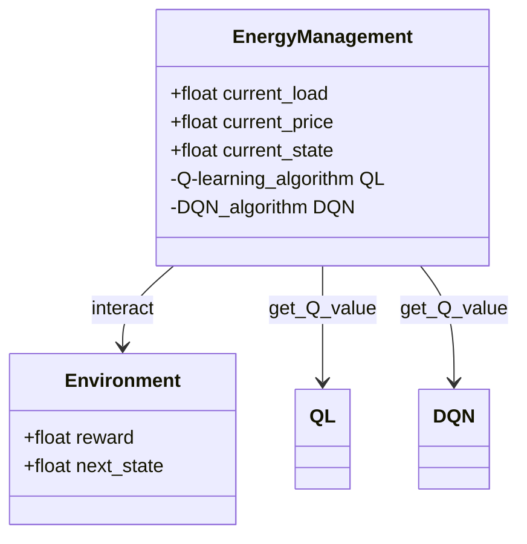
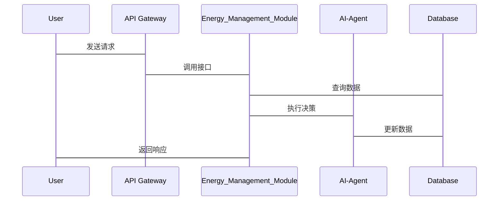

                 


# 《AI Agent在智能城市能源管理中的实践》

---

## 关键词：
智能城市, 能源管理, AI Agent, 强化学习, 智能电网, 能源优化, 可持续发展

---

## 摘要：
随着智能城市的快速发展，能源管理成为实现城市可持续发展的重要组成部分。AI Agent（人工智能代理）作为一种智能化的决策支持工具，正在被广泛应用于智能城市能源管理中。本文从智能城市能源管理的背景出发，详细探讨了AI Agent的核心概念、算法原理、系统架构设计以及实际应用案例。通过强化学习算法和系统架构的分析，本文揭示了AI Agent在智能城市能源管理中的巨大潜力，并提供了从理论到实践的全面指导。

---

# 第一部分: AI Agent在智能城市能源管理中的背景与概念

---

# 第1章: 智能城市与能源管理的背景

## 1.1 智能城市的发展概述

### 1.1.1 智能城市的定义与特征

智能城市是指通过智能化技术（如物联网、大数据、人工智能等）优化城市资源配置、提升居民生活质量的城市发展模式。其主要特征包括：

1. **数字化**：城市基础设施的数字化改造。
2. **智能化**：利用AI、大数据等技术实现智能化管理。
3. **可持续性**：注重资源节约和环境友好。
4. **以人为本**：以提升居民生活质量为核心目标。

### 1.1.2 智能城市中的能源管理需求

能源管理是智能城市运营的核心环节之一。随着城市化进程的加快，能源需求急剧增加，传统的能源管理方式已难以应对以下挑战：

1. **能源浪费**：设备闲置或过度使用导致能源浪费。
2. **供需不平衡**：能源需求波动大，难以实时调节。
3. **环保压力**：高碳排放导致环境污染问题加剧。

### 1.1.3 智能城市能源管理的挑战与机遇

- **挑战**：能源管理涉及多个领域（如电力、燃气、可再生能源等），需要协调各方利益，同时需要应对突发性事件（如极端天气）。
- **机遇**：AI技术的快速发展为能源管理提供了新的工具和方法，能够实现能源的高效利用和智能调度。

---

## 1.2 能源管理的核心问题

### 1.2.1 能源管理的基本概念

能源管理是指对能源的生产、传输、分配和使用进行规划、监控和优化的过程。其目标是实现能源的高效利用、降低成本、减少环境污染。

### 1.2.2 智能城市中的能源管理场景

智能城市中的能源管理场景多样，主要包括：

1. **电力管理**：包括电力生产、传输和分配。
2. **可再生能源管理**：如太阳能、风能等的接入和优化。
3. **需求侧管理**：通过需求响应技术优化用户的能源使用。

### 1.2.3 能源管理的目标与关键指标

- **目标**：提高能源利用效率，降低能源成本，减少碳排放。
- **关键指标**：
  - 能源使用效率（Energy Efficiency）
  - 综合能源成本（Total Energy Cost）
  - 碳排放量（Carbon Emissions）

---

## 1.3 AI Agent的定义与特点

### 1.3.1 AI Agent的基本概念

AI Agent是一种能够感知环境、自主决策并执行任务的智能实体。它可以是一个软件程序，也可以是一个物理设备，通过与环境的交互实现特定目标。

### 1.3.2 AI Agent的核心能力

1. **感知能力**：通过传感器、数据源等获取环境信息。
2. **决策能力**：基于感知信息，利用算法制定最优决策。
3. **执行能力**：根据决策结果执行相应动作。

### 1.3.3 AI Agent在能源管理中的优势

1. **高效性**：能够快速处理大量数据，实时优化能源使用。
2. **自主性**：能够在无人干预的情况下自主决策。
3. **适应性**：能够根据环境变化动态调整策略。

---

## 1.4 本章小结

本章介绍了智能城市的发展背景，分析了能源管理在智能城市中的重要性，并详细探讨了AI Agent的基本概念和特点。AI Agent作为一种智能化的工具，为智能城市能源管理提供了新的解决方案。

---

# 第2章: AI Agent的核心概念与原理

---

## 2.1 AI Agent的感知与决策机制

### 2.1.1 感知层: 数据采集与处理

AI Agent通过传感器、数据库等获取环境数据，并进行预处理（如清洗、特征提取）。

### 2.1.2 决策层: 策略制定与优化

基于感知数据，AI Agent利用算法（如强化学习、监督学习）制定最优决策。

### 2.1.3 执行层: 动作输出与反馈

AI Agent根据决策结果执行相应动作，并通过反馈机制不断优化决策策略。

---

## 2.2 AI Agent的分类与应用场景

### 2.2.1 基于规则的AI Agent

- **定义**：基于预定义的规则进行决策。
- **特点**：简单易懂，但灵活性较差。
- **应用场景**：适用于规则明确的场景，如简单的设备控制。

### 2.2.2 基于学习的AI Agent

- **定义**：通过机器学习算法从数据中学习决策策略。
- **特点**：灵活性高，能够处理复杂问题。
- **应用场景**：适用于复杂的能源管理场景，如电力调度。

### 2.2.3 基于强化学习的AI Agent

- **定义**：通过与环境交互，基于奖励机制优化决策策略。
- **特点**：能够实现自主学习和优化。
- **应用场景**：适用于需要动态优化的场景，如智能电网。

---

## 2.3 AI Agent在能源管理中的核心算法

### 2.3.1 强化学习算法

- **Q-learning算法**：通过状态、动作、奖励的定义，更新Q值表。
  $$ Q(s,a) = r + \gamma \max Q(s',a') $$
- **Deep Q-Networks (DQN)**：利用深度神经网络近似Q值函数。

### 2.3.2 监督学习算法

- **线性回归**：用于预测能源需求。
- **随机森林**：用于分类和回归任务。

### 2.3.3 聚类与分类算法

- **K-means**：用于用户行为分析。
- **SVM**：用于分类任务。

---

## 2.4 本章小结

本章详细探讨了AI Agent的核心概念与原理，包括感知、决策和执行机制，AI Agent的分类以及在能源管理中的核心算法。通过这些算法，AI Agent能够实现对能源的高效管理和优化。

---

# 第3章: AI Agent的算法原理与数学模型

---

## 3.1 强化学习算法在AI Agent中的应用

### 3.1.1 强化学习的基本原理

- **状态空间**：环境的状态表示。
- **动作空间**：AI Agent可执行的动作。
- **奖励函数**：对决策结果的反馈。

### 3.1.2 Q-learning算法的数学模型

$$ Q(s,a) = r + \gamma \max Q(s',a') $$

其中：
- \( Q(s,a) \)：状态\( s \)下执行动作\( a \)的Q值。
- \( r \)：立即奖励。
- \( \gamma \)：折扣因子，\( 0 < \gamma \leq 1 \)。
- \( s' \)：下一状态。
- \( a' \)：下一动作。

### 3.1.3 Deep Q-Networks (DQN) 的实现

- **网络结构**：输入层、隐藏层、输出层。
- **目标网络**：用于稳定训练。
- **经验回放**：存储历史经验，随机采样训练。

---

## 3.2 强化学习在能源管理中的应用案例

### 3.2.1 案例分析: 智能电网中的负荷调度

- **场景描述**：通过AI Agent优化电力负荷分配，减少峰谷差。
- **算法实现**：使用DQN算法实现负荷调度。

### 3.2.2 算法实现: 使用Python实现DQN算法

```python
class DQN:
    def __init__(self, state_space, action_space):
        self.state_space = state_space
        self.action_space = action_space
        # 网络结构
        self.model = Sequential()
        self.model.add(Dense(64, input_dim=state_space, activation='relu'))
        self.model.add(Dense(action_space, activation='linear'))
        self.model.compile(optimizer='adam', loss='mse')
```

---

## 3.3 本章小结

本章通过强化学习算法的数学模型和实际应用案例，详细解释了AI Agent在能源管理中的算法实现。通过DQN算法，AI Agent能够实现对能源的动态优化管理。

---

# 第四部分: AI Agent的系统架构设计

---

# 第4章: 系统架构设计

## 4.1 系统功能设计

### 4.1.1 领域模型设计



---

## 4.2 系统架构设计


---

## 4.3 系统接口设计

### 4.3.1 接口描述

- **输入接口**：接收环境数据（如负载、价格）。
- **输出接口**：输出决策结果（如负荷调整指令）。

### 4.3.2 接口交互流程



---

## 4.4 本章小结

本章通过系统架构设计和接口设计，详细展示了AI Agent在智能城市能源管理中的实现方式。通过领域模型和架构图，读者可以清晰理解系统的各个组成部分及其交互关系。

---

# 第五部分: AI Agent的项目实战

---

# 第5章: 项目实战

## 5.1 环境安装与配置

### 5.1.1 安装Python环境

```bash
python --version
pip install numpy
pip install keras
pip install tensorflow
```

### 5.1.2 安装DQN算法依赖

```bash
pip install gym
pip install matplotlib
pip install scikit-learn
```

## 5.2 系统核心实现源代码

### 5.2.1 DQN算法实现

```python
import numpy as np
import gym
from gym import spaces
from collections import deque
import random
import torch
import torch.nn as nn
import torch.optim as optim

class DQNAgent:
    def __init__(self, state_size, action_size):
        self.state_size = state_size
        self.action_size = action_size
        self.gamma = 0.99
        self.epsilon = 1.0
        self.epsilon_min = 0.01
        self.memory = deque(maxlen=10000)
        self.model = nn.Sequential(
            nn.Linear(state_size, 64),
            nn.ReLU(),
            nn.Linear(64, action_size)
        )
        self.optimizer = optim.Adam(self.model.parameters(), lr=0.001)

    def act(self, state):
        if random.random() < self.epsilon:
            return random.randint(0, self.action_size - 1)
        with torch.no_grad():
            q_values = self.model(torch.FloatTensor(state))
            return torch.argmax(q_values).item()

    def remember(self, state, action, reward, next_state):
        self.memory.append((state, action, reward, next_state))

    def replay(self, batch_size):
        if len(self.memory) < batch_size:
            return
        minibatch = random.sample(self.memory, batch_size)
        states = torch.FloatTensor(np.array([t[0] for t in minibatch]))
        actions = torch.LongTensor(np.array([t[1] for t in minibatch]))
        rewards = torch.FloatTensor(np.array([t[2] for t in minibatch]))
        next_states = torch.FloatTensor(np.array([t[3] for t in minibatch]))

        current_q_values = self.model(states).gather(1, actions)
        next_q_values = self.model(next_states).max(1)[0].detach()
        target_q_values = rewards + self.gamma * next_q_values

        loss = nn.MSELoss()(current_q_values, target_q_values)
        self.optimizer.zero_grad()
        loss.backward()
        self.optimizer.step()

    def decay_epsilon(self):
        self.epsilon = max(self.epsilon_min, self.epsilon * 0.995)
```

### 5.2.2 训练与测试

```python
env = gym.make('EnergyManagement-v0')
agent = DQNAgent(env.observation_space.shape[0], env.action_space.n)
episodes = 1000
for episode in range(episodes):
    state = env.reset()
    total_reward = 0
    while True:
        action = agent.act(state)
        next_state, reward, done, _ = env.step(action)
        agent.remember(state, action, reward, next_state)
        agent.replay(32)
        agent.decay_epsilon()
        state = next_state
        total_reward += reward
        if done:
            break
    print(f'Episode {episode}, Reward: {total_reward}')
```

## 5.3 案例分析

### 5.3.1 案例背景

某城市电网公司希望通过AI Agent优化电力负荷分配，减少高峰时段的电力需求。

### 5.3.2 实施步骤

1. **数据采集**：采集电力负荷、电价数据。
2. **模型训练**：使用DQN算法训练AI Agent。
3. **系统部署**：将AI Agent部署到电网管理系统中。
4. **效果评估**：通过实际运行数据验证优化效果。

### 5.3.3 实施效果

- **能源消耗降低**：通过AI Agent的优化，电力负荷分配更加合理，降低了高峰时段的电力需求。
- **成本降低**：减少了备用电源的使用，降低了能源成本。
- **环境效益**：减少了碳排放，有助于环境保护。

---

## 5.4 本章小结

本章通过实际案例展示了AI Agent在智能城市能源管理中的应用。通过环境安装、系统实现和案例分析，读者可以深入了解AI Agent的实际应用过程。

---

# 第六部分: 总结与展望

---

# 第6章: 总结与展望

## 6.1 本章总结

本文从智能城市能源管理的背景出发，详细探讨了AI Agent的核心概念、算法原理和系统架构设计。通过实际案例展示了AI Agent在智能城市能源管理中的应用，证明了其在优化能源使用、降低成本和减少碳排放方面的巨大潜力。

---

## 6.2 未来展望

随着AI技术的不断发展，AI Agent在智能城市能源管理中的应用将更加广泛和深入。未来的研究方向包括：

1. **多 Agent 协作**：研究多个AI Agent协同工作的机制。
2. **强化学习优化**：进一步优化强化学习算法，提高决策效率。
3. **可再生能源接入**：研究AI Agent在可再生能源管理中的应用。

---

## 6.3 注意事项

- **数据隐私**：在实际应用中，需要关注用户数据的隐私保护。
- **系统稳定性**：确保AI Agent系统的稳定运行，避免因系统故障导致能源管理混乱。
- **法律法规**：遵守相关法律法规，确保AI Agent的应用合法合规。

---

## 6.4 拓展阅读

1. **强化学习经典书籍**：《Deep Reinforcement Learning》。
2. **智能城市相关论文**：搜索相关领域的最新论文，了解研究动态。
3. **AI Agent工具库**：学习使用TensorFlow、Keras等深度学习框架，掌握AI Agent的实现技巧。

---

# 附录: AI Agent相关工具与资源

## 附录A: Python库与框架

- **TensorFlow**：深度学习框架。
- **Keras**：用于快速构建深度学习模型。
- **Gym**：强化学习环境库。
- **Scikit-learn**：机器学习算法库。

## 附录B: 开发环境配置

```bash
# 安装基础库
pip install numpy
pip install pandas
pip install matplotlib
pip install scikit-learn
pip install gym

# 安装深度学习库
pip install tensorflow
pip install keras
```

---

## 附录C: 参考文献

1. Mnih, V., et al. "Human-level control through deep reinforcement learning." *Nature*, 2015.
2. LeCun, Y., Bengio, Y., & Hinton, G. "Deep learning." *Nature*, 2015.
3. Sutton, R. S., & Barto, A. G. "Reinforcement learning: An introduction." *MIT Press*, 2018.

---

通过以上内容，读者可以系统地了解AI Agent在智能城市能源管理中的实践，从理论到实践，从背景到应用，全面掌握相关知识。

