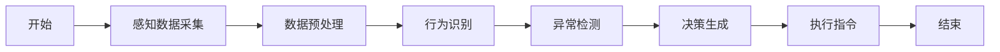
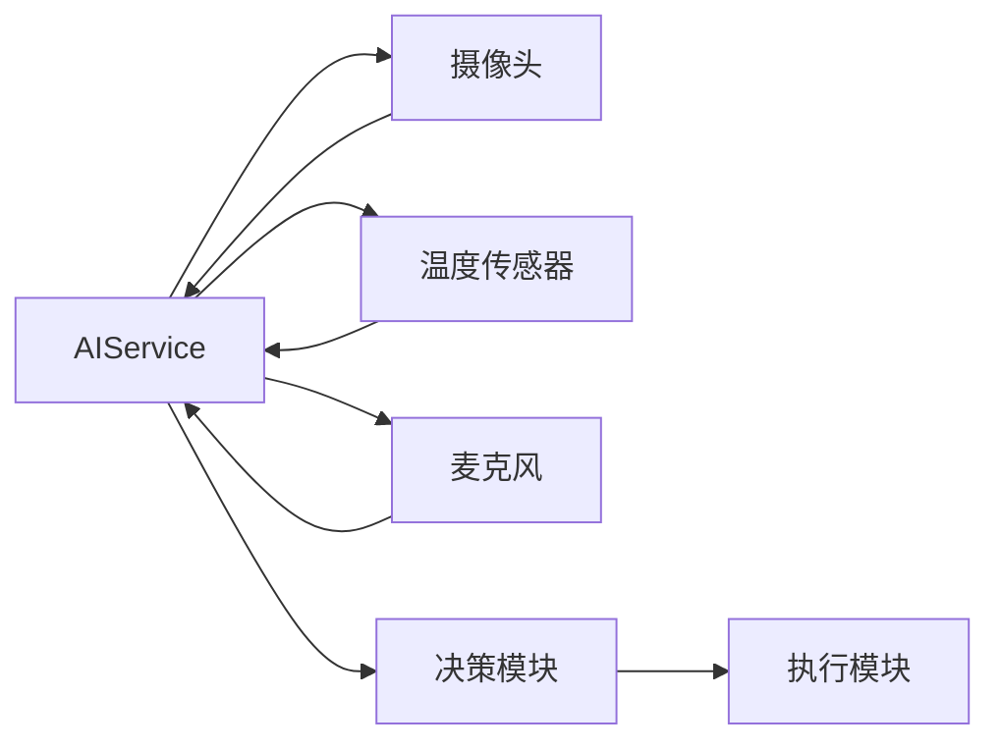
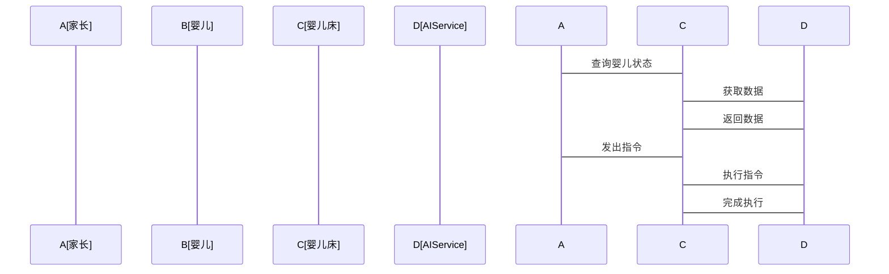

                 


# AI Agent在智能婴儿床中的安全监控

> 关键词：AI Agent，智能婴儿床，安全监控，算法原理，系统架构

> 摘要：本文深入探讨了AI Agent在智能婴儿床中的安全监控应用，从基本概念到算法原理，从系统架构到项目实战，全面解析了AI Agent如何实现婴儿行为识别、异常检测以及安全预警。通过详细的技术分析和实际案例，本文展示了AI Agent在智能婴儿床中的核心作用及其未来发展方向。

---

# 第一部分: AI Agent与智能婴儿床安全监控概述

# 第1章: AI Agent与智能婴儿床安全监控概述

## 1.1 AI Agent的基本概念

### 1.1.1 AI Agent的定义

AI Agent（人工智能代理）是指能够感知环境、做出决策并执行动作的智能实体。它通过传感器获取信息，利用算法处理数据，并通过执行器与环境交互。

### 1.1.2 AI Agent的核心特征

- **自主性**：能够在没有外部干预的情况下自主运行。
- **反应性**：能够实时感知环境并做出反应。
- **学习能力**：通过数据和经验不断优化自身行为。
- **可扩展性**：能够适应不同的应用场景和复杂度。

### 1.1.3 智能婴儿床的定义与特点

智能婴儿床是一种结合了物联网和人工智能技术的婴儿床，能够实时监控婴儿的生理指标、行为状态以及环境数据，提供智能化的安全监控服务。

## 1.2 AI Agent在智能婴儿床中的应用背景

### 1.2.1 婴儿安全监控的重要性

婴儿是需要特别保护的群体，他们的生理和行为数据需要实时监控，以确保他们的安全和健康。

### 1.2.2 传统婴儿床监控的局限性

传统婴儿床监控设备通常依赖单一传感器，无法全面感知婴儿的状态，且缺乏智能决策能力。

### 1.2.3 AI Agent在婴儿床监控中的优势

AI Agent能够通过多传感器融合、智能算法和自主决策，实现婴儿行为识别、异常检测和安全预警。

## 1.3 本书内容概述

### 1.3.1 本书的核心目标

本书旨在通过理论与实践结合的方式，深入讲解AI Agent在智能婴儿床中的安全监控应用。

### 1.3.2 本书的主要内容

- 第一部分：AI Agent与智能婴儿床安全监控概述。
- 第二部分：AI Agent的核心概念与原理。
- 第三部分：AI Agent在婴儿床安全监控中的算法原理。
- 第四部分：系统架构设计与实现。
- 第五部分：项目实战与案例分析。
- 第六部分：总结与展望。

### 1.3.3 本书的结构安排

本书从理论到实践，层层递进，帮助读者全面掌握AI Agent在智能婴儿床中的安全监控技术。

---

# 第二部分: AI Agent的核心概念与原理

# 第2章: AI Agent的核心概念

## 2.1 AI Agent的基本原理

### 2.1.1 感知层

AI Agent通过传感器（如摄像头、温度传感器、心率监测仪等）感知婴儿的行为和环境数据。

### 2.1.2 决策层

AI Agent利用机器学习算法对感知数据进行分析，生成决策指令。

### 2.1.3 执行层

AI Agent通过执行器（如报警系统、调节温控等）执行决策指令，实现对婴儿的保护。

## 2.2 AI Agent的感知能力

### 2.2.1 多传感器数据融合

AI Agent能够整合多种传感器的数据，提高感知的准确性和全面性。

### 2.2.2 婴儿行为识别

AI Agent能够识别婴儿的哭声、翻身、睡姿等行为，实时监控婴儿状态。

### 2.2.3 异常检测

AI Agent能够检测婴儿的异常行为，如窒息风险、体温异常等，并及时发出预警。

## 2.3 AI Agent的决策机制

### 2.3.1 基于规则的决策

AI Agent可以根据预设的规则（如体温超过38°C触发报警）进行决策。

### 2.3.2 基于机器学习的决策

AI Agent可以通过训练好的机器学习模型（如支持向量机、随机森林）进行智能决策。

### 2.3.3 基于强化学习的决策

AI Agent可以通过强化学习优化决策策略，提高安全监控的准确性。

## 2.4 AI Agent的执行能力

### 2.4.1 系统控制

AI Agent能够控制婴儿床的温控系统、灯光系统等。

### 2.4.2 信息反馈

AI Agent能够向家长或护理人员发送实时信息，如婴儿的睡眠状态、环境数据等。

### 2.4.3 状态更新

AI Agent能够根据新的感知数据不断更新内部状态，保持对婴儿状态的实时监控。

---

# 第三部分: AI Agent在婴儿床安全监控中的算法原理

# 第3章: 婴儿行为识别算法

## 3.1 婴儿行为识别的挑战与解决方案

### 3.1.1 数据采集与预处理

- **数据采集**：通过摄像头、麦克风等设备采集婴儿的行为数据。
- **数据预处理**：去除噪声、标准化数据等。

### 3.1.2 基于深度学习的行为识别

- **卷积神经网络（CNN）**：用于图像特征提取。
- **长短期记忆网络（LSTM）**：用于时间序列数据的建模。

### 3.1.3 基于传统算法的行为识别

- **支持向量机（SVM）**：用于分类任务。
- **K近邻算法（KNN）**：用于分类和回归任务。

## 3.2 基于卷积神经网络的行为识别

### 3.2.1 CNN网络结构

- **输入层**：接收婴儿行为图像。
- **卷积层**：提取图像的特征。
- **池化层**：降低特征维度，防止过拟合。
- **全连接层**：分类婴儿行为。

### 3.2.2 婴儿行为识别的模型训练

- **数据集**：使用公开的婴儿行为数据集或自建数据集。
- **训练方法**：使用交叉验证、数据增强等技术优化模型。

### 3.2.3 模型优化与部署

- **模型优化**：通过剪枝、量化等技术降低模型复杂度。
- **模型部署**：将模型部署到婴儿床的智能设备中。

## 3.3 婴儿行为识别的算法实现

### 3.3.1 数据集的准备

- **数据格式**：图像数据格式为JPEG/PNG，标签格式为CSV/JSON。
- **数据分割**：将数据集划分为训练集、验证集和测试集。

### 3.3.2 模型训练代码

```python
import tensorflow as tf
from tensorflow.keras import layers

model = tf.keras.Sequential([
    layers.Conv2D(32, (3,3), activation='relu', input_shape=(64,64,3)),
    layers.MaxPooling2D((2,2)),
    layers.Conv2D(64, (3,3), activation='relu'),
    layers.MaxPooling2D((2,2)),
    layers.Flatten(),
    layers.Dense(128, activation='relu'),
    layers.Dense(10, activation='softmax')
])

model.compile(optimizer='adam', loss='sparse_categorical_crossentropy', metrics=['accuracy'])
model.fit(x_train, y_train, epochs=10, validation_data=(x_val, y_val))
```

### 3.3.3 模型测试与评估

- **测试指标**：准确率、召回率、F1值。
- **可视化分析**：混淆矩阵分析模型的分类效果。

---

# 第四部分: 系统架构设计与实现

# 第4章: 系统架构设计与实现

## 4.1 系统功能设计

### 4.1.1 功能模块划分

- **感知模块**：负责采集婴儿的行为数据。
- **决策模块**：负责分析数据并生成决策指令。
- **执行模块**：负责执行决策指令。

### 4.1.2 功能流程图



## 4.2 系统架构设计

### 4.2.1 系统架构图



### 4.2.2 系统接口设计

- **感知模块接口**：提供传感器数据的接口。
- **决策模块接口**：提供行为识别和异常检测的API。
- **执行模块接口**：提供设备控制的API。

### 4.2.3 系统交互图



---

# 第五部分: 项目实战

# 第5章: 项目实战

## 5.1 环境安装

### 5.1.1 开发环境

- **操作系统**：Windows/Mac/Linux
- **编程语言**：Python
- **深度学习框架**：TensorFlow/PyTorch

### 5.1.2 依赖安装

```bash
pip install tensorflow keras matplotlib numpy
```

## 5.2 系统核心实现

### 5.2.1 行为识别实现

```python
import numpy as np
from tensorflow.keras.models import load_model

model = load_model('baby_behavior_model.h5')
def predict_behavior(image):
    prediction = model.predict(np.array([image]))
    return np.argmax(prediction[0])
```

### 5.2.2 异常检测实现

```python
def detect_abnormalities(behavior_data):
    # 假设behavior_data是行为数据列表
    # 实现异常检测逻辑
    return True if any(data异常) else False
```

## 5.3 代码应用解读与分析

### 5.3.1 行为识别代码解读

- **输入数据**：图像数据。
- **模型加载**：加载预训练好的模型。
- **预测结果**：返回预测的行为类别。

### 5.3.2 异常检测代码解读

- **输入数据**：婴儿的行为数据。
- **检测逻辑**：判断是否存在异常行为。
- **返回结果**：布尔值，表示是否存在异常。

## 5.4 实际案例分析

### 5.4.1 案例背景

- **案例名称**：婴儿行为识别案例。
- **案例描述**：使用AI Agent识别婴儿的哭声和翻身行为。

### 5.4.2 案例实现

- **数据采集**：采集婴儿的哭声和翻身行为数据。
- **模型训练**：训练行为识别模型。
- **模型测试**：测试模型的准确率和召回率。

## 5.5 项目小结

通过实际案例，我们验证了AI Agent在婴儿床安全监控中的有效性，同时积累了宝贵的实践经验。

---

# 第六部分: 总结与展望

# 第6章: 总结与展望

## 6.1 总结

本文全面解析了AI Agent在智能婴儿床中的安全监控应用，从核心概念到算法原理，从系统架构到项目实战，为读者提供了全面的技术指导。

## 6.2 未来展望

### 6.2.1 技术发展

- **更智能的算法**：如深度学习、强化学习的进一步优化。
- **更高效的硬件**：如边缘计算、低功耗设备的应用。

### 6.2.2 应用场景扩展

- **家庭场景**：进一步优化婴儿床的安全监控功能。
- **医疗场景**：将AI Agent应用于婴儿健康监测。

### 6.2.3 挑战与机遇

- **挑战**：数据隐私、模型实时性等问题。
- **机遇**：AI技术的不断进步为婴儿床安全监控提供了更多可能性。

## 6.3 最佳实践

### 6.3.1 注意事项

- **数据安全**：确保婴儿数据的隐私和安全。
- **设备稳定性**：确保设备的稳定运行，避免因设备故障导致的安全问题。

### 6.3.2 实用建议

- **定期维护**：定期更新模型和设备软件，确保系统正常运行。
- **用户培训**：对家长和护理人员进行培训，确保正确使用婴儿床设备。

---

# 附录

## 附录A: AI Agent相关数学公式

### 1. 支持向量机（SVM）

$$
\text{目标函数：} \min_{w,b,\xi} \frac{1}{2}||w||^2 + C\sum_{i=1}^n \xi_i
$$

### 2. 长短期记忆网络（LSTM）

$$
f_t = \text{激活}(W_f \cdot [h_{t-1}, x_t] + b_f)
$$

## 附录B: 项目代码库

- **代码仓库地址**：[GitHub链接](https://github.com/yourusername/baby-bed-ai-agent)
- **代码许可证**：MIT License

---

# 结束语

通过本文的详细讲解，我们希望能够帮助读者深入了解AI Agent在智能婴儿床中的安全监控应用，并为相关领域的研究和实践提供有价值的参考。

